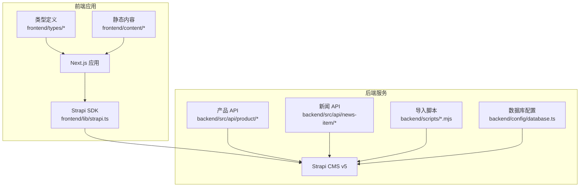
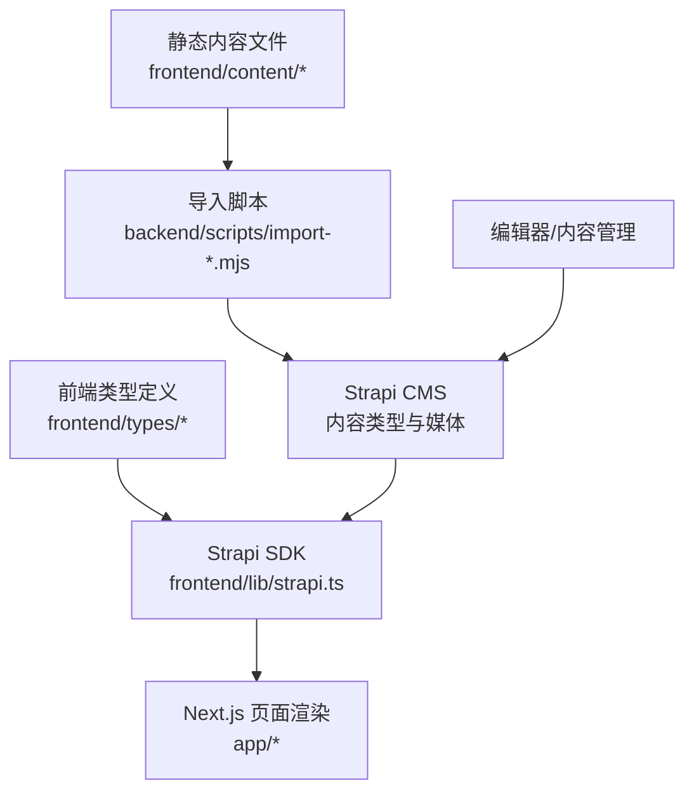
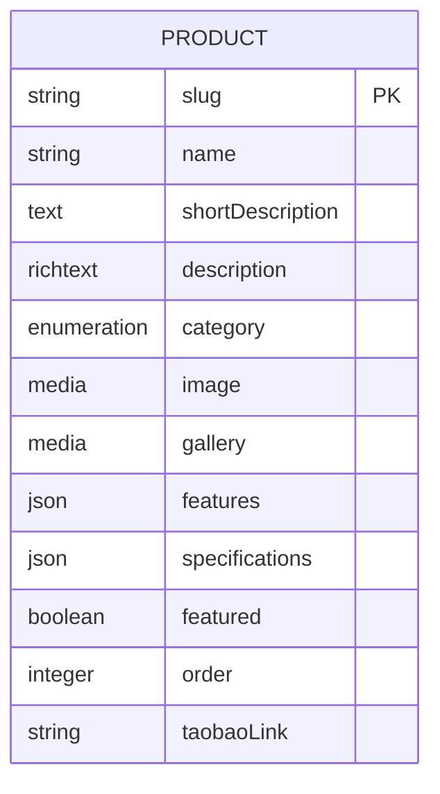
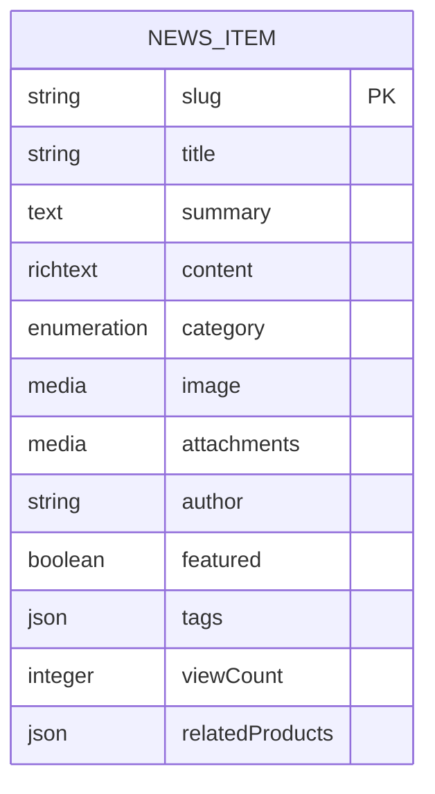
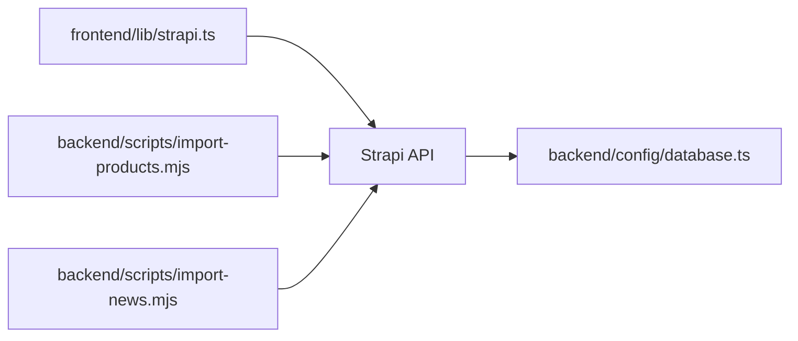
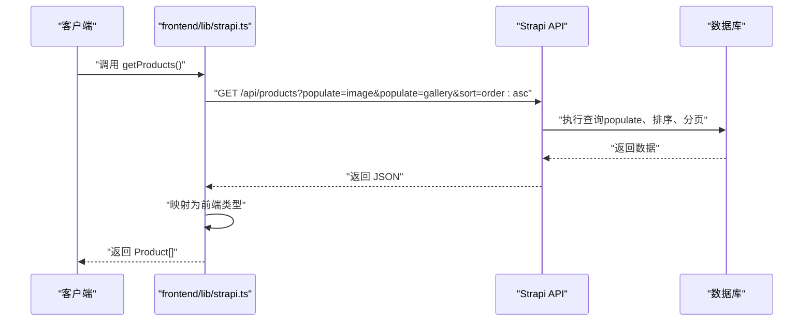
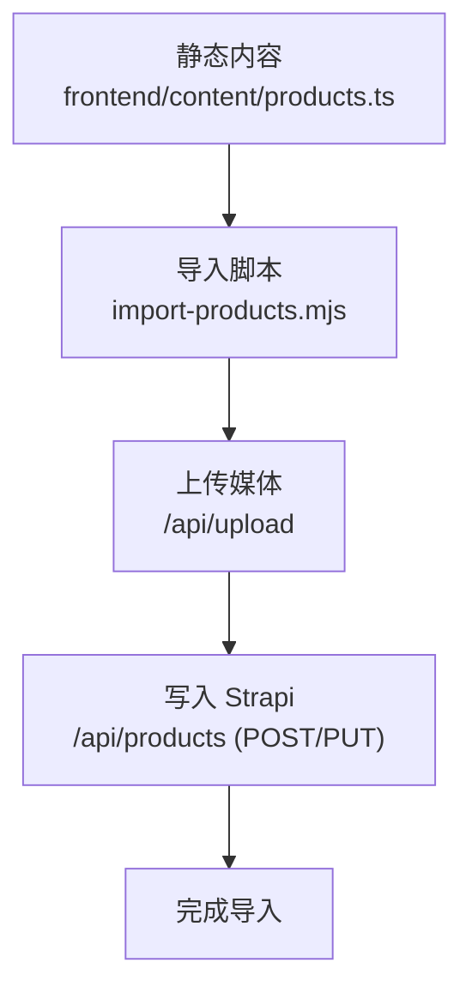

# 数据模型设计

<cite>
**本文引用的文件**
- [backend/src/api/product/content-types/product/schema.json](file://backend/src/api/product/content-types/product/schema.json)
- [backend/src/api/news-item/content-types/news-item/schema.json](file://backend/src/api/news-item/content-types/news-item/schema.json)
- [specs/001-strapi-backend-cms/data-model.md](file://specs/001-strapi-backend-cms/data-model.md)
- [specs/001-nextjs-migration/data-model.md](file://specs/001-nextjs-migration/data-model.md)
- [frontend/types/product.ts](file://frontend/types/product.ts)
- [frontend/types/news.ts](file://frontend/types/news.ts)
- [frontend/content/products.ts](file://frontend/content/products.ts)
- [frontend/content/news.ts](file://frontend/content/news.ts)
- [backend/scripts/import-products.mjs](file://backend/scripts/import-products.mjs)
- [backend/scripts/import-news.mjs](file://backend/scripts/import-news.mjs)
- [backend/src/api/product/controllers/product.ts](file://backend/src/api/product/controllers/product.ts)
- [backend/src/api/news-item/controllers/news-item.ts](file://backend/src/api/news-item/controllers/news-item.ts)
- [backend/config/database.ts](file://backend/config/database.ts)
- [backend/package.json](file://backend/package.json)
- [frontend/lib/strapi.ts](file://frontend/lib/strapi.ts)
</cite>

## 目录
1. [简介](#简介)
2. [项目结构](#项目结构)
3. [核心组件](#核心组件)
4. [架构总览](#架构总览)
5. [详细组件分析](#详细组件分析)
6. [依赖分析](#依赖分析)
7. [性能考量](#性能考量)
8. [故障排查指南](#故障排查指南)
9. [结论](#结论)
10. [附录](#附录)

## 简介
本文件系统化梳理中创智控官网的数据模型设计，覆盖后端 Strapi CMS 的内容类型定义与前端 Next.js 应用的数据消费模式。文档聚焦两类核心内容：
- 产品数据模型：字段定义、数据类型、业务规则、分类体系、属性关系与约束条件
- 新闻数据模型：文章结构、分类标签、发布流程、阅读计数与关联产品
同时，结合导入脚本、类型定义与查询接口，阐明静态内容模式与动态内容模式的差异，给出数据验证、索引与查询优化建议，以及缓存策略、性能考虑、数据生命周期与迁移策略。

## 项目结构
项目采用前后端分离架构：
- 后端：基于 Strapi v5 的内容管理系统，提供 REST API 与媒体上传能力
- 前端：Next.js 应用，通过 Strapi SDK 获取数据并渲染页面
- 数据导入：提供脚本将前端静态内容导入 Strapi，实现“静态内容 + 动态管理”的混合模式

图表来源
- [frontend/lib/strapi.ts](file://frontend/lib/strapi.ts#L100-L155)
- [backend/src/api/product/controllers/product.ts](file://backend/src/api/product/controllers/product.ts#L1-L4)
- [backend/src/api/news-item/controllers/news-item.ts](file://backend/src/api/news-item/controllers/news-item.ts#L1-L4)
- [backend/config/database.ts](file://backend/config/database.ts#L1-L61)
- [backend/scripts/import-products.mjs](file://backend/scripts/import-products.mjs#L126-L163)
- [backend/scripts/import-news.mjs](file://backend/scripts/import-news.mjs#L124-L157)

章节来源
- [backend/package.json](file://backend/package.json#L1-L45)
- [specs/001-strapi-backend-cms/data-model.md](file://specs/001-strapi-backend-cms/data-model.md#L1-L46)
- [specs/001-nextjs-migration/data-model.md](file://specs/001-nextjs-migration/data-model.md#L1-L348)

## 核心组件
- 产品内容类型（Strapi）
  - 字段：名称、URL 友好标识、简述、富文本详情、分类枚举、封面图、图集、特性 JSON、规格 JSON、是否首页推荐、排序整数、淘宝链接
  - 约束：名称必填；UID 标识必填且唯一；草稿/发布开关开启
- 新闻内容类型（Strapi）
  - 字段：标题、URL 友好标识、摘要、富文本正文、分类枚举、封面图、附件、作者、是否首页推荐、标签 JSON、阅读计数、关联产品 JSON
  - 约束：标题与 UID 必填；可无正文（摘要文章）；草稿/发布开关开启
- 前端类型与静态内容
  - 产品与新闻类型定义、分类枚举、静态数据文件与内容获取函数，体现“静态内容模式”下的数据结构
- 导入脚本
  - 将前端静态内容导入 Strapi，上传媒体并写入对应字段，支持 Upsert
- 查询与映射
  - 前端 SDK 对 Strapi 返回进行统一映射，补充媒体 URL 并返回前端可用的类型化对象

章节来源
- [backend/src/api/product/content-types/product/schema.json](file://backend/src/api/product/content-types/product/schema.json#L1-L63)
- [backend/src/api/news-item/content-types/news-item/schema.json](file://backend/src/api/news-item/content-types/news-item/schema.json#L1-L65)
- [frontend/types/product.ts](file://frontend/types/product.ts#L1-L39)
- [frontend/types/news.ts](file://frontend/types/news.ts#L1-L44)
- [frontend/content/products.ts](file://frontend/content/products.ts#L1-L183)
- [frontend/content/news.ts](file://frontend/content/news.ts#L1-L239)
- [backend/scripts/import-products.mjs](file://backend/scripts/import-products.mjs#L126-L163)
- [backend/scripts/import-news.mjs](file://backend/scripts/import-news.mjs#L124-L157)
- [frontend/lib/strapi.ts](file://frontend/lib/strapi.ts#L55-L98)

## 架构总览
下图展示“静态内容模式”与“动态内容模式”的数据流与职责分工：

图表来源
- [frontend/content/products.ts](file://frontend/content/products.ts#L1-L183)
- [frontend/content/news.ts](file://frontend/content/news.ts#L1-L239)
- [backend/scripts/import-products.mjs](file://backend/scripts/import-products.mjs#L126-L163)
- [backend/scripts/import-news.mjs](file://backend/scripts/import-news.mjs#L124-L157)
- [frontend/lib/strapi.ts](file://frontend/lib/strapi.ts#L100-L155)

## 详细组件分析

### 产品数据模型（Strapi 内容类型）
- 字段与类型
  - 名称：字符串，必填
  - URL 友好标识：UID，目标字段指向名称，必填且唯一
  - 简述：文本
  - 详情：富文本
  - 分类：枚举，取值限定
  - 封面图：媒体（单张），仅图片
  - 图集：媒体（多张），仅图片
  - 特性：JSON 数组/对象
  - 规格：JSON 键值对
  - 是否首页推荐：布尔，默认否
  - 排序：整数
  - 淘宝链接：字符串
- 业务规则
  - 草稿/发布：启用草稿与发布流程
  - 唯一性：UID 唯一
  - 媒体类型限制：仅图片
- 关系与约束
  - 与媒体插件的关系：通过媒体字段引用文件实体
  - 与前端的映射：导入脚本将前端静态字段映射到 Strapi 字段，SDK 将返回值映射为前端类型

图表来源
- [backend/src/api/product/content-types/product/schema.json](file://backend/src/api/product/content-types/product/schema.json#L13-L62)

章节来源
- [backend/src/api/product/content-types/product/schema.json](file://backend/src/api/product/content-types/product/schema.json#L1-L63)
- [specs/001-strapi-backend-cms/data-model.md](file://specs/001-strapi-backend-cms/data-model.md#L5-L23)
- [specs/001-nextjs-migration/data-model.md](file://specs/001-nextjs-migration/data-model.md#L11-L60)
- [frontend/types/product.ts](file://frontend/types/product.ts#L8-L39)
- [frontend/content/products.ts](file://frontend/content/products.ts#L10-L161)
- [backend/scripts/import-products.mjs](file://backend/scripts/import-products.mjs#L132-L155)
- [frontend/lib/strapi.ts](file://frontend/lib/strapi.ts#L55-L76)

### 新闻数据模型（Strapi 内容类型）
- 字段与类型
  - 标题：字符串，必填
  - URL 友好标识：UID，目标字段指向标题，必填且唯一
  - 摘要：文本
  - 正文：富文本
  - 分类：枚举，取值限定
  - 封面图：媒体（单张），仅图片
  - 附件：媒体（多张），仅图片
  - 作者：字符串
  - 是否首页推荐：布尔，默认否
  - 标签：JSON 数组
  - 阅读计数：整数，默认 0
  - 关联产品：JSON 数组（slug 列表）
- 业务规则
  - 草稿/发布：启用草稿与发布流程
  - 唯一性：UID 唯一
  - 媒体类型限制：仅图片
- 关系与约束
  - 与媒体插件的关系：通过媒体字段引用文件实体
  - 与产品的关系：通过 JSON 字段存储关联产品 slug，实现弱关联

图表来源
- [backend/src/api/news-item/content-types/news-item/schema.json](file://backend/src/api/news-item/content-types/news-item/schema.json#L13-L63)

章节来源
- [backend/src/api/news-item/content-types/news-item/schema.json](file://backend/src/api/news-item/content-types/news-item/schema.json#L1-L65)
- [specs/001-strapi-backend-cms/data-model.md](file://specs/001-strapi-backend-cms/data-model.md#L24-L46)
- [specs/001-nextjs-migration/data-model.md](file://specs/001-nextjs-migration/data-model.md#L119-L171)
- [frontend/types/news.ts](file://frontend/types/news.ts#L3-L44)
- [frontend/content/news.ts](file://frontend/content/news.ts#L11-L206)
- [backend/scripts/import-news.mjs](file://backend/scripts/import-news.mjs#L130-L149)
- [frontend/lib/strapi.ts](file://frontend/lib/strapi.ts#L78-L98)

### 静态内容模式 vs 动态内容模式
- 静态内容模式（前端直出）
  - 数据来源：静态 TS 文件（content/products.ts、content/news.ts）
  - 特点：无需后端 API，构建期或运行期直接导入，适合内容稳定、无需频繁编辑的场景
  - 适用：产品目录、新闻列表摘要、导航与站点配置等
- 动态内容模式（Strapi 管理）
  - 数据来源：Strapi 内容类型 + 媒体插件
  - 特点：支持富文本、媒体上传、草稿/发布、排序与推荐位等高级能力
  - 适用：产品详情、新闻全文、首页推荐、媒体资源管理

章节来源
- [specs/001-nextjs-migration/data-model.md](file://specs/001-nextjs-migration/data-model.md#L262-L297)
- [frontend/content/products.ts](file://frontend/content/products.ts#L1-L183)
- [frontend/content/news.ts](file://frontend/content/news.ts#L1-L239)
- [backend/src/api/product/content-types/product/schema.json](file://backend/src/api/product/content-types/product/schema.json#L1-L63)
- [backend/src/api/news-item/content-types/news-item/schema.json](file://backend/src/api/news-item/content-types/news-item/schema.json#L1-L65)

### 数据验证规则
- 产品
  - 名称必填；UID 唯一；封面图/图集为图片类型；布尔字段默认值；整数排序字段
- 新闻
  - 标题与 UID 必填；正文可为空（摘要文章）；封面图/附件为图片类型；阅读计数默认 0
- 前端静态内容
  - 产品：slug 唯一、名称长度限制、图片 URL 校验等（以静态文件为准）
  - 新闻：slug 唯一、标题长度限制、日期格式校验、分类枚举校验等（以静态文件为准）

章节来源
- [backend/src/api/product/content-types/product/schema.json](file://backend/src/api/product/content-types/product/schema.json#L14-L62)
- [backend/src/api/news-item/content-types/news-item/schema.json](file://backend/src/api/news-item/content-types/news-item/schema.json#L14-L63)
- [specs/001-strapi-backend-cms/data-model.md](file://specs/001-strapi-backend-cms/data-model.md#L17-L37)
- [specs/001-nextjs-migration/data-model.md](file://specs/001-nextjs-migration/data-model.md#L54-L60)
- [specs/001-nextjs-migration/data-model.md](file://specs/001-nextjs-migration/data-model.md#L166-L171)

### 索引设计与查询优化策略
- 索引建议
  - UID 字段：slug（唯一索引）用于高效按标识检索
  - 分类字段：category（枚举）用于分类筛选
  - 发布时间：publishedAt（草稿/发布开关启用）用于排序与时间范围查询
  - 推荐位：featured（布尔）用于首页推荐
  - 排序：order（整数）用于手动排序
- 查询优化
  - 前端 SDK 已按需 populate 媒体字段，减少冗余数据传输
  - 使用分页与限制条数（如首页推荐限制）控制响应规模
  - 按时间倒序排序，利用数据库索引提升性能

章节来源
- [frontend/lib/strapi.ts](file://frontend/lib/strapi.ts#L113-L147)
- [backend/src/api/product/content-types/product/schema.json](file://backend/src/api/product/content-types/product/schema.json#L10-L12)
- [backend/src/api/news-item/content-types/news-item/schema.json](file://backend/src/api/news-item/content-types/news-item/schema.json#L10-L12)

### 数据访问模式与缓存策略
- 访问模式
  - 产品：获取全部、按分类过滤、按推荐位过滤、按排序字段排序
  - 新闻：获取全部、按分类过滤、按推荐位过滤、按发布时间倒序、按 slug 查询
- 缓存策略
  - 前端 SDK 使用 Next.js 的缓存配置（revalidate 参数），默认 60 秒
  - 首页推荐与列表页可适当提高 revalidate 时间，降低后端压力
  - 媒体 URL 解析统一处理相对路径与绝对路径

章节来源
- [frontend/lib/strapi.ts](file://frontend/lib/strapi.ts#L100-L155)

### 数据生命周期管理、版本控制与迁移策略
- 生命周期
  - 草稿/发布：通过草稿与发布开关管理内容上线
  - 归档：可选字段或移除发布标记
- 版本控制
  - 内容版本：Strapi 提供版本与审核流程（需插件支持）
  - 媒体版本：上传插件管理文件版本
- 迁移策略
  - 字段变更：先添加新字段并填充默认值，再迁移旧数据，最后删除旧字段
  - 枚举扩展：新增枚举值不影响现有数据，但需前端类型同步
  - 媒体迁移：导出媒体文件清单，重建数据库后重新上传并更新关联

章节来源
- [specs/001-strapi-backend-cms/data-model.md](file://specs/001-strapi-backend-cms/data-model.md#L20-L23)
- [backend/src/api/product/content-types/product/schema.json](file://backend/src/api/product/content-types/product/schema.json#L10-L12)
- [backend/src/api/news-item/content-types/news-item/schema.json](file://backend/src/api/news-item/content-types/news-item/schema.json#L10-L12)

## 依赖分析
- 组件耦合
  - 前端 SDK 依赖 Strapi URL 与响应结构
  - 导入脚本依赖前端静态内容导出与媒体上传接口
  - 内容类型与媒体插件耦合，字段类型决定前端映射逻辑
- 外部依赖
  - Strapi v5、数据库驱动（MySQL/PostgreSQL/SQLite）
  - Next.js 缓存与 ISR 机制

图表来源
- [frontend/lib/strapi.ts](file://frontend/lib/strapi.ts#L100-L155)
- [backend/scripts/import-products.mjs](file://backend/scripts/import-products.mjs#L126-L163)
- [backend/scripts/import-news.mjs](file://backend/scripts/import-news.mjs#L124-L157)
- [backend/config/database.ts](file://backend/config/database.ts#L1-L61)

章节来源
- [backend/package.json](file://backend/package.json#L20-L45)
- [backend/config/database.ts](file://backend/config/database.ts#L1-L61)

## 性能考量
- 数据库连接池与超时
  - MySQL/PostgreSQL 支持连接池配置，SQLite 默认 null 处理
- 查询负载
  - 前端按需 populate 媒体字段，减少响应体积
  - 列表页限制条数与分页，首页推荐限制条数
- 缓存与预取
  - Next.js ISR revalidate 控制刷新频率
  - 首页与热门内容可采用更高 revalidate 值
- 媒体优化
  - 前端统一解析媒体 URL，避免重复请求

章节来源
- [backend/config/database.ts](file://backend/config/database.ts#L45-L50)
- [frontend/lib/strapi.ts](file://frontend/lib/strapi.ts#L100-L155)

## 故障排查指南
- 导入失败
  - 检查 STRAPI_TOKEN 是否正确设置
  - 确认 Strapi 地址与端口可达
  - 查看上传媒体失败日志，确认文件路径与 MIME 类型
- 查询异常
  - 核对 Strapi URL 与路径拼接
  - 检查 populate 参数与排序参数
  - 确认 slug 唯一性与大小写敏感
- 映射错误
  - 确认返回结构与映射函数一致
  - 检查媒体字段是否存在 fallback URL

章节来源
- [backend/scripts/import-products.mjs](file://backend/scripts/import-products.mjs#L13-L16)
- [backend/scripts/import-products.mjs](file://backend/scripts/import-products.mjs#L47-L66)
- [backend/scripts/import-news.mjs](file://backend/scripts/import-news.mjs#L13-L16)
- [backend/scripts/import-news.mjs](file://backend/scripts/import-news.mjs#L47-L66)
- [frontend/lib/strapi.ts](file://frontend/lib/strapi.ts#L100-L155)

## 结论
本数据模型以 Strapi 为核心，结合前端静态内容与 SDK 映射，实现了“静态内容 + 动态管理”的混合架构。产品与新闻两类核心内容类型具备清晰的字段定义、业务规则与约束，配合导入脚本与查询接口，满足内容管理与高性能渲染的需求。建议在后续演进中完善版本与审核流程、扩展分类与标签体系，并持续优化查询与缓存策略以提升整体性能与可维护性。

## 附录
- API 调用序列（获取产品列表）

图表来源
- [frontend/lib/strapi.ts](file://frontend/lib/strapi.ts#L113-L125)
- [backend/src/api/product/controllers/product.ts](file://backend/src/api/product/controllers/product.ts#L1-L4)

- 数据导入流程（产品）

图表来源
- [frontend/content/products.ts](file://frontend/content/products.ts#L126-L161)
- [backend/scripts/import-products.mjs](file://backend/scripts/import-products.mjs#L126-L163)