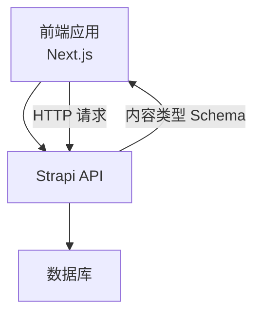
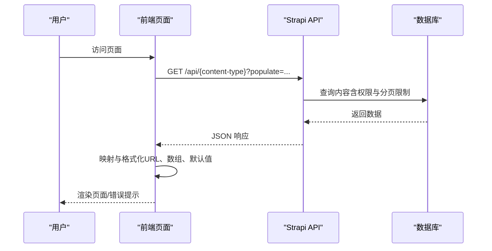
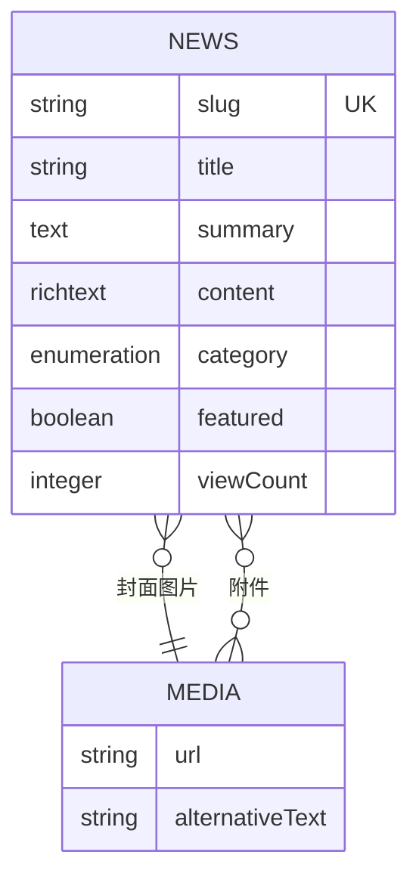
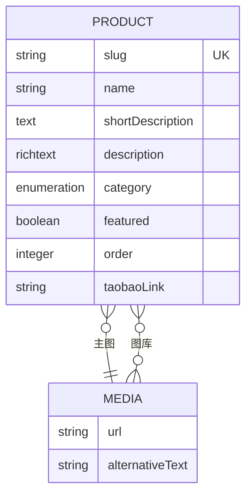
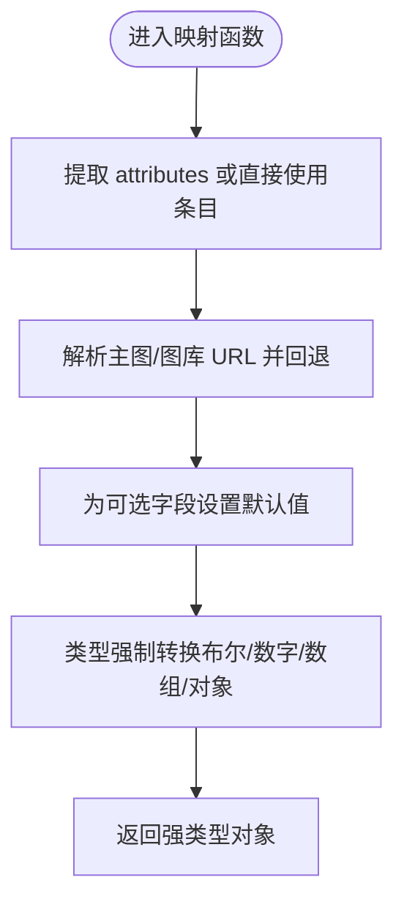
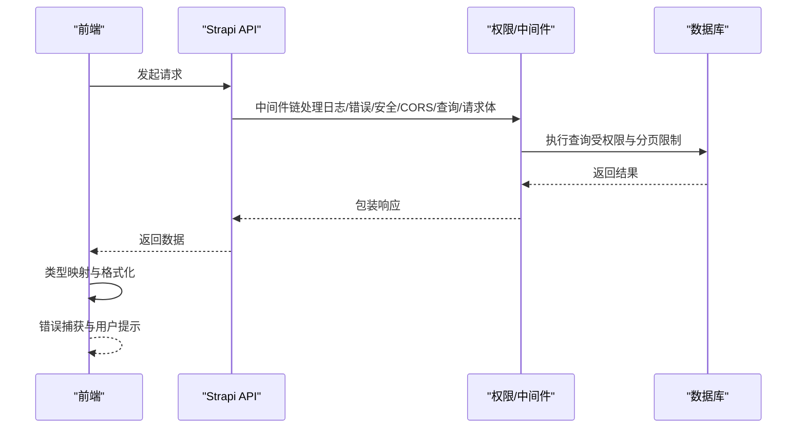
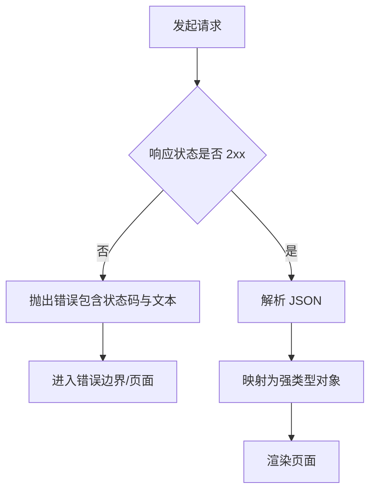
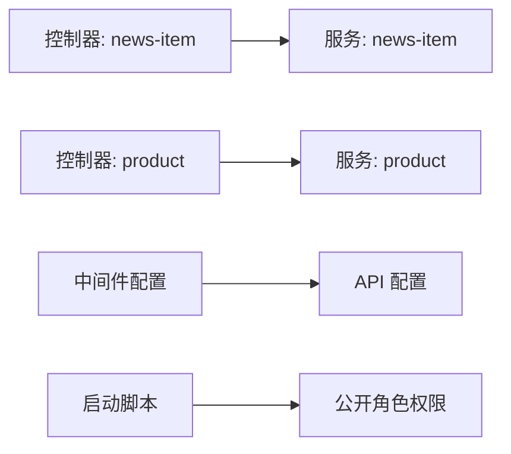

# 数据验证规则

<cite>
**本文引用的文件**
- [backend/src/api/news-item/content-types/news-item/schema.json](file://backend/src/api/news-item/content-types/news-item/schema.json)
- [backend/src/api/product/content-types/product/schema.json](file://backend/src/api/product/content-types/product/schema.json)
- [frontend/types/news.ts](file://frontend/types/news.ts)
- [frontend/types/product.ts](file://frontend/types/product.ts)
- [backend/src/api/news-item/controllers/news-item.ts](file://backend/src/api/news-item/controllers/news-item.ts)
- [backend/src/api/product/controllers/product.ts](file://backend/src/api/product/controllers/product.ts)
- [backend/src/api/news-item/services/news-item.ts](file://backend/src/api/news-item/services/news-item.ts)
- [backend/src/api/product/services/product.ts](file://backend/src/api/product/services/product.ts)
- [backend/config/middlewares.ts](file://backend/config/middlewares.ts)
- [backend/config/api.ts](file://backend/config/api.ts)
- [backend/config/server.ts](file://backend/config/server.ts)
- [backend/src/index.ts](file://backend/src/index.ts)
- [frontend/lib/strapi.ts](file://frontend/lib/strapi.ts)
- [frontend/app/news/[slug]/page.tsx](file://frontend/app/news/[slug]/page.tsx)
- [specs/001-nextjs-migration/data-model.md](file://specs/001-nextjs-migration/data-model.md)
</cite>

## 目录
1. [引言](#引言)
2. [项目结构](#项目结构)
3. [核心组件](#核心组件)
4. [架构总览](#架构总览)
5. [详细组件分析](#详细组件分析)
6. [依赖关系分析](#依赖关系分析)
7. [性能考量](#性能考量)
8. [故障排查指南](#故障排查指南)
9. [结论](#结论)
10. [附录](#附录)

## 引言
本文件系统化梳理本项目的“数据验证规则”，覆盖前后端协同验证策略、类型安全与格式校验、唯一性与业务规则约束、错误处理与用户反馈、常见验证场景与调试技巧，以及验证对性能的影响与优化建议。文档同时给出面向非技术读者的可读性说明，并通过图示帮助快速建立整体认知。

## 项目结构
项目采用前后端分离：前端为 Next.js 应用，负责界面渲染与用户交互；后端为 Strapi CMS，负责内容模型管理与 API 提供。验证规则在两个层面实施：
- 后端（Strapi）：通过内容类型 schema 定义字段的数据类型、必填、唯一、枚举等基础约束；通过中间件与权限配置保障请求安全与访问控制。
- 前端（Next.js）：通过 TypeScript 接口定义数据契约，确保类型安全；通过 fetch 请求与映射函数进行数据转换与基本格式校验；在页面层处理错误与回退逻辑。

**图表来源**
- [frontend/lib/strapi.ts](file://frontend/lib/strapi.ts#L100-L155)
- [backend/src/api/news-item/content-types/news-item/schema.json](file://backend/src/api/news-item/content-types/news-item/schema.json#L1-L65)
- [backend/src/api/product/content-types/product/schema.json](file://backend/src/api/product/content-types/product/schema.json#L1-L63)

**章节来源**
- [frontend/lib/strapi.ts](file://frontend/lib/strapi.ts#L100-L155)
- [backend/src/api/news-item/content-types/news-item/schema.json](file://backend/src/api/news-item/content-types/news-item/schema.json#L1-L65)
- [backend/src/api/product/content-types/product/schema.json](file://backend/src/api/product/content-types/product/schema.json#L1-L63)

## 核心组件
- 内容类型 Schema（后端）
  - 新闻（News Item）：定义字段类型、必填、唯一（UID）、枚举值、媒体类型限制、布尔默认值、整数默认值等。
  - 产品（Product）：定义字段类型、必填、唯一（UID）、枚举值、媒体类型限制、布尔默认值、整数字段、字符串链接等。
- TypeScript 类型（前端）
  - 新闻文章接口：明确字段含义、可选字段、数组与对象结构、时间戳格式约定等。
  - 产品接口：明确分类枚举、特性键值结构、规格表结构、排序权重、外部链接等。
- API 映射与调用（前端）
  - Strapi 请求封装、媒体 URL 解析与回退、响应映射函数、错误抛出与处理。
- 中间件与权限（后端）
  - 默认中间件栈、分页与请求体限制、公开角色权限初始化。

**章节来源**
- [backend/src/api/news-item/content-types/news-item/schema.json](file://backend/src/api/news-item/content-types/news-item/schema.json#L13-L62)
- [backend/src/api/product/content-types/product/schema.json](file://backend/src/api/product/content-types/product/schema.json#L13-L61)
- [frontend/types/news.ts](file://frontend/types/news.ts#L16-L43)
- [frontend/types/product.ts](file://frontend/types/product.ts#L13-L38)
- [frontend/lib/strapi.ts](file://frontend/lib/strapi.ts#L55-L98)
- [backend/config/middlewares.ts](file://backend/config/middlewares.ts#L1-L12)
- [backend/config/api.ts](file://backend/config/api.ts#L1-L8)
- [backend/src/index.ts](file://backend/src/index.ts#L29-L62)

## 架构总览
下图展示了从前端到后端的数据流与验证点位：前端负责类型与格式的初步约束，后端负责持久化前的强约束与权限控制，最终返回给前端并进行映射与展示。

**图表来源**
- [frontend/lib/strapi.ts](file://frontend/lib/strapi.ts#L100-L155)
- [backend/config/api.ts](file://backend/config/api.ts#L1-L8)
- [backend/src/index.ts](file://backend/src/index.ts#L29-L62)

## 详细组件分析

### 新闻内容类型验证规则
- 字段级约束
  - 标题：字符串、必填。
  - Slug：UID，基于标题生成，必填且唯一。
  - 摘要/正文：文本与富文本类型，非必填。
  - 分类：枚举类型，限定取值集合。
  - 图片/附件：媒体类型，单/多图，限定类型为图片，非必填。
  - 作者：字符串，非必填。
  - 置顶：布尔，默认 false。
  - 标签/阅读数/关联产品：JSON/整数，非必填或有默认值。
- 唯一性与 UID
  - Slug 由 UID 字段自动生成并保持唯一，避免重复与冲突。
- Draft/Publish 选项
  - 支持草稿与发布流程，便于内容治理。

**图表来源**
- [backend/src/api/news-item/content-types/news-item/schema.json](file://backend/src/api/news-item/content-types/news-item/schema.json#L13-L62)

**章节来源**
- [backend/src/api/news-item/content-types/news-item/schema.json](file://backend/src/api/news-item/content-types/news-item/schema.json#L13-L62)

### 产品内容类型验证规则
- 字段级约束
  - 名称：字符串、必填。
  - Slug：UID，基于名称生成，必填且唯一。
  - 描述：文本与富文本类型，非必填。
  - 分类：枚举类型，限定取值集合。
  - 图片/图库：媒体类型，限定类型为图片，非必填。
  - 特性/规格：JSON 结构，非必填。
  - 置顶与排序：布尔与整数，布尔默认 false，排序默认 0。
  - 外链：字符串，非必填。
- 唯一性与 UID
  - Slug 由 UID 字段自动生成并保持唯一，避免重复与冲突。

**图表来源**
- [backend/src/api/product/content-types/product/schema.json](file://backend/src/api/product/content-types/product/schema.json#L13-L61)

**章节来源**
- [backend/src/api/product/content-types/product/schema.json](file://backend/src/api/product/content-types/product/schema.json#L13-L61)

### 前端类型与数据映射验证
- 类型契约
  - 新闻文章接口：明确 slug、标题、摘要、正文、分类、图片、发布时间、作者、置顶、标签、更新时间、阅读数、关联产品等字段的类型与可选性。
  - 产品接口：明确分类枚举、特性键值结构、规格表结构、排序权重、外链等字段的类型与可选性。
- 数据映射与格式化
  - 媒体 URL 解析与回退：统一处理相对路径与绝对路径，提供默认图作为兜底。
  - 数字与布尔转换：将字符串或空值转换为数字与布尔，设置合理默认值。
  - JSON 字段校验：对 features、specifications、tags 等进行类型断言与默认空数组/对象。
- 错误处理
  - 对于非 2xx 响应，抛出错误，便于上层捕获与用户反馈。

**图表来源**
- [frontend/lib/strapi.ts](file://frontend/lib/strapi.ts#L55-L98)

**章节来源**
- [frontend/types/news.ts](file://frontend/types/news.ts#L16-L43)
- [frontend/types/product.ts](file://frontend/types/product.ts#L13-L38)
- [frontend/lib/strapi.ts](file://frontend/lib/strapi.ts#L55-L98)

### 前后端协同验证机制
- 前端职责
  - 类型安全：通过 TypeScript 接口在编译期约束数据结构。
  - 基础格式校验：URL、布尔、整数、数组等的转换与默认值处理。
  - 用户反馈：错误页面与重试机制，提升可用性。
- 后端职责
  - Schema 约束：字段类型、必填、唯一、枚举、媒体类型限制等。
  - 权限控制：公开角色对查询接口启用，避免未授权访问。
  - 中间件与安全：日志、错误、安全头、CORS、查询与请求体处理等。
- 协同要点
  - 前端只做“可见即合理”的基础校验；后端承担“不可信输入”的强约束。
  - 前端负责“用户体验”，后端负责“数据一致性”。

**图表来源**
- [backend/config/middlewares.ts](file://backend/config/middlewares.ts#L1-L12)
- [backend/src/index.ts](file://backend/src/index.ts#L29-L62)
- [frontend/lib/strapi.ts](file://frontend/lib/strapi.ts#L100-L155)

**章节来源**
- [backend/config/middlewares.ts](file://backend/config/middlewares.ts#L1-L12)
- [backend/src/index.ts](file://backend/src/index.ts#L29-L62)
- [frontend/lib/strapi.ts](file://frontend/lib/strapi.ts#L100-L155)

### 数据完整性、业务规则与一致性
- 数据完整性
  - 唯一性：UID 字段自动保证 slug 的唯一性，避免重复。
  - 枚举约束：分类字段限定取值范围，防止脏数据进入。
  - 媒体类型限制：仅允许图片类型，减少非法资源占用。
- 业务规则
  - 置顶与排序：布尔与整数字段支持首页展示与排序策略。
  - 外链：对外部链接进行字符串约束，避免注入风险。
- 一致性保证
  - 前端映射统一处理空值与默认值，确保 UI 层一致显示。
  - 后端通过中间件与权限配置，确保请求链路安全与稳定。

**章节来源**
- [backend/src/api/news-item/content-types/news-item/schema.json](file://backend/src/api/news-item/content-types/news-item/schema.json#L13-L62)
- [backend/src/api/product/content-types/product/schema.json](file://backend/src/api/product/content-types/product/schema.json#L13-L61)
- [frontend/lib/strapi.ts](file://frontend/lib/strapi.ts#L55-L98)

### 错误处理与用户反馈最佳实践
- 前端错误页面
  - 捕获异常并记录日志，提供“重试”与“返回首页”按钮，改善用户体验。
- API 错误
  - 非 2xx 响应时抛出错误，便于上层统一处理。
- 页面级容错
  - 新闻详情页在找不到文章时返回 404，避免无效内容泄露。

**图表来源**
- [frontend/lib/strapi.ts](file://frontend/lib/strapi.ts#L100-L111)
- [frontend/app/news/[slug]/page.tsx](file://frontend/app/news/[slug]/page.tsx#L55-L57)

**章节来源**
- [frontend/lib/strapi.ts](file://frontend/lib/strapi.ts#L100-L111)
- [frontend/app/news/[slug]/page.tsx](file://frontend/app/news/[slug]/page.tsx#L55-L57)

### 常见验证场景与调试技巧
- 场景一：UID 冲突
  - 现象：保存失败，提示唯一性冲突。
  - 处理：检查目标字段是否为 UID，确认唯一性约束已生效。
- 场景二：媒体类型不匹配
  - 现象：上传后无法显示或报类型错误。
  - 处理：确认媒体字段的 allowedTypes 为 images，避免其他类型资源。
- 场景三：前端类型不匹配
  - 现象：运行时报错或 UI 显示异常。
  - 处理：检查映射函数中对可选字段的默认值设置与类型断言。
- 调试技巧
  - 在前端打印原始响应与映射后的对象，定位字段差异。
  - 使用浏览器网络面板查看实际请求与响应，核对状态码与内容。
  - 在后端开启日志中间件，观察请求链路与错误堆栈。

**章节来源**
- [backend/src/api/news-item/content-types/news-item/schema.json](file://backend/src/api/news-item/content-types/news-item/schema.json#L18-L22)
- [backend/src/api/product/content-types/product/schema.json](file://backend/src/api/product/content-types/product/schema.json#L18-L22)
- [frontend/lib/strapi.ts](file://frontend/lib/strapi.ts#L55-L98)

## 依赖关系分析
- 控制器与服务
  - 控制器与服务均为 Strapi 核心工厂生成，遵循默认行为，不引入额外验证逻辑。
- 中间件与 API 配置
  - 中间件栈提供日志、错误、安全、CORS、查询与请求体处理。
  - API 配置限制默认分页与最大返回条数，有助于性能与安全。
- 权限初始化
  - 启动脚本为公开角色启用产品与新闻的查询权限，避免无权限导致的验证失败。

**图表来源**
- [backend/src/api/news-item/controllers/news-item.ts](file://backend/src/api/news-item/controllers/news-item.ts#L1-L4)
- [backend/src/api/product/controllers/product.ts](file://backend/src/api/product/controllers/product.ts#L1-L4)
- [backend/src/api/news-item/services/news-item.ts](file://backend/src/api/news-item/services/news-item.ts#L1-L4)
- [backend/src/api/product/services/product.ts](file://backend/src/api/product/services/product.ts#L1-L4)
- [backend/config/middlewares.ts](file://backend/config/middlewares.ts#L1-L12)
- [backend/config/api.ts](file://backend/config/api.ts#L1-L8)
- [backend/src/index.ts](file://backend/src/index.ts#L29-L62)

**章节来源**
- [backend/src/api/news-item/controllers/news-item.ts](file://backend/src/api/news-item/controllers/news-item.ts#L1-L4)
- [backend/src/api/product/controllers/product.ts](file://backend/src/api/product/controllers/product.ts#L1-L4)
- [backend/src/api/news-item/services/news-item.ts](file://backend/src/api/news-item/services/news-item.ts#L1-L4)
- [backend/src/api/product/services/product.ts](file://backend/src/api/product/services/product.ts#L1-L4)
- [backend/config/middlewares.ts](file://backend/config/middlewares.ts#L1-L12)
- [backend/config/api.ts](file://backend/config/api.ts#L1-L8)
- [backend/src/index.ts](file://backend/src/index.ts#L29-L62)

## 性能考量
- 分页与限制
  - API 默认分页与最大限制有助于控制单次响应体积，降低前端解析压力。
- 媒体资源
  - 媒体字段仅允许图片类型，减少冗余资源与带宽消耗。
- 映射与回退
  - 前端映射函数集中处理 URL 与默认值，避免重复计算与空值判断开销。
- 建议
  - 对大字段（如富文本）按需 populate，减少不必要的数据传输。
  - 对频繁访问的列表接口启用缓存与 revalidate 策略，平衡新鲜度与性能。

**章节来源**
- [backend/config/api.ts](file://backend/config/api.ts#L1-L8)
- [frontend/lib/strapi.ts](file://frontend/lib/strapi.ts#L100-L155)

## 故障排查指南
- 常见问题
  - 403/401：检查公开角色权限是否正确初始化。
  - 404：确认查询条件与 slug 是否匹配，页面层已处理 NotFound。
  - 500：查看后端日志中间件输出，定位具体环节。
- 建议流程
  - 前端：捕获错误并记录，提供重试与回退 UI。
  - 后端：开启日志与错误中间件，逐步缩小问题范围。
  - 数据层：核对 Schema 约束与唯一性索引。

**章节来源**
- [backend/src/index.ts](file://backend/src/index.ts#L29-L62)
- [frontend/app/news/[slug]/page.tsx](file://frontend/app/news/[slug]/page.tsx#L55-L57)
- [backend/config/middlewares.ts](file://backend/config/middlewares.ts#L1-L12)

## 结论
本项目通过“前端类型约束 + 后端 Schema 强约束 + 中间件与权限保障”的三层验证体系，实现了从契约到执行的全链路数据质量控制。前端负责类型安全与友好体验，后端负责强一致与安全边界，二者协同确保数据完整性与业务规则的一致性。配合合理的性能策略与完善的错误处理，能够有效提升系统的稳定性与可维护性。

## 附录
- 规范参考
  - 迁移规范中对 slug、name、shortDescription、image 等字段的验证要求，可作为补充约束依据。
- 相关文件
  - 新闻与产品内容类型 Schema、前端类型定义、API 映射与调用、中间件与权限配置等。

**章节来源**
- [specs/001-nextjs-migration/data-model.md](file://specs/001-nextjs-migration/data-model.md#L54-L111)
- [backend/src/api/news-item/content-types/news-item/schema.json](file://backend/src/api/news-item/content-types/news-item/schema.json#L1-L65)
- [backend/src/api/product/content-types/product/schema.json](file://backend/src/api/product/content-types/product/schema.json#L1-L63)
- [frontend/types/news.ts](file://frontend/types/news.ts#L1-L44)
- [frontend/types/product.ts](file://frontend/types/product.ts#L1-L39)
- [frontend/lib/strapi.ts](file://frontend/lib/strapi.ts#L1-L155)
- [backend/config/middlewares.ts](file://backend/config/middlewares.ts#L1-L12)
- [backend/config/api.ts](file://backend/config/api.ts#L1-L8)
- [backend/src/index.ts](file://backend/src/index.ts#L1-L65)