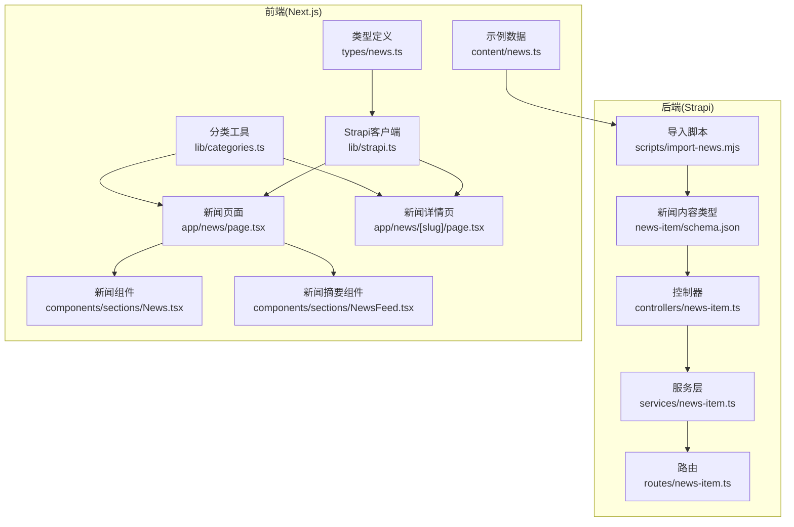
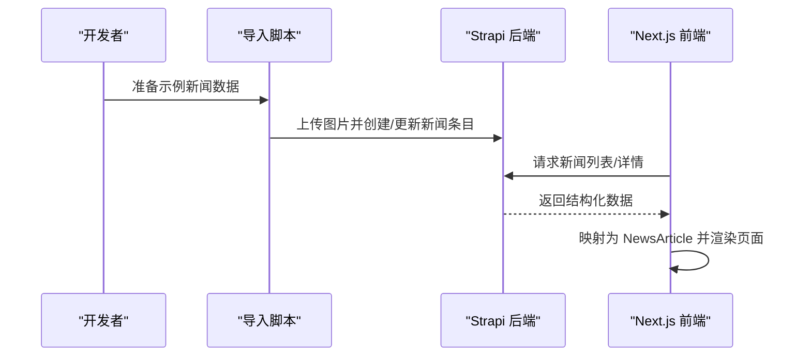
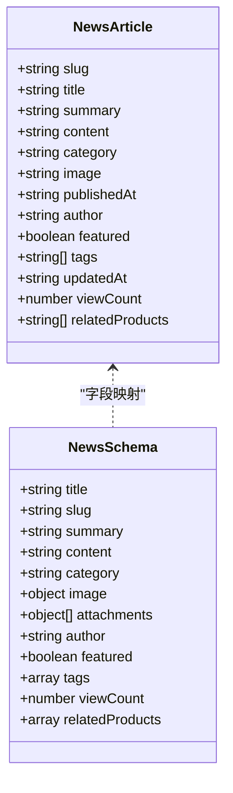
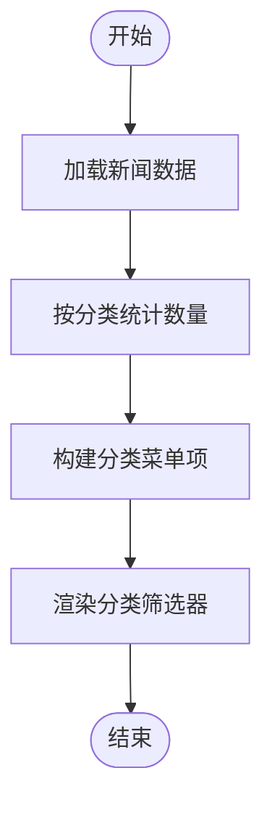
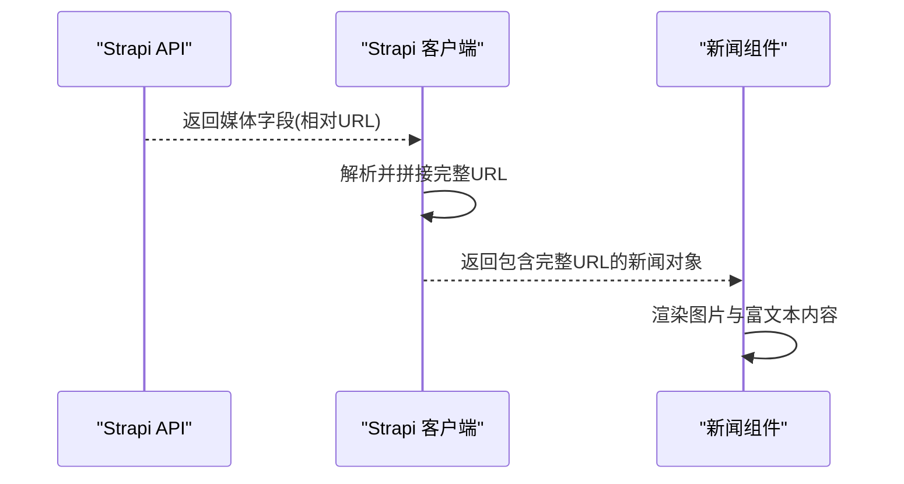
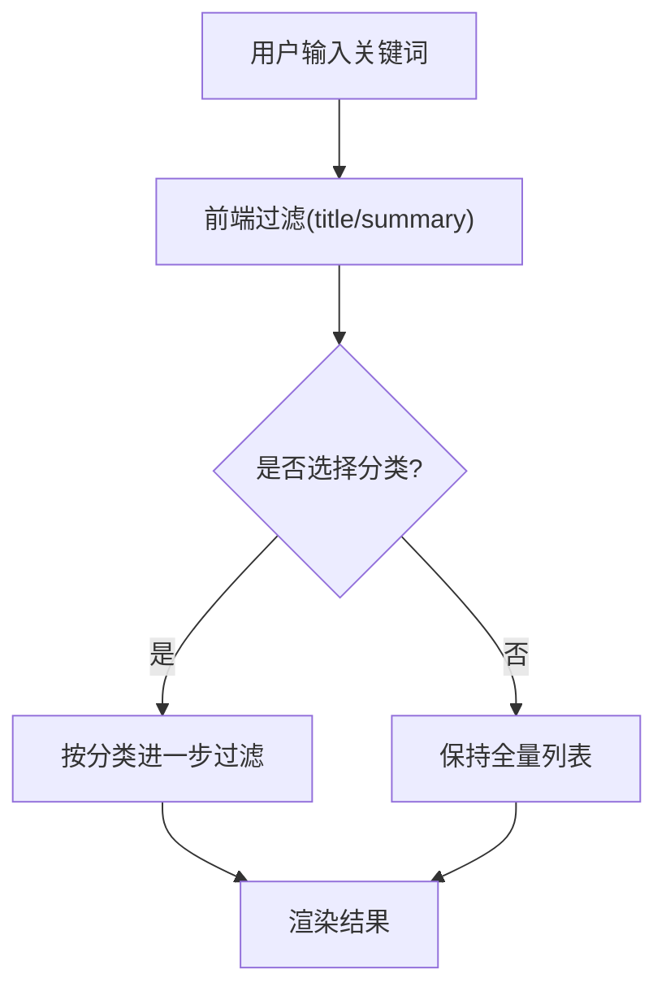
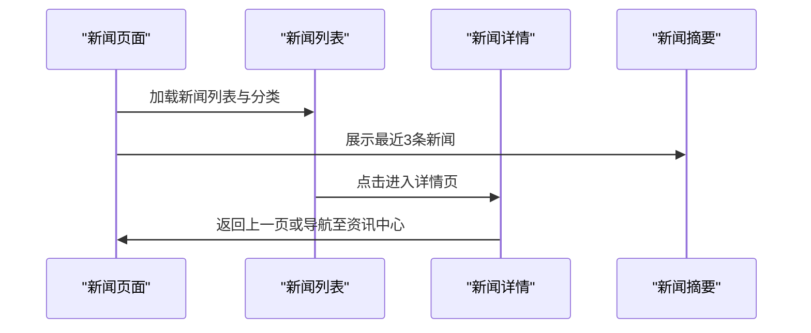
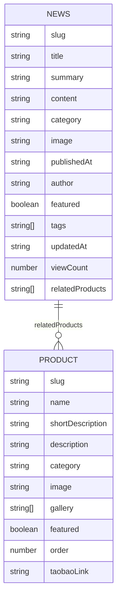
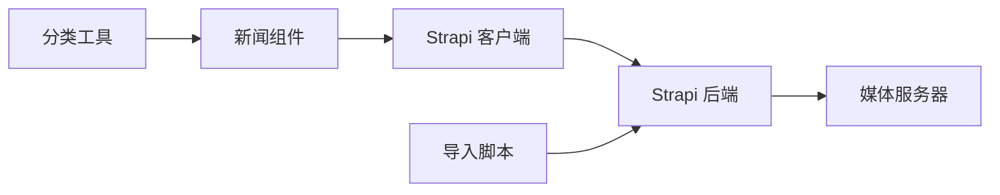

# 新闻数据模型

<cite>
**本文引用的文件**
- [backend/src/api/news-item/content-types/news-item/schema.json](file://backend/src/api/news-item/content-types/news-item/schema.json)
- [backend/src/api/news-item/controllers/news-item.ts](file://backend/src/api/news-item/controllers/news-item.ts)
- [backend/src/api/news-item/routes/news-item.ts](file://backend/src/api/news-item/routes/news-item.ts)
- [backend/src/api/news-item/services/news-item.ts](file://backend/src/api/news-item/services/news-item.ts)
- [backend/scripts/import-news.mjs](file://backend/scripts/import-news.mjs)
- [backend/src/api/product/content-types/product/schema.json](file://backend/src/api/product/content-types/product/schema.json)
- [frontend/types/news.ts](file://frontend/types/news.ts)
- [frontend/types/product.ts](file://frontend/types/product.ts)
- [frontend/lib/categories.ts](file://frontend/lib/categories.ts)
- [frontend/lib/strapi.ts](file://frontend/lib/strapi.ts)
- [frontend/components/sections/News.tsx](file://frontend/components/sections/News.tsx)
- [frontend/components/sections/NewsFeed.tsx](file://frontend/components/sections/NewsFeed.tsx)
- [frontend/app/news/page.tsx](file://frontend/app/news/page.tsx)
- [frontend/app/news/[slug]/page.tsx](file://frontend/app/news/[slug]/page.tsx)
- [frontend/content/news.ts](file://frontend/content/news.ts)
</cite>

## 目录
1. [简介](#简介)
2. [项目结构](#项目结构)
3. [核心组件](#核心组件)
4. [架构概览](#架构概览)
5. [详细组件分析](#详细组件分析)
6. [依赖分析](#依赖分析)
7. [性能考虑](#性能考虑)
8. [故障排除指南](#故障排除指南)
9. [结论](#结论)
10. [附录](#附录)

## 简介
本文件系统性地阐述了新闻数据模型的设计与实现，涵盖 Strapi 后端的内容类型定义、Next.js 前端的数据映射与渲染、以及新闻与产品模型之间的关联关系。文档重点解释 NewsArticle 接口的字段定义、数据类型与业务规则，新闻分类体系与标签系统，富文本内容与媒体资源管理，数据验证与 SEO 友好字段设计，以及实际应用场景与关联查询策略。

## 项目结构
该项目采用前后端分离架构：
- 后端基于 Strapi CMS，提供新闻内容的增删改查与富文本、媒体资源管理能力。
- 前端基于 Next.js App Router，负责新闻列表、详情页、分类筛选、搜索与 SEO 元数据生成。
- 导入脚本负责将前端示例数据导入 Strapi，确保开发与演示环境的一致性。

**图表来源**
- [backend/src/api/news-item/content-types/news-item/schema.json](file://backend/src/api/news-item/content-types/news-item/schema.json#L1-L65)
- [backend/src/api/news-item/controllers/news-item.ts](file://backend/src/api/news-item/controllers/news-item.ts#L1-L4)
- [backend/src/api/news-item/services/news-item.ts](file://backend/src/api/news-item/services/news-item.ts#L1-L4)
- [backend/src/api/news-item/routes/news-item.ts](file://backend/src/api/news-item/routes/news-item.ts#L1-L4)
- [backend/scripts/import-news.mjs](file://backend/scripts/import-news.mjs#L1-L157)
- [frontend/types/news.ts](file://frontend/types/news.ts#L1-L44)
- [frontend/lib/categories.ts](file://frontend/lib/categories.ts#L1-L48)
- [frontend/lib/strapi.ts](file://frontend/lib/strapi.ts#L1-L155)
- [frontend/app/news/page.tsx](file://frontend/app/news/page.tsx#L1-L31)
- [frontend/app/news/[slug]/page.tsx](file://frontend/app/news/[slug]/page.tsx#L1-L71)
- [frontend/components/sections/News.tsx](file://frontend/components/sections/News.tsx#L1-L299)
- [frontend/components/sections/NewsFeed.tsx](file://frontend/components/sections/NewsFeed.tsx#L1-L141)
- [frontend/content/news.ts](file://frontend/content/news.ts#L1-L239)

**章节来源**
- [backend/src/api/news-item/content-types/news-item/schema.json](file://backend/src/api/news-item/content-types/news-item/schema.json#L1-L65)
- [frontend/types/news.ts](file://frontend/types/news.ts#L1-L44)
- [frontend/lib/strapi.ts](file://frontend/lib/strapi.ts#L1-L155)

## 核心组件
本节聚焦 NewsArticle 接口的字段定义、数据类型与业务规则，以及 Strapi 内容类型中的对应属性。

- 字段与类型
  - slug: string，UID 类型，唯一且必填，用于 SEO 友好 URL。
  - title: string，必填，文章标题。
  - summary: string，可选，文章摘要。
  - content: string，富文本类型，支持 Markdown/HTML 内容。
  - category: 枚举类型，取值限定为 ["product", "tech", "standard", "company"]。
  - image: 媒体类型，单张图片，允许为空。
  - attachments: 媒体类型，多张图片，允许为空。
  - author: string，作者名。
  - featured: boolean，默认 false，是否置顶。
  - tags: string[]，标签数组。
  - publishedAt: string，ISO 8601 日期字符串，发布日期。
  - updatedAt: string，ISO 8601 日期字符串，可选。
  - viewCount: integer，默认 0，阅读计数。
  - relatedProducts: string[]，关联产品 slug 列表，可选。

- 业务规则
  - slug 必须唯一，且由 title 自动生成。
  - category 为受控枚举，确保分类一致性。
  - image 与 attachments 使用媒体字段，限制为图片类型。
  - publishedAt 与 updatedAt 用于排序与展示。
  - featured 用于首页推荐与置顶展示。
  - tags 与 relatedProducts 用于内容关联与检索。

**章节来源**
- [backend/src/api/news-item/content-types/news-item/schema.json](file://backend/src/api/news-item/content-types/news-item/schema.json#L13-L63)
- [frontend/types/news.ts](file://frontend/types/news.ts#L16-L43)

## 架构概览
新闻数据在系统中的流转路径如下：
- 数据源：前端示例数据或 Strapi 后台内容。
- 导入：导入脚本将示例数据上传图片并写入 Strapi。
- 查询：前端通过 Strapi 客户端按需查询新闻列表、详情与分类。
- 渲染：Next.js 页面与组件负责展示、筛选、搜索与 SEO 元数据生成。

**图表来源**
- [backend/scripts/import-news.mjs](file://backend/scripts/import-news.mjs#L124-L151)
- [frontend/lib/strapi.ts](file://frontend/lib/strapi.ts#L127-L147)
- [frontend/app/news/page.tsx](file://frontend/app/news/page.tsx#L25-L30)
- [frontend/app/news/[slug]/page.tsx](file://frontend/app/news/[slug]/page.tsx#L48-L70)

## 详细组件分析

### 新闻内容类型与字段映射
- Strapi 内容类型定义了完整的字段集，包括 UID、富文本、枚举、媒体与 JSON 字段。
- 前端 NewsArticle 接口与 Strapi 字段一一对应，包含 slug、title、summary、content、category、image、publishedAt、author、featured、tags、updatedAt、viewCount、relatedProducts 等。

**图表来源**
- [frontend/types/news.ts](file://frontend/types/news.ts#L16-L43)
- [backend/src/api/news-item/content-types/news-item/schema.json](file://backend/src/api/news-item/content-types/news-item/schema.json#L13-L63)

**章节来源**
- [frontend/types/news.ts](file://frontend/types/news.ts#L16-L43)
- [backend/src/api/news-item/content-types/news-item/schema.json](file://backend/src/api/news-item/content-types/news-item/schema.json#L13-L63)

### 分类体系与标签系统
- 分类枚举：["product", "tech", "standard", "company"]，分别对应“产品动态”、“技术迭代”、“标准制定”、“公司新闻”。
- 标签：字符串数组，用于内容标记与二次分组。
- 前端分类统计：根据新闻数据计算各分类的数量，用于侧边栏筛选与导航。

**图表来源**
- [frontend/lib/categories.ts](file://frontend/lib/categories.ts#L33-L47)
- [frontend/components/sections/News.tsx](file://frontend/components/sections/News.tsx#L100-L124)

**章节来源**
- [frontend/lib/categories.ts](file://frontend/lib/categories.ts#L10-L15)
- [frontend/lib/categories.ts](file://frontend/lib/categories.ts#L33-L47)
- [frontend/components/sections/News.tsx](file://frontend/components/sections/News.tsx#L100-L124)

### 富文本结构与媒体资源管理
- 富文本：content 字段为富文本类型，支持 Markdown/HTML，便于编辑器生成结构化内容。
- 媒体资源：
  - image：单张封面图，支持空值回退。
  - attachments：多张图片附件，支持空数组。
- 前端媒体解析：Strapi 客户端统一处理媒体 URL，自动拼接完整地址，保证跨域与本地开发兼容。

**图表来源**
- [frontend/lib/strapi.ts](file://frontend/lib/strapi.ts#L35-L53)
- [frontend/lib/strapi.ts](file://frontend/lib/strapi.ts#L78-L98)
- [frontend/components/sections/News.tsx](file://frontend/components/sections/News.tsx#L160-L165)

**章节来源**
- [backend/src/api/news-item/content-types/news-item/schema.json](file://backend/src/api/news-item/content-types/news-item/schema.json#L27-L44)
- [frontend/lib/strapi.ts](file://frontend/lib/strapi.ts#L35-L53)
- [frontend/lib/strapi.ts](file://frontend/lib/strapi.ts#L78-L98)

### 数据验证规则与搜索优化
- 后端验证：UID 唯一性、必填字段校验、枚举值约束。
- 前端搜索：支持按标题与摘要关键词过滤，结合分类筛选实现高效检索。
- SEO 友好字段：slug 用于 URL，title 与 summary 用于页面标题与描述，Open Graph 图片与标签完善社交分享体验。

**图表来源**
- [frontend/components/sections/News.tsx](file://frontend/components/sections/News.tsx#L22-L34)
- [frontend/app/news/[slug]/page.tsx](file://frontend/app/news/[slug]/page.tsx#L23-L46)

**章节来源**
- [backend/src/api/news-item/content-types/news-item/schema.json](file://backend/src/api/news-item/content-types/news-item/schema.json#L18-L22)
- [frontend/components/sections/News.tsx](file://frontend/components/sections/News.tsx#L22-L34)
- [frontend/app/news/[slug]/page.tsx](file://frontend/app/news/[slug]/page.tsx#L23-L46)

### 新闻数据示例与实际应用场景
- 示例数据：包含多条新闻条目，涵盖不同分类、标签与发布时间，便于演示与测试。
- 应用场景：
  - 资讯中心首页：展示置顶新闻与最新动态。
  - 新闻列表页：支持分类筛选与关键词搜索。
  - 新闻详情页：静态生成路由参数，动态生成 SEO 元数据。
  - 新闻摘要模块：在产品矩阵等页面展示最新资讯。

**图表来源**
- [frontend/app/news/page.tsx](file://frontend/app/news/page.tsx#L25-L30)
- [frontend/components/sections/NewsFeed.tsx](file://frontend/components/sections/NewsFeed.tsx#L14-L141)
- [frontend/app/news/[slug]/page.tsx](file://frontend/app/news/[slug]/page.tsx#L48-L70)

**章节来源**
- [frontend/content/news.ts](file://frontend/content/news.ts#L11-L206)
- [frontend/app/news/page.tsx](file://frontend/app/news/page.tsx#L25-L30)
- [frontend/components/sections/NewsFeed.tsx](file://frontend/components/sections/NewsFeed.tsx#L14-L141)
- [frontend/app/news/[slug]/page.tsx](file://frontend/app/news/[slug]/page.tsx#L48-L70)

### 与产品模型的关系与关联查询策略
- 关联字段：relatedProducts 为字符串数组，存储关联产品的 slug。
- 关联查询策略：
  - 后端：可通过 filters[slug][$in] 查询多个产品，或在前端进行二次过滤。
  - 前端：根据 slug 数组在产品列表中匹配，渲染关联产品卡片。
- 产品模型：与新闻模型共享媒体与富文本能力，便于跨内容类型统一管理。

**图表来源**
- [backend/src/api/news-item/content-types/news-item/schema.json](file://backend/src/api/news-item/content-types/news-item/schema.json#L60-L62)
- [backend/src/api/product/content-types/product/schema.json](file://backend/src/api/product/content-types/product/schema.json#L1-L63)
- [frontend/types/news.ts](file://frontend/types/news.ts#L42-L42)
- [frontend/types/product.ts](file://frontend/types/product.ts#L13-L38)

**章节来源**
- [backend/src/api/news-item/content-types/news-item/schema.json](file://backend/src/api/news-item/content-types/news-item/schema.json#L60-L62)
- [backend/src/api/product/content-types/product/schema.json](file://backend/src/api/product/content-types/product/schema.json#L13-L62)
- [frontend/types/news.ts](file://frontend/types/news.ts#L42-L42)
- [frontend/types/product.ts](file://frontend/types/product.ts#L13-L38)

## 依赖分析
- 组件耦合
  - 前端组件依赖 Strapi 客户端进行数据获取与映射。
  - 分类工具依赖新闻数据进行统计与菜单构建。
  - 导入脚本依赖 Strapi API 进行批量写入与媒体上传。
- 外部依赖
  - Strapi 后端提供内容管理与 API。
  - Next.js App Router 提供页面路由与静态生成能力。
  - 媒体服务器提供图片资源访问。

**图表来源**
- [frontend/lib/strapi.ts](file://frontend/lib/strapi.ts#L100-L154)
- [frontend/lib/categories.ts](file://frontend/lib/categories.ts#L33-L47)
- [backend/scripts/import-news.mjs](file://backend/scripts/import-news.mjs#L83-L122)

**章节来源**
- [frontend/lib/strapi.ts](file://frontend/lib/strapi.ts#L100-L154)
- [frontend/lib/categories.ts](file://frontend/lib/categories.ts#L33-L47)
- [backend/scripts/import-news.mjs](file://backend/scripts/import-news.mjs#L83-L122)

## 性能考虑
- 缓存与预取：利用 Next.js App Router 的缓存与预取能力，减少重复请求。
- 媒体优化：统一解析媒体 URL，避免重复拼接与跨域问题。
- 分页与懒加载：在列表页实现分页与滚动懒加载，提升首屏性能。
- SEO 优化：静态生成路由参数与动态元数据，提升搜索引擎收录质量。

## 故障排除指南
- 媒体资源为空：检查 Strapi 媒体上传与 URL 解析逻辑，确认 fallback 图片可用。
- 分类统计异常：确认分类枚举值与前端映射一致，避免大小写与拼写差异。
- 导入失败：检查 Strapi Token 与 API 地址，确认图片路径与 MIME 类型正确。
- 详情页 404：确认 slug 存在且与数据库一致，必要时重建静态参数。

**章节来源**
- [frontend/lib/strapi.ts](file://frontend/lib/strapi.ts#L35-L53)
- [frontend/lib/strapi.ts](file://frontend/lib/strapi.ts#L149-L154)
- [backend/scripts/import-news.mjs](file://backend/scripts/import-news.mjs#L13-L16)
- [frontend/app/news/[slug]/page.tsx](file://frontend/app/news/[slug]/page.tsx#L55-L57)

## 结论
本新闻数据模型以 Strapi 为核心，结合 Next.js 的静态生成与动态元数据能力，实现了从内容创作、导入、查询到渲染的完整链路。NewsArticle 接口清晰定义了字段与业务规则，配合分类体系与标签系统，满足了资讯中心的展示与检索需求。relatedProducts 字段为新闻与产品模型建立了自然的关联，便于跨内容类型的推荐与导航。整体方案具备良好的扩展性与 SEO 友好性，适合在企业官网与行业门户中推广使用。

## 附录
- 开发与生产环境分离方案：建议在不同环境配置独立的 STRAPI_URL 与 NEXT_PUBLIC_STRAPI_URL，确保开发与线上资源隔离。
- 部署方案：生产环境需配置 HTTPS、CDN 与缓存策略，确保媒体资源与页面的快速加载。