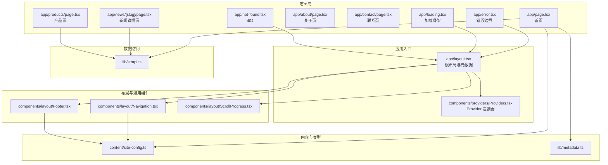
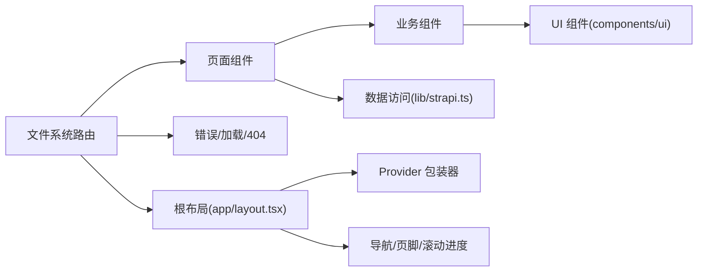
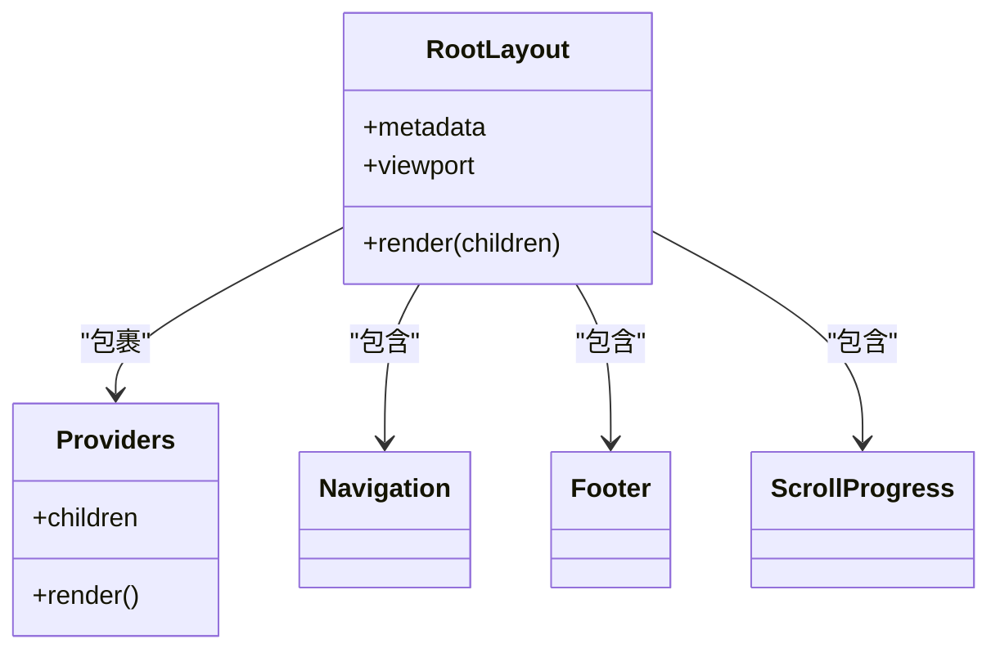
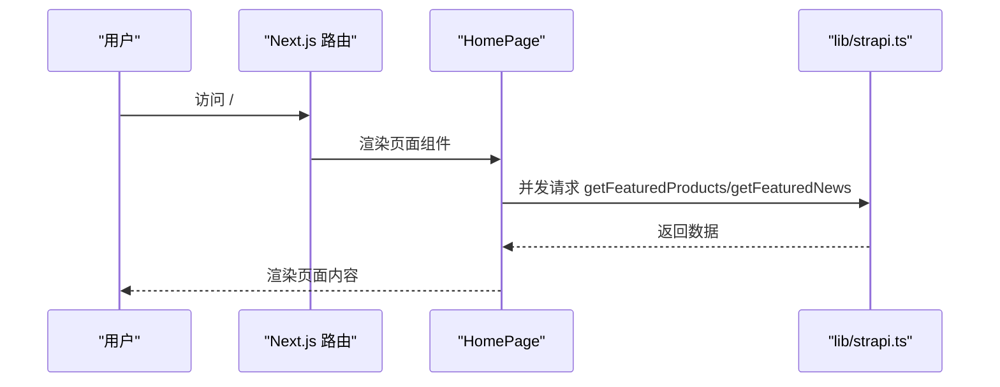
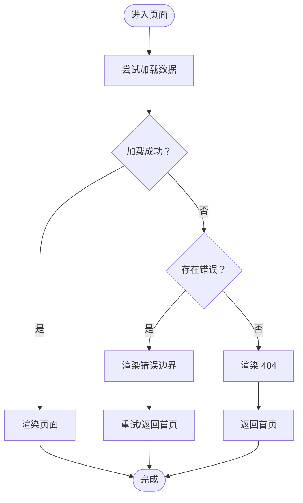
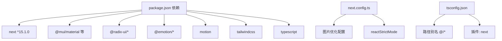

# 前端架构设计

<cite>
**本文引用的文件**
- [frontend/app/layout.tsx](file://frontend/app/layout.tsx)
- [frontend/components/providers/Providers.tsx](file://frontend/components/providers/Providers.tsx)
- [frontend/next.config.ts](file://frontend/next.config.ts)
- [frontend/tsconfig.json](file://frontend/tsconfig.json)
- [frontend/package.json](file://frontend/package.json)
- [frontend/app/page.tsx](file://frontend/app/page.tsx)
- [frontend/content/site-config.ts](file://frontend/content/site-config.ts)
- [frontend/lib/metadata.ts](file://frontend/lib/metadata.ts)
- [frontend/components/layout/Navigation.tsx](file://frontend/components/layout/Navigation.tsx)
- [frontend/components/layout/Footer.tsx](file://frontend/components/layout/Footer.tsx)
- [frontend/components/layout/ScrollProgress.tsx](file://frontend/components/layout/ScrollProgress.tsx)
- [frontend/app/error.tsx](file://frontend/app/error.tsx)
- [frontend/app/loading.tsx](file://frontend/app/loading.tsx)
- [frontend/app/not-found.tsx](file://frontend/app/not-found.tsx)
- [frontend/lib/strapi.ts](file://frontend/lib/strapi.ts)
</cite>

## 目录
1. [引言](#引言)
2. [项目结构](#项目结构)
3. [核心组件](#核心组件)
4. [架构总览](#架构总览)
5. [组件详解](#组件详解)
6. [依赖关系分析](#依赖关系分析)
7. [性能与构建优化](#性能与构建优化)
8. [故障排查指南](#故障排查指南)
9. [结论](#结论)
10. [附录](#附录)

## 引言
本文件面向基于 Next.js 15 的前端应用，系统性梳理其架构设计与实现要点，重点覆盖：
- App Router 文件系统路由：页面路由、嵌套路由与动态路由
- 组件层次结构：根布局到页面再到业务组件
- 渲染模式：静态生成（SSG）、服务端渲染（SSR）、客户端渲染（CSR）的应用策略
- Provider 包装器与全局状态管理思路
- TypeScript、构建与性能优化
- 响应式设计、主题系统与 SEO 架构

## 项目结构
前端采用 Next.js 15 App Router 的文件系统路由约定，页面按目录层级映射为路由路径；根布局负责全局元数据、主题色、Provider 包裹与通用布局元素；页面组件负责具体业务数据拉取与内容展示；业务组件按功能拆分至 sections 与 ui 子目录；内容配置集中于 content；数据访问封装在 lib。

图表来源
- [frontend/app/layout.tsx](file://frontend/app/layout.tsx#L63-L82)
- [frontend/components/providers/Providers.tsx](file://frontend/components/providers/Providers.tsx#L9-L16)
- [frontend/app/page.tsx](file://frontend/app/page.tsx#L40-L71)
- [frontend/app/news/[slug]/page.tsx](file://frontend/app/news/[slug]/page.tsx)
- [frontend/app/products/page.tsx](file://frontend/app/products/page.tsx)
- [frontend/app/about/page.tsx](file://frontend/app/about/page.tsx)
- [frontend/app/contact/page.tsx](file://frontend/app/contact/page.tsx)
- [frontend/app/error.tsx](file://frontend/app/error.tsx#L5-L65)
- [frontend/app/loading.tsx](file://frontend/app/loading.tsx#L1-L14)
- [frontend/app/not-found.tsx](file://frontend/app/not-found.tsx#L3-L41)
- [frontend/components/layout/Navigation.tsx](file://frontend/components/layout/Navigation.tsx#L9-L125)
- [frontend/components/layout/Footer.tsx](file://frontend/components/layout/Footer.tsx#L10-L207)
- [frontend/components/layout/ScrollProgress.tsx](file://frontend/components/layout/ScrollProgress.tsx#L6-L20)
- [frontend/content/site-config.ts](file://frontend/content/site-config.ts#L1-L47)
- [frontend/lib/metadata.ts](file://frontend/lib/metadata.ts#L10-L57)
- [frontend/lib/strapi.ts](file://frontend/lib/strapi.ts#L100-L155)

章节来源
- [frontend/app/layout.tsx](file://frontend/app/layout.tsx#L1-L83)
- [frontend/components/providers/Providers.tsx](file://frontend/components/providers/Providers.tsx#L1-L18)
- [frontend/app/page.tsx](file://frontend/app/page.tsx#L1-L72)
- [frontend/content/site-config.ts](file://frontend/content/site-config.ts#L1-L47)
- [frontend/lib/metadata.ts](file://frontend/lib/metadata.ts#L1-L60)
- [frontend/components/layout/Navigation.tsx](file://frontend/components/layout/Navigation.tsx#L1-L126)
- [frontend/components/layout/Footer.tsx](file://frontend/components/layout/Footer.tsx#L1-L208)
- [frontend/components/layout/ScrollProgress.tsx](file://frontend/components/layout/ScrollProgress.tsx#L1-L21)
- [frontend/app/error.tsx](file://frontend/app/error.tsx#L1-L66)
- [frontend/app/loading.tsx](file://frontend/app/loading.tsx#L1-L15)
- [frontend/app/not-found.tsx](file://frontend/app/not-found.tsx#L1-L42)
- [frontend/lib/strapi.ts](file://frontend/lib/strapi.ts#L1-L155)

## 核心组件
- 根布局与元数据：定义站点标题、描述、Open Graph、Twitter 卡片、robots 策略与 viewport 主题色，统一包裹 Provider 并注入导航、主内容区与页脚。
- Provider 包装器：作为全局上下文容器，预留主题、认证等 Provider 的挂载点。
- 导航与页脚：响应式导航菜单、移动端抽屉、滚动进度条与品牌信息、业务范围、快速链接、联系方式等。
- 页面组件：首页聚合多段落内容，异步拉取 Strapi 数据；新闻详情页使用动态路由参数 slug；产品页、关于页、联系页分别承载对应业务。
- 错误、加载与 404：统一的错误边界、加载骨架与 404 页面，保证用户体验一致性。

章节来源
- [frontend/app/layout.tsx](file://frontend/app/layout.tsx#L9-L52)
- [frontend/app/layout.tsx](file://frontend/app/layout.tsx#L63-L82)
- [frontend/components/providers/Providers.tsx](file://frontend/components/providers/Providers.tsx#L9-L16)
- [frontend/components/layout/Navigation.tsx](file://frontend/components/layout/Navigation.tsx#L9-L125)
- [frontend/components/layout/Footer.tsx](file://frontend/components/layout/Footer.tsx#L10-L207)
- [frontend/components/layout/ScrollProgress.tsx](file://frontend/components/layout/ScrollProgress.tsx#L6-L20)
- [frontend/app/page.tsx](file://frontend/app/page.tsx#L40-L71)
- [frontend/app/error.tsx](file://frontend/app/error.tsx#L5-L65)
- [frontend/app/loading.tsx](file://frontend/app/loading.tsx#L1-L14)
- [frontend/app/not-found.tsx](file://frontend/app/not-found.tsx#L3-L41)

## 架构总览
Next.js 15 App Router 以文件系统为路由定义中心，支持：
- 页面路由：app/page.tsx 对应根路径 /
- 嵌套路由：app/about/page.tsx、app/contact/page.tsx 等
- 动态路由：app/news/[slug]/page.tsx 与 app/solutions/[slug]/page.tsx
- 错误与加载：app/error.tsx、app/loading.tsx、app/not-found.tsx
- 全局元数据：app/layout.tsx 定义 metadata 与 viewport
- 根布局：app/layout.tsx 作为根组件，包裹 Provider 与通用布局

图表来源
- [frontend/app/layout.tsx](file://frontend/app/layout.tsx#L63-L82)
- [frontend/app/page.tsx](file://frontend/app/page.tsx#L40-L71)
- [frontend/app/news/[slug]/page.tsx](file://frontend/app/news/[slug]/page.tsx)
- [frontend/app/solutions/[slug]/page.tsx](file://frontend/app/solutions/[slug]/page.tsx)
- [frontend/app/error.tsx](file://frontend/app/error.tsx#L5-L65)
- [frontend/app/loading.tsx](file://frontend/app/loading.tsx#L1-L14)
- [frontend/app/not-found.tsx](file://frontend/app/not-found.tsx#L3-L41)
- [frontend/lib/strapi.ts](file://frontend/lib/strapi.ts#L100-L155)

## 组件详解

### 根布局与 Provider 包装器
- 根布局负责：
  - 全局元数据与 viewport 配置
  - 语言属性与防水合警告开关
  - Provider 包裹子树，便于未来接入主题、认证等全局状态
  - 注入 ScrollProgress、Navigation、Footer 与主内容区
- Provider 包装器当前为空壳，预留扩展位

图表来源
- [frontend/app/layout.tsx](file://frontend/app/layout.tsx#L63-L82)
- [frontend/components/providers/Providers.tsx](file://frontend/components/providers/Providers.tsx#L9-L16)
- [frontend/components/layout/Navigation.tsx](file://frontend/components/layout/Navigation.tsx#L9-L125)
- [frontend/components/layout/Footer.tsx](file://frontend/components/layout/Footer.tsx#L10-L207)
- [frontend/components/layout/ScrollProgress.tsx](file://frontend/components/layout/ScrollProgress.tsx#L6-L20)

章节来源
- [frontend/app/layout.tsx](file://frontend/app/layout.tsx#L9-L52)
- [frontend/app/layout.tsx](file://frontend/app/layout.tsx#L63-L82)
- [frontend/components/providers/Providers.tsx](file://frontend/components/providers/Providers.tsx#L1-L18)

### 页面组件与数据流
- 首页页面组件演示了典型的 SSR/SSG 模式：在组件顶层声明 metadata，并在组件内部并发拉取多个数据源，最终渲染多个业务区块。
- 新闻详情页通过动态路由参数 slug 从 Strapi 获取文章详情，结合内容配置与元数据工具生成 SEO 友好的页面。

图表来源
- [frontend/app/page.tsx](file://frontend/app/page.tsx#L40-L71)
- [frontend/lib/strapi.ts](file://frontend/lib/strapi.ts#L120-L125)
- [frontend/lib/strapi.ts](file://frontend/lib/strapi.ts#L134-L139)

章节来源
- [frontend/app/page.tsx](file://frontend/app/page.tsx#L13-L38)
- [frontend/app/page.tsx](file://frontend/app/page.tsx#L40-L71)
- [frontend/lib/strapi.ts](file://frontend/lib/strapi.ts#L100-L155)

### 错误、加载与 404 边界
- 错误边界：捕获子树错误，提供重试与返回首页能力
- 加载骨架：统一的加载动画，改善感知性能
- 404 页面：优雅提示与返回入口

图表来源
- [frontend/app/error.tsx](file://frontend/app/error.tsx#L5-L65)
- [frontend/app/loading.tsx](file://frontend/app/loading.tsx#L1-L14)
- [frontend/app/not-found.tsx](file://frontend/app/not-found.tsx#L3-L41)

章节来源
- [frontend/app/error.tsx](file://frontend/app/error.tsx#L1-L66)
- [frontend/app/loading.tsx](file://frontend/app/loading.tsx#L1-L15)
- [frontend/app/not-found.tsx](file://frontend/app/not-found.tsx#L1-L42)

### 导航、页脚与滚动进度
- 导航：响应式桌面菜单与移动端抽屉，支持滚动变色与动画过渡
- 页脚：品牌信息、业务范围、快速链接、法律条款与联系方式
- 滚动进度：基于 motion 的平滑进度条，指示页面滚动位置

章节来源
- [frontend/components/layout/Navigation.tsx](file://frontend/components/layout/Navigation.tsx#L9-L125)
- [frontend/components/layout/Footer.tsx](file://frontend/components/layout/Footer.tsx#L10-L207)
- [frontend/components/layout/ScrollProgress.tsx](file://frontend/components/layout/ScrollProgress.tsx#L6-L20)

## 依赖关系分析
- Next.js 15 与 Turbopack 开发体验
- 图片优化与现代格式支持
- 严格模式与 TypeScript 配置
- UI 与动画库：Radix UI、Emotion、Material UI、Motion、Tailwind 等
- 构建与开发脚本

图表来源
- [frontend/package.json](file://frontend/package.json#L12-L87)
- [frontend/next.config.ts](file://frontend/next.config.ts#L3-L36)
- [frontend/tsconfig.json](file://frontend/tsconfig.json#L19-L28)

章节来源
- [frontend/package.json](file://frontend/package.json#L1-L88)
- [frontend/next.config.ts](file://frontend/next.config.ts#L1-L39)
- [frontend/tsconfig.json](file://frontend/tsconfig.json#L1-L42)

## 性能与构建优化
- 图片优化：远程域名白名单、现代图片格式（AVIF/WebP）、响应式尺寸与设备像素比
- 严格模式：提升开发期质量与潜在性能收益
- 构建与开发：Turbopack 加速开发，TypeScript 严格模式与增量编译
- 数据拉取：并发请求与缓存控制（revalidate），减少首屏等待
- 动画与滚动：使用平滑弹簧动画与轻量级滚动进度条，避免阻塞主线程

章节来源
- [frontend/next.config.ts](file://frontend/next.config.ts#L4-L33)
- [frontend/next.config.ts](file://frontend/next.config.ts#L34-L36)
- [frontend/app/page.tsx](file://frontend/app/page.tsx#L41-L44)
- [frontend/lib/strapi.ts](file://frontend/lib/strapi.ts#L100-L111)
- [frontend/components/layout/ScrollProgress.tsx](file://frontend/components/layout/ScrollProgress.tsx#L6-L20)

## 故障排查指南
- 错误边界：在错误组件中打印错误对象，提供重试与返回首页
- 加载状态：确保关键区域有加载骨架，避免空白长时间显示
- 404 页面：对不存在路由进行友好提示与引导
- 数据访问：检查 Strapi 请求返回状态与 URL 环境变量，确认 revalidate 参数合理

章节来源
- [frontend/app/error.tsx](file://frontend/app/error.tsx#L12-L15)
- [frontend/app/loading.tsx](file://frontend/app/loading.tsx#L1-L14)
- [frontend/app/not-found.tsx](file://frontend/app/not-found.tsx#L3-L41)
- [frontend/lib/strapi.ts](file://frontend/lib/strapi.ts#L100-L111)

## 结论
该前端架构以 Next.js 15 App Router 为核心，通过清晰的文件系统路由、根布局与 Provider 包装器，实现了可扩展的页面与组件体系。配合 Strapi 数据访问、统一的 SEO 元数据与响应式 UI，兼顾了性能、可维护性与用户体验。建议后续在 Provider 中逐步接入主题与认证状态，完善全局状态管理；同时持续优化图片与第三方资源加载策略，进一步提升首屏性能。

## 附录
- SEO 架构：根布局与页面组件共同维护 metadata、Open Graph、Twitter 卡片与 robots 策略
- 内容配置：site-config.ts 提供品牌、SEO、社交与版权信息，被导航、页脚与页面组件复用
- 类型与路径：tsconfig.json 使用路径别名与严格模式，lib/metadata.ts 提供可复用的元数据生成函数

章节来源
- [frontend/content/site-config.ts](file://frontend/content/site-config.ts#L1-L47)
- [frontend/lib/metadata.ts](file://frontend/lib/metadata.ts#L10-L57)
- [frontend/tsconfig.json](file://frontend/tsconfig.json#L24-L28)