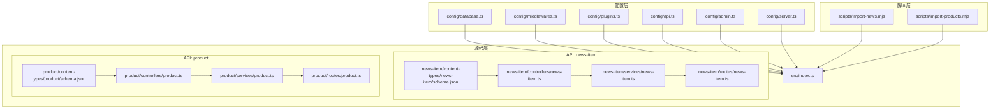
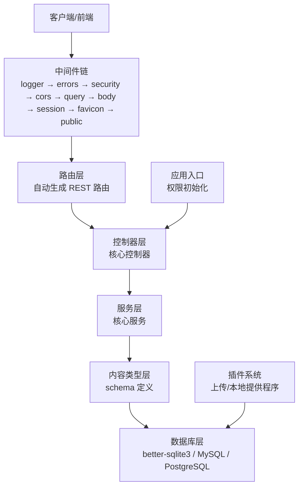
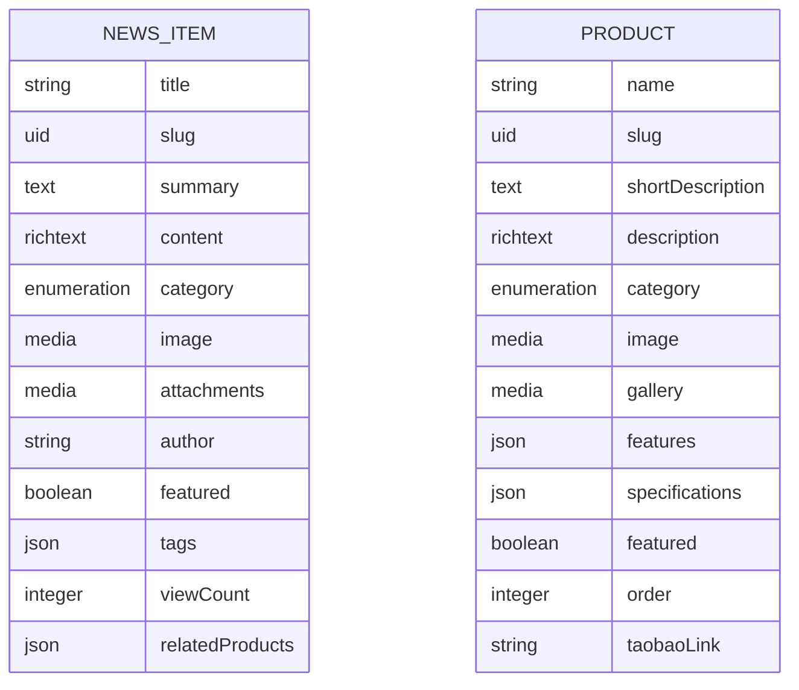
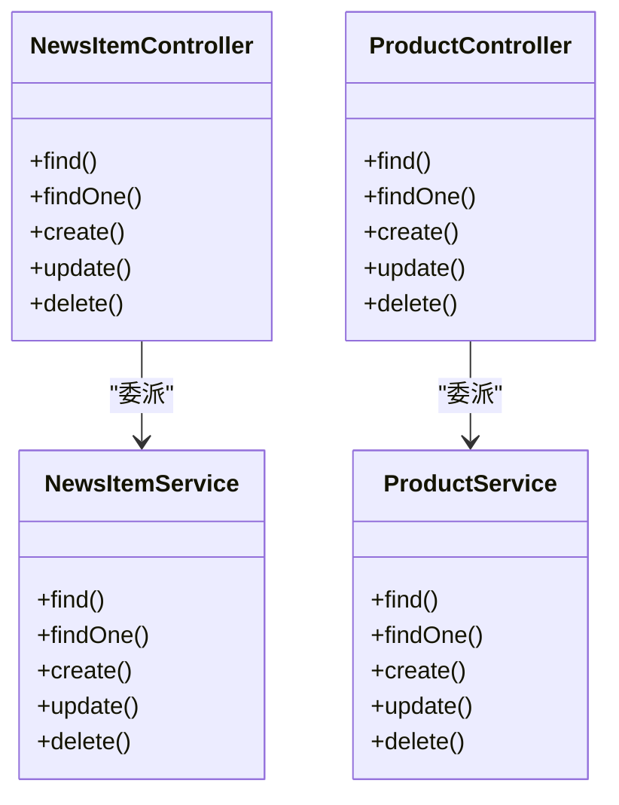
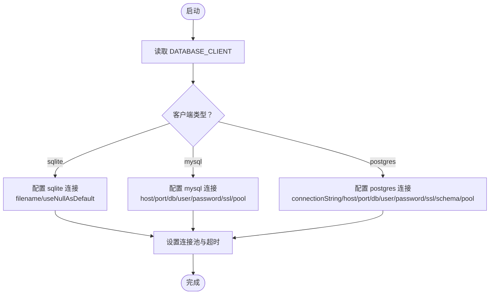
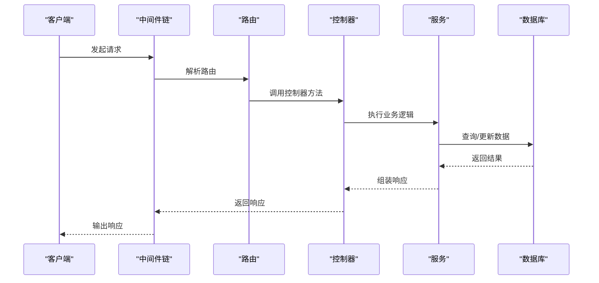
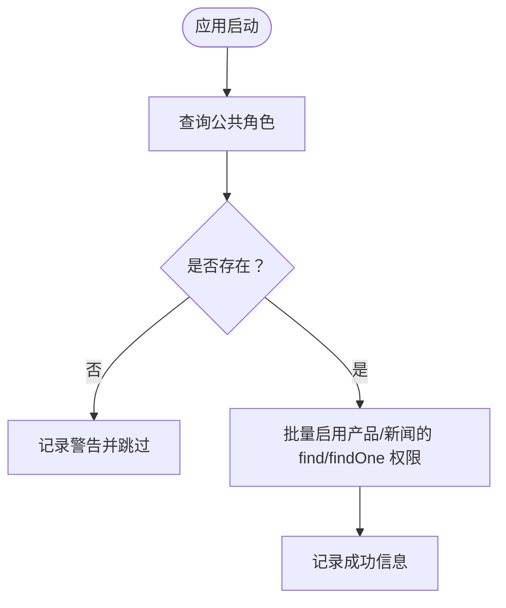
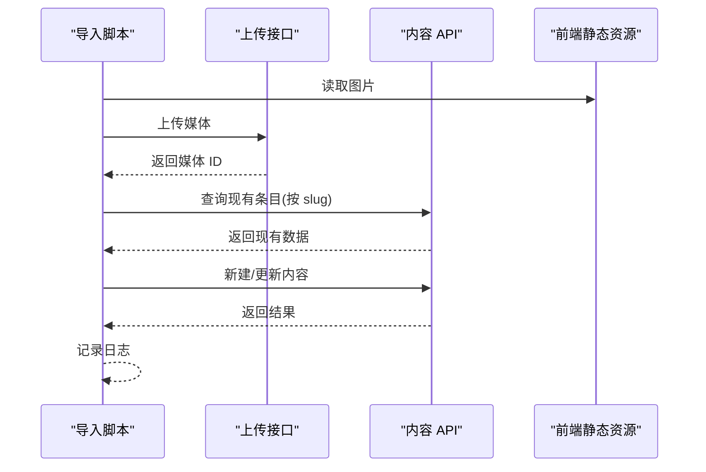
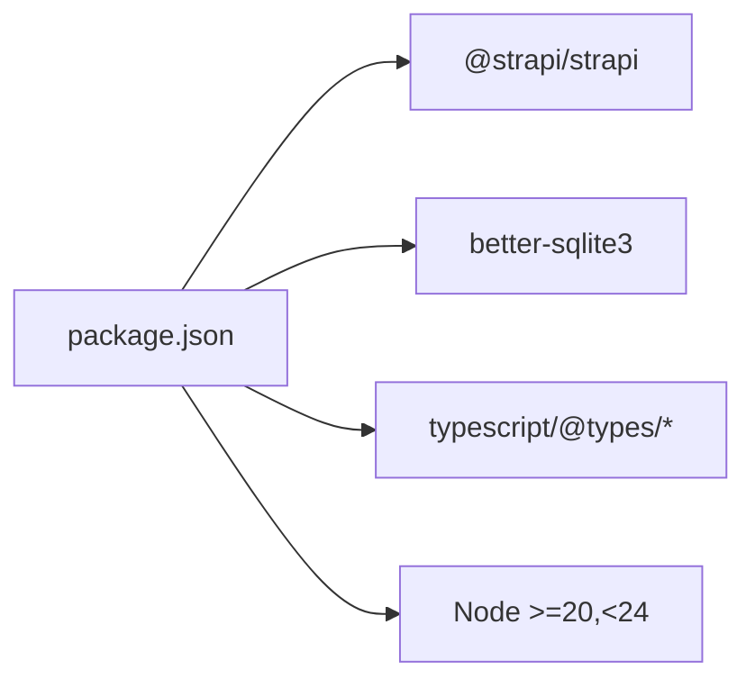

# 后端架构设计

<cite>
**本文引用的文件**
- [package.json](file://backend/package.json)
- [index.ts](file://backend/src/index.ts)
- [database.ts](file://backend/config/database.ts)
- [server.ts](file://backend/config/server.ts)
- [middlewares.ts](file://backend/config/middlewares.ts)
- [plugins.ts](file://backend/config/plugins.ts)
- [api.ts](file://backend/config/api.ts)
- [admin.ts](file://backend/config/admin.ts)
- [news-item-schema.json](file://backend/src/api/news-item/content-types/news-item/schema.json)
- [product-schema.json](file://backend/src/api/product/content-types/product/schema.json)
- [news-item-controller.ts](file://backend/src/api/news-item/controllers/news-item.ts)
- [product-controller.ts](file://backend/src/api/product/controllers/product.ts)
- [news-item-service.ts](file://backend/src/api/news-item/services/news-item.ts)
- [product-service.ts](file://backend/src/api/product/services/product.ts)
- [news-item-route.ts](file://backend/src/api/news-item/routes/news-item.ts)
- [product-route.ts](file://backend/src/api/product/routes/product.ts)
- [import-news.mjs](file://backend/scripts/import-news.mjs)
- [import-products.mjs](file://backend/scripts/import-products.mjs)
</cite>

## 目录
1. [简介](#简介)
2. [项目结构](#项目结构)
3. [核心组件](#核心组件)
4. [架构总览](#架构总览)
5. [详细组件分析](#详细组件分析)
6. [依赖关系分析](#依赖关系分析)
7. [性能考量](#性能考量)
8. [故障排查指南](#故障排查指南)
9. [结论](#结论)
10. [附录](#附录)

## 简介
本文件为基于 Strapi 5 的 CMS 后端架构设计文档，面向后端开发与运维人员，系统阐述 MVC 架构（内容类型、控制器、服务层、路由）、数据库与 API 设计、插件体系、权限与发布流程、以及可扩展性与性能优化建议。项目采用 TypeScript 编写，使用 better-sqlite3 作为默认数据库驱动，并通过内置的 Users & Permissions 插件提供基础鉴权能力。

## 项目结构
后端工程位于 backend 目录，采用 Strapi 标准目录结构：
- 配置层：config 下包含数据库、服务器、中间件、插件、API、管理端等配置
- 源码层：src 下包含应用入口、管理员前端（示例）与业务 API（news-item、product）
- 脚本层：scripts 提供内容导入脚本，用于从前端内容源批量导入新闻与产品数据
- 类型生成：types/generated 由 Strapi 自动生成，便于在 TypeScript 中使用

图表来源
- [database.ts](file://backend/config/database.ts#L1-L61)
- [server.ts](file://backend/config/server.ts#L1-L8)
- [middlewares.ts](file://backend/config/middlewares.ts#L1-L13)
- [plugins.ts](file://backend/config/plugins.ts#L1-L11)
- [api.ts](file://backend/config/api.ts#L1-L8)
- [admin.ts](file://backend/config/admin.ts#L1-L21)
- [index.ts](file://backend/src/index.ts#L1-L65)
- [news-item-schema.json](file://backend/src/api/news-item/content-types/news-item/schema.json#L1-L65)
- [product-schema.json](file://backend/src/api/product/content-types/product/schema.json#L1-L63)
- [news-item-controller.ts](file://backend/src/api/news-item/controllers/news-item.ts#L1-L4)
- [product-controller.ts](file://backend/src/api/product/controllers/product.ts#L1-L4)
- [news-item-service.ts](file://backend/src/api/news-item/services/news-item.ts#L1-L4)
- [product-service.ts](file://backend/src/api/product/services/product.ts#L1-L4)
- [news-item-route.ts](file://backend/src/api/news-item/routes/news-item.ts#L1-L4)
- [product-route.ts](file://backend/src/api/product/routes/product.ts#L1-L4)
- [import-news.mjs](file://backend/scripts/import-news.mjs#L1-L157)
- [import-products.mjs](file://backend/scripts/import-products.mjs#L1-L163)

章节来源
- [package.json](file://backend/package.json#L1-L45)
- [database.ts](file://backend/config/database.ts#L1-L61)
- [server.ts](file://backend/config/server.ts#L1-L8)
- [middlewares.ts](file://backend/config/middlewares.ts#L1-L13)
- [plugins.ts](file://backend/config/plugins.ts#L1-L11)
- [api.ts](file://backend/config/api.ts#L1-L8)
- [admin.ts](file://backend/config/admin.ts#L1-L21)
- [index.ts](file://backend/src/index.ts#L1-L65)

## 核心组件
- 应用入口与引导：应用入口负责在启动阶段为公共角色启用必要的 API 权限，确保匿名用户可读取产品与新闻列表及详情。
- 内容类型：news-item 与 product 两个集合类型，均启用草稿/发布（draftAndPublish），并定义了字段、媒体、枚举、布尔、整数、JSON 等多种属性。
- 控制器与服务：采用 Strapi 工厂方法创建核心控制器与服务，遵循 MVC 分层；路由由工厂方法自动生成 REST 路由。
- 数据库：支持 sqlite/mysql/postgres，sqlite 默认使用 better-sqlite3，配置包含连接池、超时与空值处理。
- 中间件：按顺序加载日志、错误处理、安全、CORS、查询、Body 解析、会话、静态资源等。
- 插件：上传插件使用本地提供程序，限制单文件大小；Users & Permissions 插件已安装，用于权限与角色管理。
- 管理端：配置了管理员 JWT 密钥、API Token Salt、传输 Token Salt、加密密钥等安全参数。
- API 层：REST 默认分页、最大限制与计数返回开关。

章节来源
- [index.ts](file://backend/src/index.ts#L19-L62)
- [news-item-schema.json](file://backend/src/api/news-item/content-types/news-item/schema.json#L10-L12)
- [product-schema.json](file://backend/src/api/product/content-types/product/schema.json#L10-L12)
- [news-item-controller.ts](file://backend/src/api/news-item/controllers/news-item.ts#L1-L4)
- [product-controller.ts](file://backend/src/api/product/controllers/product.ts#L1-L4)
- [news-item-service.ts](file://backend/src/api/news-item/services/news-item.ts#L1-L4)
- [product-service.ts](file://backend/src/api/product/services/product.ts#L1-L4)
- [news-item-route.ts](file://backend/src/api/news-item/routes/news-item.ts#L1-L4)
- [product-route.ts](file://backend/src/api/product/routes/product.ts#L1-L4)
- [database.ts](file://backend/config/database.ts#L45-L50)
- [middlewares.ts](file://backend/config/middlewares.ts#L1-L13)
- [plugins.ts](file://backend/config/plugins.ts#L1-L11)
- [admin.ts](file://backend/config/admin.ts#L2-L15)
- [api.ts](file://backend/config/api.ts#L2-L6)

## 架构总览
下图展示 Strapi 5 在本项目中的整体运行时架构：配置层决定行为，入口在启动时进行权限初始化，API 层通过控制器-服务-路由链路访问内容类型，数据库层根据配置选择具体驱动，中间件贯穿请求生命周期，插件提供上传等能力。

图表来源
- [middlewares.ts](file://backend/config/middlewares.ts#L1-L13)
- [news-item-route.ts](file://backend/src/api/news-item/routes/news-item.ts#L1-L4)
- [product-route.ts](file://backend/src/api/product/routes/product.ts#L1-L4)
- [news-item-controller.ts](file://backend/src/api/news-item/controllers/news-item.ts#L1-L4)
- [product-controller.ts](file://backend/src/api/product/controllers/product.ts#L1-L4)
- [news-item-service.ts](file://backend/src/api/news-item/services/news-item.ts#L1-L4)
- [product-service.ts](file://backend/src/api/product/services/product.ts#L1-L4)
- [news-item-schema.json](file://backend/src/api/news-item/content-types/news-item/schema.json#L1-L65)
- [product-schema.json](file://backend/src/api/product/content-types/product/schema.json#L1-L63)
- [database.ts](file://backend/config/database.ts#L45-L50)
- [plugins.ts](file://backend/config/plugins.ts#L1-L11)
- [index.ts](file://backend/src/index.ts#L19-L62)

## 详细组件分析

### MVC 架构与内容类型
- 内容类型定义：news-item 与 product 均为 collectionType，启用 draftAndPublish，字段覆盖字符串、文本、富文本、UID、枚举、媒体、布尔、整数、JSON 等，满足新闻与产品内容管理需求。
- 字段设计要点：
  - UID 字段用于 slug，保证唯一性与 SEO 友好 URL
  - media 字段限定 images 类型，支持单图与图集
  - JSON 字段用于灵活存储特性与规格
  - integer 字段用于排序与计数
- 版本与发布：草稿/发布选项开启，配合 Users & Permissions 插件可实现不同角色对内容状态的控制。

图表来源
- [news-item-schema.json](file://backend/src/api/news-item/content-types/news-item/schema.json#L13-L62)
- [product-schema.json](file://backend/src/api/product/content-types/product/schema.json#L13-L61)

章节来源
- [news-item-schema.json](file://backend/src/api/news-item/content-types/news-item/schema.json#L1-L65)
- [product-schema.json](file://backend/src/api/product/content-types/product/schema.json#L1-L63)

### 控制器、服务与路由
- 控制器：通过工厂方法创建核心控制器，绑定到对应内容类型，负责接收请求并委派给服务层。
- 服务：通过工厂方法创建核心服务，封装业务逻辑与数据访问。
- 路由：通过工厂方法创建核心路由，自动生成 RESTful 路由，遵循 Strapi 约定式命名。
- 设计原则：MVC 分层清晰，控制器仅做参数解析与响应组装，服务层承担业务规则，路由层保持最小化。

图表来源
- [news-item-controller.ts](file://backend/src/api/news-item/controllers/news-item.ts#L1-L4)
- [product-controller.ts](file://backend/src/api/product/controllers/product.ts#L1-L4)
- [news-item-service.ts](file://backend/src/api/news-item/services/news-item.ts#L1-L4)
- [product-service.ts](file://backend/src/api/product/services/product.ts#L1-L4)

章节来源
- [news-item-controller.ts](file://backend/src/api/news-item/controllers/news-item.ts#L1-L4)
- [product-controller.ts](file://backend/src/api/product/controllers/product.ts#L1-L4)
- [news-item-service.ts](file://backend/src/api/news-item/services/news-item.ts#L1-L4)
- [product-service.ts](file://backend/src/api/product/services/product.ts#L1-L4)
- [news-item-route.ts](file://backend/src/api/news-item/routes/news-item.ts#L1-L4)
- [product-route.ts](file://backend/src/api/product/routes/product.ts#L1-L4)

### 数据库架构与配置
- 驱动选择：默认 sqlite 使用 better-sqlite3，同时支持 mysql 与 postgres，可通过环境变量切换。
- 连接参数：sqlite 指定文件路径；mysql/postgres 支持连接池、SSL、schema 等配置。
- 运行时行为：useNullAsDefault 与 acquireConnectionTimeout 等参数提升稳定性。
- 文件存储：sqlite 默认文件位于项目内相对路径，适合开发与小规模部署。

图表来源
- [database.ts](file://backend/config/database.ts#L3-L60)

章节来源
- [database.ts](file://backend/config/database.ts#L1-L61)

### API 架构与路由组织
- REST 约定：路由由工厂方法自动生成，遵循 Strapi 约定式命名，控制器与服务自动匹配。
- 分页与计数：默认分页限制与最大限制、是否返回总数均可配置。
- 请求处理：中间件链贯穿请求生命周期，统一处理安全、CORS、查询、Body、会话与静态资源。

图表来源
- [middlewares.ts](file://backend/config/middlewares.ts#L1-L13)
- [news-item-route.ts](file://backend/src/api/news-item/routes/news-item.ts#L1-L4)
- [product-route.ts](file://backend/src/api/product/routes/product.ts#L1-L4)
- [news-item-controller.ts](file://backend/src/api/news-item/controllers/news-item.ts#L1-L4)
- [product-controller.ts](file://backend/src/api/product/controllers/product.ts#L1-L4)
- [news-item-service.ts](file://backend/src/api/news-item/services/news-item.ts#L1-L4)
- [product-service.ts](file://backend/src/api/product/services/product.ts#L1-L4)
- [database.ts](file://backend/config/database.ts#L45-L50)

章节来源
- [api.ts](file://backend/config/api.ts#L1-L8)
- [middlewares.ts](file://backend/config/middlewares.ts#L1-L13)

### 权限管理与认证授权
- 公共权限初始化：应用入口在启动时查找公共角色，批量启用产品与新闻的 find/findOne 权限，确保匿名用户可读取公开内容。
- Users & Permissions 插件：已安装，可用于精细化角色与权限配置，结合草稿/发布流程实现内容审核与发布。
- 管理端安全：管理员 JWT 密钥、API Token Salt、传输 Token Salt、加密密钥等参数集中配置，保障管理端安全。

图表来源
- [index.ts](file://backend/src/index.ts#L19-L62)

章节来源
- [index.ts](file://backend/src/index.ts#L19-L62)
- [admin.ts](file://backend/config/admin.ts#L2-L15)
- [package.json](file://backend/package.json#L21-L23)

### 插件系统架构
- 上传插件：使用本地提供程序，限制单文件大小，适配静态资源托管。
- 第三方插件：Users & Permissions 插件已安装，提供用户、角色、权限与 JWT 等能力。
- Cloud 插件：已安装，可用于云存储或云端增强功能（需进一步配置）。

章节来源
- [plugins.ts](file://backend/config/plugins.ts#L1-L11)
- [package.json](file://backend/package.json#L21-L23)

### 内容导入与数据迁移
- 导入脚本：提供导入新闻与产品的脚本，支持从前端内容源批量导入，并处理媒体上传、去重与更新。
- 流程要点：
  - 读取前端内容导出文件
  - 上传媒体至上传接口
  - 基于 slug 查询现有条目，存在则更新，否则新建
  - 记录导入日志与错误处理

图表来源
- [import-news.mjs](file://backend/scripts/import-news.mjs#L68-L122)
- [import-products.mjs](file://backend/scripts/import-products.mjs#L68-L124)

章节来源
- [import-news.mjs](file://backend/scripts/import-news.mjs#L1-L157)
- [import-products.mjs](file://backend/scripts/import-products.mjs#L1-L163)

## 依赖关系分析
- 核心依赖：Strapi 5 与 better-sqlite3，提供 CMS 能力与高性能 SQLite 驱动。
- 开发依赖：TypeScript 与相关类型声明，保障类型安全。
- 环境约束：Node 版本范围严格，确保兼容性与稳定性。

图表来源
- [package.json](file://backend/package.json#L20-L43)

章节来源
- [package.json](file://backend/package.json#L1-L45)

## 性能考量
- 数据库连接池：合理设置最小/最大连接数与超时时间，避免高并发下的连接争用。
- 分页与查询：利用 API 层的默认分页与最大限制，避免一次性返回过多数据；结合过滤器与排序减少无效查询。
- 媒体处理：上传插件限制单文件大小，避免大文件拖慢系统；建议对图片进行压缩与格式优化。
- 缓存策略：当前未见显式缓存层配置，可在网关或应用层引入缓存（如 Redis）以减轻数据库压力；对热点内容（如首页、热门文章）实施缓存与失效策略。
- 并发与会话：中间件中包含会话处理，注意会话存储与清理策略，避免内存泄漏。

## 故障排查指南
- 权限问题：若匿名用户无法读取内容，检查应用入口是否正确启用公共角色的 find/findOne 权限。
- 数据库连接：若启动时报连接错误，检查 DATABASE_CLIENT 与连接参数（主机、端口、用户名、密码、SSL 等）。
- 上传失败：若媒体上传失败，确认上传接口可用、令牌有效、文件大小与类型符合限制。
- 导入异常：若导入脚本报错，检查 STRAPI_URL 与 STRAPI_TOKEN 是否正确，网络连通性与 API 可用性。

章节来源
- [index.ts](file://backend/src/index.ts#L19-L62)
- [database.ts](file://backend/config/database.ts#L3-L60)
- [plugins.ts](file://backend/config/plugins.ts#L1-L11)
- [import-news.mjs](file://backend/scripts/import-news.mjs#L10-L16)
- [import-products.mjs](file://backend/scripts/import-products.mjs#L10-L16)

## 结论
本项目基于 Strapi 5 构建，采用标准 MVC 分层与约定式路由，结合 better-sqlite3 实现高性能开发环境；通过 Users & Permissions 插件与应用入口的权限初始化，实现了基础的公开读取能力。内容类型设计覆盖新闻与产品场景，具备草稿/发布与媒体管理能力。后续可在缓存、CDN、监控与可观测性方面进一步增强，以支撑更高并发与更复杂的业务需求。

## 附录
- 环境变量建议：DATABASE_CLIENT、DATABASE_FILENAME、HOST、PORT、APP_KEYS、ADMIN_JWT_SECRET、API_TOKEN_SALT、TRANSFER_TOKEN_SALT、ENCRYPTION_KEY 等
- 扩展方向：引入 Redis 缓存、图片 CDN、日志与指标采集、灰度发布与蓝绿部署策略