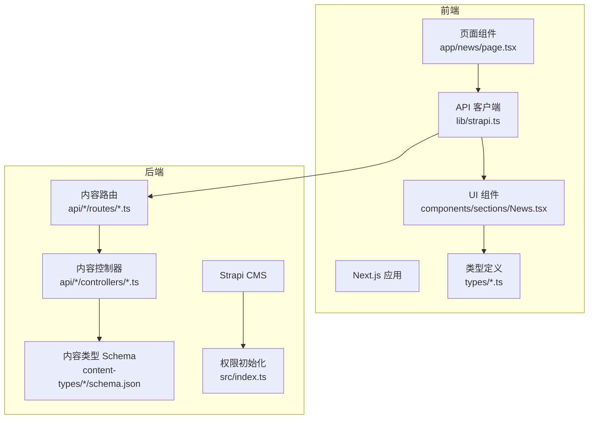
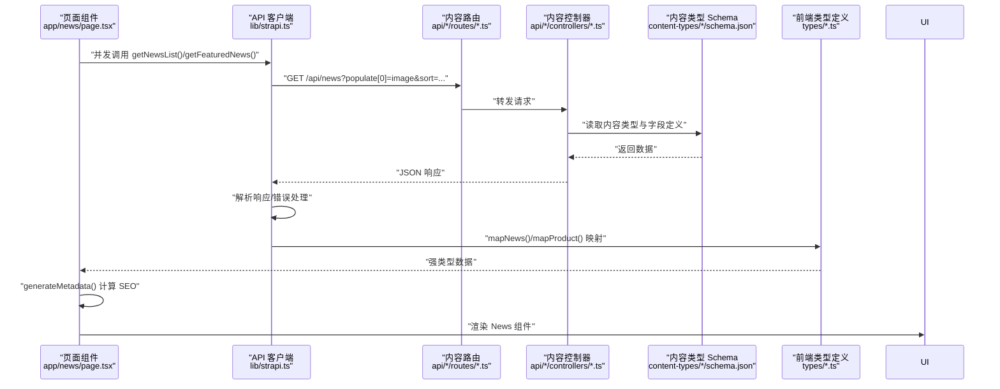
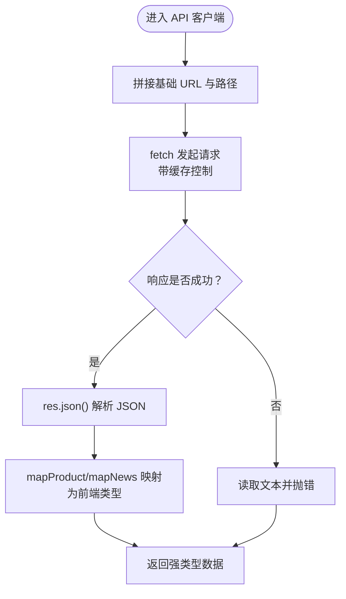
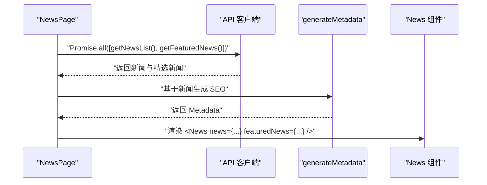
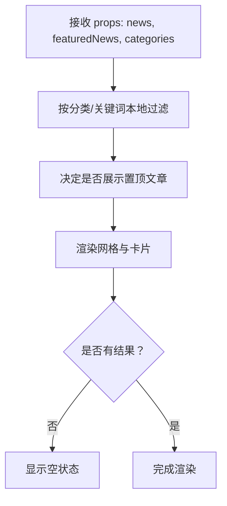
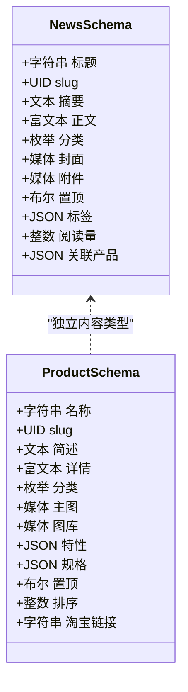
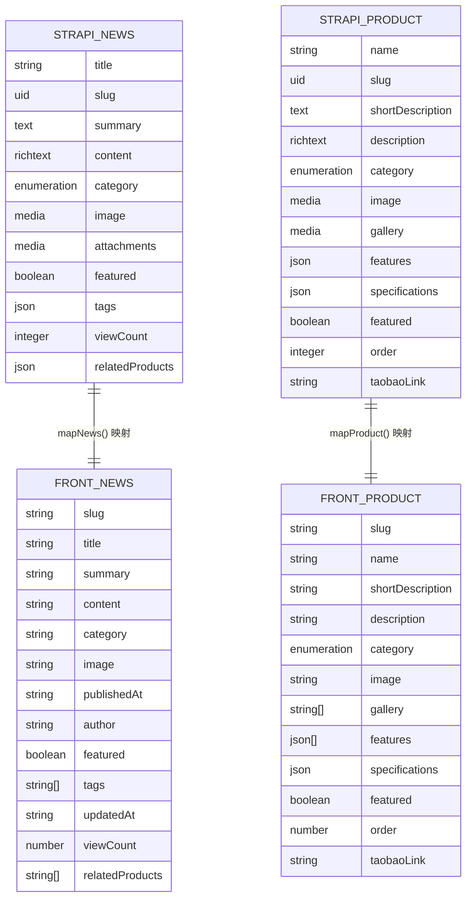
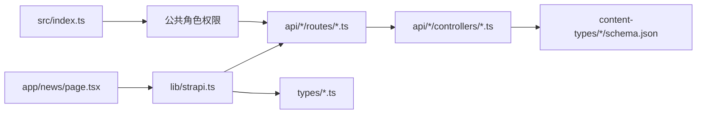

# 数据流架构

<cite>
**本文引用的文件**
- [frontend/lib/strapi.ts](file://frontend/lib/strapi.ts)
- [frontend/app/news/page.tsx](file://frontend/app/news/page.tsx)
- [frontend/components/sections/News.tsx](file://frontend/components/sections/News.tsx)
- [frontend/types/news.ts](file://frontend/types/news.ts)
- [frontend/types/product.ts](file://frontend/types/product.ts)
- [backend/src/index.ts](file://backend/src/index.ts)
- [backend/src/api/news-item/content-types/news-item/schema.json](file://backend/src/api/news-item/content-types/news-item/schema.json)
- [backend/src/api/product/content-types/product/schema.json](file://backend/src/api/product/content-types/product/schema.json)
- [backend/src/api/news-item/routes/news-item.ts](file://backend/src/api/news-item/routes/news-item.ts)
- [backend/src/api/product/routes/product.ts](file://backend/src/api/product/routes/product.ts)
- [backend/src/api/news-item/controllers/news-item.ts](file://backend/src/api/news-item/controllers/news-item.ts)
- [backend/src/api/product/controllers/product.ts](file://backend/src/api/product/controllers/product.ts)
- [backend/types/generated/contentTypes.d.ts](file://backend/types/generated/contentTypes.d.ts)
- [frontend/content/site-config.ts](file://frontend/content/site-config.ts)
</cite>

## 目录
1. [引言](#引言)
2. [项目结构](#项目结构)
3. [核心组件](#核心组件)
4. [架构总览](#架构总览)
5. [详细组件分析](#详细组件分析)
6. [依赖分析](#依赖分析)
7. [性能考虑](#性能考虑)
8. [故障排查指南](#故障排查指南)
9. [结论](#结论)
10. [附录](#附录)

## 引言
本文件面向前端与后端工程师，系统性梳理从前端请求到后端响应的完整数据传输路径，重点覆盖以下方面：
- API 客户端设计：请求封装、错误处理、缓存与再验证策略
- 数据获取流程：从页面组件到 API 客户端再到 Strapi 的调用链路
- 数据模型映射：前端类型定义与后端 Schema 的对应关系
- 数据验证与转换：输入参数校验、输出序列化与格式标准化
- 实时与增量更新：基于 Next.js 缓存控制与 Strapi 内容发布状态的协同
- 数据流监控、性能优化与故障恢复策略

## 项目结构
该仓库采用前后端分层组织：前端使用 Next.js 应用，后端基于 Strapi CMS。数据流主要由前端通过自研 API 客户端发起请求，经由 Strapi 的内容类型路由与控制器返回 JSON，前端再进行类型映射与渲染。

图表来源
- [frontend/app/news/page.tsx](file://frontend/app/news/page.tsx#L1-L31)
- [frontend/lib/strapi.ts](file://frontend/lib/strapi.ts#L1-L155)
- [frontend/components/sections/News.tsx](file://frontend/components/sections/News.tsx#L1-L299)
- [backend/src/api/news-item/routes/news-item.ts](file://backend/src/api/news-item/routes/news-item.ts#L1-L4)
- [backend/src/api/product/routes/product.ts](file://backend/src/api/product/routes/product.ts#L1-L4)
- [backend/src/api/news-item/controllers/news-item.ts](file://backend/src/api/news-item/controllers/news-item.ts#L1-L4)
- [backend/src/api/product/controllers/product.ts](file://backend/src/api/product/controllers/product.ts#L1-L4)
- [backend/src/api/news-item/content-types/news-item/schema.json](file://backend/src/api/news-item/content-types/news-item/schema.json#L1-L65)
- [backend/src/api/product/content-types/product/schema.json](file://backend/src/api/product/content-types/product/schema.json#L1-L63)
- [backend/src/index.ts](file://backend/src/index.ts#L1-L65)

章节来源
- [frontend/app/news/page.tsx](file://frontend/app/news/page.tsx#L1-L31)
- [frontend/lib/strapi.ts](file://frontend/lib/strapi.ts#L1-L155)
- [backend/src/api/news-item/routes/news-item.ts](file://backend/src/api/news-item/routes/news-item.ts#L1-L4)
- [backend/src/api/product/routes/product.ts](file://backend/src/api/product/routes/product.ts#L1-L4)
- [backend/src/api/news-item/controllers/news-item.ts](file://backend/src/api/news-item/controllers/news-item.ts#L1-L4)
- [backend/src/api/product/controllers/product.ts](file://backend/src/api/product/controllers/product.ts#L1-L4)
- [backend/src/api/news-item/content-types/news-item/schema.json](file://backend/src/api/news-item/content-types/news-item/schema.json#L1-L65)
- [backend/src/api/product/content-types/product/schema.json](file://backend/src/api/product/content-types/product/schema.json#L1-L63)
- [backend/src/index.ts](file://backend/src/index.ts#L1-L65)

## 核心组件
- 前端 API 客户端：负责拼装请求路径、设置缓存控制、统一错误处理，并将 Strapi 返回的条目映射为前端类型对象。
- 页面组件：负责并发拉取多类数据，计算元数据，驱动 UI 渲染。
- UI 组件：负责本地筛选、分类与展示，不直接访问后端。
- 后端内容类型与路由：提供标准 REST 接口，支持 populate、过滤、排序与分页。
- 权限初始化：启动时为公共角色启用内容查询权限。

章节来源
- [frontend/lib/strapi.ts](file://frontend/lib/strapi.ts#L1-L155)
- [frontend/app/news/page.tsx](file://frontend/app/news/page.tsx#L1-L31)
- [frontend/components/sections/News.tsx](file://frontend/components/sections/News.tsx#L1-L299)
- [backend/src/api/news-item/routes/news-item.ts](file://backend/src/api/news-item/routes/news-item.ts#L1-L4)
- [backend/src/api/product/routes/product.ts](file://backend/src/api/product/routes/product.ts#L1-L4)
- [backend/src/index.ts](file://backend/src/index.ts#L19-L62)

## 架构总览
下图展示了从页面到 API 客户端再到 Strapi 的完整数据流，以及数据映射与渲染路径。

图表来源
- [frontend/app/news/page.tsx](file://frontend/app/news/page.tsx#L7-L30)
- [frontend/lib/strapi.ts](file://frontend/lib/strapi.ts#L100-L154)
- [backend/src/api/news-item/routes/news-item.ts](file://backend/src/api/news-item/routes/news-item.ts#L1-L4)
- [backend/src/api/news-item/controllers/news-item.ts](file://backend/src/api/news-item/controllers/news-item.ts#L1-L4)
- [backend/src/api/news-item/content-types/news-item/schema.json](file://backend/src/api/news-item/content-types/news-item/schema.json#L13-L63)
- [frontend/types/news.ts](file://frontend/types/news.ts#L16-L43)

## 详细组件分析

### 前端 API 客户端（lib/strapi.ts）
- 请求封装与缓存控制
  - 使用 fetch 并传入缓存控制参数以启用 Next.js 缓存与再验证。
  - 提供多个业务函数：获取产品列表、推荐产品、新闻列表、按 slug 查询新闻、获取所有新闻 slug。
- 错误处理
  - 对非 OK 响应读取文本并抛出错误，便于上层捕获与降级。
- 媒体资源 URL 解析
  - 支持相对路径与绝对路径，自动拼接基础地址；兼容单个媒体与媒体数组两种结构。
- 数据映射
  - 将 Strapi 返回的条目结构映射为前端类型对象，确保字段类型与默认值一致。

图表来源
- [frontend/lib/strapi.ts](file://frontend/lib/strapi.ts#L100-L154)
- [frontend/lib/strapi.ts](file://frontend/lib/strapi.ts#L55-L98)

章节来源
- [frontend/lib/strapi.ts](file://frontend/lib/strapi.ts#L1-L155)

### 页面组件（app/news/page.tsx）
- 并发拉取数据：同时获取全部新闻与精选新闻，提升首屏性能。
- 动态元数据生成：基于第一条新闻生成 Open Graph 描述与图片，增强 SEO。
- 传递给 UI 组件：将数据与分类聚合结果注入到 News 组件。

图表来源
- [frontend/app/news/page.tsx](file://frontend/app/news/page.tsx#L25-L30)
- [frontend/app/news/page.tsx](file://frontend/app/news/page.tsx#L7-L23)

章节来源
- [frontend/app/news/page.tsx](file://frontend/app/news/page.tsx#L1-L31)

### UI 组件（components/sections/News.tsx）
- 本地筛选与分类：根据分类与搜索词在客户端进行过滤，减少后端压力。
- 展示逻辑：支持置顶文章、网格布局、空状态与分页占位。
- 与类型定义协作：接收强类型数据并进行渲染。

图表来源
- [frontend/components/sections/News.tsx](file://frontend/components/sections/News.tsx#L16-L34)
- [frontend/components/sections/News.tsx](file://frontend/components/sections/News.tsx#L151-L197)

章节来源
- [frontend/components/sections/News.tsx](file://frontend/components/sections/News.tsx#L1-L299)

### 后端内容类型与路由
- 路由与控制器
  - 使用 Strapi 工厂方法生成内容路由与控制器，提供标准 REST 接口。
- 内容类型 Schema
  - 新闻与产品内容类型定义了字段、枚举、媒体与 UID 等约束。
- 权限初始化
  - 启动时为公共角色启用内容查询权限，确保前端可访问。

图表来源
- [backend/src/api/news-item/content-types/news-item/schema.json](file://backend/src/api/news-item/content-types/news-item/schema.json#L13-L63)
- [backend/src/api/product/content-types/product/schema.json](file://backend/src/api/product/content-types/product/schema.json#L13-L62)

章节来源
- [backend/src/api/news-item/routes/news-item.ts](file://backend/src/api/news-item/routes/news-item.ts#L1-L4)
- [backend/src/api/product/routes/product.ts](file://backend/src/api/product/routes/product.ts#L1-L4)
- [backend/src/api/news-item/controllers/news-item.ts](file://backend/src/api/news-item/controllers/news-item.ts#L1-L4)
- [backend/src/api/product/controllers/product.ts](file://backend/src/api/product/controllers/product.ts#L1-L4)
- [backend/src/api/news-item/content-types/news-item/schema.json](file://backend/src/api/news-item/content-types/news-item/schema.json#L1-L65)
- [backend/src/api/product/content-types/product/schema.json](file://backend/src/api/product/content-types/product/schema.json#L1-L63)
- [backend/src/index.ts](file://backend/src/index.ts#L19-L62)

### 数据模型映射机制
- 前端类型定义
  - 新闻与产品类型定义了字段名、类型与可选字段，确保组件消费数据时具备强类型保障。
- 后端 Schema 对应
  - 新闻与产品内容类型的字段与枚举与前端类型一一对应，避免运行期类型不匹配。
- 映射函数
  - API 客户端提供 mapNews 与 mapProduct，将 Strapi 返回的 attributes 与 id 结构映射为前端类型对象，统一默认值与类型。

图表来源
- [backend/src/api/news-item/content-types/news-item/schema.json](file://backend/src/api/news-item/content-types/news-item/schema.json#L13-L63)
- [backend/src/api/product/content-types/product/schema.json](file://backend/src/api/product/content-types/product/schema.json#L13-L62)
- [frontend/types/news.ts](file://frontend/types/news.ts#L16-L43)
- [frontend/types/product.ts](file://frontend/types/product.ts#L13-L38)
- [frontend/lib/strapi.ts](file://frontend/lib/strapi.ts#L55-L98)
- [frontend/lib/strapi.ts](file://frontend/lib/strapi.ts#L113-L154)

章节来源
- [frontend/types/news.ts](file://frontend/types/news.ts#L1-L44)
- [frontend/types/product.ts](file://frontend/types/product.ts#L1-L39)
- [frontend/lib/strapi.ts](file://frontend/lib/strapi.ts#L55-L98)
- [backend/src/api/news-item/content-types/news-item/schema.json](file://backend/src/api/news-item/content-types/news-item/schema.json#L13-L63)
- [backend/src/api/product/content-types/product/schema.json](file://backend/src/api/product/content-types/product/schema.json#L13-L62)

### 数据验证与转换
- 输入验证
  - 前端对媒体 URL 进行解析与拼接，确保返回可用的绝对路径。
  - 对 JSON 字段（如 features、specifications、tags）进行类型断言与默认值处理。
- 输出序列化
  - Strapi 根据 Schema 自动序列化字段，前端通过映射函数统一为组件可用结构。
- 格式标准化
  - 时间字段统一为字符串 ISO 8601；布尔字段统一为布尔值；数组字段统一为数组。

章节来源
- [frontend/lib/strapi.ts](file://frontend/lib/strapi.ts#L35-L98)

### 实时数据更新与一致性
- 内容发布状态
  - 后端内容类型开启“草稿与发布”选项，前端通过查询接口获取已发布版本。
- 缓存与再验证
  - 前端 fetch 请求携带缓存控制参数，结合 Next.js 缓存实现静态生成与增量再验证。
- 增量更新策略
  - 通过重新生成页面或触发再验证，确保内容变更后尽快反映到前端。

章节来源
- [backend/src/api/news-item/content-types/news-item/schema.json](file://backend/src/api/news-item/content-types/news-item/schema.json#L10-L12)
- [backend/src/api/product/content-types/product/schema.json](file://backend/src/api/product/content-types/product/schema.json#L10-L12)
- [frontend/lib/strapi.ts](file://frontend/lib/strapi.ts#L100-L111)
- [backend/src/index.ts](file://backend/src/index.ts#L29-L62)

## 依赖分析
- 前端对后端的依赖
  - 页面组件依赖 API 客户端；API 客户端依赖 Strapi 路由与控制器；UI 组件依赖类型定义。
- 后端对权限的依赖
  - 启动脚本为公共角色启用内容查询权限，否则前端无法访问。
- 类型与 Schema 的耦合
  - 前端类型与后端 Schema 保持一致，降低运行期类型错误风险。

图表来源
- [frontend/app/news/page.tsx](file://frontend/app/news/page.tsx#L5-L6)
- [frontend/lib/strapi.ts](file://frontend/lib/strapi.ts#L100-L154)
- [backend/src/api/news-item/routes/news-item.ts](file://backend/src/api/news-item/routes/news-item.ts#L1-L4)
- [backend/src/api/product/routes/product.ts](file://backend/src/api/product/routes/product.ts#L1-L4)
- [backend/src/api/news-item/controllers/news-item.ts](file://backend/src/api/news-item/controllers/news-item.ts#L1-L4)
- [backend/src/api/product/controllers/product.ts](file://backend/src/api/product/controllers/product.ts#L1-L4)
- [backend/src/api/news-item/content-types/news-item/schema.json](file://backend/src/api/news-item/content-types/news-item/schema.json#L13-L63)
- [backend/src/api/product/content-types/product/schema.json](file://backend/src/api/product/content-types/product/schema.json#L13-L62)
- [backend/src/index.ts](file://backend/src/index.ts#L19-L62)
- [frontend/types/news.ts](file://frontend/types/news.ts#L16-L43)
- [frontend/types/product.ts](file://frontend/types/product.ts#L13-L38)

章节来源
- [frontend/app/news/page.tsx](file://frontend/app/news/page.tsx#L1-L31)
- [frontend/lib/strapi.ts](file://frontend/lib/strapi.ts#L1-L155)
- [backend/src/index.ts](file://backend/src/index.ts#L19-L62)

## 性能考虑
- 并发请求：页面组件使用并发拉取，减少总等待时间。
- 缓存与再验证：通过缓存控制参数与 Next.js 缓存机制，平衡新鲜度与性能。
- 本地筛选：UI 组件在客户端进行筛选，降低后端压力。
- 媒体 URL 解析：统一解析与拼接，避免重复计算与网络请求。

## 故障排查指南
- 请求失败
  - 现象：抛出包含状态码与响应文本的错误。
  - 处理：检查后端路由是否正确、权限是否启用、网络连通性。
- 数据为空
  - 现象：返回空数组或空对象。
  - 处理：确认内容类型中是否存在已发布条目、populate 参数是否正确。
- 类型不匹配
  - 现象：组件渲染异常或运行时报错。
  - 处理：核对前端类型与后端 Schema 是否一致，映射函数是否覆盖所有字段。

章节来源
- [frontend/lib/strapi.ts](file://frontend/lib/strapi.ts#L105-L111)
- [backend/src/index.ts](file://backend/src/index.ts#L19-L62)

## 结论
该数据流架构以“前端 API 客户端 + Strapi 内容类型”为核心，通过明确的请求封装、错误处理与类型映射，实现了从前端到后端的稳定数据传输。配合 Next.js 缓存与再验证机制，兼顾性能与一致性。建议持续维护前端类型与后端 Schema 的一致性，并在权限初始化与内容发布流程上保持严格管理，以确保系统的可靠性与可维护性。

## 附录
- SEO 配置参考：页面组件在生成元数据时使用站点配置中的默认信息作为回退，确保在无数据时仍能正确渲染。

章节来源
- [frontend/content/site-config.ts](file://frontend/content/site-config.ts#L22-L29)
- [frontend/app/news/page.tsx](file://frontend/app/news/page.tsx#L7-L23)