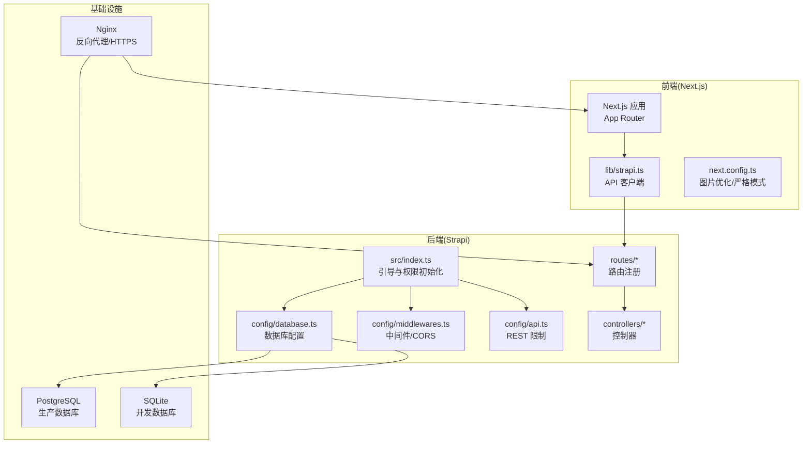
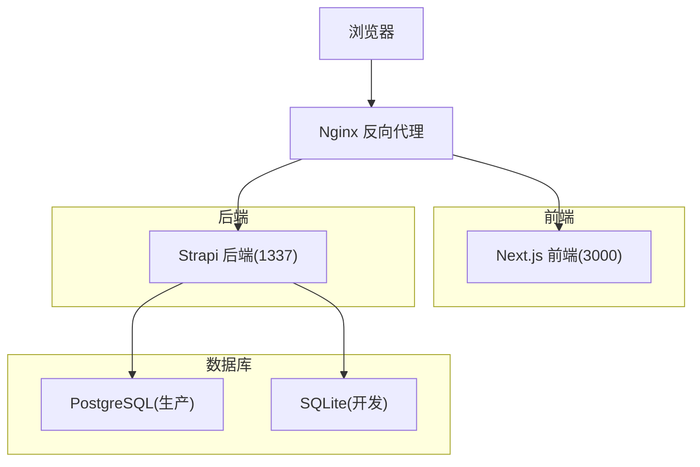
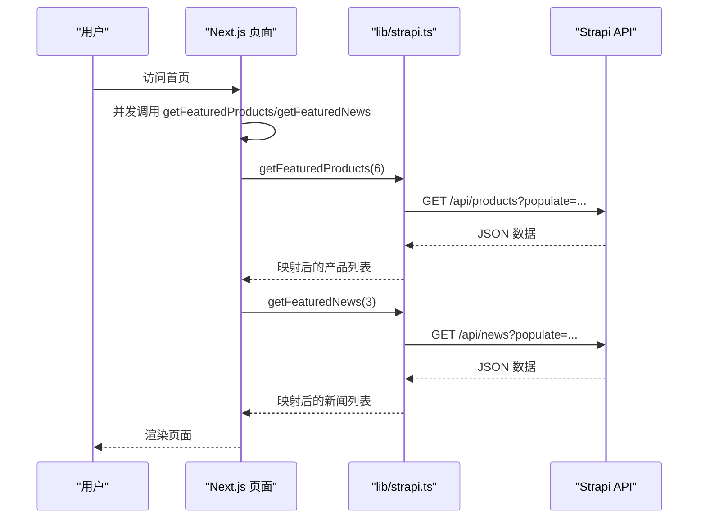
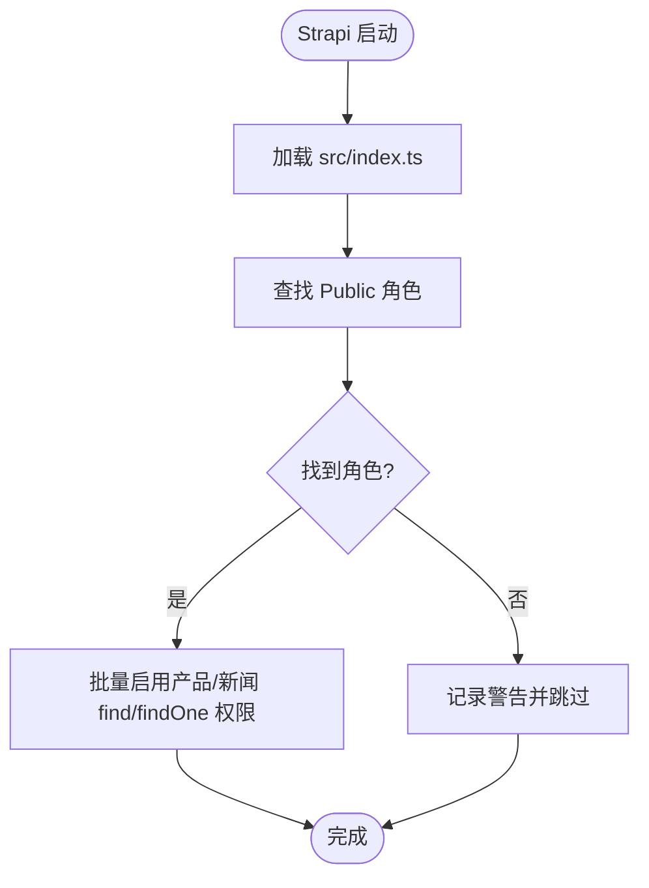
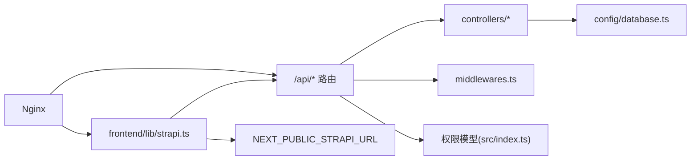

# 整体架构设计

<cite>
**本文档引用的文件**
- [README.md](file://README.md)
- [DEPLOYMENT.md](file://DEPLOYMENT.md)
- [开发与生产环境分离方案.md](file://开发与生产环境分离方案.md)
- [生产环境分离的部署方案.md](file://生产环境分离的部署方案.md)
- [frontend/package.json](file://frontend/package.json)
- [backend/package.json](file://backend/package.json)
- [frontend/lib/strapi.ts](file://frontend/lib/strapi.ts)
- [frontend/next.config.ts](file://frontend/next.config.ts)
- [frontend/app/layout.tsx](file://frontend/app/layout.tsx)
- [frontend/app/page.tsx](file://frontend/app/page.tsx)
- [backend/src/index.ts](file://backend/src/index.ts)
- [backend/config/api.ts](file://backend/config/api.ts)
- [backend/config/database.ts](file://backend/config/database.ts)
- [backend/config/middlewares.ts](file://backend/config/middlewares.ts)
- [backend/src/api/product/controllers/product.ts](file://backend/src/api/product/controllers/product.ts)
- [backend/src/api/news-item/controllers/news-item.ts](file://backend/src/api/news-item/controllers/news-item.ts)
- [backend/src/api/product/routes/product.ts](file://backend/src/api/product/routes/product.ts)
- [backend/src/api/news-item/routes/news-item.ts](file://backend/src/api/news-item/routes/news-item.ts)
</cite>

## 目录
1. [引言](#引言)
2. [项目结构](#项目结构)
3. [核心组件](#核心组件)
4. [架构总览](#架构总览)
5. [详细组件分析](#详细组件分析)
6. [依赖关系分析](#依赖关系分析)
7. [性能考虑](#性能考虑)
8. [故障排查指南](#故障排查指南)
9. [结论](#结论)
10. [附录](#附录)

## 引言
本项目为中创智控官网，采用前后端分离架构，前端基于 Next.js 15 App Router，后端基于 Strapi 5 无头 CMS。系统通过 API 优先的设计模式，实现内容管理与前端展示的解耦；通过容器化与反向代理实现生产环境的高可用部署；通过权限模型与中间件保障接口安全；通过多阶段构建与健康检查提升交付质量与运维效率。

## 项目结构
项目采用“前后端分离 + 无头 CMS”的组织方式：
- 前端：Next.js 15 应用，负责页面渲染、SEO、静态/服务端渲染与交互逻辑
- 后端：Strapi 5 CMS，提供 REST API 与 Admin UI，管理产品与新闻内容
- 运维：Docker Compose 编排，Nginx 反向代理，Let's Encrypt 自动证书管理

**图表来源**
- [frontend/next.config.ts](file://frontend/next.config.ts#L1-L39)
- [frontend/lib/strapi.ts](file://frontend/lib/strapi.ts#L1-L155)
- [backend/src/index.ts](file://backend/src/index.ts#L1-L65)
- [backend/config/database.ts](file://backend/config/database.ts#L1-L61)
- [backend/config/middlewares.ts](file://backend/config/middlewares.ts#L1-L13)
- [backend/config/api.ts](file://backend/config/api.ts#L1-L8)
- [backend/src/api/product/routes/product.ts](file://backend/src/api/product/routes/product.ts#L1-L4)
- [backend/src/api/news-item/routes/news-item.ts](file://backend/src/api/news-item/routes/news-item.ts#L1-L4)

**章节来源**
- [README.md](file://README.md#L66-L227)
- [DEPLOYMENT.md](file://DEPLOYMENT.md#L34-L85)

## 核心组件
- 前端 Next.js 应用
  - App Router 路由体系，支持 SSR/SSG/CSR
  - 全局布局与元数据配置，统一 SEO
  - 图片优化与严格模式
- Strapi CMS 后端
  - REST API 提供产品与新闻数据
  - Admin UI 内容管理
  - 权限模型与中间件安全控制
- API 客户端
  - 统一封装 Strapi 请求与数据映射
  - 支持 populate、排序、分页与错误处理
- 基础设施
  - Nginx 反向代理与 HTTPS
  - Docker Compose 编排
  - Let's Encrypt 自动证书管理

**章节来源**
- [frontend/package.json](file://frontend/package.json#L1-L88)
- [backend/package.json](file://backend/package.json#L1-L45)
- [frontend/lib/strapi.ts](file://frontend/lib/strapi.ts#L1-L155)
- [backend/src/index.ts](file://backend/src/index.ts#L1-L65)

## 架构总览
系统采用“前端渲染 + 后端无头 CMS”的前后端分离架构，API 优先设计贯穿全链路，确保内容与展示解耦、团队协作清晰、可扩展性强。

**图表来源**
- [DEPLOYMENT.md](file://DEPLOYMENT.md#L38-L67)
- [开发与生产环境分离方案.md](file://开发与生产环境分离方案.md#L90-L139)

## 详细组件分析

### 前端组件：Next.js 应用与 API 客户端
- 全局布局与元数据
  - 根布局负责 Provider、滚动进度条、导航与页脚
  - 元数据配置遵循 Open Graph/Twitter 协议，支持 SEO
- 页面渲染
  - 首页异步并发拉取精选产品与新闻
  - 通过 API 客户端封装请求与错误处理
- 图片优化
  - 白名单远程域名、现代图片格式、响应式尺寸配置

**图表来源**
- [frontend/app/page.tsx](file://frontend/app/page.tsx#L40-L72)
- [frontend/lib/strapi.ts](file://frontend/lib/strapi.ts#L113-L139)

**章节来源**
- [frontend/app/layout.tsx](file://frontend/app/layout.tsx#L63-L82)
- [frontend/app/page.tsx](file://frontend/app/page.tsx#L40-L72)
- [frontend/next.config.ts](file://frontend/next.config.ts#L3-L36)
- [frontend/lib/strapi.ts](file://frontend/lib/strapi.ts#L100-L155)

### 后端组件：Strapi CMS 与权限模型
- 引导与权限初始化
  - 启动时为 Public 角色启用产品与新闻的 find/findOne 权限
- 数据库配置
  - 支持 sqlite/mysql/postgres，生产默认 PostgreSQL
- 中间件与安全
  - 默认启用 logger、errors、security、cors、query、body 等
- API 限制
  - 默认分页限制与最大返回条数，开启计数

**图表来源**
- [backend/src/index.ts](file://backend/src/index.ts#L19-L63)

**章节来源**
- [backend/src/index.ts](file://backend/src/index.ts#L1-L65)
- [backend/config/database.ts](file://backend/config/database.ts#L1-L61)
- [backend/config/middlewares.ts](file://backend/config/middlewares.ts#L1-L13)
- [backend/config/api.ts](file://backend/config/api.ts#L1-L8)

### 微服务与 API 优先设计
- 以 API 为中心的契约
  - 前后端通过 REST API 约定交互，前端通过 lib/strapi.ts 统一消费
- 职责划分
  - 前端：页面渲染、交互、SEO、图片优化
  - 后端：内容管理、数据持久化、权限控制、API 提供
- 可扩展性
  - 新增内容类型只需在 Strapi 中定义内容类型与 API，前端按契约消费
  - 数据库可平滑从 SQLite 迁移到 PostgreSQL

**章节来源**
- [frontend/lib/strapi.ts](file://frontend/lib/strapi.ts#L113-L155)
- [backend/src/api/product/controllers/product.ts](file://backend/src/api/product/controllers/product.ts#L1-L4)
- [backend/src/api/news-item/controllers/news-item.ts](file://backend/src/api/news-item/controllers/news-item.ts#L1-L4)

### 部署拓扑与技术栈决策
- 技术栈选择
  - 前端：Next.js 15 + React + TypeScript，支持 App Router 与 Turbopack
  - 后端：Strapi 5 + better-sqlite3（开发）+ PostgreSQL（生产）
  - 基础设施：Nginx + Docker Compose + Let's Encrypt
- 部署拓扑
  - 开发：浏览器 → Next.js(3000) → Strapi(1337) → SQLite
  - 生产：浏览器 → Nginx(443/80) → Next.js(3000)/Strapi(1337) → PostgreSQL
- 环境分离
  - 开发/生产配置文件分离，敏感信息不提交至仓库
  - 多阶段构建，部署时构建，不提交构建产物

**章节来源**
- [README.md](file://README.md#L5-L64)
- [DEPLOYMENT.md](file://DEPLOYMENT.md#L38-L67)
- [开发与生产环境分离方案.md](file://开发与生产环境分离方案.md#L90-L139)

## 依赖关系分析
- 前端对后端的依赖
  - 通过 NEXT_PUBLIC_STRAPI_URL 指向后端 API
  - 通过 lib/strapi.ts 封装请求、populate、错误处理
- 后端对数据库的依赖
  - 通过 config/database.ts 选择 sqlite/postgres/mysql
  - 通过中间件与权限模型控制访问
- 基础设施对应用的依赖
  - Nginx 提供 HTTPS 与反向代理
  - Docker Compose 管理容器生命周期与健康检查

**图表来源**
- [frontend/lib/strapi.ts](file://frontend/lib/strapi.ts#L4-L155)
- [backend/src/api/product/controllers/product.ts](file://backend/src/api/product/controllers/product.ts#L1-L4)
- [backend/config/database.ts](file://backend/config/database.ts#L1-L61)
- [backend/config/middlewares.ts](file://backend/config/middlewares.ts#L1-L13)
- [backend/src/index.ts](file://backend/src/index.ts#L1-L65)

**章节来源**
- [frontend/lib/strapi.ts](file://frontend/lib/strapi.ts#L1-L155)
- [backend/config/database.ts](file://backend/config/database.ts#L1-L61)
- [backend/config/middlewares.ts](file://backend/config/middlewares.ts#L1-L13)
- [backend/src/index.ts](file://backend/src/index.ts#L1-L65)

## 性能考虑
- 前端性能
  - 图片优化：现代格式、响应式尺寸、远程域名白名单
  - 渲染策略：SSR/SSG 结合，首页并发请求减少等待
- 后端性能
  - API 限制：默认分页与最大返回条数，避免大查询
  - 数据库池：可配置连接池参数，生产环境建议调优
- 基础设施性能
  - Nginx 作为反向代理与缓存入口，配合 HTTPS
  - 多阶段构建减小镜像体积，提升启动速度

**章节来源**
- [frontend/next.config.ts](file://frontend/next.config.ts#L3-L36)
- [backend/config/api.ts](file://backend/config/api.ts#L1-L8)
- [DEPLOYMENT.md](file://DEPLOYMENT.md#L225-L276)

## 故障排查指南
- 常见问题
  - CORS 配置错误：检查 middlewares.ts 中的 CORS 设置
  - API 请求失败：确认 NEXT_PUBLIC_STRAPI_URL 与后端端口
  - 数据库连接失败：确认 DATABASE_CLIENT 与连接参数
  - 健康检查失败：查看容器日志与健康检查配置
- 排查步骤
  - 检查容器状态与日志
  - 验证 API 响应与权限
  - 确认 Nginx 配置与证书状态
  - 执行健康检查与端到端连通性测试

**章节来源**
- [backend/config/middlewares.ts](file://backend/config/middlewares.ts#L1-L13)
- [backend/config/database.ts](file://backend/config/database.ts#L1-L61)
- [DEPLOYMENT.md](file://DEPLOYMENT.md#L587-L631)

## 结论
本项目通过前后端分离与 API 优先的设计，实现了内容与展示的解耦、团队协作的清晰化与系统的可扩展性。借助 Strapi 的无头 CMS 能力与 Next.js 的现代渲染能力，结合 Nginx 与 Docker Compose 的基础设施，形成一套可维护、可扩展、可自动化的整体架构方案。

## 附录
- 环境变量与配置
  - 前端：NEXT_PUBLIC_STRAPI_URL
  - 后端：DATABASE_CLIENT、DATABASE_URL/FILENAME、APP_KEYS 等
- 路由与权限
  - 前端路由：Next.js App Router
  - 后端路由：Strapi 自动生成的 api::product.api::news-item
  - 权限：Public 角色启用 find/findOne，Authenticated 角色启用 CRUD

**章节来源**
- [frontend/lib/strapi.ts](file://frontend/lib/strapi.ts#L4-L155)
- [backend/src/api/product/routes/product.ts](file://backend/src/api/product/routes/product.ts#L1-L4)
- [backend/src/api/news-item/routes/news-item.ts](file://backend/src/api/news-item/routes/news-item.ts#L1-L4)
- [backend/src/index.ts](file://backend/src/index.ts#L29-L60)