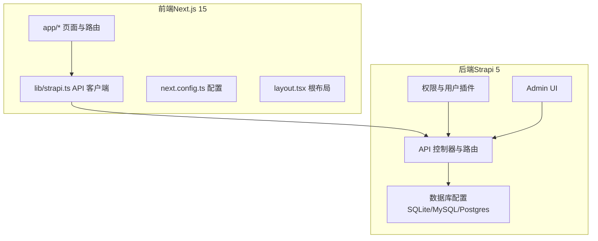
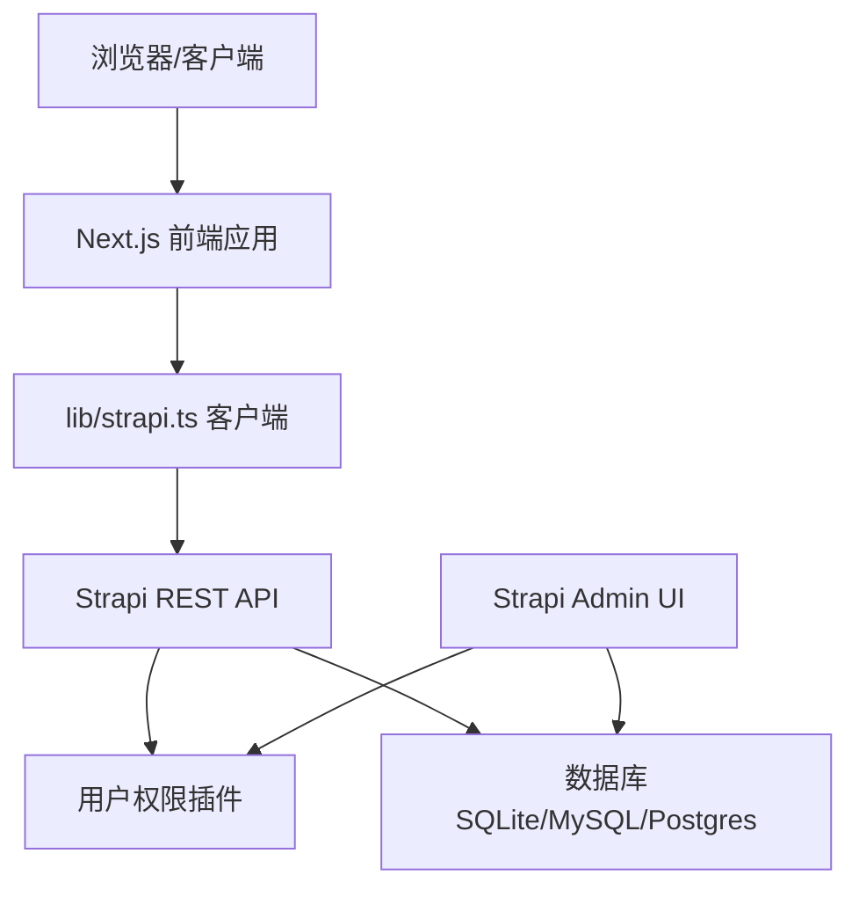
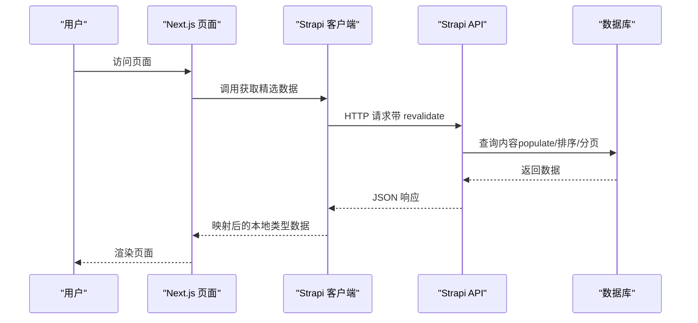
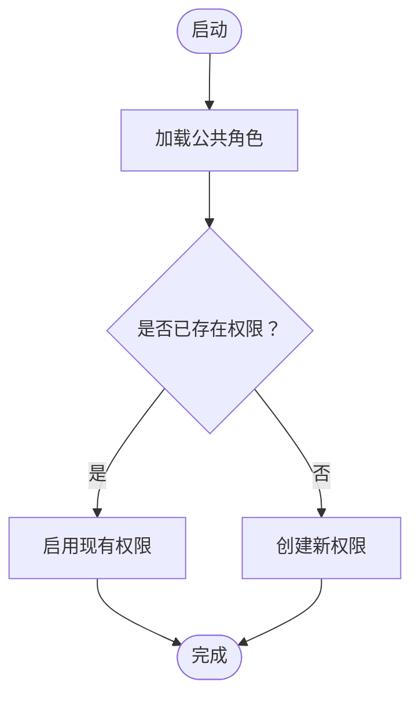
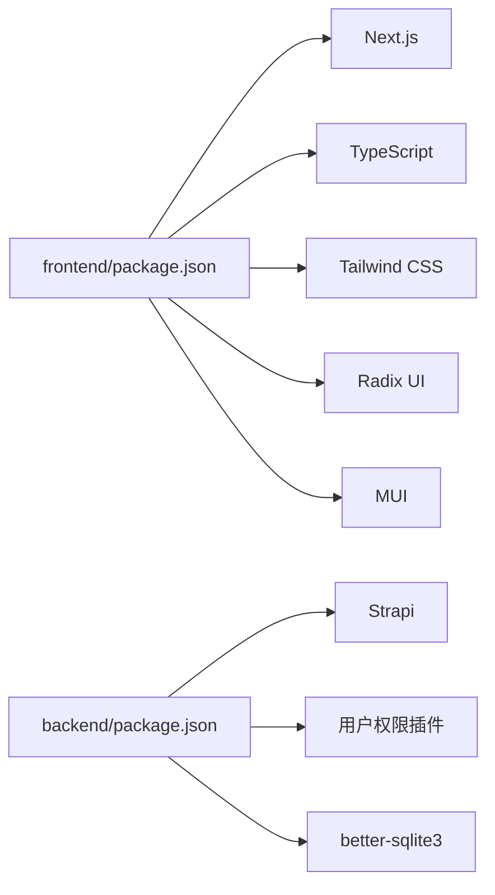

# 架构设计

<cite>
**本文引用的文件**
- [README.md](file://README.md)
- [frontend/package.json](file://frontend/package.json)
- [backend/package.json](file://backend/package.json)
- [frontend/next.config.ts](file://frontend/next.config.ts)
- [frontend/lib/strapi.ts](file://frontend/lib/strapi.ts)
- [frontend/app/layout.tsx](file://frontend/app/layout.tsx)
- [frontend/app/page.tsx](file://frontend/app/page.tsx)
- [backend/src/index.ts](file://backend/src/index.ts)
- [backend/config/api.ts](file://backend/config/api.ts)
- [backend/config/database.ts](file://backend/config/database.ts)
- [specs/001-nextjs-migration/spec.md](file://specs/001-nextjs-migration/spec.md)
- [specs/001-strapi-backend-cms/spec.md](file://specs/001-strapi-backend-cms/spec.md)
</cite>

## 目录
1. [简介](#简介)
2. [项目结构](#项目结构)
3. [核心组件](#核心组件)
4. [架构总览](#架构总览)
5. [详细组件分析](#详细组件分析)
6. [依赖分析](#依赖分析)
7. [性能考量](#性能考量)
8. [故障排查指南](#故障排查指南)
9. [结论](#结论)
10. [附录](#附录)

## 简介
本项目为中创智控官网，采用前后端分离架构：前端基于 Next.js 15 App Router，后端基于 Strapi 5 无头 CMS。系统通过 API 优先模式实现数据解耦，前端负责页面渲染与交互，后端负责内容管理与数据持久化。项目支持混合渲染模式（SSG、SSR、CSR），并提供静态内容与动态内容双模式，满足快速迭代与内容运营需求。

## 项目结构
项目采用多目录组织方式，前后端独立开发、独立部署：
- frontend：Next.js 15 应用，使用 App Router，提供页面级路由、布局、全局样式与组件。
- backend：Strapi 5 CMS，提供 REST API、内容类型、权限与 Admin UI。
- specs：需求与规格文档，定义了 Next.js 迁移与 CMS 后端的关键功能与验收标准。

图表来源
- [frontend/next.config.ts](file://frontend/next.config.ts#L1-L39)
- [frontend/lib/strapi.ts](file://frontend/lib/strapi.ts#L1-L155)
- [backend/config/database.ts](file://backend/config/database.ts#L1-L61)
- [backend/src/index.ts](file://backend/src/index.ts#L1-L65)

章节来源
- [README.md](file://README.md#L66-L227)

## 核心组件
- 前端应用（Next.js 15 App Router）
  - 负责页面路由、布局、全局样式与组件渲染。
  - 使用混合渲染模式：静态生成（SSG）、服务端渲染（SSR）、客户端渲染（CSR）。
  - 通过 lib/strapi.ts 与后端 Strapi API 交互。
- 后端应用（Strapi 5 CMS）
  - 提供 REST API，管理产品与新闻内容。
  - 支持用户权限插件与 Admin UI。
  - 默认使用 SQLite，可配置 MySQL/Postgres。
- 数据模型与映射
  - 前端通过 Strapi API 客户端获取数据并映射为本地类型，确保类型安全。
- 配置与部署
  - 前端：next.config.ts 配置图片优化与严格模式；package.json 定义构建与启动脚本。
  - 后端：package.json 定义开发、构建与启动脚本；config/*.ts 定义 API、数据库与权限配置。

章节来源
- [README.md](file://README.md#L229-L495)
- [frontend/package.json](file://frontend/package.json#L1-L88)
- [backend/package.json](file://backend/package.json#L1-L45)
- [frontend/next.config.ts](file://frontend/next.config.ts#L1-L39)
- [frontend/lib/strapi.ts](file://frontend/lib/strapi.ts#L1-L155)
- [backend/config/api.ts](file://backend/config/api.ts#L1-L8)
- [backend/config/database.ts](file://backend/config/database.ts#L1-L61)

## 架构总览
系统采用前后端分离与 API 优先设计，数据流从前端请求到后端 API，最终到达数据库。权限通过 Strapi 用户权限插件控制，Admin UI 提供可视化内容管理。

图表来源
- [frontend/lib/strapi.ts](file://frontend/lib/strapi.ts#L1-L155)
- [backend/src/index.ts](file://backend/src/index.ts#L1-L65)
- [backend/config/database.ts](file://backend/config/database.ts#L1-L61)

章节来源
- [README.md](file://README.md#L249-L298)

## 详细组件分析

### 前端渲染与数据流
- 页面渲染策略
  - 首页、关于、联系等静态页面采用 SSG，提升首屏性能与 SEO。
  - 产品、新闻、解决方案等列表页采用 SSR 或 ISR，确保内容实时性。
  - 交互组件（导航、滚动进度条）采用 CSR，增强用户体验。
- 数据获取与映射
  - 通过 lib/strapi.ts 封装 API 调用，统一处理响应、错误与媒体资源 URL。
  - 将 Strapi 响应映射为前端类型，保证类型安全与可维护性。
- 根布局与元数据
  - layout.tsx 定义全局元数据、Viewport 与主题色，确保 SEO 与品牌一致性。
  - page.tsx 组合各业务模块，异步并发获取精选产品与新闻。

图表来源
- [frontend/app/page.tsx](file://frontend/app/page.tsx#L40-L72)
- [frontend/lib/strapi.ts](file://frontend/lib/strapi.ts#L100-L155)
- [backend/config/api.ts](file://backend/config/api.ts#L1-L8)

章节来源
- [specs/001-nextjs-migration/spec.md](file://specs/001-nextjs-migration/spec.md#L109-L130)
- [frontend/app/layout.tsx](file://frontend/app/layout.tsx#L1-L83)
- [frontend/app/page.tsx](file://frontend/app/page.tsx#L1-L72)
- [frontend/lib/strapi.ts](file://frontend/lib/strapi.ts#L1-L155)

### 后端 API 与权限
- API 控制器
  - 产品与新闻控制器基于 Strapi 核心控制器工厂生成，遵循 REST 约定。
- 权限与角色
  - 启动时自动为公共角色启用产品与新闻的查询权限，认证角色启用写入权限。
- 数据库配置
  - 支持 SQLite、MySQL、Postgres，可通过环境变量切换，默认 SQLite 文件位于 .tmp/data.db。

图表来源
- [backend/src/index.ts](file://backend/src/index.ts#L19-L63)

章节来源
- [backend/src/index.ts](file://backend/src/index.ts#L1-L65)
- [backend/config/api.ts](file://backend/config/api.ts#L1-L8)
- [backend/config/database.ts](file://backend/config/database.ts#L1-L61)

### 混合渲染模式（SSG、SSR、CSR）
- SSG（静态生成）
  - 首页、关于、联系等页面在构建时生成静态 HTML，提升首屏性能与 SEO。
- SSR（服务端渲染）
  - 列表页在请求时拉取最新数据，保证内容时效性。
- CSR（客户端渲染）
  - 导航、滚动进度条等交互组件在客户端运行，提升交互体验。
- 配置与实现
  - Next.js 严格模式与图片优化配置提升开发体验与性能。
  - 页面通过异步函数并发获取数据，减少请求等待时间。

章节来源
- [specs/001-nextjs-migration/spec.md](file://specs/001-nextjs-migration/spec.md#L118-L127)
- [frontend/next.config.ts](file://frontend/next.config.ts#L1-L39)
- [frontend/app/page.tsx](file://frontend/app/page.tsx#L40-L72)

### 微服务与 API 优先设计
- 微服务体现
  - 前后端独立开发与部署，前端通过 API 与后端解耦，便于团队协作与弹性扩展。
- API 优先
  - 前端通过 lib/strapi.ts 统一调用后端 API，接口契约稳定，利于演进与测试。
- 内容管理
  - 支持静态内容与动态内容双模式，动态内容通过 Strapi 管理，导入脚本支持批量迁移。

章节来源
- [README.md](file://README.md#L231-L298)
- [frontend/lib/strapi.ts](file://frontend/lib/strapi.ts#L1-L155)
- [backend/package.json](file://backend/package.json#L12-L18)

### 系统边界与组件交互
- 系统边界
  - 前端：Next.js 应用，负责 UI 与交互。
  - 后端：Strapi CMS，负责内容与数据。
- 组件交互
  - 前端通过 HTTP/HTTPS 与后端 API 通信。
  - Admin UI 与后端 API 协同，提供内容管理能力。
  - 数据库作为后端持久化层，支持多种驱动。

章节来源
- [README.md](file://README.md#L281-L298)
- [backend/config/database.ts](file://backend/config/database.ts#L1-L61)

## 依赖分析
- 前端依赖
  - Next.js 15、React 18、TypeScript、Tailwind CSS、Radix UI、MUI、Motion 等。
- 后端依赖
  - Strapi 5、用户权限插件、better-sqlite3、React Admin UI 框架等。
- 配置与脚本
  - 前端：开发、构建、启动脚本与图片优化配置。
  - 后端：开发、构建、启动、内容导入脚本与环境变量。

图表来源
- [frontend/package.json](file://frontend/package.json#L1-L88)
- [backend/package.json](file://backend/package.json#L1-L45)

章节来源
- [frontend/package.json](file://frontend/package.json#L1-L88)
- [backend/package.json](file://backend/package.json#L1-L45)

## 性能考量
- 首屏性能
  - SSG 与图片优化（AVIF/WebP、响应式尺寸）降低首屏加载时间。
- 数据获取
  - 并发请求与缓存策略（revalidate）平衡实时性与性能。
- 交互体验
  - CSR 组件提升交互流畅度，Motion 动画增强视觉体验。
- SEO 与可访问性
  - 全局元数据与 Open Graph/Twitter Cards 提升 SEO；严格模式与无障碍组件提升可访问性。

章节来源
- [specs/001-nextjs-migration/spec.md](file://specs/001-nextjs-migration/spec.md#L141-L152)
- [frontend/next.config.ts](file://frontend/next.config.ts#L1-L39)
- [frontend/app/layout.tsx](file://frontend/app/layout.tsx#L1-L83)

## 故障排查指南
- 前端常见问题
  - API 地址未配置：确认 NEXT_PUBLIC_STRAPI_URL 环境变量指向正确的后端地址。
  - 图片加载失败：检查 remotePatterns 与媒体资源 URL 映射逻辑。
  - 首屏空白：确认页面是否采用 SSR/SSG，检查数据获取与错误边界。
- 后端常见问题
  - 数据库连接异常：检查 DATABASE_CLIENT 与连接参数，确认文件路径与权限。
  - 权限不足：确认公共角色与认证角色的权限配置是否正确。
  - Admin UI 无法登录：检查密钥与 JWT 配置。
- 部署与环境
  - 环境变量缺失：核对 .env 示例文件，补充必要配置。
  - CORS 问题：确认 API 跨域配置与前端访问地址一致。

章节来源
- [README.md](file://README.md#L511-L581)
- [backend/config/database.ts](file://backend/config/database.ts#L1-L61)
- [backend/src/index.ts](file://backend/src/index.ts#L19-L63)

## 结论
本项目通过前后端分离与 API 优先设计，实现了清晰的职责划分与高效的协作模式。前端利用混合渲染模式兼顾性能与交互，后端通过 Strapi 提供灵活的内容管理能力。系统支持静态与动态内容双模式，具备良好的扩展性与可维护性。建议在生产环境中完善监控与日志、强化安全配置与权限审计，并持续优化数据获取与缓存策略以进一步提升性能与可靠性。

## 附录
- 开发与生产环境分离方案
  - 前端：独立构建与部署，通过环境变量切换后端地址。
  - 后端：独立构建与部署，支持多数据库配置与 Admin UI。
- 部署拓扑
  - 前端部署于 CDN/静态托管平台，后端部署于云服务器或容器平台，二者通过 HTTPS API 通信。

章节来源
- [README.md](file://README.md#L281-L298)
- [README.md](file://README.md#L747-L762)