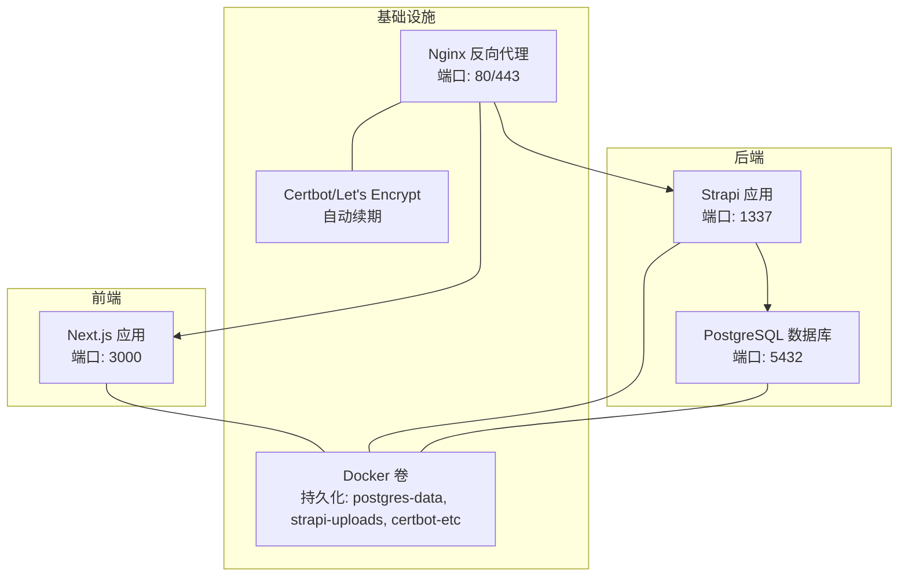
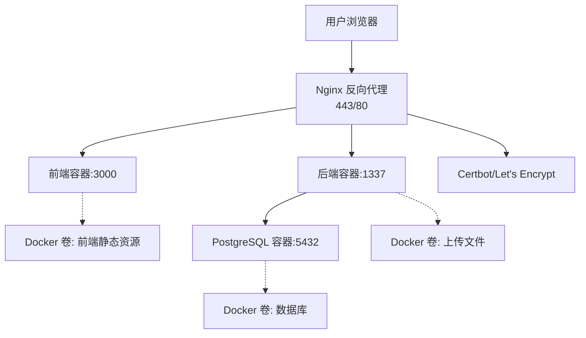
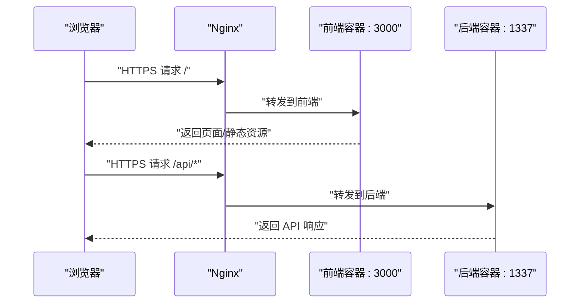
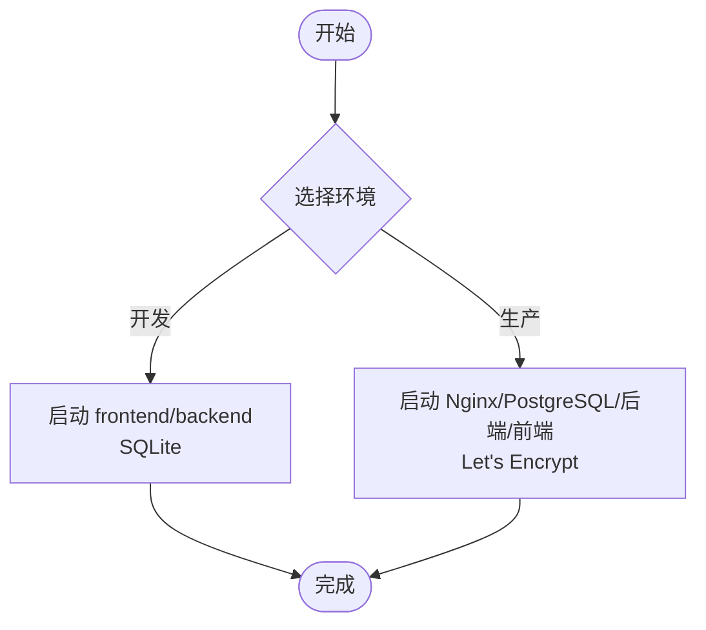
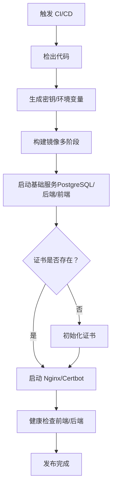
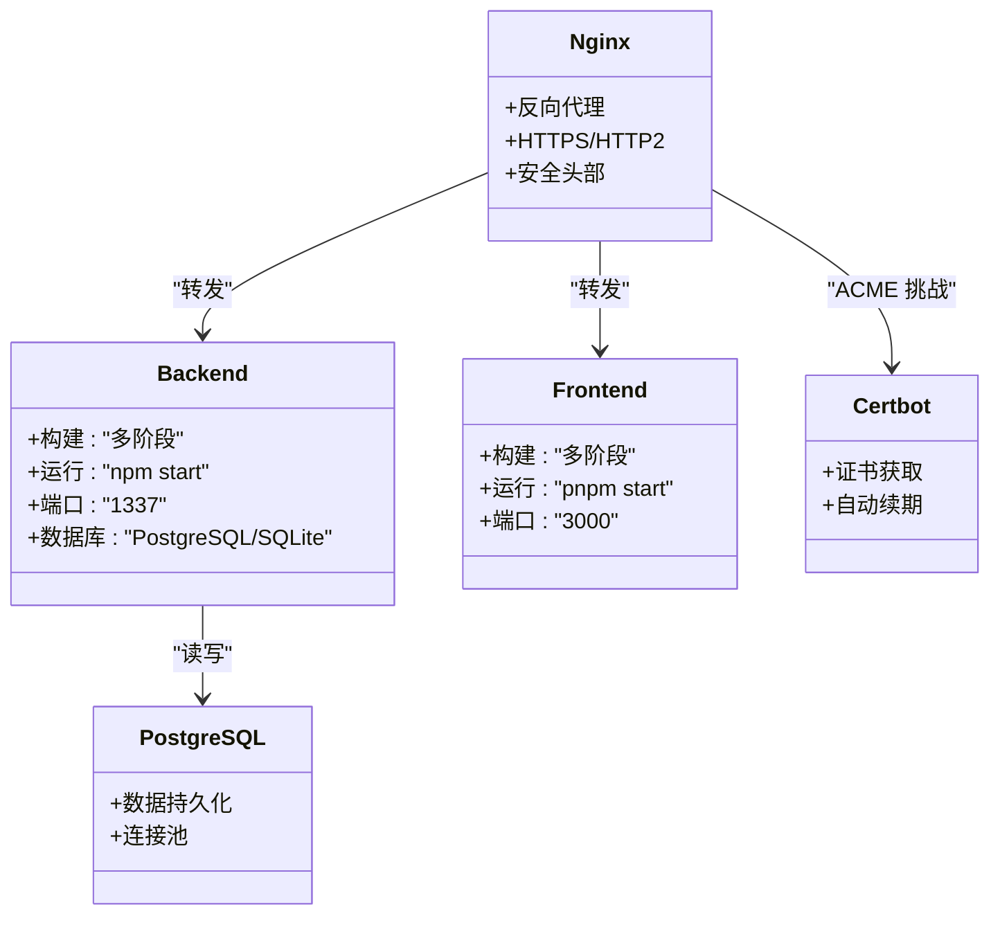
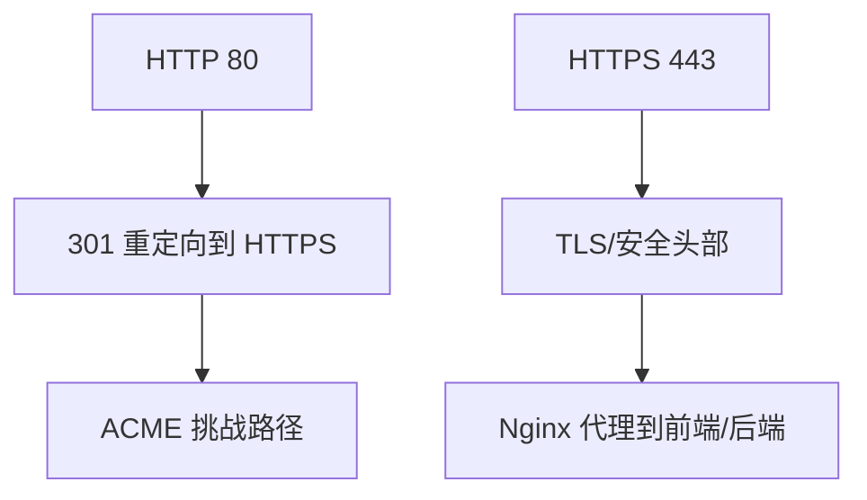
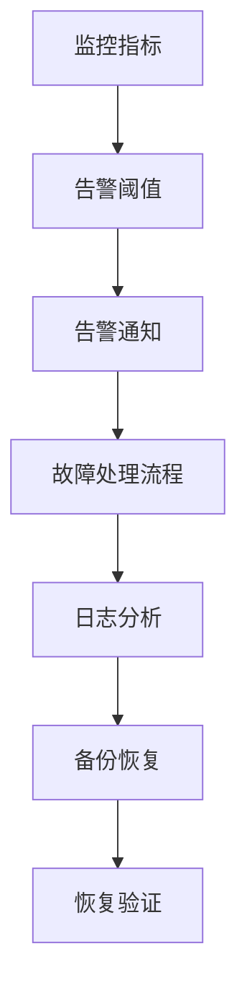
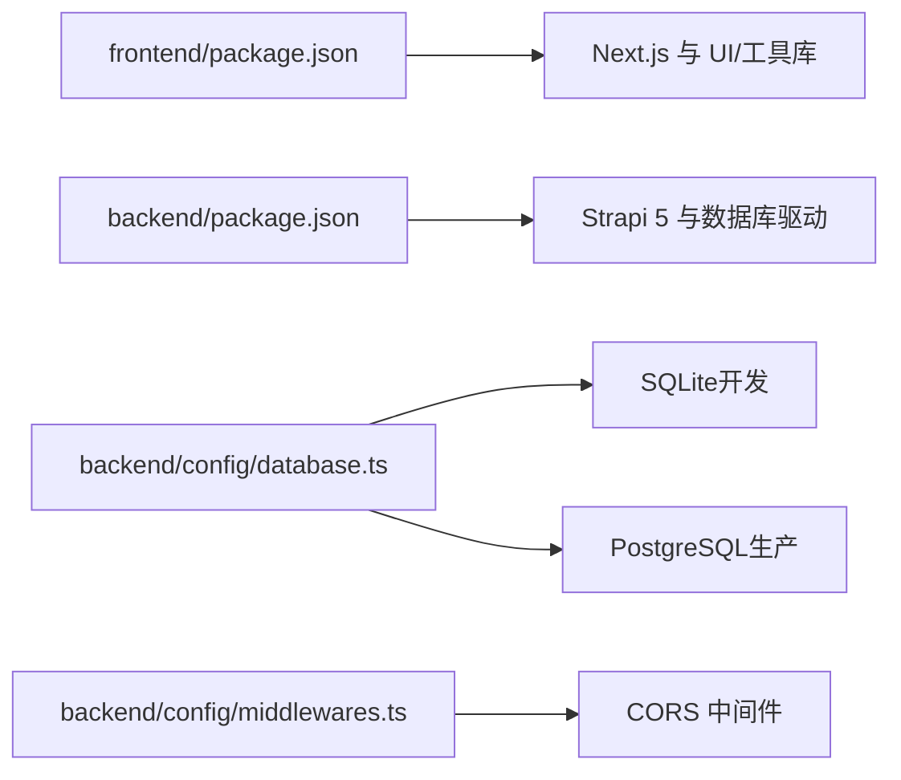

# 部署架构

<cite>
**本文引用的文件**
- [DEPLOYMENT.md](file://DEPLOYMENT.md)
- [README.md](file://README.md)
- [开发与生产环境分离方案.md](file://开发与生产环境分离方案.md)
- [生产环境分离的部署方案.md](file://生产环境分离的部署方案.md)
- [backend/package.json](file://backend/package.json)
- [frontend/package.json](file://frontend/package.json)
- [backend/config/database.ts](file://backend/config/database.ts)
- [backend/config/middlewares.ts](file://backend/config/middlewares.ts)
- [backend/.env.example](file://backend/.env.example)
- [frontend/.env.example](file://frontend/.env.example)
</cite>

## 目录
1. [简介](#简介)
2. [项目结构](#项目结构)
3. [核心组件](#核心组件)
4. [架构总览](#架构总览)
5. [详细组件分析](#详细组件分析)
6. [依赖关系分析](#依赖关系分析)
7. [性能考量](#性能考量)
8. [故障排查指南](#故障排查指南)
9. [结论](#结论)
10. [附录](#附录)

## 简介
本文件面向中创智控官网的部署与运维，系统化阐述前后端分离部署策略、环境分离方案、容器化与编排、负载均衡与反向代理、SSL 证书自动化、监控告警与日志管理、备份恢复以及 CI/CD 流水线设计，并提供最佳实践与运维指南。文档以仓库现有部署文档与配置为基础，结合前后端技术栈与容器化编排实践，形成可落地的部署架构说明。

## 项目结构
项目采用前后端分离架构，前端基于 Next.js 15 App Router，后端基于 Strapi 5 无头 CMS，数据库在开发环境使用 SQLite，生产环境使用 PostgreSQL。整体目录组织如下：
- frontend/：Next.js 前端应用，负责页面渲染与交互
- backend/：Strapi 后端应用，提供 REST API 与内容管理
- ops/：运维脚本与配置（包含 Docker Compose、Nginx、证书、备份等）
- specs/：规格文档与迁移计划
- 根目录：根级 README、部署文档与环境分离方案

图表来源
- [DEPLOYMENT.md](file://DEPLOYMENT.md#L36-L67)
- [开发与生产环境分离方案.md](file://开发与生产环境分离方案.md#L90-L139)

章节来源
- [README.md](file://README.md#L66-L227)
- [DEPLOYMENT.md](file://DEPLOYMENT.md#L101-L144)

## 核心组件
- 前端（Next.js 15）
  - 使用 App Router，支持 SSR/SSG/CSS-in-JS（Emotion/MUI）、Tailwind CSS v4
  - 通过环境变量 NEXT_PUBLIC_STRAPI_URL 指向后端 API
- 后端（Strapi 5）
  - 提供 REST API，支持用户权限插件与媒体上传
  - 数据库可配置为 SQLite（开发）或 PostgreSQL（生产）
- 反向代理与证书（Nginx + Let's Encrypt）
  - 统一入口，强制 HTTPS，安全头部，自动续期
- 容器化与编排（Docker + Docker Compose）
  - 多阶段构建，部署时构建，不提交构建产物
  - 数据卷持久化，健康检查与自动重启
- 运维脚本与自动化
  - 密钥生成、部署脚本、证书初始化与续期、备份与恢复

章节来源
- [README.md](file://README.md#L5-L65)
- [backend/package.json](file://backend/package.json#L1-L45)
- [frontend/package.json](file://frontend/package.json#L1-L88)
- [DEPLOYMENT.md](file://DEPLOYMENT.md#L1-L26)

## 架构总览
整体架构分为开发与生产两套环境，均通过 Docker Compose 编排，Nginx 作为统一入口，后端提供 API，数据库为 PostgreSQL（生产）或 SQLite（开发）。生产环境引入 Let's Encrypt 自动证书管理与续期，配合健康检查与日志轮转。

图表来源
- [DEPLOYMENT.md](file://DEPLOYMENT.md#L36-L67)
- [开发与生产环境分离方案.md](file://开发与生产环境分离方案.md#L90-L139)

## 详细组件分析

### 前后端分离部署
- 前端部署
  - 构建与启动：前端使用 pnpm 管理依赖，构建命令生成 .next 输出，启动命令监听 3000 端口
  - 环境变量：NEXT_PUBLIC_STRAPI_URL 指向后端 API（开发/生产）
- 后端部署
  - 构建与启动：后端使用 npm 管理依赖，构建命令生成 dist/build，启动命令监听 1337 端口
  - 数据库：开发使用 SQLite，生产使用 PostgreSQL；数据库配置通过环境变量与连接池参数控制
- 通信方式
  - 前端通过 HTTP/HTTPS API 与后端交互，开发环境支持跨域（localhost、127.0.0.1、192.168.0.2）

图表来源
- [README.md](file://README.md#L281-L298)
- [DEPLOYMENT.md](file://DEPLOYMENT.md#L94-L99)

章节来源
- [README.md](file://README.md#L281-L298)
- [frontend/package.json](file://frontend/package.json#L6-L11)
- [backend/package.json](file://backend/package.json#L6-L19)

### 环境分离策略
- 开发环境
  - 前端：http://localhost:3000
  - 后端：http://localhost:1337
  - 数据库：SQLite（文件存储）
- 生产环境
  - 前端：https://szzczk.com（经 Nginx）
  - 后端：https://szzczk.com/api（经 Nginx）
  - 数据库：PostgreSQL（Docker 卷持久化）
  - 证书：Let's Encrypt 自动续期
- 配置隔离
  - 开发与生产分别使用独立的 .env 与 .env.prod
  - 自动生成密钥（PostgreSQL 密码、Strapi APP_KEYS、JWT/加密密钥等）
  - 手动变量：域名与 Let's Encrypt 邮箱

图表来源
- [开发与生产环境分离方案.md](file://开发与生产环境分离方案.md#L15-L27)
- [生产环境分离的部署方案.md](file://生产环境分离的部署方案.md#L13-L19)

章节来源
- [开发与生产环境分离方案.md](file://开发与生产环境分离方案.md#L15-L27)
- [生产环境分离的部署方案.md](file://生产环境分离的部署方案.md#L13-L19)
- [DEPLOYMENT.md](file://DEPLOYMENT.md#L148-L222)

### CI/CD 流水线设计
- 构建策略
  - 部署时构建，不在仓库中提交构建产物（dist、build、.next）
  - 多阶段 Docker 构建，减小镜像体积，提升安全性
- 自动化流程
  - 拉取代码 → 生成密钥/环境变量 → 构建镜像 → 启动基础服务 → 初始化证书（首次）→ 启动 Nginx/Certbot → 健康检查
  - 更新部署：拉取最新代码 → 重新构建镜像 → 重启容器
- 脚本化
  - generate-secrets.sh：生成生产环境密钥与环境变量
  - deploy.sh：一键部署与健康检查
  - init-cert.sh：证书初始化（首次）
  - certbot-renew.sh：证书续期与 Nginx 重载

图表来源
- [DEPLOYMENT.md](file://DEPLOYMENT.md#L278-L318)
- [开发与生产环境分离方案.md](file://开发与生产环境分离方案.md#L407-L436)

章节来源
- [DEPLOYMENT.md](file://DEPLOYMENT.md#L225-L318)
- [开发与生产环境分离方案.md](file://开发与生产环境分离方案.md#L291-L436)

### 容器化与编排
- 镜像构建
  - 后端：多阶段构建，安装生产依赖，复制构建产物，非 root 用户运行
  - 前端：多阶段构建，安装 pnpm 与依赖，复制构建产物，非 root 用户运行
- 编排与网络
  - Docker Compose 编排，服务间通过内部网络通信
  - 数据卷持久化：postgres-data、strapi-uploads、certbot-etc
  - 健康检查：PostgreSQL、后端、前端、Nginx
- 日志与轮转
  - Docker 默认 json-file 日志驱动，配置最大大小与文件数量

图表来源
- [DEPLOYMENT.md](file://DEPLOYMENT.md#L225-L276)
- [开发与生产环境分离方案.md](file://开发与生产环境分离方案.md#L291-L406)

章节来源
- [DEPLOYMENT.md](file://DEPLOYMENT.md#L225-L276)
- [开发与生产环境分离方案.md](file://开发与生产环境分离方案.md#L291-L406)

### 负载均衡、反向代理与 SSL
- Nginx 配置要点
  - HTTP 80：重定向至 HTTPS，并开放 /.well-known/acme-challenge/ 用于 Let's Encrypt 验证
  - HTTPS 443：TLSv1.2+，安全密码套件，会话缓存与超时，安全响应头
- 证书管理
  - Certbot Standalone 模式首次获取证书
  - 定时任务每日检查续期并自动重载 Nginx
- 域名与入口
  - 生产域名 szczk.com 与 www.szzczk.com
  - 通过 Docker 卷挂载证书文件

图表来源
- [DEPLOYMENT.md](file://DEPLOYMENT.md#L364-L410)
- [开发与生产环境分离方案.md](file://开发与生产环境分离方案.md#L541-L588)

章节来源
- [DEPLOYMENT.md](file://DEPLOYMENT.md#L364-L410)
- [开发与生产环境分离方案.md](file://开发与生产环境分离方案.md#L541-L588)

### 监控告警、日志与故障恢复
- 健康检查
  - PostgreSQL：pg_isready
  - 后端/前端/Nginx：HTTP 健康端点
- 日志管理
  - Docker 日志轮转：单文件大小与保留数量
  - 查看日志：docker compose logs -f 与 --tail=100
- 备份与恢复
  - 数据库：pg_dump 完整备份
  - 上传文件：归档备份
  - 定时任务：每日数据库备份，每周清理过期备份
- 故障恢复
  - 证书续期失败：检查定时任务与 Nginx 重载
  - 数据库连接失败：检查容器健康与连接参数
  - API/前端不可用：检查 Nginx 配置与服务日志

图表来源
- [DEPLOYMENT.md](file://DEPLOYMENT.md#L587-L743)
- [开发与生产环境分离方案.md](file://开发与生产环境分离方案.md#L501-L591)

章节来源
- [DEPLOYMENT.md](file://DEPLOYMENT.md#L587-L743)
- [开发与生产环境分离方案.md](file://开发与生产环境分离方案.md#L501-L591)

## 依赖关系分析
- 前端依赖 Next.js 15 与大量 UI/工具库，构建与启动脚本明确
- 后端依赖 Strapi 5 与数据库驱动（better-sqlite3），支持多数据库配置
- 中间件启用 CORS，便于跨域访问
- 环境变量模板与示例文件清晰区分开发与生产

图表来源
- [frontend/package.json](file://frontend/package.json#L1-L88)
- [backend/package.json](file://backend/package.json#L1-L45)
- [backend/config/database.ts](file://backend/config/database.ts#L1-L61)
- [backend/config/middlewares.ts](file://backend/config/middlewares.ts#L1-L13)

章节来源
- [frontend/package.json](file://frontend/package.json#L1-L88)
- [backend/package.json](file://backend/package.json#L1-L45)
- [backend/config/database.ts](file://backend/config/database.ts#L1-L61)
- [backend/config/middlewares.ts](file://backend/config/middlewares.ts#L1-L13)
- [backend/.env.example](file://backend/.env.example#L1-L15)
- [frontend/.env.example](file://frontend/.env.example#L1-L2)

## 性能考量
- 构建优化
  - 多阶段构建与依赖缓存，减少镜像体积与构建时间
  - 部署时构建，避免构建产物提交
- 运行时优化
  - 健康检查与自动重启，保障可用性
  - 日志轮转与保留策略，降低磁盘压力
- 网络与安全
  - Nginx 强化安全头部，TLS 优化，证书自动续期
- 数据库
  - 连接池参数可调，PostgreSQL 生产环境具备更高并发能力

[本节为通用指导，无需列出具体文件来源]

## 故障排查指南
- 常见问题定位
  - 容器无法启动：检查端口占用与 Docker Compose 日志
  - 数据库连接失败：确认 PostgreSQL 健康状态与连接参数
  - API 请求失败：检查 CORS 配置与后端日志
  - 前端无法访问：检查 Nginx 配置与证书状态
  - SSL 证书过期：执行 certbot renew 并重载 Nginx
- 回滚与恢复
  - 使用部署脚本回滚镜像标签
  - 从备份恢复数据库与上传文件
- 健康检查与验证
  - 前端/后端健康端点验证
  - 数据库连接与表结构验证

章节来源
- [开发与生产环境分离方案.md](file://开发与生产环境分离方案.md#L543-L591)
- [DEPLOYMENT.md](file://DEPLOYMENT.md#L587-L743)

## 结论
本部署架构以 Docker 容器化为核心，结合 Nginx 反向代理与 Let's Encrypt 自动证书管理，实现了前后端分离、环境隔离与自动化运维。通过多阶段构建、健康检查、日志轮转与备份恢复机制，确保了生产环境的稳定性与可维护性。建议在 CI/CD 中集成自动化测试与安全扫描，并持续优化监控与告警体系。

[本节为总结性内容，无需列出具体文件来源]

## 附录
- 环境变量与密钥
  - 自动生成：PostgreSQL 密码、Strapi APP_KEYS、JWT/加密密钥等
  - 手动定义：域名与 Let's Encrypt 邮箱
- 部署脚本与职责
  - generate-secrets.sh：生成生产环境密钥与 .env.prod
  - deploy.sh：一键部署、健康检查与服务启动
  - init-cert.sh：首次证书初始化
  - certbot-renew.sh：证书续期与 Nginx 重载
- 备份与恢复
  - 备份脚本：pg_dump 与媒体文件归档
  - 定时任务：每日数据库备份，每周清理过期备份
  - 恢复脚本：从备份文件恢复数据库

章节来源
- [DEPLOYMENT.md](file://DEPLOYMENT.md#L162-L222)
- [开发与生产环境分离方案.md](file://开发与生产环境分离方案.md#L622-L777)
- [生产环境分离的部署方案.md](file://生产环境分离的部署方案.md#L313-L368)