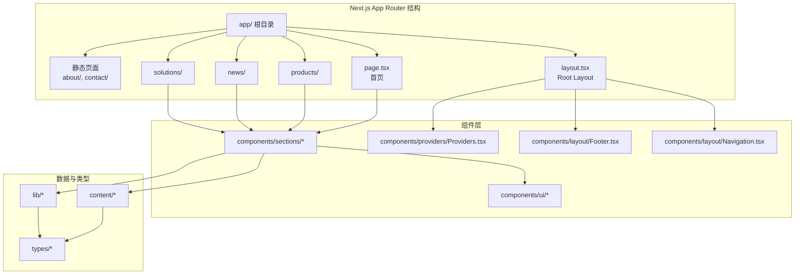
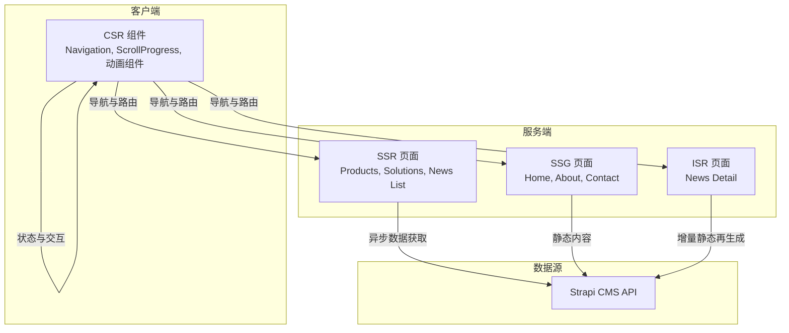
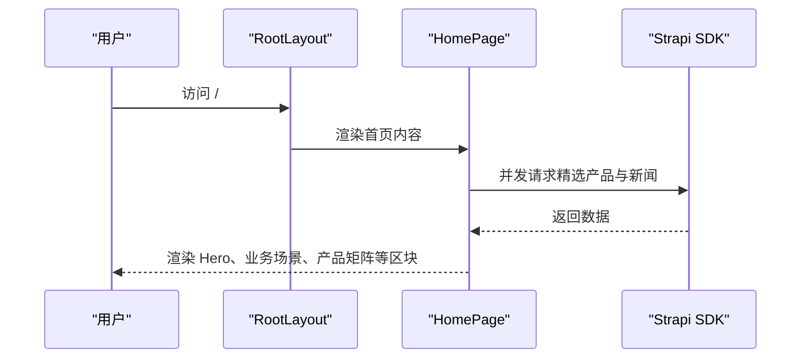
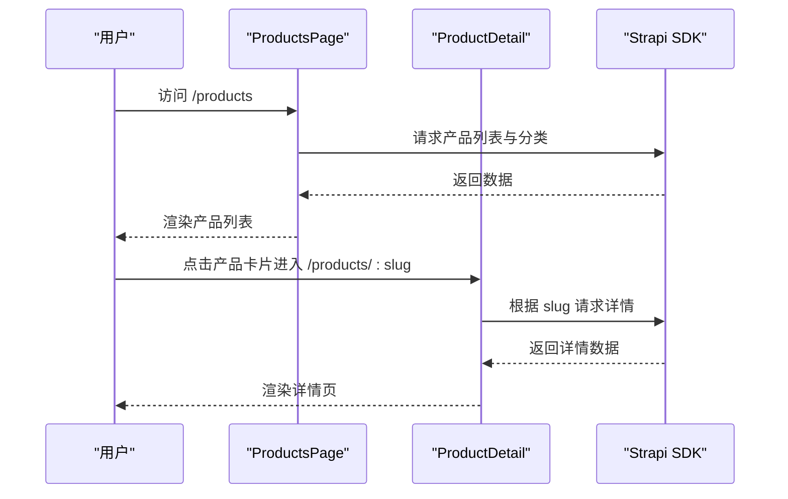
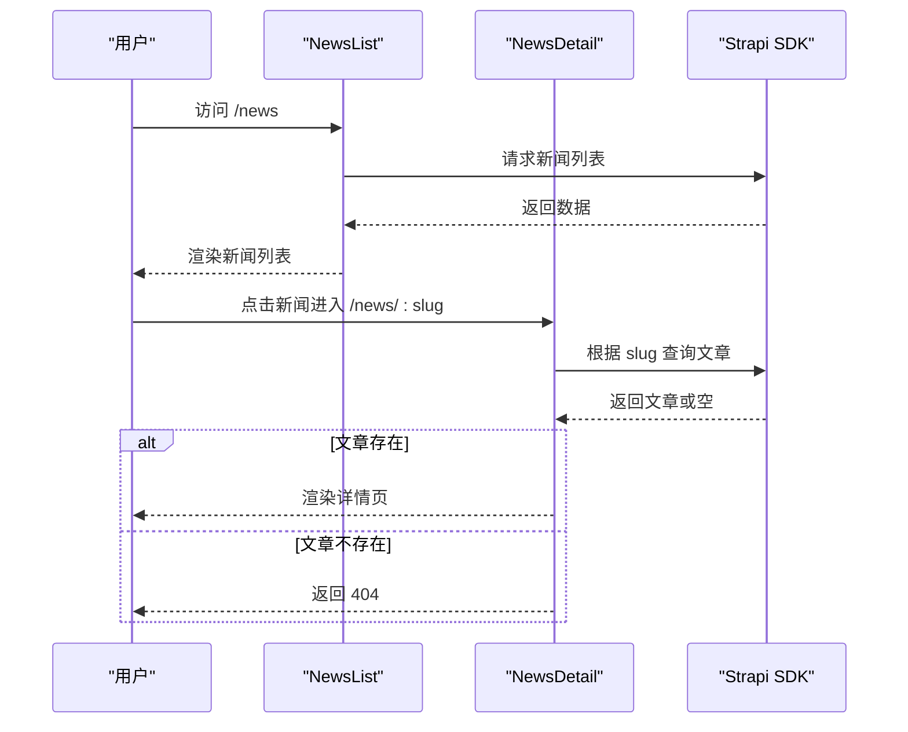
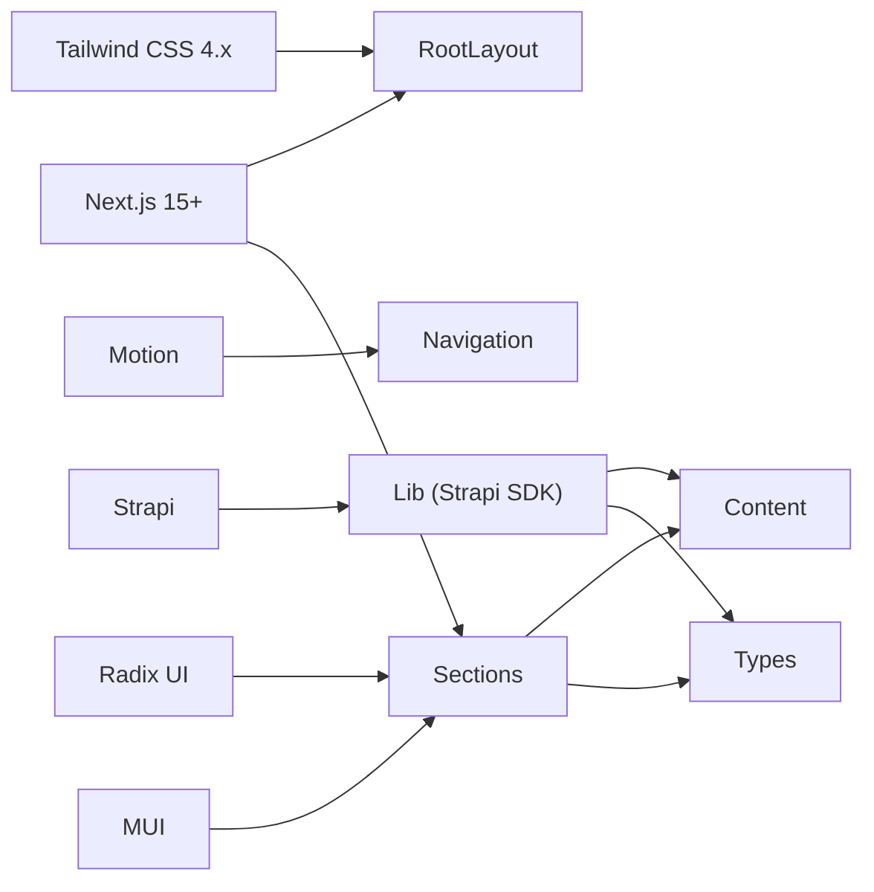

# Next.js迁移规格

<cite>
**本文档引用的文件**
- [frontend/package.json](file://frontend/package.json)
- [frontend/next.config.ts](file://frontend/next.config.ts)
- [frontend/app/layout.tsx](file://frontend/app/layout.tsx)
- [frontend/app/page.tsx](file://frontend/app/page.tsx)
- [frontend/app/products/page.tsx](file://frontend/app/products/page.tsx)
- [frontend/app/news/[slug]/page.tsx](file://frontend/app/news/[slug]/page.tsx)
- [frontend/lib/strapi.ts](file://frontend/lib/strapi.ts)
- [frontend/content/site-config.ts](file://frontend/content/site-config.ts)
- [frontend/components/providers/Providers.tsx](file://frontend/components/providers/Providers.tsx)
- [frontend/components/layout/Navigation.tsx](file://frontend/components/layout/Navigation.tsx)
- [frontend/lib/metadata.ts](file://frontend/lib/metadata.ts)
- [specs/001-nextjs-migration/spec.md](file://specs/001-nextjs-migration/spec.md)
- [specs/001-nextjs-migration/tasks.md](file://specs/001-nextjs-migration/tasks.md)
- [specs/001-nextjs-migration/plan.md](file://specs/001-nextjs-migration/plan.md)
- [specs/001-nextjs-migration/checklists/requirements.md](file://specs/001-nextjs-migration/checklists/requirements.md)
- [specs/001-nextjs-migration/data-model.md](file://specs/001-nextjs-migration/data-model.md)
</cite>

## 目录
1. [简介](#简介)
2. [项目结构](#项目结构)
3. [核心组件](#核心组件)
4. [架构总览](#架构总览)
5. [详细组件分析](#详细组件分析)
6. [依赖关系分析](#依赖关系分析)
7. [性能考虑](#性能考虑)
8. [故障排除指南](#故障排除指南)
9. [结论](#结论)
10. [附录](#附录)

## 简介
本规格文档面向将现有 React/Vite 应用迁移至 Next.js 15+ App Router 的工程团队，提供从技术要求、渲染策略、用户故事到成功标准的完整迁移蓝图。迁移遵循混合渲染模式（SSG/SSR/ISR/CSR），在保留全部视觉设计、动画与交互体验的同时，最大化 SEO 与性能表现。

## 项目结构
Next.js 15+ App Router 采用基于文件系统的路由，结合 React Server Components 与客户端组件的分层架构。前端代码采用以下组织方式：
- app/: 路由根目录，包含页面、布局、错误处理、加载状态等
- components/: 可复用组件，按功能域拆分（layout、sections、ui、figma、providers）
- content/: 静态内容与配置（产品、解决方案、新闻、导航、站点配置）
- lib/: 工具函数与数据访问层（Strapi API、元数据工具、分类工具）
- types/: TypeScript 类型定义
- public/: 静态资源（图片、字体、favicon）

图表来源
- [specs/001-nextjs-migration/plan.md](file://specs/001-nextjs-migration/plan.md#L80-L153)

章节来源
- [specs/001-nextjs-migration/plan.md](file://specs/001-nextjs-migration/plan.md#L60-L153)

## 核心组件
本节概述迁移后的关键组件及其职责与渲染策略：

- Root Layout（SSG/SSR 共享布局）
  - 负责全局元数据、主题提供者、导航、页脚、滚动进度条的注入
  - 作为所有页面的共享容器，确保品牌一致性与导航体验
- 页面组件（按页面职责划分）
  - 首页：聚合多个区块组件，采用 SSG，异步加载精选产品与新闻
  - 产品中心：SSR/ISR，支持动态参数生成与元数据生成
  - 解决方案：SSG，支持动态详情页
  - 资讯中心：SSR/ISR，支持动态详情页
  - 联系与关于：SSG，静态内容
- 组件层
  - Navigation：客户端组件，负责滚动态样式、移动端汉堡菜单与动画
  - Footer：服务端组件，负责版权与静态链接
  - Sections：页面区块组件，按需标记客户端指令以保留动画
  - UI：Radix UI/MUI 组件封装，保持交互一致性
  - Providers：全局上下文容器，预留主题与认证等 Provider
- 数据层
  - Strapi SDK：统一的数据访问层，支持 revalidate 缓存策略
  - 元数据工具：集中生成 SEO 元数据（title、description、OG、Twitter）
  - 站点配置：品牌色、SEO 默认值、社交媒体与版权信息

章节来源
- [frontend/app/layout.tsx](file://frontend/app/layout.tsx#L1-L83)
- [frontend/app/page.tsx](file://frontend/app/page.tsx#L1-L72)
- [frontend/app/products/page.tsx](file://frontend/app/products/page.tsx#L1-L50)
- [frontend/app/news/[slug]/page.tsx](file://frontend/app/news/[slug]/page.tsx#L1-L71)
- [frontend/components/layout/Navigation.tsx](file://frontend/components/layout/Navigation.tsx#L1-L126)
- [frontend/lib/strapi.ts](file://frontend/lib/strapi.ts#L1-L155)
- [frontend/lib/metadata.ts](file://frontend/lib/metadata.ts#L1-L60)
- [frontend/content/site-config.ts](file://frontend/content/site-config.ts#L1-L47)

## 架构总览
迁移采用混合渲染策略，结合 React Server Components 与客户端组件，实现高性能与良好 SEO 的平衡。

图表来源
- [specs/001-nextjs-migration/spec.md](file://specs/001-nextjs-migration/spec.md#L111-L130)
- [frontend/lib/strapi.ts](file://frontend/lib/strapi.ts#L100-L155)

章节来源
- [specs/001-nextjs-migration/spec.md](file://specs/001-nextjs-migration/spec.md#L111-L130)

## 详细组件分析

### 首页访问体验（US1）
- 目标：用户访问根路径时快速加载并看到完整的品牌展示内容，包括英雄区域、业务场景、产品矩阵、技术实力、案例研究、服务介绍与新闻动态，同时享受流畅的滚动动画效果。
- 技术要点：
  - 首页采用 SSG，异步并发加载精选产品与新闻，减少首屏等待
  - 所有区块组件按需标记客户端指令以保留动画效果
  - Root Layout 注入全局元数据与主题提供者
- 成功标准：
  - 首页在 2 秒内完成首屏渲染
  - 模块进入视口时按预期触发淡入与缩放动画
  - 搜索引擎爬虫可正确索引标题、描述与主要内容

图表来源
- [frontend/app/layout.tsx](file://frontend/app/layout.tsx#L63-L82)
- [frontend/app/page.tsx](file://frontend/app/page.tsx#L40-L71)
- [frontend/lib/strapi.ts](file://frontend/lib/strapi.ts#L113-L139)

章节来源
- [specs/001-nextjs-migration/spec.md](file://specs/001-nextjs-migration/spec.md#L10-L23)
- [frontend/app/page.tsx](file://frontend/app/page.tsx#L1-L72)

### 产品浏览与详情查看（US2）
- 目标：用户可浏览产品中心，查看产品列表并进入详情页
- 技术要点：
  - 产品中心页面采用 SSR/ISR，支持 revalidate 缓存
  - 详情页采用动态路由与静态参数生成，支持动态元数据生成
  - 导航使用 Next.js Link，保持浏览器历史记录可用
- 成功标准：
  - 列表页正确显示产品分类与卡片
  - 详情页根据 slug 正确渲染并生成 SEO 元数据
  - 返回列表页时滚动位置保持

图表来源
- [frontend/app/products/page.tsx](file://frontend/app/products/page.tsx#L43-L48)
- [frontend/lib/strapi.ts](file://frontend/lib/strapi.ts#L113-L125)

章节来源
- [specs/001-nextjs-migration/spec.md](file://specs/001-nextjs-migration/spec.md#L26-L39)

### 解决方案了解（US3）
- 目标：用户可浏览解决方案列表并查看详情
- 技术要点：
  - 列表页采用 SSG，详情页采用动态路由与静态参数生成
  - 支持动态元数据生成，包含 Open Graph 与 Twitter 卡片
- 成功标准：
  - 列表页正确显示各行业解决方案概览
  - 详情页完整展示解决方案介绍

章节来源
- [specs/001-nextjs-migration/spec.md](file://specs/001-nextjs-migration/spec.md#L42-L54)

### 资讯阅读（US4）
- 目标：用户可浏览资讯中心新闻列表并阅读详情
- 技术要点：
  - 列表页采用 SSR/ISR，详情页采用动态路由与静态参数生成
  - 详情页根据 slug 查询文章，不存在时返回 404
  - 支持动态元数据生成，包含文章发布时间、作者与标签
- 成功标准：
  - 列表页显示新闻列表与分类筛选
  - 详情页正确渲染文章内容与侧边栏

图表来源
- [frontend/app/news/[slug]/page.tsx](file://frontend/app/news/[slug]/page.tsx#L48-L70)
- [frontend/lib/strapi.ts](file://frontend/lib/strapi.ts#L141-L154)

章节来源
- [specs/001-nextjs-migration/spec.md](file://specs/001-nextjs-migration/spec.md#L57-L69)

### 响应式移动端体验（US5）
- 目标：移动端用户获得适配的布局与交互体验
- 技术要点：
  - Navigation 组件在移动端显示汉堡菜单，展开/收起使用动画
  - 响应式断点覆盖手机、平板与桌面
  - 触摸交互点击区域满足可访问性要求
- 成功标准：
  - 移动端显示汉堡菜单按钮
  - 菜单展开/收起动画与现有效果一致

章节来源
- [specs/001-nextjs-migration/spec.md](file://specs/001-nextjs-migration/spec.md#L72-L84)
- [frontend/components/layout/Navigation.tsx](file://frontend/components/layout/Navigation.tsx#L1-L126)

### 联系与关于页面访问（US6）
- 目标：用户可访问联系我们与关于我们页面
- 技术要点：
  - 采用 SSG，静态内容渲染
  - 联系表单标记客户端指令以启用交互
- 成功标准：
  - 联系页面显示表单与公司联系信息
  - 关于页面显示公司介绍、团队与发展历程

章节来源
- [specs/001-nextjs-migration/spec.md](file://specs/001-nextjs-migration/spec.md#L87-L99)

## 依赖关系分析
- 外部依赖
  - Next.js 15+：App Router、React Server Components、图片优化
  - Motion：滚动触发动画与交互动画
  - Radix UI + MUI：无障碍 UI 原语与图标
  - Tailwind CSS 4.x：样式系统与主题变量
  - Strapi：内容数据源
- 内部依赖
  - Root Layout 依赖 Navigation、Footer、Providers
  - 页面组件依赖 Sections、Content、Lib
  - Lib 依赖 Types 与 Content

图表来源
- [frontend/package.json](file://frontend/package.json#L12-L86)
- [frontend/next.config.ts](file://frontend/next.config.ts#L1-L39)
- [frontend/app/layout.tsx](file://frontend/app/layout.tsx#L1-L83)

章节来源
- [frontend/package.json](file://frontend/package.json#L12-L86)
- [frontend/next.config.ts](file://frontend/next.config.ts#L1-L39)

## 性能考虑
- 首屏性能
  - 首页采用 SSG，确保首屏内容即时可用
  - 图片优化：启用现代格式（WebP/AVIF）、响应式尺寸与远程域名白名单
- 渲染策略
  - 静态页面（首页、关于、联系）：SSG
  - 列表页面（产品、资讯、解决方案）：SSR/ISR（revalidate 缓存）
  - 交互组件（导航、动画）：客户端渲染
- SEO 与可访问性
  - 集中元数据生成，包含 Open Graph 与 Twitter 卡片
  - 无障碍支持：Radix UI 原生支持 WCAG 2.1 AA
- 浏览器兼容性
  - 支持现代浏览器，强制 HTTPS 与 CSP

章节来源
- [specs/001-nextjs-migration/spec.md](file://specs/001-nextjs-migration/spec.md#L139-L162)
- [frontend/next.config.ts](file://frontend/next.config.ts#L4-L33)
- [frontend/lib/metadata.ts](file://frontend/lib/metadata.ts#L1-L60)

## 故障排除指南
- 动态路由参数生成失败
  - 检查 generateStaticParams 是否正确返回 slug 列表
  - 确认 Strapi 中存在对应内容
- 详情页 404
  - 当查询不到文章时，使用 notFound() 返回 404 页面
- 图片加载失败
  - 使用 ImageWithFallback 组件的回退机制
- JavaScript 禁用时页面不可访问
  - 确保静态/服务端渲染内容仍可访问
- 动画效果丢失
  - 确认相关组件标记了客户端指令，且与 Motion 兼容

章节来源
- [frontend/app/news/[slug]/page.tsx](file://frontend/app/news/[slug]/page.tsx#L55-L57)
- [specs/001-nextjs-migration/spec.md](file://specs/001-nextjs-migration/spec.md#L102-L108)

## 结论
本次迁移通过 Next.js 15+ App Router 与混合渲染策略，在保留品牌视觉与交互体验的基础上，显著提升了性能与 SEO 表现。通过模块化的组件与数据层设计，项目具备良好的可维护性与扩展性，可按用户故事逐步交付并持续优化。

## 附录

### 用户故事与验收场景
- 首页访问体验（P1）
  - 首页在 2 秒内完成首屏渲染，显示导航栏与英雄区域
  - 滚动时模块按预期触发淡入与缩放动画
  - 搜索引擎爬虫可正确索引标题、描述与主要内容
- 产品浏览与详情查看（P1）
  - 产品中心正确显示分类与卡片
  - 详情页根据 slug 正确渲染并生成 SEO 元数据
  - 返回列表页时滚动位置保持
- 解决方案了解（P2）
  - 解决方案列表正确显示概览
  - 详情页完整展示解决方案介绍
- 资讯阅读（P2）
  - 资讯中心显示列表与分类筛选
  - 详情页正确渲染文章内容与侧边栏
- 响应式移动端体验（P2）
  - 移动端显示汉堡菜单按钮
  - 菜单展开/收起动画与现有效果一致
- 联系与关于页面访问（P3）
  - 联系页面显示表单与公司联系信息
  - 关于页面显示公司介绍、团队与发展历程

章节来源
- [specs/001-nextjs-migration/spec.md](file://specs/001-nextjs-migration/spec.md#L8-L108)

### 成功标准
- 首页首屏加载时间（LCP）在 3G 网络下不超过 2.5 秒
- Lighthouse 性能评分达到 90 分以上
- 所有页面在搜索引擎爬虫视角下仍可访问主要内容
- 现有所有动画效果在迁移后 100% 保留，无视觉差异
- 响应式断点（手机、平板、桌面）布局与现有网站完全一致
- 所有页面的品牌色彩（#11345b、#fdbd00）保持不变
- 用户完成从首页到产品详情页的导航路径不超过 3 次点击
- 页面切换动画流畅度保持 60fps 以上
- 所有内部链接在导航后保持浏览历史记录可用（支持前进后退）
- 移动端导航菜单展开/收起动画与现有效果一致

章节来源
- [specs/001-nextjs-migration/spec.md](file://specs/001-nextjs-migration/spec.md#L139-L152)

### 迁移检查清单
- 项目初始化与依赖安装
  - Next.js 15+ 项目创建与配置
  - TypeScript、Tailwind CSS 4.x、PostCSS 配置
  - Next.js 图片域名白名单配置
- 基础设施
  - 全局样式迁移与品牌色彩变量配置
  - 类型定义创建（Product、Solution、News、Navigation）
  - 元数据工具函数与内容数据层（products、solutions、news、navigation、site-config）
  - UI 基础组件（Radix UI/MUI）迁移与客户端指令标记
  - 布局组件（Navigation、Footer、ScrollProgress）迁移
  - Providers 包装组件创建
  - Root Layout、全局加载状态、404 页面、错误边界创建
- 用户故事实施
  - 首页区块组件迁移与首页整合
  - 产品页面组件与路由（列表页、详情页）
  - 解决方案页面组件与路由
  - 资讯页面组件与路由
  - 响应式移动端体验验证
  - 联系与关于页面组件与路由
- 全站优化与最终验证
  - 图片优化配置（WebP/AVIF、响应式尺寸）
  - Lighthouse 评分验证（性能 > 90）
  - Core Web Vitals 验证（LCP < 2.5s、FID < 100ms、CLS < 0.1）
  - sitemap.xml 与 robots.txt 生成
  - 跨浏览器兼容性测试（Chrome、Firefox、Safari、Edge）
  - 无障碍性验证（WCAG 2.1 AA）

章节来源
- [specs/001-nextjs-migration/tasks.md](file://specs/001-nextjs-migration/tasks.md#L18-L251)

### 路线图与任务分解
- 阶段划分
  - Phase 1：Setup（项目初始化）
  - Phase 2：Foundational（基础设施，阻塞所有用户故事）
  - Phase 3：US1 首页（MVP）
  - Phase 4：US2 产品
  - Phase 5：US3 解决方案
  - Phase 6：US4 资讯
  - Phase 7：US5 响应式
  - Phase 8：US6 联系/关于
  - Phase 9：Polish（全站优化与最终验证）
- 并行机会
  - Phase 2 内多任务并行（类型定义、内容数据层、UI 组件、布局组件）
  - Phase 3 内首页区块组件并行迁移
  - 用户故事间并行（开发者 A: US1；开发者 B: US2；开发者 C: US6）

章节来源
- [specs/001-nextjs-migration/tasks.md](file://specs/001-nextjs-migration/tasks.md#L254-L343)

### 数据模型与类型定义
- 核心实体
  - Product：产品实体，包含 slug、名称、简述、描述、分类、图片、特性、规格、置顶与排序等字段
  - Solution：解决方案实体，包含 slug、名称、简述、描述、行业、图片、亮点、关联产品与排序等字段
  - NewsArticle：新闻资讯实体，包含 slug、标题、摘要、正文、分类、标签、封面图、作者、发布/更新时间、阅读数、关联产品与置顶等字段
  - PageMetadata：页面元数据，包含标题、描述、OG 图片、关键词与索引控制
  - PageConfig：页面配置，包含路由路径、渲染策略（SSG/SSR/ISR/CSR）、ISR 重新验证时间与动态路由标识
  - NavItem：导航项，包含名称、路径、子菜单与移动端显示标识
- 实体关系
  - Solution 与 Product 通过 slug 关联
  - NewsArticle 与 Product 通过 relatedProducts 关联

章节来源
- [specs/001-nextjs-migration/data-model.md](file://specs/001-nextjs-migration/data-model.md#L9-L171)