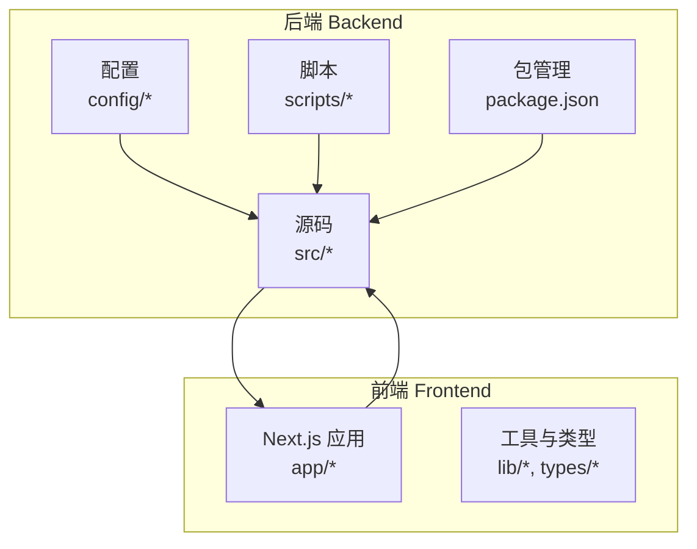
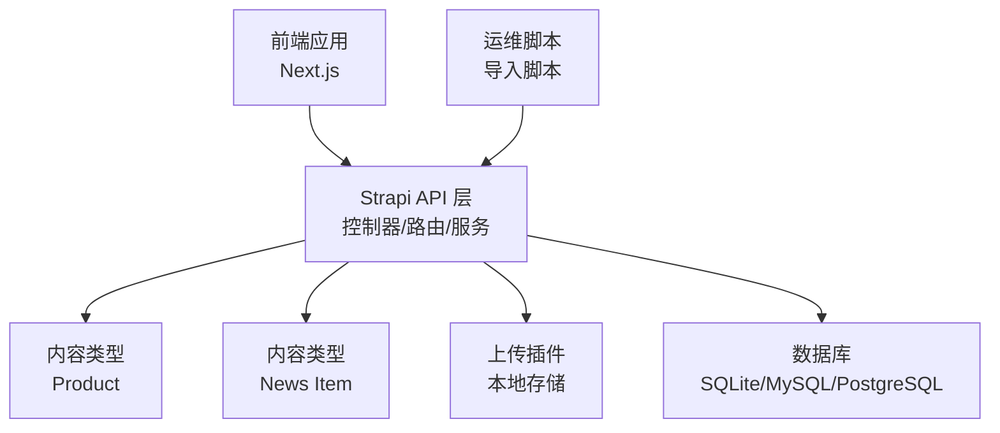
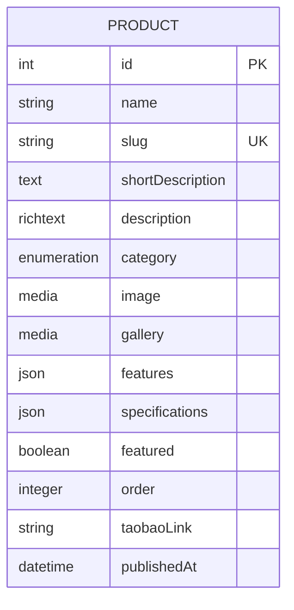
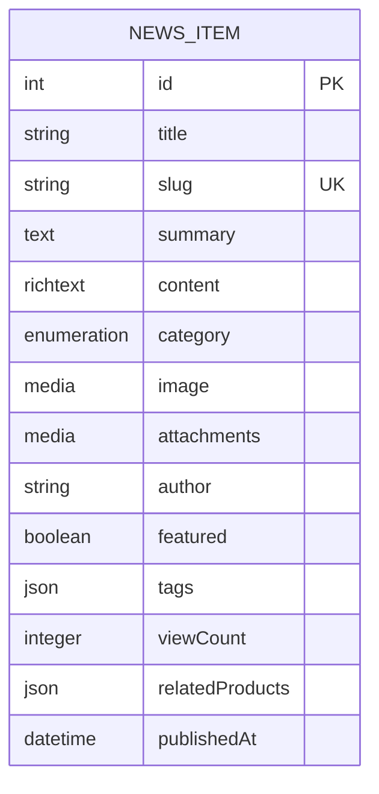
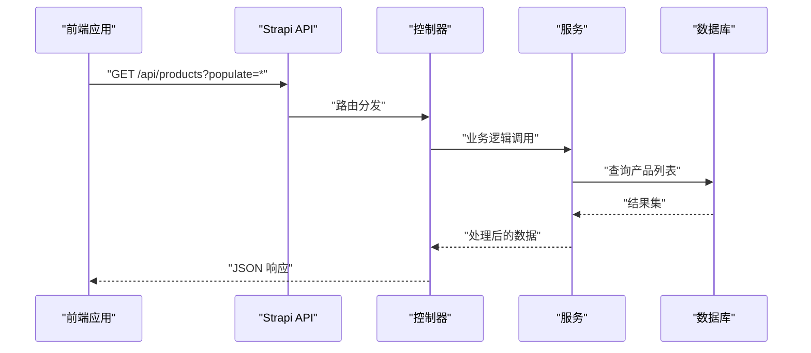
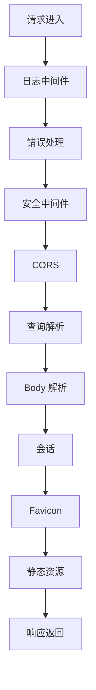
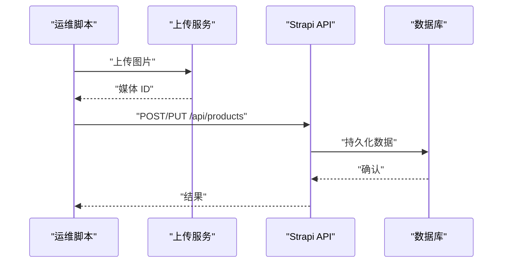
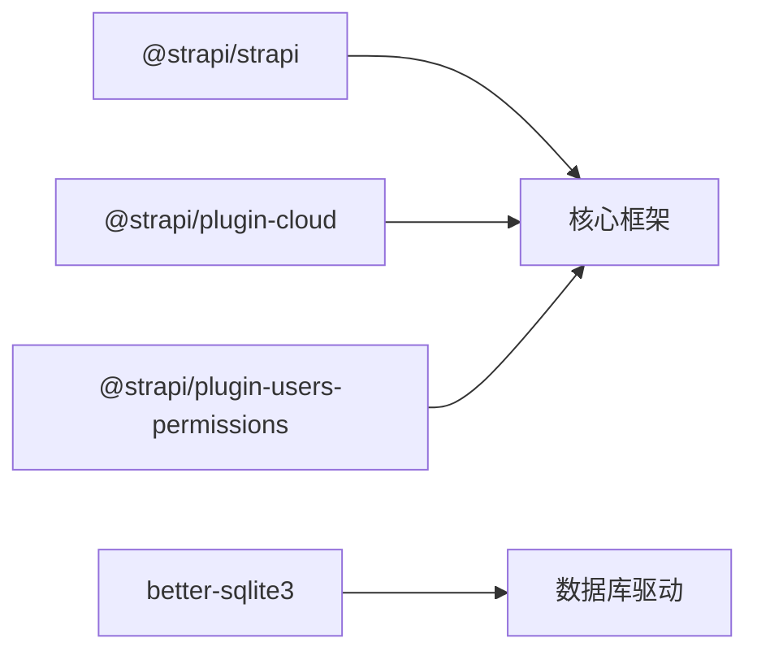

# Strapi后端CMS规格

<cite>
**本文档引用的文件**
- [package.json](file://backend/package.json)
- [README.md](file://backend/README.md)
- [server.ts](file://backend/config/server.ts)
- [database.ts](file://backend/config/database.ts)
- [middlewares.ts](file://backend/config/middlewares.ts)
- [plugins.ts](file://backend/config/plugins.ts)
- [product/schema.json](file://backend/src/api/product/content-types/product/schema.json)
- [news-item/schema.json](file://backend/src/api/news-item/content-types/news-item/schema.json)
- [product/controller.ts](file://backend/src/api/product/controllers/product.ts)
- [news-item/controller.ts](file://backend/src/api/news-item/controllers/news-item.ts)
- [product/route.ts](file://backend/src/api/product/routes/product.ts)
- [news-item/route.ts](file://backend/src/api/news-item/routes/news-item.ts)
- [product/service.ts](file://backend/src/api/product/services/product.ts)
- [news-item/service.ts](file://backend/src/api/news-item/services/news-item.ts)
- [import-products.mjs](file://backend/scripts/import-products.mjs)
- [import-news.mjs](file://backend/scripts/import-news.mjs)
- [specs.md](file://specs/001-strapi-backend-cms/spec.md)
- [data-model.md](file://specs/001-strapi-backend-cms/data-model.md)
</cite>

## 目录
1. [简介](#简介)
2. [项目结构](#项目结构)
3. [核心组件](#核心组件)
4. [架构总览](#架构总览)
5. [详细组件分析](#详细组件分析)
6. [依赖分析](#依赖分析)
7. [性能考虑](#性能考虑)
8. [故障排除指南](#故障排除指南)
9. [结论](#结论)
10. [附录](#附录)

## 简介
本规格文档面向基于 Strapi 5.33.4 构建的内容管理系统（CMS），聚焦产品管理与新闻资讯两大核心内容模块，定义内容类型、API 端点、权限控制、中间件配置、数据模型、API 契约、功能需求、性能与安全、以及部署与运维要求。文档旨在确保前端应用能够稳定可靠地消费后端动态内容。

## 项目结构
后端采用 Strapi 标准目录结构，核心位于 backend/ 目录，包含配置、API 模块、上传插件、导入脚本与类型声明。前端位于 frontend/ 目录，通过 Next.js 应用消费后端提供的内容。

图表来源
- [server.ts](file://backend/config/server.ts#L1-L8)
- [database.ts](file://backend/config/database.ts#L1-L61)
- [middlewares.ts](file://backend/config/middlewares.ts#L1-L13)
- [plugins.ts](file://backend/config/plugins.ts#L1-L11)

章节来源
- [package.json](file://backend/package.json#L1-L45)
- [README.md](file://backend/README.md#L1-L91)

## 核心组件
- 服务器配置：主机、端口、应用密钥
- 数据库配置：支持 SQLite、MySQL、PostgreSQL，连接池与超时
- 中间件栈：日志、错误、安全、CORS、查询、Body、会话、静态资源
- 插件：本地上传，限制 10MB 文件大小
- 内容类型：产品（Product）与新闻（News Item）
- API 控制器/路由/服务：基于 Strapi 核心工厂函数生成
- 导入脚本：从前端 content 目录导入产品与新闻内容及媒体

章节来源
- [server.ts](file://backend/config/server.ts#L1-L8)
- [database.ts](file://backend/config/database.ts#L1-L61)
- [middlewares.ts](file://backend/config/middlewares.ts#L1-L13)
- [plugins.ts](file://backend/config/plugins.ts#L1-L11)
- [product/schema.json](file://backend/src/api/product/content-types/product/schema.json#L1-L63)
- [news-item/schema.json](file://backend/src/api/news-item/content-types/news-item/schema.json#L1-L65)
- [product/controller.ts](file://backend/src/api/product/controllers/product.ts#L1-L4)
- [news-item/controller.ts](file://backend/src/api/news-item/controllers/news-item.ts#L1-L4)
- [product/route.ts](file://backend/src/api/product/routes/product.ts#L1-L4)
- [news-item/route.ts](file://backend/src/api/news-item/routes/news-item.ts#L1-L4)
- [product/service.ts](file://backend/src/api/product/services/product.ts#L1-L4)
- [news-item/service.ts](file://backend/src/api/news-item/services/news-item.ts#L1-L4)
- [import-products.mjs](file://backend/scripts/import-products.mjs#L1-L163)
- [import-news.mjs](file://backend/scripts/import-news.mjs#L1-L157)

## 架构总览
后端通过 Strapi 核心框架提供内容管理与 API 访问，前端 Next.js 应用通过 REST 接口消费内容。上传插件负责媒体资源存储，导入脚本实现初始内容迁移。

图表来源
- [middlewares.ts](file://backend/config/middlewares.ts#L1-L13)
- [plugins.ts](file://backend/config/plugins.ts#L1-L11)
- [database.ts](file://backend/config/database.ts#L1-L61)
- [import-products.mjs](file://backend/scripts/import-products.mjs#L1-L163)
- [import-news.mjs](file://backend/scripts/import-news.mjs#L1-L157)

## 详细组件分析

### 产品内容类型（Product）
- 类型：集合类型（collectionType），启用草稿与发布
- 关键字段：名称、唯一标识（UID）、简述、富文本描述、分类枚举、单张封面图、相册图集、JSON 特性与规格、布尔精选标志、整数排序、第三方链接
- 关系：媒体字段关联上传插件存储的文件实体
- 发布流程：通过设置发布时间字段实现草稿到发布的转换

图表来源
- [product/schema.json](file://backend/src/api/product/content-types/product/schema.json#L1-L63)

章节来源
- [product/schema.json](file://backend/src/api/product/content-types/product/schema.json#L1-L63)

### 新闻资讯内容类型（News Item）
- 类型：集合类型（collectionType），启用草稿与发布
- 关键字段：标题、唯一标识（UID）、摘要、富文本正文、分类枚举、单张封面图、附件图集、作者、布尔精选标志、标签 JSON、阅读计数、关联产品 JSON
- 关系：媒体字段关联上传插件存储的文件实体
- 发布流程：通过设置发布时间字段实现草稿到发布的转换

图表来源
- [news-item/schema.json](file://backend/src/api/news-item/content-types/news-item/schema.json#L1-L65)

章节来源
- [news-item/schema.json](file://backend/src/api/news-item/content-types/news-item/schema.json#L1-L65)

### API 设计与契约
- 自动生成的 REST 端点：基于内容类型名生成标准 CRUD 接口
- 认证授权：公共角色仅允许读取（find/findOne），认证角色允许写入（create/update/delete）
- 请求/响应格式：遵循 Strapi JSON API 规范，包含 data、meta、pagination 等结构
- 错误处理：中间件统一处理错误，返回标准化错误响应
- CORS 与安全：内置安全中间件与 CORS 支持

图表来源
- [middlewares.ts](file://backend/config/middlewares.ts#L1-L13)
- [product/route.ts](file://backend/src/api/product/routes/product.ts#L1-L4)
- [product/controller.ts](file://backend/src/api/product/controllers/product.ts#L1-L4)
- [product/service.ts](file://backend/src/api/product/services/product.ts#L1-L4)

章节来源
- [README.md](file://backend/README.md#L27-L31)
- [middlewares.ts](file://backend/config/middlewares.ts#L1-L13)

### 权限管理与中间件
- 中间件顺序：日志、错误、安全、CORS、Powered By、查询、Body、会话、Favicon、静态资源
- 上传插件：本地提供者，文件大小限制 10MB
- 用户权限：通过 Strapi 用户与权限插件配置角色与策略

图表来源
- [middlewares.ts](file://backend/config/middlewares.ts#L1-L13)
- [plugins.ts](file://backend/config/plugins.ts#L1-L11)

章节来源
- [middlewares.ts](file://backend/config/middlewares.ts#L1-L13)
- [plugins.ts](file://backend/config/plugins.ts#L1-L11)

### 数据导入与迁移
- 导入脚本：从前端 content 目录读取产品与新闻数据，上传媒体资源，调用 Strapi API 完成创建或更新
- 媒体上传：通过 /api/upload 端点上传图片，支持 JPEG/PNG/WebP/AVIF 等常见格式
- 去重与更新：根据 slug 查询现有条目，存在则 PUT 更新，否则 POST 创建
- 错误处理：对上传失败与 API 失败进行降级处理，跳过问题资源并记录警告

图表来源
- [import-products.mjs](file://backend/scripts/import-products.mjs#L1-L163)
- [import-news.mjs](file://backend/scripts/import-news.mjs#L1-L157)

章节来源
- [import-products.mjs](file://backend/scripts/import-products.mjs#L1-L163)
- [import-news.mjs](file://backend/scripts/import-news.mjs#L1-L157)

## 依赖分析
- 核心依赖：Strapi 5.33.4、Cloud 插件、用户权限插件、better-sqlite3
- 运行时要求：Node.js >=20 且 <=24
- 开发依赖：TypeScript、React 生态（用于 Admin UI 开发）

图表来源
- [package.json](file://backend/package.json#L20-L29)

章节来源
- [package.json](file://backend/package.json#L1-L45)

## 性能考虑
- 数据库连接池：根据客户端类型配置最小/最大连接数，合理设置连接超时
- 上传限制：本地上传文件大小限制 10MB，避免过大资源拖慢系统
- 缓存策略：建议在网关或 CDN 层引入静态资源缓存，减少数据库压力
- 查询优化：对高频查询（如列表、详情）建立必要索引（如 slug、publishedAt）
- 并发控制：限制并发上传与批量导入任务，避免瞬时峰值

## 故障排除指南
- 无法启动：检查 HOST/PORT/APP_KEYS 环境变量与数据库连接参数
- 上传失败：确认 STRAPI_TOKEN 有效，检查上传插件配置与文件类型
- 权限错误：核对公共/认证角色权限，确保只读与写入权限正确分配
- 导入异常：查看脚本输出与 API 返回，定位具体失败项并重试

章节来源
- [server.ts](file://backend/config/server.ts#L1-L8)
- [database.ts](file://backend/config/database.ts#L1-L61)
- [plugins.ts](file://backend/config/plugins.ts#L1-L11)
- [README.md](file://backend/README.md#L12-L31)

## 结论
本规格明确了基于 Strapi 5.33.4 的 CMS 架构与实现边界，覆盖内容模型、API 设计、权限控制、中间件与上传配置、导入脚本与运维实践。通过标准化的契约与严格的权限约束，确保前端应用能够稳定获取动态内容，同时满足性能与安全要求。

## 附录

### 功能需求规格（摘录）
- 内容管理：维护产品与资讯两类内容，支持富文本、媒体、分类与精选标记
- 访问控制：公共用户仅可读取，认证用户可写入
- 首页动态：产品矩阵与新闻动态来自 CMS，其他模块保持静态
- SEO 与元数据：基于 CMS 数据生成标题、描述与分享图
- 错误处理与加载状态：提供明确错误提示与加载反馈

章节来源
- [specs.md](file://specs/001-strapi-backend-cms/spec.md#L76-L124)

### 数据模型要点（摘录）
- 产品：标题、唯一标识、摘要、正文、封面图、相册、发布时间、精选标志、排序、链接
- 新闻：标题、唯一标识、摘要、正文、封面图、附件、发布时间、精选标志、标签、阅读计数、关联产品
- 媒体资产：由上传插件管理，通过媒体字段关联到内容条目
- 首页精选：通过布尔精选标志与发布时间排序实现最新内容展示

章节来源
- [data-model.md](file://specs/001-strapi-backend-cms/data-model.md#L1-L46)