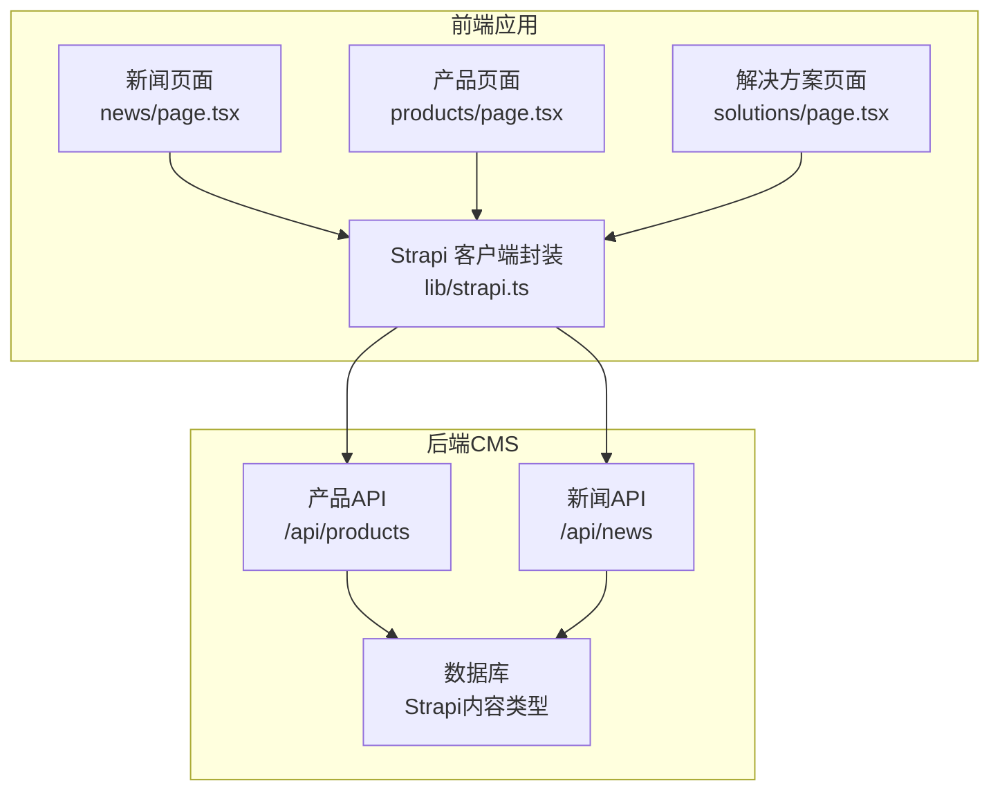
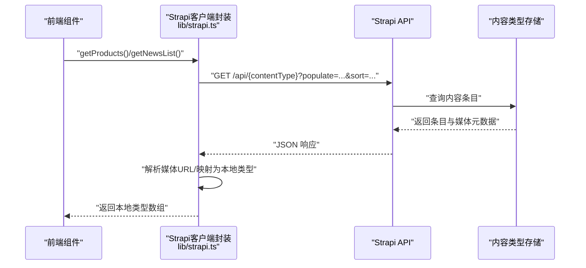
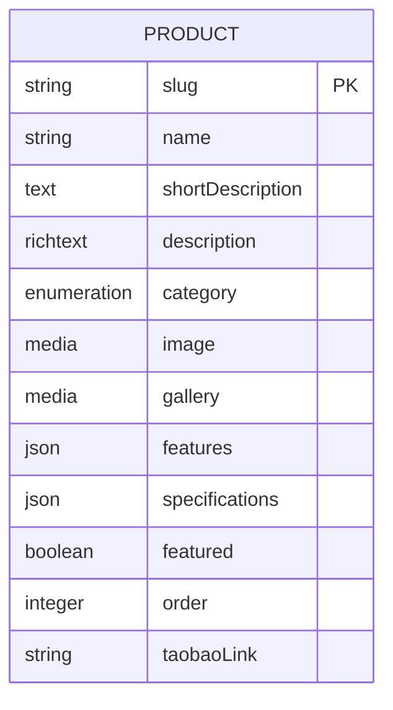
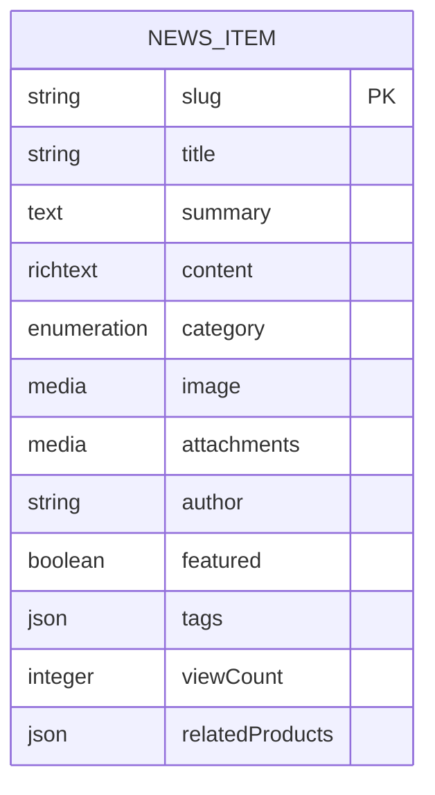
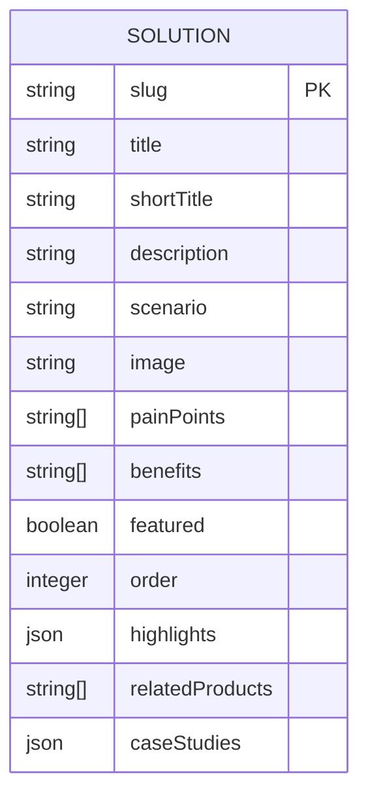
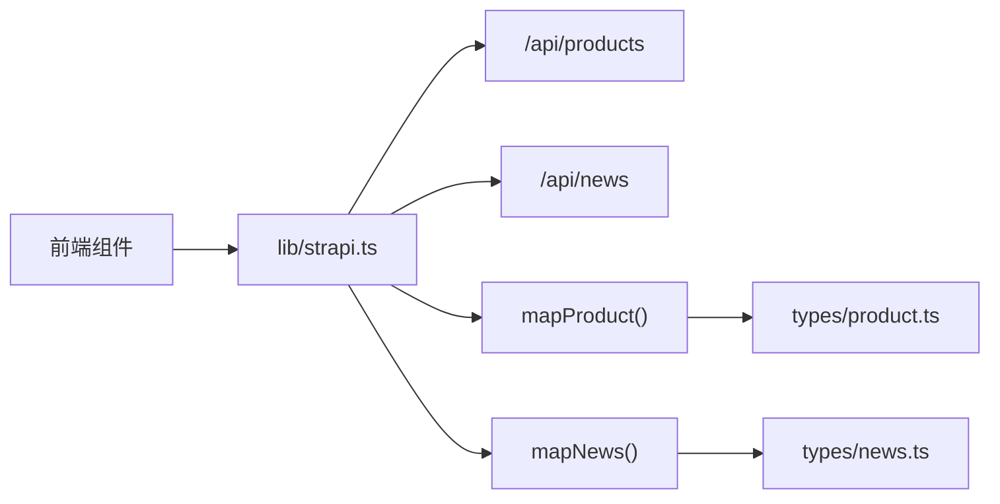

# 数据模型规格

<cite>
**本文引用的文件**
- [backend/src/api/product/content-types/product/schema.json](file://backend/src/api/product/content-types/product/schema.json)
- [backend/src/api/news-item/content-types/news-item/schema.json](file://backend/src/api/news-item/content-types/news-item/schema.json)
- [specs/001-strapi-backend-cms/data-model.md](file://specs/001-strapi-backend-cms/data-model.md)
- [specs/001-nextjs-migration/data-model.md](file://specs/001-nextjs-migration/data-model.md)
- [frontend/types/product.ts](file://frontend/types/product.ts)
- [frontend/types/news.ts](file://frontend/types/news.ts)
- [frontend/types/solution.ts](file://frontend/types/solution.ts)
- [frontend/content/products.ts](file://frontend/content/products.ts)
- [frontend/content/news.ts](file://frontend/content/news.ts)
- [frontend/content/solutions.ts](file://frontend/content/solutions.ts)
- [frontend/lib/strapi.ts](file://frontend/lib/strapi.ts)
- [backend/src/api/product/controllers/product.ts](file://backend/src/api/product/controllers/product.ts)
- [backend/src/api/news-item/controllers/news-item.ts](file://backend/src/api/news-item/controllers/news-item.ts)
</cite>

## 目录
1. [简介](#简介)
2. [项目结构](#项目结构)
3. [核心组件](#核心组件)
4. [架构总览](#架构总览)
5. [详细组件分析](#详细组件分析)
6. [依赖分析](#依赖分析)
7. [性能考虑](#性能考虑)
8. [故障排除指南](#故障排除指南)
9. [结论](#结论)
10. [附录](#附录)

## 简介
本文件系统化梳理中创智控官网项目的数据模型规格，覆盖产品、新闻资讯与解决方案三大核心实体及其字段定义、数据类型、关系映射、验证规则与业务约束，并给出前后端对接方式、迁移与版本管理策略建议，以支撑未来功能扩展与数据演进。

## 项目结构
- 后端采用 Strapi v5 CMS，通过内容类型（Content Types）定义产品与新闻条目，提供 REST API。
- 前端 Next.js 应用通过 Strapi SDK 获取数据，并在本地维护少量静态内容与类型定义。
- 规划文档包含 Strapi 与 Next.js 迁移两套数据模型说明，二者在字段与语义上存在差异，需以当前实现为准。



图表来源
- [frontend/lib/strapi.ts](file://frontend/lib/strapi.ts#L100-L155)
- [backend/src/api/product/controllers/product.ts](file://backend/src/api/product/controllers/product.ts#L1-L4)
- [backend/src/api/news-item/controllers/news-item.ts](file://backend/src/api/news-item/controllers/news-item.ts#L1-L4)

章节来源
- [specs/001-nextjs-migration/data-model.md](file://specs/001-nextjs-migration/data-model.md#L1-L348)
- [specs/001-strapi-backend-cms/data-model.md](file://specs/001-strapi-backend-cms/data-model.md#L1-L46)

## 核心组件
本节聚焦产品、新闻资讯与解决方案的数据模型，明确字段、类型、约束与业务含义。

- 产品（Product）
  - 字段要点：名称、URL 友好标识、简述、富文本详情、分类枚举、封面图、图集、特性列表、技术规格、是否精选、排序权重、淘宝链接等。
  - 数据类型：字符串、富文本、媒体、布尔、整数、JSON 对象等。
  - 约束：名称必填；slug 唯一且自动生成；可选封面图与图集；特性与规格以 JSON 存储，便于灵活扩展。
  - 业务含义：用于产品目录、详情页与首页推荐。

- 新闻资讯（News Item）
  - 字段要点：标题、slug、摘要、富文本正文、分类枚举、封面图、附件、作者、是否精选、标签、阅读量、关联产品（slug 列表）等。
  - 数据类型：字符串、富文本、媒体、枚举、JSON、整数等。
  - 约束：标题与 slug 必填且唯一；支持空正文（摘要文章）。
  - 业务含义：用于新闻列表、详情页与首页焦点展示。

- 解决方案（Solution）
  - 字段要点：标题、短标题、描述、场景标识、主图、痛点、价值点、是否精选、排序权重、亮点、关联产品（slug 列表）、案例研究等。
  - 数据类型：字符串、数组、对象、枚举等。
  - 约束：slug 唯一；场景枚举限定；亮点与案例研究为可选结构化数据。
  - 业务含义：用于解决方案矩阵、场景筛选与详情页。

章节来源
- [backend/src/api/product/content-types/product/schema.json](file://backend/src/api/product/content-types/product/schema.json#L1-L63)
- [backend/src/api/news-item/content-types/news-item/schema.json](file://backend/src/api/news-item/content-types/news-item/schema.json#L1-L65)
- [frontend/types/product.ts](file://frontend/types/product.ts#L1-L39)
- [frontend/types/news.ts](file://frontend/types/news.ts#L1-L44)
- [frontend/types/solution.ts](file://frontend/types/solution.ts#L1-L58)

## 架构总览
前后端数据交互遵循“前端调用后端 API → 后端返回内容类型数据 → 前端映射为本地类型”的模式。Strapi 的媒体字段通过 populate 参数加载，前端统一解析媒体 URL 并回退默认图。



图表来源
- [frontend/lib/strapi.ts](file://frontend/lib/strapi.ts#L100-L155)
- [backend/src/api/product/controllers/product.ts](file://backend/src/api/product/controllers/product.ts#L1-L4)
- [backend/src/api/news-item/controllers/news-item.ts](file://backend/src/api/news-item/controllers/news-item.ts#L1-L4)

## 详细组件分析

### 产品数据模型（Product）
- 字段与类型
  - 名称：字符串，必填
  - slug：UID，必填且唯一
  - 简述：文本
  - 详情：富文本
  - 分类：枚举（warning/sensing/inspection）
  - 封面图：媒体（单张，图片）
  - 图集：媒体（多张，图片）
  - 特性：JSON（键值对列表）
  - 规格：JSON（键值对）
  - 是否精选：布尔，默认 false
  - 排序权重：整数
  - 淘宝链接：字符串
- 业务规则
  - draftAndPublish：支持草稿/发布状态流转
  - 排序：按 order 升序
  - 媒体回退：无封面图时优先取图集首张
- 映射与校验
  - 前端类型与后端 schema 字段一一对应，媒体 URL 统一解析
  - 前端本地数据示例包含特性与规格字段，用于演示



图表来源
- [backend/src/api/product/content-types/product/schema.json](file://backend/src/api/product/content-types/product/schema.json#L13-L62)
- [frontend/lib/strapi.ts](file://frontend/lib/strapi.ts#L55-L76)

章节来源
- [backend/src/api/product/content-types/product/schema.json](file://backend/src/api/product/content-types/product/schema.json#L1-L63)
- [frontend/lib/strapi.ts](file://frontend/lib/strapi.ts#L55-L76)
- [frontend/content/products.ts](file://frontend/content/products.ts#L1-L183)
- [frontend/types/product.ts](file://frontend/types/product.ts#L1-L39)

### 新闻资讯数据模型（News Item）
- 字段与类型
  - 标题：字符串，必填
  - slug：UID，必填且唯一
  - 摘要：文本
  - 正文：富文本
  - 分类：枚举（product/tech/standard/company）
  - 封面图：媒体（单张，图片）
  - 附件：媒体（多张，图片）
  - 作者：字符串
  - 是否精选：布尔，默认 false
  - 标签：JSON（字符串数组）
  - 阅读量：整数，默认 0
  - 关联产品：JSON（字符串数组，slug 列表）
- 业务规则
  - draftAndPublish：支持草稿/发布状态流转
  - 默认封面图：当无封面图时回退至固定图片
  - 阅读量：可统计与展示
- 映射与校验
  - 前端类型与后端 schema 字段一致，媒体 URL 统一解析



图表来源
- [backend/src/api/news-item/content-types/news-item/schema.json](file://backend/src/api/news-item/content-types/news-item/schema.json#L13-L63)
- [frontend/lib/strapi.ts](file://frontend/lib/strapi.ts#L78-L98)

章节来源
- [backend/src/api/news-item/content-types/news-item/schema.json](file://backend/src/api/news-item/content-types/news-item/schema.json#L1-L65)
- [frontend/lib/strapi.ts](file://frontend/lib/strapi.ts#L78-L98)
- [frontend/content/news.ts](file://frontend/content/news.ts#L1-L239)
- [frontend/types/news.ts](file://frontend/types/news.ts#L1-L44)

### 解决方案数据模型（Solution）
- 字段与类型
  - 标题：字符串
  - 短标题：字符串
  - 描述：字符串
  - 场景：字符串（场景标识）
  - 主图：字符串（URL）
  - 痛点：字符串数组
  - 价值：字符串数组
  - 是否精选：布尔
  - 排序权重：整数
  - 亮点：结构化数组（标题/描述/图标）
  - 关联产品：字符串数组（slug 列表）
  - 案例研究：结构化数组（标题/客户/描述/结果等）
- 业务规则
  - 场景枚举限定；亮点与案例研究为可选结构化数据
  - 排序：按 order 升序
- 映射与校验
  - 前端类型与本地数据示例一致，媒体 URL 为静态路径



图表来源
- [frontend/types/solution.ts](file://frontend/types/solution.ts#L30-L57)
- [frontend/content/solutions.ts](file://frontend/content/solutions.ts#L11-L112)

章节来源
- [frontend/types/solution.ts](file://frontend/types/solution.ts#L1-L58)
- [frontend/content/solutions.ts](file://frontend/content/solutions.ts#L1-L134)

### 实体关系与映射
- 一对一
  - 产品封面图/图集：媒体字段（单/多）
  - 新闻封面图/附件：媒体字段（单/多）
- 一对多
  - 产品与图集：一个产品可有多张图
  - 新闻与附件：一张新闻可有多个附件
- 多对多
  - 新闻与产品：通过 JSON 字段存储 slug 列表，实现多对多关联
  - 解决方案与产品：通过 JSON 字段存储 slug 列表，实现多对多关联
- 设计原则与约束
  - 使用 JSON 字段存储关联 slug 列表，简化查询与渲染
  - 通过枚举限制分类与场景，保证数据一致性
  - 媒体字段通过 populate 加载，前端统一解析 URL

```mermaid
classDiagram
class Product {
+slug
+name
+category
+image
+gallery
+features
+specifications
+featured
+order
+taobaoLink
}
class NewsItem {
+slug
+title
+category
+image
+attachments
+tags
+relatedProducts
+featured
}
class Solution {
+slug
+title
+scenario
+image
+painPoints
+benefits
+relatedProducts
+caseStudies
}
Product "1" -- "0..*" ProductGallery : "图集"
NewsItem "1" -- "0..*" NewsAttachment : "附件"
NewsItem ||--|| Product : "通过relatedProducts关联"
Solution ||--|| Product : "通过relatedProducts关联"
```

图表来源
- [backend/src/api/product/content-types/product/schema.json](file://backend/src/api/product/content-types/product/schema.json#L40-L44)
- [backend/src/api/news-item/content-types/news-item/schema.json](file://backend/src/api/news-item/content-types/news-item/schema.json#L40-L44)
- [frontend/types/solution.ts](file://frontend/types/solution.ts#L53-L56)
- [frontend/types/news.ts](file://frontend/types/news.ts#L42-L42)

章节来源
- [specs/001-nextjs-migration/data-model.md](file://specs/001-nextjs-migration/data-model.md#L238-L258)

### 数据验证规则与业务约束
- 通用约束
  - 必填字段：名称、标题、slug、发布时间等
  - 唯一性：slug 唯一
  - 枚举约束：分类与场景枚举限定取值
  - 媒体类型：仅允许图片
- 产品特有
  - 特性与规格为 JSON，建议在写入时校验键值对结构
  - 排序权重用于手动排序
- 新闻特有
  - 支持空正文（摘要文章）
  - 阅读量默认 0，可递增
- 解决方案特有
  - 场景标识与枚举保持一致
  - 亮点与案例研究为可选结构化数据

章节来源
- [backend/src/api/product/content-types/product/schema.json](file://backend/src/api/product/content-types/product/schema.json#L14-L61)
- [backend/src/api/news-item/content-types/news-item/schema.json](file://backend/src/api/news-item/content-types/news-item/schema.json#L14-L62)
- [specs/001-strapi-backend-cms/data-model.md](file://specs/001-strapi-backend-cms/data-model.md#L17-L22)

### 数据迁移与版本管理策略
- 迁移策略
  - 产品与新闻：基于 Strapi 内容类型 schema，通过 Strapi 后台或脚本导入初始数据
  - 解决方案：前端本地静态数据，通过内容文件维护与版本控制
- 版本管理
  - 使用 Git 管理内容文件与类型定义变更
  - 对媒体资源采用版本化命名或 CDN 缓存策略
- 扩展建议
  - 若未来需要更强的关联能力，可引入独立的 Category/Tag 内容类型并通过关系字段替代 JSON 列表
  - 对 SEO 元数据（如关键词、描述）可新增字段并在前端生成页面元数据

章节来源
- [specs/001-strapi-backend-cms/data-model.md](file://specs/001-strapi-backend-cms/data-model.md#L44-L46)
- [specs/001-nextjs-migration/data-model.md](file://specs/001-nextjs-migration/data-model.md#L262-L296)

## 依赖分析
- 前端依赖后端 API 返回的媒体 URL 与属性映射，统一通过 lib/strapi.ts 封装
- 产品与新闻的 populate 查询确保媒体字段可用
- 解决方案数据为前端本地静态数据，不依赖后端 API



图表来源
- [frontend/lib/strapi.ts](file://frontend/lib/strapi.ts#L100-L155)
- [frontend/types/product.ts](file://frontend/types/product.ts#L1-L39)
- [frontend/types/news.ts](file://frontend/types/news.ts#L1-L44)

章节来源
- [frontend/lib/strapi.ts](file://frontend/lib/strapi.ts#L1-L155)

## 性能考虑
- 媒体加载
  - 使用 populate 按需加载媒体字段，避免一次性拉取过多资源
  - 前端统一解析媒体 URL，减少重复计算
- 列表排序
  - 产品按 order 排序，新闻按发布时间排序，减少前端二次排序成本
- 缓存与增量
  - 前端 fetch 使用 next.revalidate 控制缓存刷新频率
  - 新闻与产品列表可设置合理的 revalidate 时间以平衡新鲜度与性能

章节来源
- [frontend/lib/strapi.ts](file://frontend/lib/strapi.ts#L100-L155)
- [specs/001-strapi-backend-cms/data-model.md](file://specs/001-strapi-backend-cms/data-model.md#L41-L42)

## 故障排除指南
- 媒体 URL 为空
  - 检查后端 populate 参数是否正确传入 image/gallery
  - 前端回退逻辑：产品无封面图时取图集首张；新闻无封面图时使用默认图
- slug 重复或非法
  - 确保 slug 自动生成或手动输入符合唯一性与格式要求
- 关联产品无效
  - 检查 relatedProducts 中的 slug 是否存在于产品列表
- API 请求失败
  - 查看返回状态与错误信息，确认 Strapi 地址与路由正确

章节来源
- [frontend/lib/strapi.ts](file://frontend/lib/strapi.ts#L35-L53)
- [frontend/lib/strapi.ts](file://frontend/lib/strapi.ts#L100-L155)

## 结论
本数据模型以 Strapi 内容类型为核心，结合前端本地静态数据，实现了产品、新闻与解决方案的清晰分层与高效协作。通过枚举约束、媒体统一解析与 JSON 关联，既保证了数据一致性，又具备良好的扩展性。建议后续在 SEO 元数据、分类标签与搜索能力方面逐步增强，以支撑更丰富的前端体验与运营需求。

## 附录
- 字段对照与来源
  - 产品：schema.json 与 types/product.ts、lib/strapi.ts
  - 新闻：schema.json 与 types/news.ts、lib/strapi.ts
  - 解决方案：types/solution.ts 与 content/solutions.ts
- 相关流程图
  - 前后端数据流：参见“架构总览”与“依赖分析”中的序列图与依赖图