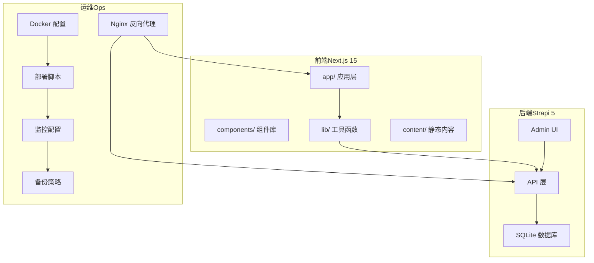
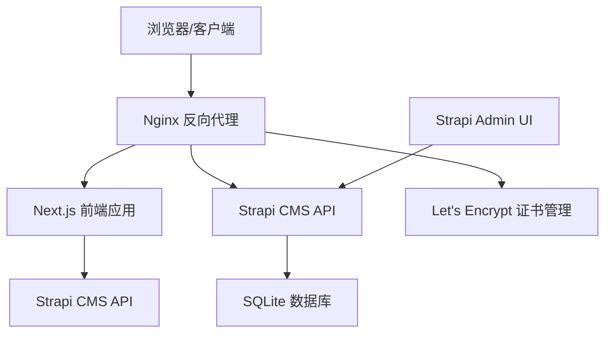
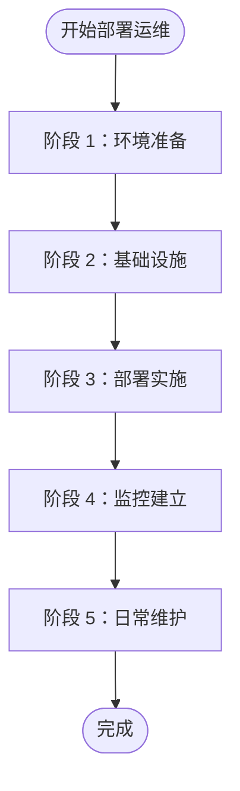
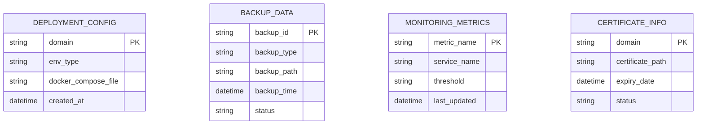
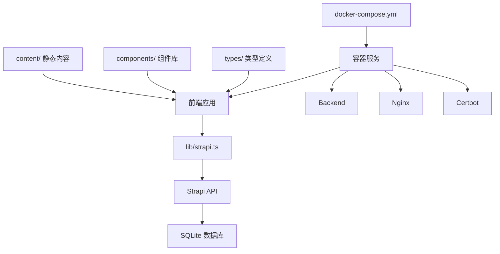

# 规格文档

<cite>
**本文档引用的文件**
- [README.md](file://README.md)
- [package.json](file://frontend/package.json)
- [package.json](file://backend/package.json)
- [spec.md](file://specs/001-deployment-ops-manual/spec.md)
- [tasks.md](file://specs/001-deployment-ops-manual/tasks.md)
- [data-model.md](file://specs/001-deployment-ops-manual/data-model.md)
- [plan.md](file://specs/001-deployment-ops-manual/plan.md)
- [quickstart.md](file://specs/001-deployment-ops-manual/quickstart.md)
- [research.md](file://specs/001-deployment-ops-manual/research.md)
- [requirements.md](file://specs/001-deployment-ops-manual/checklists/requirements.md)
- [README.md](file://specs/001-deployment-ops-manual/contracts/README.md)
- [DEPLOYMENT-OPS-MANUAL.md](file://ops/DEPLOYMENT-OPS-MANUAL.md)
- [docker-compose.prod.yml](file://ops/docker/docker-compose.prod.yml)
- [strapi.ts](file://frontend/lib/strapi.ts)
- [api.ts](file://backend/config/api.ts)
</cite>

## 更新摘要
**所做更改**
- 删除过时的Next.js迁移规格文档
- 删除过时的Strapi后端CMS规格文档
- 新增部署运维规格文档集合
- 更新架构说明以反映当前的部署运维重点
- 整合新的运维手册和最佳实践

## 目录
1. [项目概述](#项目概述)
2. [项目结构](#项目结构)
3. [核心组件](#核心组件)
4. [架构总览](#架构总览)
5. [详细组件分析](#详细组件分析)
6. [依赖关系分析](#依赖关系分析)
7. [性能考量](#性能考量)
8. [故障排除指南](#故障排除指南)
9. [结论](#结论)
10. [附录](#附录)

## 项目概述
本项目旨在为中创智控官网提供统一的规格文档体系，重点关注部署运维管理，涵盖以下关键领域：
- **部署运维规格**：定义完整的生产环境部署、更新、回滚、备份与证书管理流程，确保系统的稳定性和可维护性。
- **容器化部署架构**：基于Docker Compose的服务编排，支持开发、生产和验证环境的标准化部署。
- **自动化运维流程**：提供一键部署脚本、健康检查机制和监控告警配置，降低运维复杂度。
- **安全与合规**：集成SSL/TLS证书管理、访问控制和数据备份策略，满足生产环境的安全要求。
- **监控与可观测性**：建立完善的健康检查、日志管理和性能监控体系，确保系统可诊断性。

本项目采用前后端分离架构，前端基于Next.js 15 App Router，后端基于Strapi 5 CMS，通过Docker容器化部署，支持Nginx反向代理和Let's Encrypt证书管理。

**章节来源**
- [README.md](file://README.md#L1-L1129)

## 项目结构
项目采用清晰的分层组织结构，重点关注部署运维管理：

- **前端（frontend/）**
  - Next.js 15应用，使用App Router进行页面路由
  - 支持SSR/SSG/CSR混合渲染模式
  - 通过lib/strapi.ts与后端Strapi CMS进行数据交互
  - 包含组件库、UI基础组件、内容数据与工具函数

- **后端（backend/）**
  - Strapi 5 CMS，提供RESTful API管理产品与新闻内容
  - 使用SQLite数据库（可配置其他数据库）
  - 包含Admin UI用于内容管理
  - 支持用户权限管理与媒体上传

- **运维（ops/）**
  - Docker配置与镜像构建
  - 部署脚本与环境管理
  - 备份与恢复策略
  - 监控与日志配置
  - SSL证书管理

- **规格文档（specs/）**
  - 部署运维规格文档集合
  - 包含需求、设计、任务分解、数据模型与契约等

**图表来源**
- [README.md](file://README.md#L66-L227)

**章节来源**
- [README.md](file://README.md#L66-L227)

## 核心组件
本节概述项目的核心组件与职责分工：

- **前端核心组件**
  - App Router路由系统：负责页面路由与渲染策略（SSG/SSR/CSR）
  - 布局组件：Navigation、Footer、ScrollProgress
  - 页面区块组件：Hero、BusinessScenarios、ProductMatrix、TechnicalStrength、CaseStudies、Services、NewsFeed
  - UI基础组件：基于Radix UI的可复用组件
  - 工具函数：cn、metadata、strapi.ts API客户端

- **后端核心组件**
  - Strapi CMS：提供RESTful API与Admin UI
  - 内容类型：Product、News
  - 插件与配置：Upload、Users & Permissions、数据库配置
  - 脚本：内容导入与解析脚本

- **运维核心组件**
  - Docker配置：Dockerfile.frontend、Dockerfile.backend
  - 部署编排：docker-compose.prod.yml、docker-compose.dev.yml
  - 运维脚本：deploy.sh、rollback.sh、generate-secrets.sh
  - 备份管理：backup.sh、restore.sh、retention.sh
  - 监控配置：metrics.md、runbook.md

**章节来源**
- [README.md](file://README.md#L496-L799)
- [package.json](file://frontend/package.json#L1-L88)
- [package.json](file://backend/package.json#L1-L45)

## 架构总览
系统采用容器化部署架构，通过Docker Compose进行服务编排。前端负责用户界面与交互，后端负责内容管理与数据存储，Nginx提供反向代理和SSL终止。

**图表来源**
- [README.md](file://README.md#L249-L298)

**章节来源**
- [README.md](file://README.md#L249-L298)

## 详细组件分析

### 部署运维规格

#### 用户场景与测试
- **首次部署体验（P1）**：运维人员能够在2小时内完成生产环境的完整部署并通过健康检查
- **更新部署流程（P2）**：支持一键更新部署，成功率≥95%，服务持续可用
- **回滚恢复能力（P2）**：支持快速版本回滚，回滚成功率≥95%，恢复时间≤10分钟
- **备份恢复策略（P3）**：支持定期备份与恢复演练，备份可用性≥98%
- **证书管理自动化（P3）**：支持证书自动获取与续期，续期成功率≥98%

#### 功能需求
- **容器化部署**：支持Docker Compose编排，包含开发、生产和验证环境
- **一键部署脚本**：提供完整的部署、更新、回滚自动化脚本
- **健康检查机制**：每个服务都有健康检查配置，支持自动重启
- **SSL证书管理**：集成Let's Encrypt证书自动获取与续期
- **备份与恢复**：支持数据库和媒体文件的完整备份与恢复
- **监控与日志**：提供健康检查端点和日志管理配置

#### 成功标准
- **部署效率**：首次部署≤2小时，更新部署≤30分钟
- **可用性指标**：服务可用性≥99.9%，平均恢复时间≤5分钟
- **自动化程度**：部署自动化率≥95%，人工干预≤5%
- **安全性**：SSL证书自动管理，访问控制完善
- **可维护性**：运维手册完整，故障排查时间≤30分钟

**章节来源**
- [spec.md](file://specs/001-deployment-ops-manual/spec.md#L1-L137)

#### 实施策略与任务分解
- **阶段划分**：Setup（环境准备）、Foundational（基础设施）、Deployment（部署实施）、Monitoring（监控建立）、Maintenance（日常维护）
- **并行机会**：Docker镜像构建、环境变量配置、健康检查设置等多任务并行
- **MVP范围**：首次部署手册 + 基础监控配置 + 备份策略

**图表来源**
- [tasks.md](file://specs/001-deployment-ops-manual/tasks.md#L1-L200)

**章节来源**
- [tasks.md](file://specs/001-deployment-ops-manual/tasks.md#L1-L200)

#### 数据模型规格
- **部署配置**：环境变量、Docker配置、服务依赖关系
- **备份数据**：数据库备份、媒体文件备份、备份元数据
- **监控指标**：健康检查状态、日志级别、性能指标
- **证书信息**：域名配置、证书有效期、续期状态

**图表来源**
- [data-model.md](file://specs/001-deployment-ops-manual/data-model.md#L1-L100)

**章节来源**
- [data-model.md](file://specs/001-deployment-ops-manual/data-model.md#L1-L100)

### 容器化部署架构

#### 用户场景与测试
- **开发环境部署（P1）**：开发团队能够在本地快速启动完整的开发环境
- **生产环境部署（P1）**：运维团队能够一键完成生产环境的完整部署
- **服务编排管理（P2）**：支持服务的健康检查、自动重启和资源限制
- **网络与存储管理（P3）**：支持容器间通信、数据持久化和网络隔离

#### 功能需求
- **多环境支持**：开发、生产和验证环境的差异化配置
- **服务编排**：PostgreSQL、Strapi、Next.js、Nginx、Certbot的协调运行
- **资源管理**：内存限制、CPU配额和健康检查配置
- **网络配置**：容器网络隔离、端口映射和健康检查端点

#### 成功标准
- **启动速度**：开发环境启动≤5分钟，生产环境启动≤10分钟
- **资源利用率**：容器资源使用率≥80%，避免资源浪费
- **稳定性**：服务可用性≥99.9%，自动重启成功率≥99%
- **可扩展性**：支持水平扩展和负载均衡

**章节来源**
- [docker-compose.prod.yml](file://ops/docker/docker-compose.prod.yml#L1-L153)

#### 实施策略与任务分解
- **环境分离**：开发环境使用SQLite，生产环境使用PostgreSQL
- **服务依赖**：正确配置服务启动顺序和健康检查依赖
- **资源限制**：为每个服务设置合理的内存和CPU限制
- **网络隔离**：使用独立的Docker网络进行服务隔离

**章节来源**
- [docker-compose.prod.yml](file://ops/docker/docker-compose.prod.yml#L1-L153)

### 运维手册与最佳实践

#### 用户场景与测试
- **运维人员培训（P1）**：新运维人员能够通过手册独立完成日常运维任务
- **故障应急响应（P2）**：支持常见故障的快速定位和解决
- **性能优化（P3）**：支持系统性能监控和优化建议

#### 功能需求
- **完整手册**：包含首次部署、更新、回滚、备份、证书管理的完整流程
- **验证清单**：每个步骤都有明确的验证标准和检查项
- **故障排查**：提供常见问题的诊断方法和解决方案
- **最佳实践**：总结运维经验和优化建议

#### 成功标准
- **易用性**：手册结构清晰，操作步骤明确，成功率≥95%
- **完整性**：覆盖所有运维场景，无遗漏关键步骤
- **时效性**：手册内容与实际脚本保持同步，及时更新
- **实用性**：提供可操作的建议和解决方案

**章节来源**
- [DEPLOYMENT-OPS-MANUAL.md](file://ops/DEPLOYMENT-OPS-MANUAL.md#L1-L118)

#### 实施策略与任务分解
- **手册编写**：基于实际脚本和配置编写运维手册
- **验证测试**：通过实际部署验证手册的准确性和完整性
- **持续改进**：根据运维经验不断优化手册内容
- **知识传承**：建立运维知识库，支持团队协作

**章节来源**
- [DEPLOYMENT-OPS-MANUAL.md](file://ops/DEPLOYMENT-OPS-MANUAL.md#L1-L118)

## 依赖关系分析

### 技术栈依赖
- **前端依赖**：Next.js 15、React 18、TypeScript 5、Tailwind CSS 4、Radix UI、MUI、Motion
- **后端依赖**：Strapi 5、better-sqlite3、React、styled-components、TypeScript
- **运维依赖**：Docker 20.10+、Docker Compose 2.0+、Nginx 1.27、Certbot

### 组件耦合关系
- **前端通过lib/strapi.ts与后端API交互**，解耦内容来源
- **内容数据通过content/目录与静态内容分离**
- **组件库与UI基础组件通过types/统一类型约束**
- **运维脚本与配置文件通过ops/集中管理**

**图表来源**
- [README.md](file://README.md#L496-L799)
- [package.json](file://frontend/package.json#L1-L88)
- [package.json](file://backend/package.json#L1-L45)

**章节来源**
- [README.md](file://README.md#L496-L799)
- [package.json](file://frontend/package.json#L1-L88)
- [package.json](file://backend/package.json#L1-L45)

## 性能考量
- **容器化性能**：合理配置容器资源限制，避免资源争用
- **服务启动优化**：优化服务启动顺序和依赖关系，减少启动时间
- **健康检查配置**：设置合适的健康检查间隔和超时时间
- **日志管理**：配置日志轮转和存储策略，避免磁盘空间不足
- **监控指标**：建立关键性能指标监控，及时发现性能问题

## 故障排除指南
- **容器启动失败**：检查Docker配置、环境变量和依赖服务状态
- **健康检查失败**：查看容器日志，确认服务端口和配置正确
- **网络连接问题**：检查Docker网络配置和端口映射
- **SSL证书问题**：验证域名解析、80/443端口可用性和证书配置
- **备份恢复问题**：检查备份文件完整性、存储空间和权限设置

**章节来源**
- [README.md](file://README.md#L555-L799)

## 结论
本规格文档为中创智控官网项目提供了全面的部署运维管理规范，重点关注容器化部署、自动化运维和系统稳定性。通过明确的用户场景、功能需求、成功标准与实施策略，确保项目团队能够按照统一标准进行部署运维，实现高质量的官网建设和长期稳定运行。

## 附录

### 开发流程与里程碑
- **阶段 1：Setup（环境准备与基础配置）**
- **阶段 2：Foundational（基础设施与核心类型定义）**
- **阶段 3：Deployment（部署实施与服务编排）**
- **阶段 4：Monitoring（监控建立与日志管理）**
- **阶段 5：Maintenance（日常维护与优化）**

### 风险管理
- **技术风险**：容器化技术复杂性、服务依赖关系、网络配置问题
- **业务风险**：部署失败、数据丢失、服务中断
- **应对措施**：充分测试、备份策略、监控告警、文档化变更

### 运维最佳实践
- **自动化优先**：尽可能使用脚本和配置文件自动化运维任务
- **监控先行**：建立完善的监控体系，提前发现问题
- **文档化管理**：所有运维操作都要有详细记录和文档
- **定期演练**：定期进行备份恢复和故障演练，提高应急响应能力