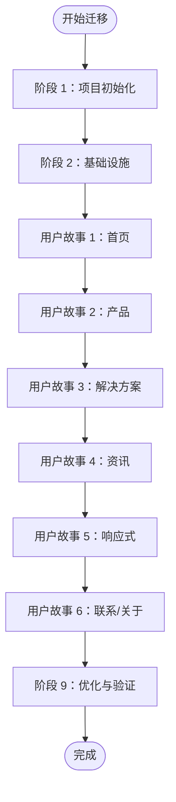

# 规格文档

<cite>
**本文档引用的文件**
- [README.md](file://README.md)
- [package.json](file://frontend/package.json)
- [package.json](file://backend/package.json)
- [spec.md](file://specs/001-nextjs-migration/spec.md)
- [tasks.md](file://specs/001-nextjs-migration/tasks.md)
- [data-model.md](file://specs/001-nextjs-migration/data-model.md)
- [plan.md](file://specs/001-nextjs-migration/plan.md)
- [spec.md](file://specs/001-strapi-backend-cms/spec.md)
- [tasks.md](file://specs/001-strapi-backend-cms/tasks.md)
- [data-model.md](file://specs/001-strapi-backend-cms/data-model.md)
- [plan.md](file://specs/001-strapi-backend-cms/plan.md)
- [schema.json](file://backend/src/api/product/content-types/product/schema.json)
- [schema.json](file://backend/src/api/news-item/content-types/news-item/schema.json)
- [strapi.ts](file://frontend/lib/strapi.ts)
- [api.ts](file://backend/config/api.ts)
</cite>

## 目录
1. [项目概述](#项目概述)
2. [项目结构](#项目结构)
3. [核心组件](#核心组件)
4. [架构总览](#架构总览)
5. [详细组件分析](#详细组件分析)
6. [依赖关系分析](#依赖关系分析)
7. [性能考量](#性能考量)
8. [故障排除指南](#故障排除指南)
9. [结论](#结论)
10. [附录](#附录)

## 项目概述
本项目旨在为中创智控官网提供统一的规格文档体系，涵盖以下关键领域：
- Next.js 迁移规格：定义从现有 React/Vite 应用到 Next.js 15+ App Router 的迁移计划、技术选型与实施策略，确保视觉设计、动画效果与交互体验的完整保留。
- Strapi 后端 CMS 规格：定义基于 Strapi 5 的内容管理后端，支持产品与新闻的动态内容管理，包含功能需求、性能要求与安全考虑。
- 数据模型规格：明确实体关系、字段定义与业务规则，支撑前后端数据契约与一致性。
- API 契约规格：定义接口设计、数据格式与版本管理策略，确保前后端协作的稳定性与可演进性。
- 测试规格文档：制定测试策略、覆盖率要求与质量标准，保障交付质量。
- 项目管理规格：明确开发流程、里程碑计划与风险管理，确保团队协同高效。

本项目采用前后端分离架构，前端基于 Next.js 15 App Router，后端基于 Strapi 5 CMS，通过 REST API 进行数据交互，支持静态内容与动态内容的混合管理模式。

**章节来源**
- [README.md](file://README.md#L1-L863)

## 项目结构
项目采用清晰的分层组织结构，前后端分离，职责明确：

- 前端（frontend/）
  - Next.js 15 应用，使用 App Router 进行页面路由
  - 支持 SSR/SSG/CSR 混合渲染模式
  - 通过 lib/strapi.ts 与后端 Strapi CMS 进行数据交互
  - 包含组件库、UI 基础组件、内容数据与工具函数

- 后端（backend/）
  - Strapi 5 CMS，提供 RESTful API 管理产品与新闻内容
  - 使用 SQLite 数据库（可配置其他数据库）
  - 包含 Admin UI 用于内容管理
  - 支持用户权限管理与媒体上传

- 规格文档（specs/）
  - Next.js 迁移规格与 Strapi 后端规格的完整文档集
  - 包含需求、设计、任务分解、数据模型与契约等

**图表来源**
- [README.md](file://README.md#L66-L227)

**章节来源**
- [README.md](file://README.md#L66-L227)

## 核心组件
本节概述项目的核心组件与职责分工：

- 前端核心组件
  - App Router 路由系统：负责页面路由与渲染策略（SSG/SSR/CSR）
  - 布局组件：Navigation、Footer、ScrollProgress
  - 页面区块组件：Hero、BusinessScenarios、ProductMatrix、TechnicalStrength、CaseStudies、Services、NewsFeed
  - UI 基础组件：基于 Radix UI 的可复用组件
  - 工具函数：cn、metadata、strapi.ts API 客户端

- 后端核心组件
  - Strapi CMS：提供 RESTful API 与 Admin UI
  - 内容类型：Product、News
  - 插件与配置：Upload、Users & Permissions、数据库配置
  - 脚本：内容导入与解析脚本

- 规格文档组件
  - Next.js 迁移规格：spec、tasks、data-model、plan
  - Strapi 后端规格：spec、tasks、data-model、plan

**章节来源**
- [README.md](file://README.md#L496-L799)
- [package.json](file://frontend/package.json#L1-L88)
- [package.json](file://backend/package.json#L1-L45)

## 架构总览
系统采用前后端分离架构，通过 HTTP/HTTPS API 进行数据交互。前端负责用户界面与交互，后端负责内容管理与数据存储。

**图表来源**
- [README.md](file://README.md#L249-L298)

**章节来源**
- [README.md](file://README.md#L249-L298)

## 详细组件分析

### Next.js 迁移规格

#### 用户场景与测试
- 首页访问体验（P1）：确保首页在 2 秒内完成首屏渲染，滚动动画正常触发，SEO 可索引
- 产品浏览与详情查看（P1）：产品列表与详情页导航顺畅，支持返回与历史记录
- 解决方案了解（P2）：解决方案列表与详情页内容完整
- 资讯阅读（P2）：新闻列表与详情页内容渲染正确
- 响应式移动端体验（P2）：移动端导航菜单与布局适配
- 联系与关于页面访问（P3）：静态页面内容完整性

#### 功能需求
- 保留所有 6 个主要页面与动态路由
- 精确保留所有动画效果与品牌色彩
- 支持混合渲染模式（SSG/SSR/CSR）
- 保留全局滚动进度条与响应式导航
- 为静态页面采用 SSG，列表页面支持 SSR/ISR，交互组件使用客户端渲染

#### 成功标准
- 首页 LCP < 2.5 秒（3G 网络）
- Lighthouse 性能评分 > 90
- 所有页面在搜索引擎爬虫视角下可访问主要内容
- 现有动画效果 100% 保留
- 响应式断点布局与现有网站一致

**章节来源**
- [spec.md](file://specs/001-nextjs-migration/spec.md#L1-L162)

#### 实施策略与任务分解
- 阶段划分：Setup（项目初始化）、Foundational（基础设施）、用户故事（US1-US6）、Polish（优化）
- 并行机会：类型定义、内容数据层、UI 组件等多任务并行
- MVP 范围：Phase 1 + Phase 2 + Phase 3（US1 首页）

**图表来源**
- [tasks.md](file://specs/001-nextjs-migration/tasks.md#L254-L344)

**章节来源**
- [tasks.md](file://specs/001-nextjs-migration/tasks.md#L1-L405)

#### 数据模型规格
- 核心实体：Product、Solution、NewsArticle、Page、Navigation
- 验证规则：slug 唯一性、必填字段、枚举值限制
- 内容数据文件结构：content/ 目录下的数据与获取函数
- 类型导出：types/index.ts 统一导出类型定义

**图表来源**
- [data-model.md](file://specs/001-nextjs-migration/data-model.md#L11-L234)

**章节来源**
- [data-model.md](file://specs/001-nextjs-migration/data-model.md#L1-L348)

### Strapi 后端 CMS 规格

#### 用户场景与测试
- 浏览产品与资讯（P1）：产品列表、资讯列表与详情页内容来自 CMS
- 首页动态模块展示（P2）：首页产品矩阵与新闻动态展示最新内容
- 内容运营与权限控制（P3）：认证用户可写入，未认证用户只读

#### 功能需求
- 提供内容管理能力维护“产品”和“资讯”
- 产品与资讯具备基础字段与媒体资源
- 公开访问与写入权限分离
- 首页动态模块与静态页面分离
- 初始内容迁移与错误处理

#### 成功标准
- 95% 访客在 2 秒内看到产品/资讯列表首屏内容
- 新增/更新内容在 10 分钟内出现在对应页面
- 公开访问成功率 99%
- 90% 目标访客能成功打开至少 1 个详情页

**章节来源**
- [spec.md](file://specs/001-strapi-backend-cms/spec.md#L1-L124)

#### 实施策略与任务分解
- 阶段划分：Setup（共享基础设施）、Foundational（阻塞性前置）、用户故事（US1-US3）、Polish
- 并行机会：Setup 与 Foundational 任务多处并行
- MVP 范围：Foundational + US1

**图表来源**
- [strapi.ts](file://frontend/lib/strapi.ts#L113-L154)

**章节来源**
- [tasks.md](file://specs/001-strapi-backend-cms/tasks.md#L1-L157)

#### 数据模型规格
- Product collectionType：name、slug、shortDescription、description、category、image、gallery、features、specifications、featured、order、taobaoLink
- News collectionType：title、slug、summary、content、category、image、attachments、author、featured、tags、viewCount、relatedProducts
- 媒体资产管理：通过 Strapi Upload 插件管理
- 首页精选：通过 isFeatured 字段与 publishedAt 排序实现

**图表来源**
- [schema.json](file://backend/src/api/product/content-types/product/schema.json#L1-L63)
- [schema.json](file://backend/src/api/news-item/content-types/news-item/schema.json#L1-L65)

**章节来源**
- [data-model.md](file://specs/001-strapi-backend-cms/data-model.md#L1-L46)

### API 契约规格

#### 接口设计
- 产品 API：GET /api/products、GET /api/products/:id
- 新闻 API：GET /api/news、GET /api/news/:id
- 媒体资源：通过 Strapi Upload 插件管理，支持单张与多张图片
- 分页与排序：默认限制与最大限制配置，支持按发布时间排序

#### 数据格式
- 统一响应格式：包含 data 数组与 attributes
- 媒体 URL 解析：支持相对路径与绝对路径
- 类型映射：后端 StrapiEntry 映射为前端类型定义

#### 版本管理
- API 版本：遵循 Strapi 5 默认 API 结构
- 兼容性：通过字段扩展与可选字段维持向后兼容

**章节来源**
- [strapi.ts](file://frontend/lib/strapi.ts#L1-L155)
- [api.ts](file://backend/config/api.ts#L1-L8)

## 依赖关系分析

### 技术栈依赖
- 前端依赖：Next.js 15、React 18、TypeScript 5、Tailwind CSS 4、Radix UI、MUI、Motion
- 后端依赖：Strapi 5、better-sqlite3、React、styled-components、TypeScript

### 组件耦合关系
- 前端通过 lib/strapi.ts 与后端 API 交互，解耦内容来源
- 内容数据通过 content/ 目录与静态内容分离
- 组件库与 UI 基础组件通过 types/ 统一类型约束

**图表来源**
- [README.md](file://README.md#L496-L799)
- [package.json](file://frontend/package.json#L1-L88)
- [package.json](file://backend/package.json#L1-L45)

**章节来源**
- [README.md](file://README.md#L496-L799)
- [package.json](file://frontend/package.json#L1-L88)
- [package.json](file://backend/package.json#L1-L45)

## 性能考量
- 首屏性能：采用混合渲染策略（SSG/SSR/CSR），目标 LCP < 2.5 秒（3G 网络）
- 图片优化：Next.js Image 组件支持现代图片格式（AVIF、WebP）
- Lighthouse 评分：目标性能 > 90，确保 Core Web Vitals 指标达标
- 缓存策略：合理使用 ISR/SSG，减少服务器压力
- 动画性能：保持 60fps 动画流畅度，避免过度重绘

## 故障排除指南
- CORS 配置：确保前端 NEXT_PUBLIC_STRAPI_URL 与后端跨域配置一致
- 环境变量：检查 .env 与 .env.example 配置，特别是数据库与密钥
- 权限问题：确认 Public 与 Authenticated 角色权限配置
- 代理设置：开发网络异常时配置 HTTP_PROXY/HTTPS_PROXY
- 数据迁移：使用 import-scripts 导入初始内容，验证数据完整性

**章节来源**
- [README.md](file://README.md#L555-L799)

## 结论
本规格文档为中创智控官网项目提供了全面的技术规范与实施指导，涵盖了 Next.js 迁移、Strapi 后端 CMS、数据模型、API 契约、测试与项目管理等关键方面。通过明确的用户场景、功能需求、成功标准与实施策略，确保项目团队能够按照统一标准进行开发与交付，实现高质量的官网建设目标。

## 附录

### 开发流程与里程碑
- 阶段 1：Setup（项目初始化与基础配置）
- 阶段 2：Foundational（基础设施与核心类型定义）
- 阶段 3：用户故事（按优先级逐项实现）
- 阶段 4：Polish（性能优化与最终验证）

### 风险管理
- 技术风险：第三方库兼容性、性能瓶颈
- 业务风险：内容迁移准确性、权限配置错误
- 应对措施：充分测试、备份策略、文档化变更