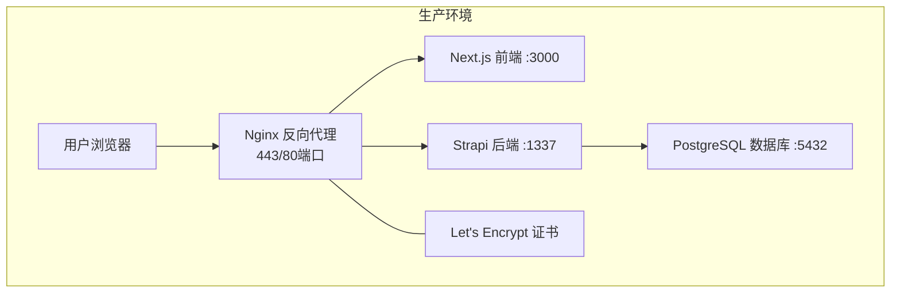
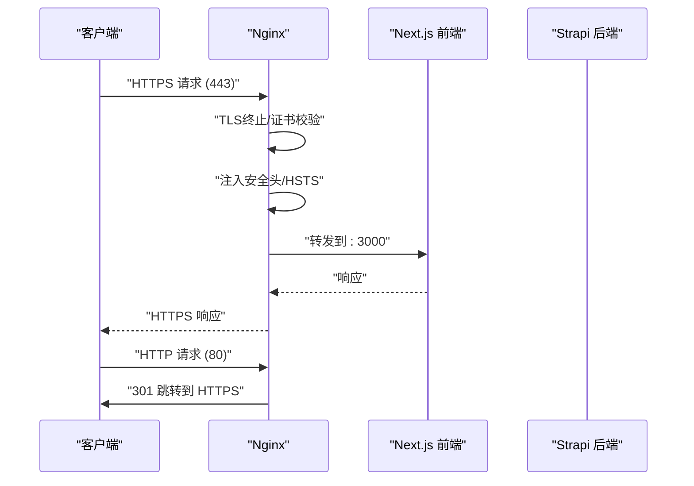
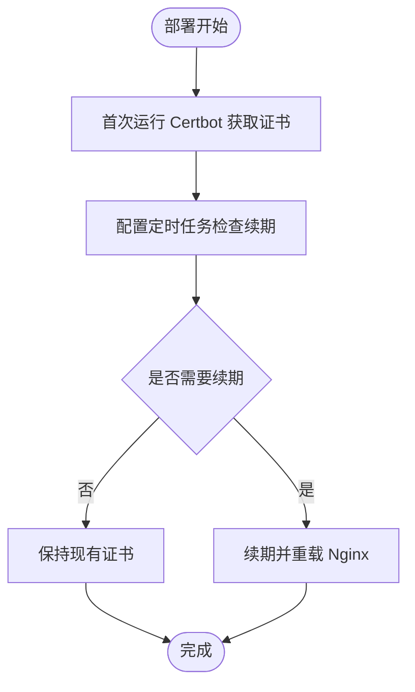
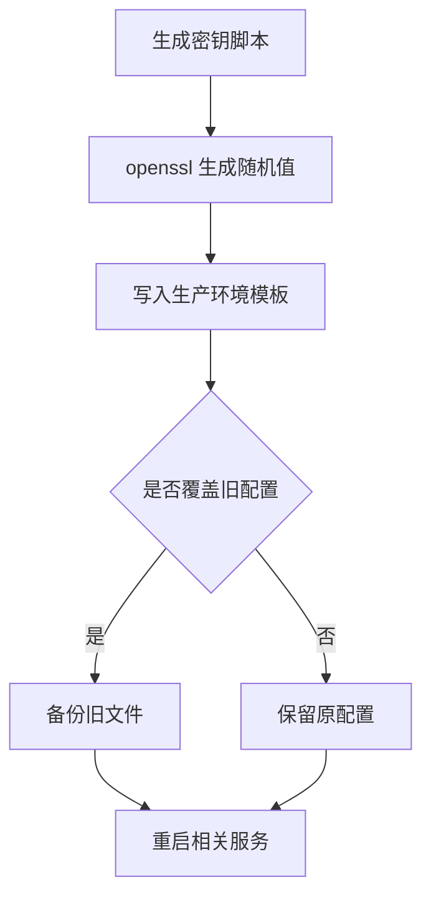
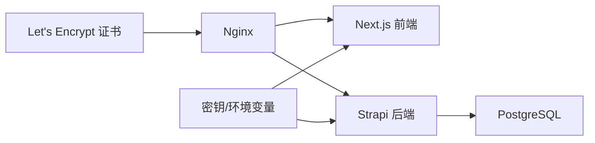

# 安全与SSL管理

<cite>
**本文档引用的文件**
- [DEPLOYMENT.md](file://DEPLOYMENT.md)
- [生产环境分离的部署方案.md](file://生产环境分离的部署方案.md)
- [backend/config/server.ts](file://backend/config/server.ts)
- [backend/.env.example](file://backend/.env.example)
- [frontend/.env.example](file://frontend/.env.example)
- [backend/config/middlewares.ts](file://backend/config/middlewares.ts)
- [backend/config/plugins.ts](file://backend/config/plugins.ts)
- [backend/config/api.ts](file://backend/config/api.ts)
- [frontend/next.config.ts](file://frontend/next.config.ts)
</cite>

## 目录
1. [引言](#引言)
2. [项目结构](#项目结构)
3. [核心组件](#核心组件)
4. [架构总览](#架构总览)
5. [详细组件分析](#详细组件分析)
6. [依赖关系分析](#依赖关系分析)
7. [性能考虑](#性能考虑)
8. [故障排查指南](#故障排查指南)
9. [结论](#结论)
10. [附录](#附录)

## 引言
本文件面向中创智控官网的生产与开发环境，系统化梳理其安全与SSL管理策略，重点覆盖以下方面：
- SSL证书自动化管理：Let's Encrypt证书获取、自动续期与Nginx配置
- 安全头配置：HSTS、X-Frame-Options、X-Content-Type-Options等的作用与落地
- 密钥管理：随机密钥生成、密钥轮换与敏感信息保护
- 跨域资源共享（CORS）：开发与生产环境的差异与最佳实践
- 安全加固：服务器安全配置、防火墙与安全审计建议
- 生产环境的完整安全防护与证书管理能力保障

## 项目结构
项目采用前后端分离与容器化部署，生产环境通过Nginx反向代理统一接入，后端由Strapi提供API，前端由Next.js提供静态页面与动态路由。生产环境的关键安全要素集中在Nginx SSL配置、Let's Encrypt证书管理、Strapi中间件与密钥管理等方面。

图表来源
- [DEPLOYMENT.md](file://DEPLOYMENT.md#L34-L99)

章节来源
- [DEPLOYMENT.md](file://DEPLOYMENT.md#L34-L99)

## 核心组件
- Nginx与SSL：负责TLS终止、证书加载、HTTP到HTTPS跳转、安全头注入与HSTS等
- Let's Encrypt/Certbot：负责证书申请、自动续期与Nginx重载
- Strapi中间件：启用CORS、安全、会话等中间件链
- 密钥与环境变量：集中于后端配置与生产环境模板，确保敏感信息不落库
- 前端Next.js：图片优化与严格模式，配合后端安全策略

章节来源
- [DEPLOYMENT.md](file://DEPLOYMENT.md#L364-L410)
- [backend/config/middlewares.ts](file://backend/config/middlewares.ts#L1-L13)
- [backend/config/server.ts](file://backend/config/server.ts#L1-L8)
- [backend/.env.example](file://backend/.env.example#L1-L15)
- [frontend/next.config.ts](file://frontend/next.config.ts#L1-L39)

## 架构总览
下图展示生产环境的流量与安全控制点，突出Nginx在证书与安全头层面的集中控制，以及后端Strapi的安全中间件链。

图表来源
- [DEPLOYMENT.md](file://DEPLOYMENT.md#L364-L410)

## 详细组件分析

### SSL证书自动化管理（Let's Encrypt + Nginx）
- 证书获取：首次部署通过Certbot Standalone模式申请证书，并将证书放置于Nginx可读目录
- 自动续期：通过定时任务每日检查续期，成功后触发Nginx重载
- Nginx配置要点：
  - 监听80/443端口，HTTP到HTTPS跳转
  - 保留ACME挑战路径以支持Let's Encrypt验证
  - 加载证书与私钥，启用TLSv1.2/1.3与合理密码套件
  - 注入安全头，包括HSTS、X-Frame-Options、X-Content-Type-Options、X-XSS-Protection、Referrer-Policy、Permissions-Policy

图表来源
- [DEPLOYMENT.md](file://DEPLOYMENT.md#L322-L363)
- [DEPLOYMENT.md](file://DEPLOYMENT.md#L364-L410)

章节来源
- [DEPLOYMENT.md](file://DEPLOYMENT.md#L322-L363)
- [DEPLOYMENT.md](file://DEPLOYMENT.md#L364-L410)

### 安全头配置（HSTS、X-Frame-Options、X-Content-Type-Options等）
- HSTS：强制浏览器使用HTTPS，开启includeSubDomains与preload声明
- X-Frame-Options：限制页面被嵌入到框架，降低点击劫持风险
- X-Content-Type-Options：阻止MIME类型嗅探，降低XSS风险
- X-XSS-Protection：启用浏览器内置XSS过滤（部分浏览器已废弃，仍具兼容价值）
- Referrer-Policy：限制Referer信息泄露
- Permissions-Policy：显式声明媒体设备等权限，默认禁用

这些安全头在Nginx站点配置中集中注入，确保全局生效。

章节来源
- [DEPLOYMENT.md](file://DEPLOYMENT.md#L402-L409)

### 密钥管理策略（随机生成、轮换与保护）
- 随机密钥生成：通过脚本调用openssl生成强随机密钥，覆盖数据库密码、APP_KEYS、JWT密钥、加密密钥等
- 密钥轮换：脚本支持备份旧配置，按需覆盖新密钥；建议建立周期性轮换流程
- 敏感信息保护：开发与生产环境的.env文件不提交至仓库；生产环境模板仅包含变量名与占位符
- 后端密钥注入：APP_KEYS通过后端配置注入，确保Strapi应用与会话安全

图表来源
- [DEPLOYMENT.md](file://DEPLOYMENT.md#L416-L498)
- [backend/config/server.ts](file://backend/config/server.ts#L4-L6)
- [backend/.env.example](file://backend/.env.example#L9-L15)

章节来源
- [DEPLOYMENT.md](file://DEPLOYMENT.md#L416-L498)
- [backend/config/server.ts](file://backend/config/server.ts#L4-L6)
- [backend/.env.example](file://backend/.env.example#L9-L15)

### 跨域资源共享（CORS）配置
- 后端中间件：启用strapi::cors中间件，确保API接口在受控范围内跨域访问
- 前端Next.js：通过remotePatterns限制图片来源，结合后端CORS策略，降低供应链与XSS风险
- 开发与生产差异：
  - 开发环境：前端本地开发，CORS与图片来源相对宽松
  - 生产环境：严格限定域名与协议，避免跨域暴露敏感接口

章节来源
- [backend/config/middlewares.ts](file://backend/config/middlewares.ts#L1-L13)
- [frontend/next.config.ts](file://frontend/next.config.ts#L5-L33)

### API与上传安全配置
- API限制：REST默认分页与最大限制，防止暴力拉取
- 上传限制：本地上传提供程序的大小限制，降低资源滥用风险

章节来源
- [backend/config/api.ts](file://backend/config/api.ts#L1-L8)
- [backend/config/plugins.ts](file://backend/config/plugins.ts#L1-L11)

### 前端安全与性能
- 严格模式：提升React与TypeScript运行时稳定性
- 图片优化：白名单远程域名、现代图片格式与响应式尺寸，减少不必要的外链与带宽消耗

章节来源
- [frontend/next.config.ts](file://frontend/next.config.ts#L34-L39)

## 依赖关系分析
- Nginx依赖Let's Encrypt证书与Strapi/Next.js服务
- Strapi依赖PostgreSQL数据库与密钥配置
- 前端Next.js依赖后端API与域名配置
- 密钥与环境变量贯穿后端配置与部署脚本

图表来源
- [DEPLOYMENT.md](file://DEPLOYMENT.md#L364-L410)
- [backend/config/server.ts](file://backend/config/server.ts#L4-L6)

章节来源
- [DEPLOYMENT.md](file://DEPLOYMENT.md#L364-L410)
- [backend/config/server.ts](file://backend/config/server.ts#L4-L6)

## 性能考虑
- Nginx启用HTTP/2与合理的TLS参数，兼顾性能与安全
- 前端图片优化与严格模式有助于提升首屏性能与运行时稳定性
- 后端API分页限制与上传大小限制，避免资源滥用导致的性能下降

## 故障排查指南
- 证书问题：确认ACME挑战路径可访问、续期脚本执行日志、Nginx重载状态
- CORS问题：检查后端CORS中间件与前端remotePatterns配置
- 密钥问题：确认APP_KEYS与JWT密钥正确注入，避免服务重启后认证失效
- 健康检查：利用部署脚本中的健康检查命令验证前后端可用性

章节来源
- [DEPLOYMENT.md](file://DEPLOYMENT.md#L500-L569)
- [DEPLOYMENT.md](file://DEPLOYMENT.md#L587-L631)

## 结论
本项目在生产环境中实现了完善的SSL/TLS与安全头策略，通过Let's Encrypt与Certbot实现证书自动化管理，并在Nginx层面集中注入安全头，显著提升传输层与浏览器侧的安全性。后端通过中间件链与严格的密钥管理策略，配合前端的CORS与图片优化配置，形成从前端到后端、从网络到应用的多层安全防护体系。建议持续执行密钥轮换、证书续期监控与安全审计，确保生产环境长期稳定与安全。

## 附录
- 生产环境部署与证书自动化流程参考：[DEPLOYMENT.md](file://DEPLOYMENT.md#L278-L318)
- 开发/生产环境分离与容器化策略参考：[生产环境分离的部署方案.md](file://生产环境分离的部署方案.md#L1-L116)
- 后端密钥与环境变量模板参考：[backend/.env.example](file://backend/.env.example#L1-L15)
- 前端环境变量模板参考：[frontend/.env.example](file://frontend/.env.example#L1-L2)