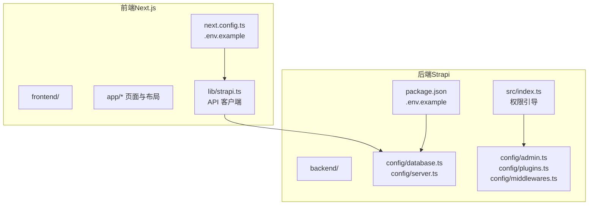
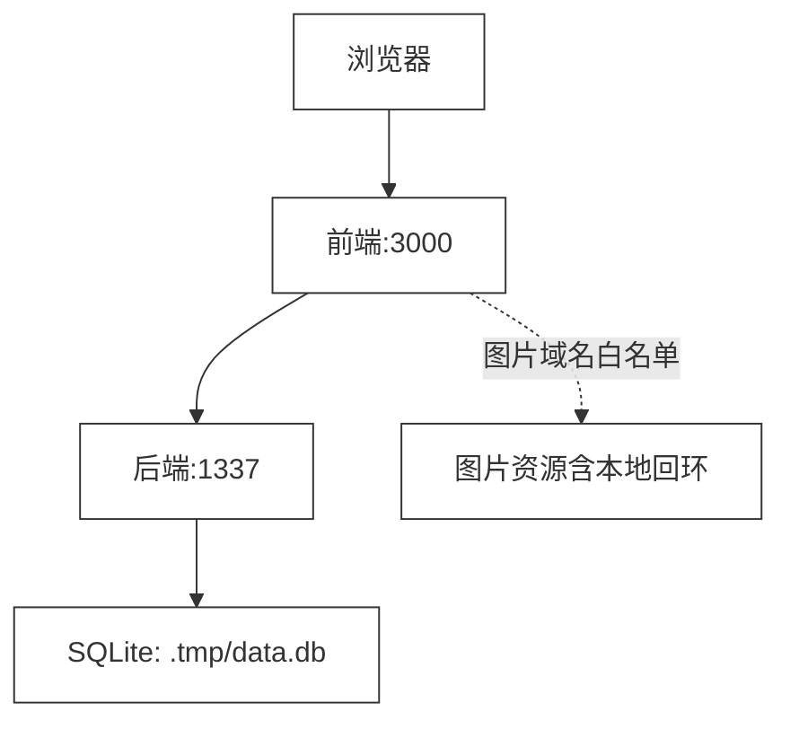
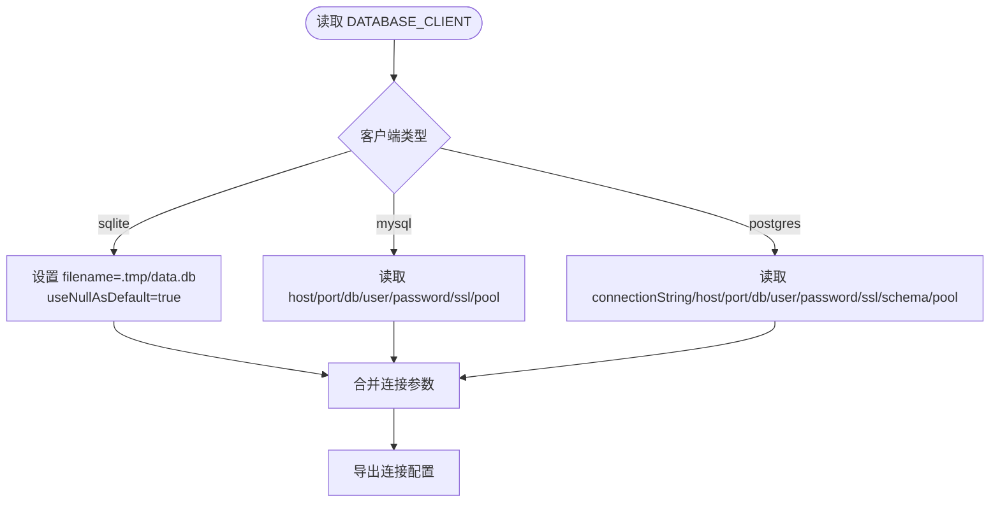
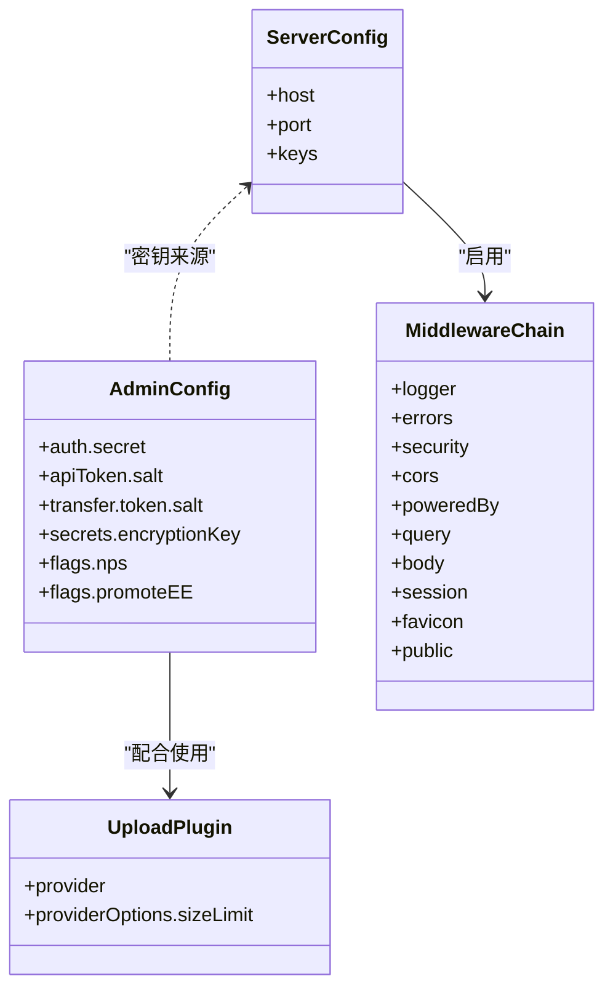
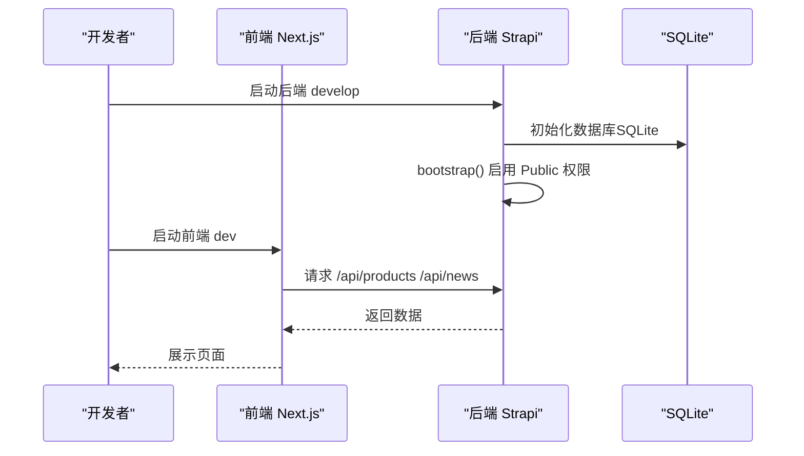
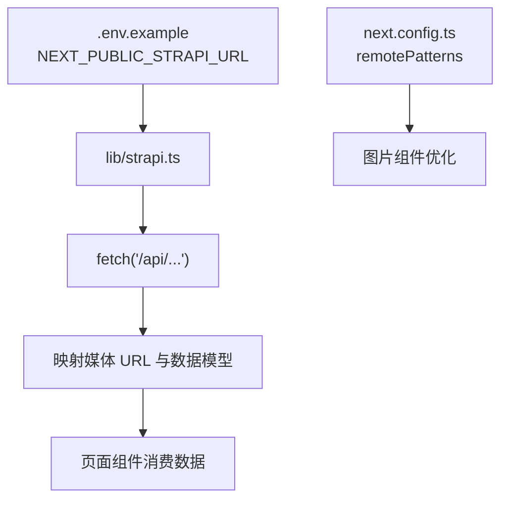
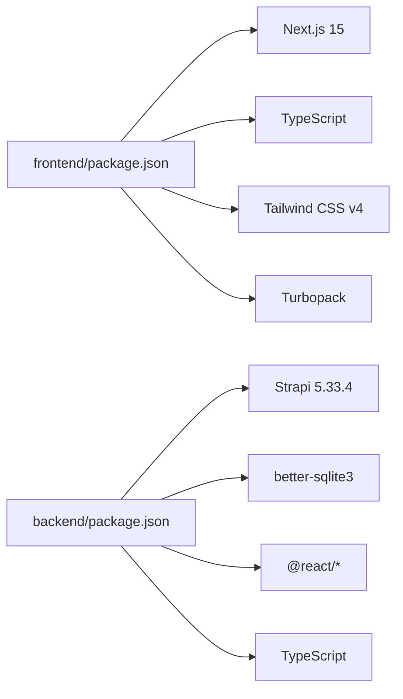

# 开发环境配置

<cite>
**本文引用的文件**
- [README.md](file://README.md)
- [DEPLOYMENT.md](file://DEPLOYMENT.md)
- [backend/.env.example](file://backend/.env.example)
- [frontend/.env.example](file://frontend/.env.example)
- [backend/package.json](file://backend/package.json)
- [frontend/package.json](file://frontend/package.json)
- [backend/config/database.ts](file://backend/config/database.ts)
- [backend/config/server.ts](file://backend/config/server.ts)
- [backend/config/admin.ts](file://backend/config/admin.ts)
- [backend/config/middlewares.ts](file://backend/config/middlewares.ts)
- [backend/config/plugins.ts](file://backend/config/plugins.ts)
- [backend/src/index.ts](file://backend/src/index.ts)
- [frontend/next.config.ts](file://frontend/next.config.ts)
- [frontend/lib/strapi.ts](file://frontend/lib/strapi.ts)
- [frontend/content/site-config.ts](file://frontend/content/site-config.ts)
</cite>

## 目录
1. [简介](#简介)
2. [项目结构](#项目结构)
3. [核心组件](#核心组件)
4. [架构总览](#架构总览)
5. [详细组件分析](#详细组件分析)
6. [依赖分析](#依赖分析)
7. [性能考虑](#性能考虑)
8. [故障排除指南](#故障排除指南)
9. [结论](#结论)
10. [附录](#附录)

## 简介
本文件面向中创智控官网开发团队，提供完整的开发环境配置方案。内容涵盖：
- 开发环境架构设计与组件职责
- SQLite 数据库配置与本地开发服务器启动
- 前端热重载与调试工具设置
- 配置文件结构与环境变量定义
- 开发编排与服务依赖关系
- 常见问题排查与解决方案

目标是帮助团队快速搭建并稳定维护高效的本地开发环境。

## 项目结构
项目采用前后端分离架构：
- 前端：Next.js 15 应用，使用 App Router、Turbopack 开发服务器、TypeScript
- 后端：Strapi 5 CMS，提供 REST API 与 Admin UI，内置 SQLite（可配置其他数据库）

图表来源
- [frontend/next.config.ts](file://frontend/next.config.ts#L1-L39)
- [frontend/lib/strapi.ts](file://frontend/lib/strapi.ts#L1-L155)
- [backend/config/database.ts](file://backend/config/database.ts#L1-L61)
- [backend/config/server.ts](file://backend/config/server.ts#L1-L8)
- [backend/config/admin.ts](file://backend/config/admin.ts#L1-L21)
- [backend/config/plugins.ts](file://backend/config/plugins.ts#L1-L11)
- [backend/config/middlewares.ts](file://backend/config/middlewares.ts#L1-L13)
- [backend/src/index.ts](file://backend/src/index.ts#L1-L65)
- [backend/package.json](file://backend/package.json#L1-L45)
- [frontend/package.json](file://frontend/package.json#L1-L88)

章节来源
- [README.md](file://README.md#L66-L227)

## 核心组件
- 前端 Next.js 应用
  - 开发服务器：Turbopack 加速的 dev 模式
  - 图片优化与远程域名白名单
  - Strapi API 客户端封装
- 后端 Strapi CMS
  - SQLite 默认数据库配置
  - Admin UI 与用户权限插件
  - CORS、中间件与上传插件配置
- 配置与环境变量
  - 前端 .env.example 与 next.config.ts
  - 后端 .env.example 与多处 config 文件

章节来源
- [frontend/package.json](file://frontend/package.json#L6-L11)
- [backend/package.json](file://backend/package.json#L6-L18)
- [frontend/next.config.ts](file://frontend/next.config.ts#L1-L39)
- [frontend/lib/strapi.ts](file://frontend/lib/strapi.ts#L100-L155)
- [backend/config/database.ts](file://backend/config/database.ts#L45-L50)
- [backend/config/admin.ts](file://backend/config/admin.ts#L1-L21)
- [backend/config/plugins.ts](file://backend/config/plugins.ts#L1-L11)
- [backend/config/middlewares.ts](file://backend/config/middlewares.ts#L1-L13)

## 架构总览
开发环境采用“前端本地开发服务器 + 后端 Strapi 本地服务”的组合，二者通过 HTTP 本地回环地址通信；数据库默认使用 SQLite，便于零依赖本地开发。

图表来源
- [frontend/next.config.ts](file://frontend/next.config.ts#L5-L33)
- [backend/config/database.ts](file://backend/config/database.ts#L45-L50)
- [backend/config/server.ts](file://backend/config/server.ts#L1-L8)

章节来源
- [README.md](file://README.md#L349-L354)

## 详细组件分析

### 数据库配置（SQLite）
- 默认客户端：sqlite
- 数据库文件：相对路径 .tmp/data.db
- acquireConnectionTimeout 可调
- 支持 MySQL/PostgreSQL 配置（通过 DATABASE_CLIENT 切换）

图表来源
- [backend/config/database.ts](file://backend/config/database.ts#L3-L61)

章节来源
- [backend/config/database.ts](file://backend/config/database.ts#L1-L61)
- [backend/.env.example](file://backend/.env.example#L3-L4)

### 服务器与安全配置
- 主机与端口：HOST/PORT（默认 0.0.0.0:1337）
- APP_KEYS：应用密钥数组
- Admin/JWT/Token/Encryption 密钥：分别在 config/admin.ts 中读取
- 中间件链：logger/errors/security/cors/query/body/session/favicon/public
- 上传插件：本地 provider，限制大小

图表来源
- [backend/config/server.ts](file://backend/config/server.ts#L1-L8)
- [backend/config/admin.ts](file://backend/config/admin.ts#L1-L21)
- [backend/config/middlewares.ts](file://backend/config/middlewares.ts#L1-L13)
- [backend/config/plugins.ts](file://backend/config/plugins.ts#L1-L11)

章节来源
- [backend/config/server.ts](file://backend/config/server.ts#L1-L8)
- [backend/config/admin.ts](file://backend/config/admin.ts#L1-L21)
- [backend/config/middlewares.ts](file://backend/config/middlewares.ts#L1-L13)
- [backend/config/plugins.ts](file://backend/config/plugins.ts#L1-L11)

### 启动流程与权限引导
- 后端启动：npm run develop（或 strapi develop）
- 前端启动：pnpm dev（Turbopack）
- 后端引导逻辑：自动为 Public 角色启用 Product/News 的 find/findOne 权限

图表来源
- [backend/src/index.ts](file://backend/src/index.ts#L19-L63)
- [backend/package.json](file://backend/package.json#L6-L11)
- [frontend/package.json](file://frontend/package.json#L6-L11)

章节来源
- [backend/src/index.ts](file://backend/src/index.ts#L1-L65)
- [backend/package.json](file://backend/package.json#L6-L11)
- [frontend/package.json](file://frontend/package.json#L6-L11)

### 前端 API 客户端与图片优化
- NEXT_PUBLIC_STRAPI_URL：前端通过该环境变量指向后端 API
- next.config.ts：配置图片远程域名白名单（localhost/127.0.0.1/192.168.0.2:1337）
- lib/strapi.ts：封装 fetch、映射媒体 URL、提供产品/新闻数据接口

图表来源
- [frontend/.env.example](file://frontend/.env.example#L1-L2)
- [frontend/lib/strapi.ts](file://frontend/lib/strapi.ts#L100-L155)
- [frontend/next.config.ts](file://frontend/next.config.ts#L5-L33)

章节来源
- [frontend/.env.example](file://frontend/.env.example#L1-L2)
- [frontend/lib/strapi.ts](file://frontend/lib/strapi.ts#L1-L155)
- [frontend/next.config.ts](file://frontend/next.config.ts#L1-L39)

## 依赖分析
- 前端依赖
  - Next.js 15、React 18、TypeScript、Tailwind CSS v4、Turbopack
  - 通过 pnpm 管理
- 后端依赖
  - Strapi 5.33.4、better-sqlite3、React、styled-components、TypeScript
  - 通过 npm 管理
- 开发工具链
  - Node.js 版本范围约束（>=20 <=24）
  - pnpm（前端）与 npm（后端）

图表来源
- [frontend/package.json](file://frontend/package.json#L1-L88)
- [backend/package.json](file://backend/package.json#L1-L45)

章节来源
- [frontend/package.json](file://frontend/package.json#L1-L88)
- [backend/package.json](file://backend/package.json#L1-L45)
- [README.md](file://README.md#L5-L64)

## 性能考虑
- Turbopack 开发服务器显著提升前端热重载速度
- SQLite 本地开发避免网络延迟与外部依赖
- 图片优化：现代格式（AVIF/WebP）、响应式尺寸、远程域名白名单
- 合理设置数据库连接超时与池大小（根据 config/database.ts）

章节来源
- [frontend/package.json](file://frontend/package.json#L6-L11)
- [frontend/next.config.ts](file://frontend/next.config.ts#L5-L33)
- [backend/config/database.ts](file://backend/config/database.ts#L53-L59)

## 故障排除指南
- 启动顺序问题
  - 必须先启动后端（npm run develop），再启动前端（pnpm dev）
  - 若前端无法访问 API，检查 NEXT_PUBLIC_STRAPI_URL 是否指向后端地址
- 数据库连接问题
  - SQLite 文件路径：确认 .tmp/data.db 存在且可写
  - 如需重置数据库，删除 .tmp/data.db 后重启后端
- API 通信问题
  - 确认后端已启用 Public 角色的 Product/News find/findOne 权限（bootstrap 已自动处理）
  - 检查 CORS 与中间件链（config/middlewares.ts）
- 图片加载失败
  - 确认 next.config.ts 的 remotePatterns 已包含后端地址（localhost/127.0.0.1/192.168.0.2:1337）
- 环境变量未生效
  - 前端：复制 .env.example 为 .env，并设置 NEXT_PUBLIC_STRAPI_URL
  - 后端：复制 .env.example 为 .env，并设置 HOST/PORT/DATABASE_* 与密钥

章节来源
- [README.md](file://README.md#L349-L354)
- [backend/.env.example](file://backend/.env.example#L1-L15)
- [frontend/.env.example](file://frontend/.env.example#L1-L2)
- [backend/config/middlewares.ts](file://backend/config/middlewares.ts#L1-L13)
- [backend/src/index.ts](file://backend/src/index.ts#L19-L63)
- [frontend/next.config.ts](file://frontend/next.config.ts#L5-L33)

## 结论
通过上述配置与流程，开发团队可在本地快速搭建中创智控官网的前后端开发环境。默认使用 SQLite 与本地回环地址，简化了依赖与网络配置；借助 Turbopack 与 Strapi 的 Admin UI，可获得高效的开发体验与内容管理能力。遇到问题时，可依据本指南逐项排查启动顺序、数据库连接、API 权限与图片配置等关键环节。

## 附录

### 环境变量与配置文件清单
- 前端
  - .env.example：NEXT_PUBLIC_STRAPI_URL
  - next.config.ts：图片远程域名白名单、严格模式
- 后端
  - .env.example：HOST、PORT、DATABASE_CLIENT、DATABASE_FILENAME、密钥等
  - config/database.ts：数据库客户端与连接参数
  - config/server.ts：主机与端口、应用密钥
  - config/admin.ts：Admin/JWT/Token/Encryption 密钥
  - config/middlewares.ts：中间件链
  - config/plugins.ts：上传插件配置

章节来源
- [frontend/.env.example](file://frontend/.env.example#L1-L2)
- [frontend/next.config.ts](file://frontend/next.config.ts#L1-L39)
- [backend/.env.example](file://backend/.env.example#L1-L15)
- [backend/config/database.ts](file://backend/config/database.ts#L1-L61)
- [backend/config/server.ts](file://backend/config/server.ts#L1-L8)
- [backend/config/admin.ts](file://backend/config/admin.ts#L1-L21)
- [backend/config/middlewares.ts](file://backend/config/middlewares.ts#L1-L13)
- [backend/config/plugins.ts](file://backend/config/plugins.ts#L1-L11)