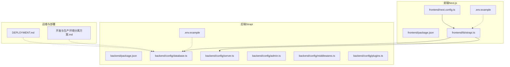
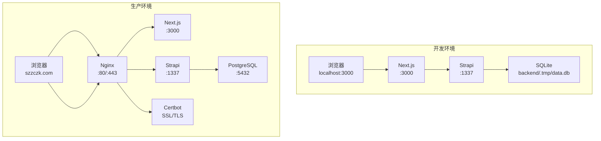
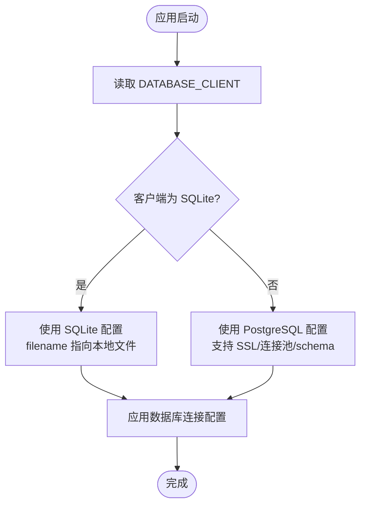
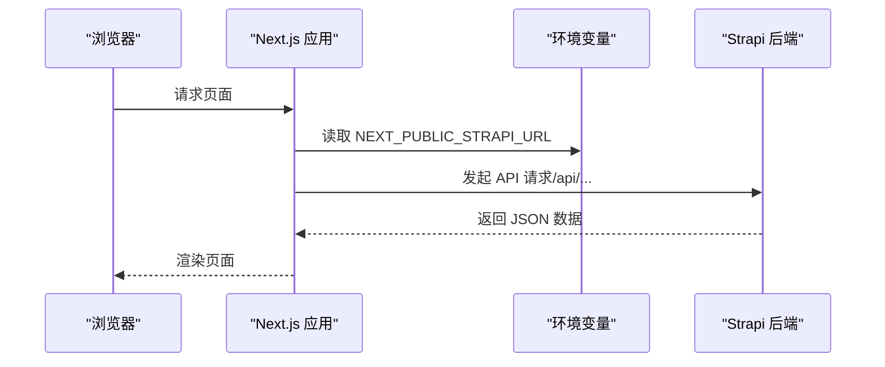
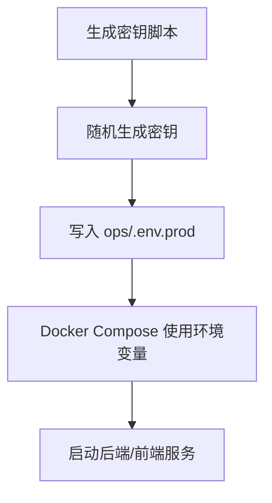
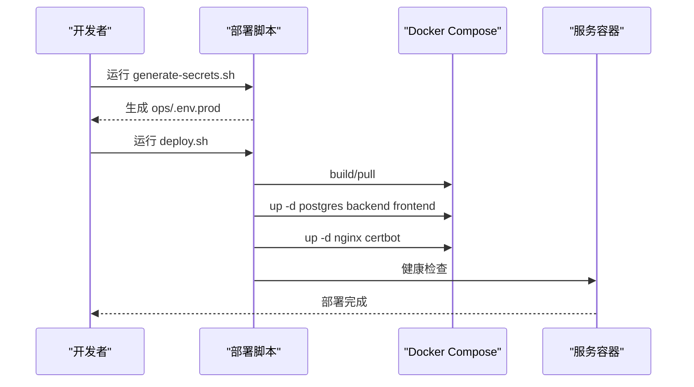
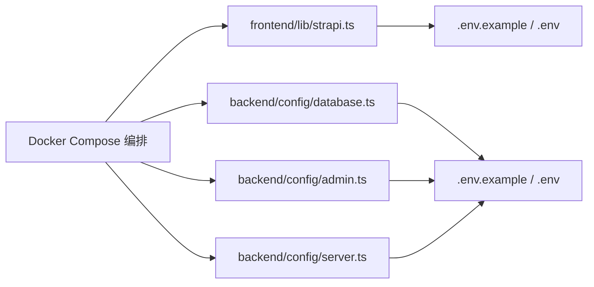

# 环境分离策略

<cite>
**本文引用的文件**
- [backend/.env.example](file://backend/.env.example)
- [frontend/.env.example](file://frontend/.env.example)
- [backend/config/database.ts](file://backend/config/database.ts)
- [backend/config/server.ts](file://backend/config/server.ts)
- [backend/config/admin.ts](file://backend/config/admin.ts)
- [backend/config/middlewares.ts](file://backend/config/middlewares.ts)
- [backend/config/plugins.ts](file://backend/config/plugins.ts)
- [backend/package.json](file://backend/package.json)
- [frontend/package.json](file://frontend/package.json)
- [frontend/lib/strapi.ts](file://frontend/lib/strapi.ts)
- [frontend/next.config.ts](file://frontend/next.config.ts)
- [DEPLOYMENT.md](file://DEPLOYMENT.md)
- [开发与生产环境分离方案.md](file://开发与生产环境分离方案.md)
</cite>

## 目录
1. [引言](#引言)
2. [项目结构](#项目结构)
3. [核心组件](#核心组件)
4. [架构总览](#架构总览)
5. [详细组件分析](#详细组件分析)
6. [依赖关系分析](#依赖关系分析)
7. [性能考量](#性能考量)
8. [故障排查指南](#故障排查指南)
9. [结论](#结论)
10. [附录](#附录)

## 引言
本文件面向中创智控官网的开发与运维团队，系统化阐述多环境管理方案，明确开发、测试与生产三类环境的配置差异与切换机制。重点覆盖数据库类型选择（SQLite vs PostgreSQL）、API 端点配置、安全设置、环境变量管理策略（敏感信息保护、配置文件版本控制、环境切换）、配置文件分层架构（模板/示例/实际部署文件），以及环境切换的实操步骤（开发启动、测试验证、生产部署）。目标是帮助团队在不同环境中正确、安全地配置与运行应用。

## 项目结构
项目采用前后端分离与容器化编排的组织方式：
- 后端（Strapi）位于 backend 目录，包含配置文件、API 路由与服务、数据库与中间件等。
- 前端（Next.js）位于 frontend 目录，包含页面、组件、类型定义与静态资源。
- 运维与部署相关脚本与模板位于 ops 目录（如示例文档中所述），包含环境变量模板、Dockerfile、Compose 编排与部署脚本等。

图表来源
- [frontend/package.json](file://frontend/package.json#L1-L88)
- [frontend/lib/strapi.ts](file://frontend/lib/strapi.ts#L1-L155)
- [frontend/next.config.ts](file://frontend/next.config.ts#L1-L39)
- [backend/package.json](file://backend/package.json#L1-L45)
- [backend/config/database.ts](file://backend/config/database.ts#L1-L61)
- [backend/config/server.ts](file://backend/config/server.ts#L1-L8)
- [backend/config/admin.ts](file://backend/config/admin.ts#L1-L21)
- [backend/config/middlewares.ts](file://backend/config/middlewares.ts#L1-L13)
- [backend/config/plugins.ts](file://backend/config/plugins.ts#L1-L11)
- [DEPLOYMENT.md](file://DEPLOYMENT.md#L1-L1366)
- [开发与生产环境分离方案.md](file://开发与生产环境分离方案.md#L1-L2173)

章节来源
- [DEPLOYMENT.md](file://DEPLOYMENT.md#L101-L144)
- [开发与生产环境分离方案.md](file://开发与生产环境分离方案.md#L141-L191)

## 核心组件
- 数据库配置：后端通过配置文件按环境选择数据库客户端（SQLite/PostgreSQL），并支持连接池、SSL、schema 等参数。
- 服务器配置：主机、端口与应用密钥等通过环境变量注入。
- 安全配置：Admin JWT 密钥、API Token 盐、Transfer Token 盐、加密密钥等敏感信息通过环境变量注入。
- 前端 API 端点：前端通过 NEXT_PUBLIC_STRAPI_URL 指向后端 API，开发与生产分别指向本地或线上域名。
- 中间件与插件：统一的安全、CORS、上传等中间件与插件配置，保证跨环境一致性。

章节来源
- [backend/config/database.ts](file://backend/config/database.ts#L1-L61)
- [backend/config/server.ts](file://backend/config/server.ts#L1-L8)
- [backend/config/admin.ts](file://backend/config/admin.ts#L1-L21)
- [frontend/lib/strapi.ts](file://frontend/lib/strapi.ts#L1-L155)
- [backend/config/middlewares.ts](file://backend/config/middlewares.ts#L1-L13)
- [backend/config/plugins.ts](file://backend/config/plugins.ts#L1-L11)

## 架构总览
下图展示了开发与生产两套环境的网络与数据流差异，以及容器化部署与反向代理的交互关系。

图表来源
- [DEPLOYMENT.md](file://DEPLOYMENT.md#L38-L99)
- [开发与生产环境分离方案.md](file://开发与生产环境分离方案.md#L90-L211)

## 详细组件分析

### 数据库配置与环境差异
- 开发环境：默认使用 SQLite，通过 DATABASE_CLIENT=sqlite 与 DATABASE_FILENAME 指定本地文件路径，适合快速启动与本地开发。
- 生产环境：使用 PostgreSQL，通过 DATABASE_CLIENT=postgres 与 DATABASE_URL 或主机/端口/凭据等参数连接，支持 SSL、连接池与 schema。
- 配置加载：数据库配置读取环境变量，支持 SSL 参数与连接超时等高级选项。

图表来源
- [backend/config/database.ts](file://backend/config/database.ts#L3-L59)

章节来源
- [backend/config/database.ts](file://backend/config/database.ts#L1-L61)
- [DEPLOYMENT.md](file://DEPLOYMENT.md#L17-L26)
- [开发与生产环境分离方案.md](file://开发与生产环境分离方案.md#L10-L13)

### API 端点与前端集成
- 前端通过 NEXT_PUBLIC_STRAPI_URL 指定后端 API 地址，开发环境默认 http://localhost:1337，生产环境指向 https 域名。
- 前端通过 fetchStrapi 统一请求后端接口，并进行错误处理与响应解析。
- Next.js 配置允许访问后端服务（localhost/127.0.0.1/192.168.0.2:1337），满足开发联调需求。

图表来源
- [frontend/lib/strapi.ts](file://frontend/lib/strapi.ts#L100-L111)
- [frontend/next.config.ts](file://frontend/next.config.ts#L5-L33)
- [frontend/.env.example](file://frontend/.env.example#L1-L2)

章节来源
- [frontend/lib/strapi.ts](file://frontend/lib/strapi.ts#L1-L155)
- [frontend/next.config.ts](file://frontend/next.config.ts#L1-L39)
- [frontend/.env.example](file://frontend/.env.example#L1-L2)

### 安全设置与密钥管理
- 后端安全相关密钥通过环境变量注入，包括 ADMIN_JWT_SECRET、API_TOKEN_SALT、TRANSFER_TOKEN_SALT、ENCRYPTION_KEY 等。
- 生产环境密钥通过脚本自动生成并写入 ops/.env.prod，避免硬编码与提交到仓库。
- 建议：生产环境使用 HTTPS、强制跳转、安全头配置与证书自动化管理。

图表来源
- [DEPLOYMENT.md](file://DEPLOYMENT.md#L418-L498)
- [开发与生产环境分离方案.md](file://开发与生产环境分离方案.md#L624-L706)

章节来源
- [backend/config/admin.ts](file://backend/config/admin.ts#L1-L21)
- [DEPLOYMENT.md](file://DEPLOYMENT.md#L164-L206)
- [开发与生产环境分离方案.md](file://开发与生产环境分离方案.md#L228-L287)

### 中间件与插件配置
- 中间件顺序与功能：logger、errors、security、cors、poweredBy、query、body、session、favicon、public，保障日志、安全、CORS 与静态资源服务能力。
- 上传插件默认使用本地存储，可按需扩展为云存储。

章节来源
- [backend/config/middlewares.ts](file://backend/config/middlewares.ts#L1-L13)
- [backend/config/plugins.ts](file://backend/config/plugins.ts#L1-L11)

### 环境变量管理策略
- 配置文件分层：
  - backend/.env.example：开发示例模板（不含敏感信息）
  - frontend/.env.example：前端示例模板
  - ops/.env.prod.example：生产示例模板
  - ops/.env.dev.example：开发示例模板
  - ops/.env.prod：生产环境变量（不提交）
- 敏感信息保护：密钥与数据库凭据通过脚本生成并写入 ops/.env.prod，不在仓库中保存真实值。
- 版本控制：.gitignore 排除 .env、.env.*、ops/.env.prod 等敏感文件。
- 环境切换：通过 Docker Compose 读取对应环境变量文件，实现开发/生产环境切换。

章节来源
- [DEPLOYMENT.md](file://DEPLOYMENT.md#L148-L222)
- [开发与生产环境分离方案.md](file://开发与生产环境分离方案.md#L214-L288)
- [backend/.env.example](file://backend/.env.example#L1-L15)
- [frontend/.env.example](file://frontend/.env.example#L1-L2)

### 环境切换指南
- 开发环境启动：
  - 使用 ops/dev.sh 启动 Docker Compose 开发编排，后端默认使用 SQLite，前端访问 http://localhost:1337。
- 测试环境验证：
  - 通过 curl 或浏览器访问后端与前端健康检查端点，确认服务可用。
- 生产环境部署：
  - 生成生产密钥与环境变量（ops/generate-secrets.sh），构建镜像并启动基础服务，初始化/续期证书，最后进行健康检查。

图表来源
- [DEPLOYMENT.md](file://DEPLOYMENT.md#L278-L318)
- [开发与生产环境分离方案.md](file://开发与生产环境分离方案.md#L407-L435)

章节来源
- [DEPLOYMENT.md](file://DEPLOYMENT.md#L278-L318)
- [开发与生产环境分离方案.md](file://开发与生产环境分离方案.md#L571-L583)

## 依赖关系分析
- 前端依赖后端 API，通过 NEXT_PUBLIC_STRAPI_URL 注入；后端依赖数据库配置与安全密钥。
- Docker Compose 将前端、后端、数据库与 Nginx/Certbot 组织为统一编排，实现环境隔离与服务发现。
- 中间件与插件配置在后端层面统一，保证跨环境一致的安全与功能边界。

图表来源
- [frontend/lib/strapi.ts](file://frontend/lib/strapi.ts#L4-L100)
- [backend/config/database.ts](file://backend/config/database.ts#L3-L59)
- [backend/config/admin.ts](file://backend/config/admin.ts#L1-L21)
- [backend/config/server.ts](file://backend/config/server.ts#L1-L8)
- [DEPLOYMENT.md](file://DEPLOYMENT.md#L101-L144)

章节来源
- [frontend/package.json](file://frontend/package.json#L1-L88)
- [backend/package.json](file://backend/package.json#L1-L45)

## 性能考量
- 构建策略：采用“部署时构建”与多阶段构建，减小镜像体积、提升安全性与构建效率。
- 连接池与超时：数据库配置支持连接池与连接超时，有助于在高并发场景下稳定运行。
- 前端图片优化：Next.js 图片优化与现代图片格式支持，提升首屏性能。
- 健康检查与日志轮转：容器健康检查与日志轮转策略，保障生产稳定性与可观测性。

章节来源
- [DEPLOYMENT.md](file://DEPLOYMENT.md#L225-L276)
- [开发与生产环境分离方案.md](file://开发与生产环境分离方案.md#L291-L457)
- [backend/config/database.ts](file://backend/config/database.ts#L53-L59)
- [frontend/next.config.ts](file://frontend/next.config.ts#L5-L33)
- [DEPLOYMENT.md](file://DEPLOYMENT.md#L587-L630)

## 故障排查指南
- 健康检查：通过 curl 访问 /healthz 端点验证前端与后端可用性。
- 日志查看：使用 docker compose logs 查看各服务日志，定位异常。
- 证书问题：确认 Certbot 证书存在与续期任务正常，必要时重新初始化证书。
- 环境变量：核对 ops/.env.prod 与 .env 文件是否正确加载，避免密钥缺失导致认证失败。

章节来源
- [DEPLOYMENT.md](file://DEPLOYMENT.md#L589-L630)
- [开发与生产环境分离方案.md](file://开发与生产环境分离方案.md#L795-L847)

## 结论
本方案通过清晰的配置分层、严格的敏感信息保护与自动化脚本，实现了开发、测试与生产环境的高效隔离与切换。建议团队在日常开发中遵循“示例模板 + 环境变量 + Docker Compose”的约定，确保不同环境的一致性与安全性，并结合健康检查与日志策略持续优化运行质量。

## 附录
- 环境变量清单与用途参考：
  - 开发/生产示例模板与变量说明见开发与生产环境分离方案。
  - 生产环境密钥生成与部署脚本见 DEPLOYMENT 文档。
- 目录结构与编排文件参考：
  - 运维与部署目录结构、Docker Compose 编排与 Nginx 配置详见 DEPLOYMENT 与开发与生产环境分离方案。

章节来源
- [DEPLOYMENT.md](file://DEPLOYMENT.md#L101-L144)
- [开发与生产环境分离方案.md](file://开发与生产环境分离方案.md#L141-L191)