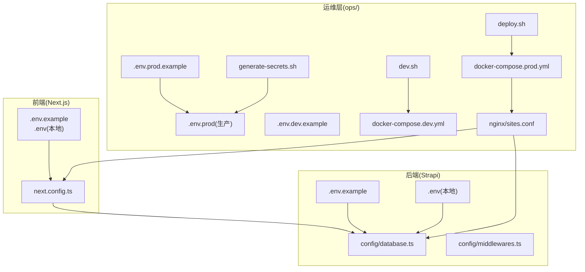
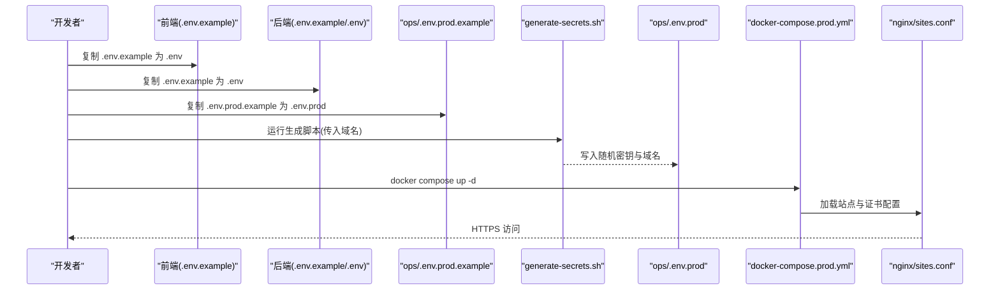
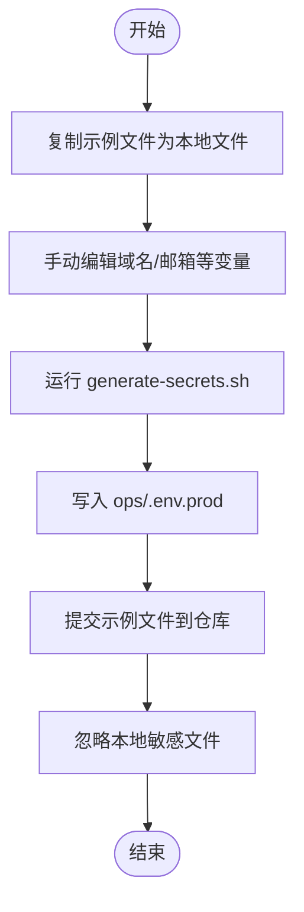
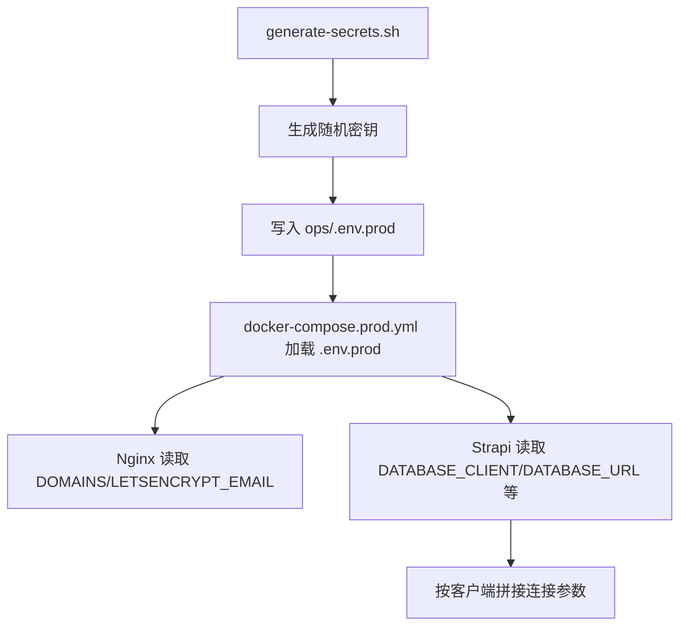
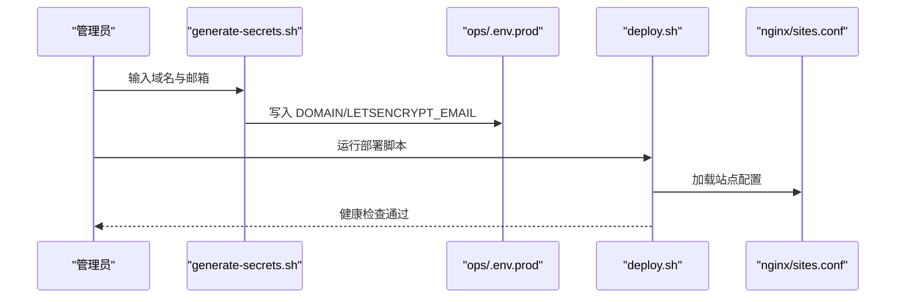
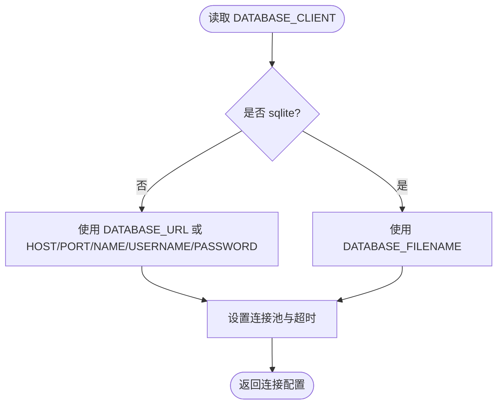
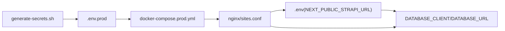

# 环境变量管理

<cite>
**本文档引用的文件**
- [backend/.env.example](file://backend/.env.example)
- [frontend/.env.example](file://frontend/.env.example)
- [DEPLOYMENT.md](file://DEPLOYMENT.md)
- [开发与生产环境分离方案.md](file://开发与生产环境分离方案.md)
- [生产环境分离的部署方案.md](file://生产环境分离的部署方案.md)
- [backend/config/database.ts](file://backend/config/database.ts)
- [backend/config/middlewares.ts](file://backend/config/middlewares.ts)
- [backend/package.json](file://backend/package.json)
- [frontend/package.json](file://frontend/package.json)
- [ops/generate-secrets.sh](file://ops/generate-secrets.sh)
- [ops/deploy.sh](file://ops/deploy.sh)
- [ops/dev.sh](file://ops/dev.sh)
- [ops/docker/docker-compose.prod.yml](file://ops/docker/docker-compose.prod.yml)
- [ops/docker/docker-compose.dev.yml](file://ops/docker/docker-compose.dev.yml)
- [ops/nginx/sites.conf](file://ops/nginx/sites.conf)
- [ops/backups/backup.sh](file://ops/backups/backup.sh)
- [ops/backups/restore.sh](file://ops/backups/restore.sh)
- [ops/backups/retention.sh](file://ops/backups/retention.sh)
</cite>

## 目录
1. [简介](#简介)
2. [项目结构](#项目结构)
3. [核心组件](#核心组件)
4. [架构总览](#架构总览)
5. [详细组件分析](#详细组件分析)
6. [依赖关系分析](#依赖关系分析)
7. [性能考虑](#性能考虑)
8. [故障排查指南](#故障排查指南)
9. [结论](#结论)
10. [附录](#附录)

## 简介
本文件系统化梳理中创智控官网项目在 Strapi + Next.js + Docker Compose 架构下的环境变量管理体系，涵盖变量分类、文件组织、生成与加载机制、安全策略与最佳实践，帮助开发与运维团队安全高效地管理各环境配置。

## 项目结构
项目采用前后端分离与环境分层的配置策略：
- 前端 Next.js：通过 NEXT_PUBLIC_STRAPI_URL 指向后端 API 地址
- 后端 Strapi：通过 DATABASE_CLIENT 选择 SQLite（开发）或 PostgreSQL（生产），并通过 DATABASE_URL 或各字段组合连接数据库
- 运维层（ops/）：集中管理生产环境变量模板与生成脚本，避免敏感信息进入代码仓库

**图表来源**
- [DEPLOYMENT.md](file://DEPLOYMENT.md#L101-L144)
- [开发与生产环境分离方案.md](file://开发与生产环境分离方案.md#L141-L191)
- [backend/config/database.ts](file://backend/config/database.ts#L1-L61)
- [backend/config/middlewares.ts](file://backend/config/middlewares.ts#L1-L13)

**章节来源**
- [DEPLOYMENT.md](file://DEPLOYMENT.md#L101-L144)
- [开发与生产环境分离方案.md](file://开发与生产环境分离方案.md#L141-L191)

## 核心组件
- 环境变量文件分层与提交策略
  - 开发环境：.env（本地，不提交）、.env.example（模板，提交）
  - 生产环境：.env.prod（本地，不提交）、.env.prod.example（模板，提交）
  - 运维脚本：generate-secrets.sh 自动生成密钥并写入 .env.prod
- 变量分类与作用
  - 自动生成的密钥变量：用于 Strapi 与数据库的强安全参数
  - 手动定义的配置变量：域名、邮件等运营信息
- 加载与验证
  - Strapi 通过 config/database.ts 动态读取 DATABASE_CLIENT 并按客户端拼接连接参数
  - Nginx 通过 DOMAINS/LETSENCRYPT_EMAIL 控制证书与站点配置

**章节来源**
- [DEPLOYMENT.md](file://DEPLOYMENT.md#L148-L179)
- [backend/config/database.ts](file://backend/config/database.ts#L1-L61)
- [ops/generate-secrets.sh](file://ops/generate-secrets.sh#L418-L498)

## 架构总览
下图展示环境变量在开发与生产环境中的流转与加载：

**图表来源**
- [DEPLOYMENT.md](file://DEPLOYMENT.md#L278-L318)
- [ops/generate-secrets.sh](file://ops/generate-secrets.sh#L418-L498)
- [ops/docker/docker-compose.prod.yml](file://ops/docker/docker-compose.prod.yml)

## 详细组件分析

### 组件A：环境变量文件组织与版本控制策略
- 文件分层与提交策略
  - 开发：.env（本地）、.env.example（模板，提交）
  - 生产：.env.prod（本地）、.env.prod.example（模板，提交）
  - 运维：.env.dev.example（开发模板）、generate-secrets.sh（生成脚本）
- 版本控制策略
  - .env、.env.*、ops/.env.prod、ops/.secrets* 等敏感文件均加入 .gitignore
  - 示例文件与脚本提交到仓库，确保团队可复用

**图表来源**
- [DEPLOYMENT.md](file://DEPLOYMENT.md#L148-L161)
- [开发与生产环境分离方案.md](file://开发与生产环境分离方案.md#L214-L227)

**章节来源**
- [DEPLOYMENT.md](file://DEPLOYMENT.md#L148-L161)
- [开发与生产环境分离方案.md](file://开发与生产环境分离方案.md#L214-L227)

### 组件B：自动生成的密钥变量与加载机制
- 自动变量（8个）
  - 数据库密码、Strapi 应用密钥（4个）、API 令牌盐、Admin JWT 密钥、Transfer 令牌盐、JWT 密钥、加密密钥
- 生成与加载
  - generate-secrets.sh 使用 openssl 生成随机十六进制字符串，写入 ops/.env.prod
  - Strapi config/database.ts 依据 DATABASE_CLIENT 选择连接方式（sqlite/postgres），postgres 优先使用 DATABASE_URL；sqlite 使用 filename
  - Nginx 通过 DOMAINS/LETSENCRYPT_EMAIL 配置站点与证书

**图表来源**
- [ops/generate-secrets.sh](file://ops/generate-secrets.sh#L418-L498)
- [ops/docker/docker-compose.prod.yml](file://ops/docker/docker-compose.prod.yml)
- [backend/config/database.ts](file://backend/config/database.ts#L25-L51)
- [ops/nginx/sites.conf](file://ops/nginx/sites.conf#L366-L410)

**章节来源**
- [DEPLOYMENT.md](file://DEPLOYMENT.md#L162-L179)
- [ops/generate-secrets.sh](file://ops/generate-secrets.sh#L418-L498)
- [backend/config/database.ts](file://backend/config/database.ts#L1-L61)

### 组件C：手动定义的配置变量与域名管理
- 手动变量（2个）
  - DOMAIN（主域名）、LETSENCRYPT_EMAIL（证书通知邮箱）
- 配置与验证
  - 生成脚本要求输入域名与邮箱，写入 ops/.env.prod
  - 部署脚本检查证书存在性，健康检查验证站点可用性
  - Nginx 配置基于 DOMAINS 设置 server_name 并启用安全头

**图表来源**
- [ops/generate-secrets.sh](file://ops/generate-secrets.sh#L418-L498)
- [ops/deploy.sh](file://ops/deploy.sh#L500-L569)
- [ops/nginx/sites.conf](file://ops/nginx/sites.conf#L366-L410)

**章节来源**
- [DEPLOYMENT.md](file://DEPLOYMENT.md#L175-L179)
- [ops/deploy.sh](file://ops/deploy.sh#L500-L569)

### 组件D：数据库连接配置与环境适配
- 开发环境：DATABASE_CLIENT=sqlite，使用 DATABASE_FILENAME 指定本地数据库文件
- 生产环境：DATABASE_CLIENT=postgres，优先使用 DATABASE_URL；也可分别设置 HOST/PORT/NAME/USERNAME/PASSWORD
- 连接池与超时：通过 DATABASE_POOL_MIN/MAX 与 DATABASE_CONNECTION_TIMEOUT 控制

**图表来源**
- [backend/config/database.ts](file://backend/config/database.ts#L3-L61)

**章节来源**
- [backend/config/database.ts](file://backend/config/database.ts#L1-L61)

### 组件E：前端环境变量与跨域策略
- 前端 .env.example 中包含 NEXT_PUBLIC_STRAPI_URL，用于在浏览器端发起 API 请求
- 后端中间件包含 CORS，确保跨域请求安全可控

**章节来源**
- [frontend/.env.example](file://frontend/.env.example#L1-L2)
- [backend/config/middlewares.ts](file://backend/config/middlewares.ts#L1-L13)

## 依赖关系分析
- 前端依赖后端 API 地址（NEXT_PUBLIC_STRAPI_URL）
- 后端依赖数据库客户端与连接参数（DATABASE_CLIENT/DATABASE_URL 等）
- 运维脚本依赖 openssl 生成密钥，docker-compose 读取 .env.prod
- Nginx 依赖 DOMAINS/LETSENCRYPT_EMAIL 配置站点与证书

**图表来源**
- [frontend/.env.example](file://frontend/.env.example#L1-L2)
- [backend/config/database.ts](file://backend/config/database.ts#L25-L51)
- [ops/generate-secrets.sh](file://ops/generate-secrets.sh#L418-L498)
- [ops/docker/docker-compose.prod.yml](file://ops/docker/docker-compose.prod.yml)
- [ops/nginx/sites.conf](file://ops/nginx/sites.conf#L366-L410)

**章节来源**
- [DEPLOYMENT.md](file://DEPLOYMENT.md#L148-L179)

## 性能考虑
- 构建与部署
  - 采用“部署时构建”策略，避免构建产物提交，减小镜像体积并提升安全性
  - 多阶段构建减少最终镜像大小，使用生产依赖安装降低运行时开销
- 数据库连接
  - 合理设置连接池（min/max）与超时，避免资源争用
- 健康检查
  - 容器健康检查与自动重启机制保障服务可用性

[本节为通用指导，无需具体文件分析]

## 故障排查指南
- 证书问题
  - 确认 DOMAINS 与 LETSENCRYPT_EMAIL 正确，检查 certbot 容器日志与续期任务
- 数据库连接失败
  - 核对 DATABASE_CLIENT 与 DATABASE_URL/主机端口/凭据，确认容器网络连通
- 域名解析与 Nginx 配置
  - 检查 server_name 与站点配置，确认 DNS 解析生效
- 部署脚本错误
  - 检查 .env.prod 是否存在，确认域名与邮箱已正确写入

**章节来源**
- [ops/deploy.sh](file://ops/deploy.sh#L500-L569)
- [ops/nginx/sites.conf](file://ops/nginx/sites.conf#L366-L410)

## 结论
通过分层的环境变量文件、自动化的密钥生成脚本与严格的版本控制策略，项目实现了开发与生产的清晰隔离与安全可控。建议团队遵循本文档的最佳实践，在变更管理、安全加固与监控告警方面持续完善，确保系统长期稳定运行。

[本节为总结，无需具体文件分析]

## 附录

### 环境变量清单与作用说明
- 自动生成的变量（8个）
  - POSTGRES_PASSWORD：数据库密码
  - APP_KEYS：Strapi 应用密钥（4个）
  - API_TOKEN_SALT：API 令牌盐
  - ADMIN_JWT_SECRET：Admin JWT 密钥
  - TRANSFER_TOKEN_SALT：Transfer 令牌盐
  - JWT_SECRET：JWT 密钥
  - ENCRYPTION_KEY：加密密钥
- 手动定义的变量（2个）
  - DOMAIN：网站主域名
  - LETSENCRYPT_EMAIL：Let's Encrypt 通知邮箱

**章节来源**
- [DEPLOYMENT.md](file://DEPLOYMENT.md#L162-L179)

### 配置文件与脚本参考路径
- 生成密钥脚本：ops/generate-secrets.sh
- 生产部署脚本：ops/deploy.sh
- 开发环境启动脚本：ops/dev.sh
- 生产环境编排：ops/docker/docker-compose.prod.yml
- 开发环境编排：ops/docker/docker-compose.dev.yml
- Nginx 站点配置：ops/nginx/sites.conf
- 数据库配置：backend/config/database.ts
- 中间件配置：backend/config/middlewares.ts

**章节来源**
- [ops/generate-secrets.sh](file://ops/generate-secrets.sh#L418-L498)
- [ops/deploy.sh](file://ops/deploy.sh#L500-L569)
- [ops/dev.sh](file://ops/dev.sh#L571-L583)
- [ops/docker/docker-compose.prod.yml](file://ops/docker/docker-compose.prod.yml)
- [ops/docker/docker-compose.dev.yml](file://ops/docker/docker-compose.dev.yml)
- [ops/nginx/sites.conf](file://ops/nginx/sites.conf#L366-L410)
- [backend/config/database.ts](file://backend/config/database.ts#L1-L61)
- [backend/config/middlewares.ts](file://backend/config/middlewares.ts#L1-L13)