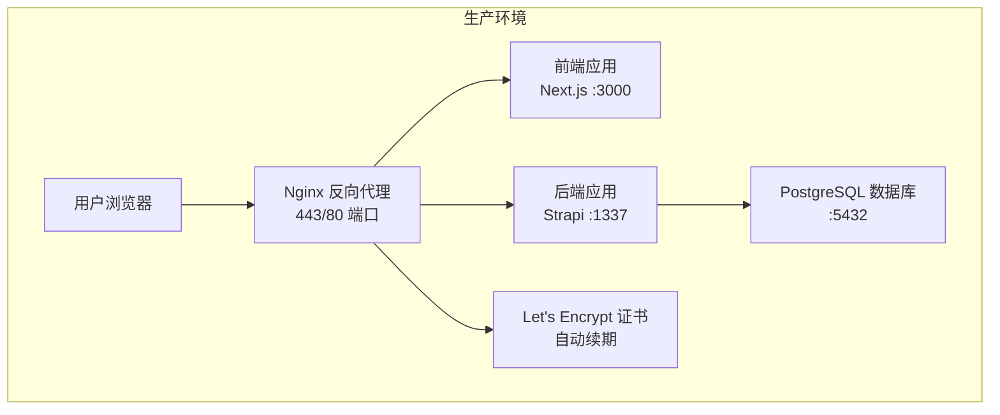
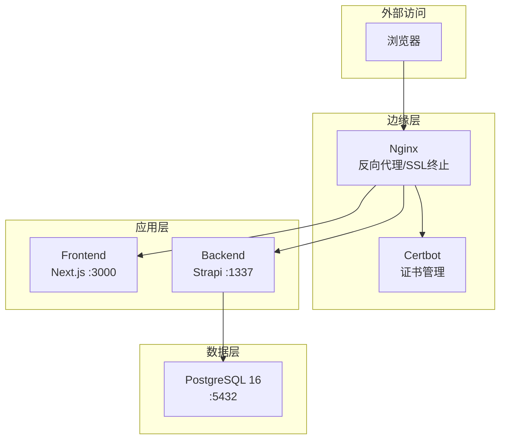
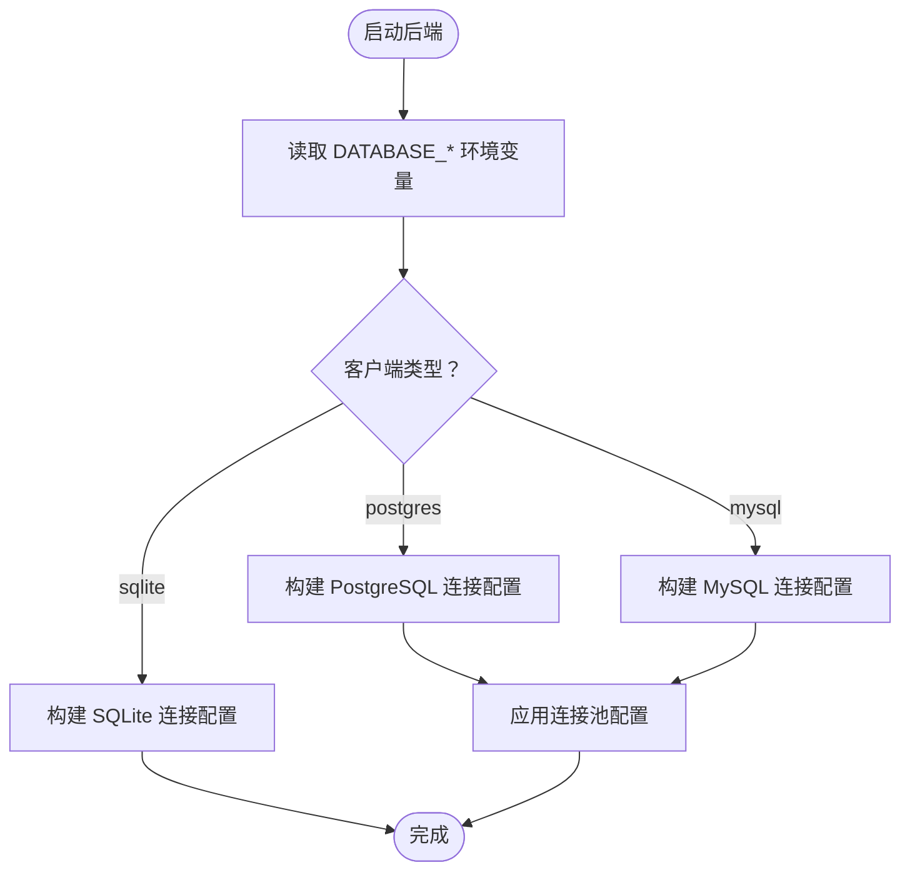
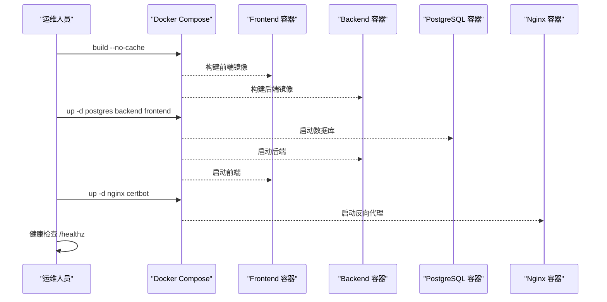
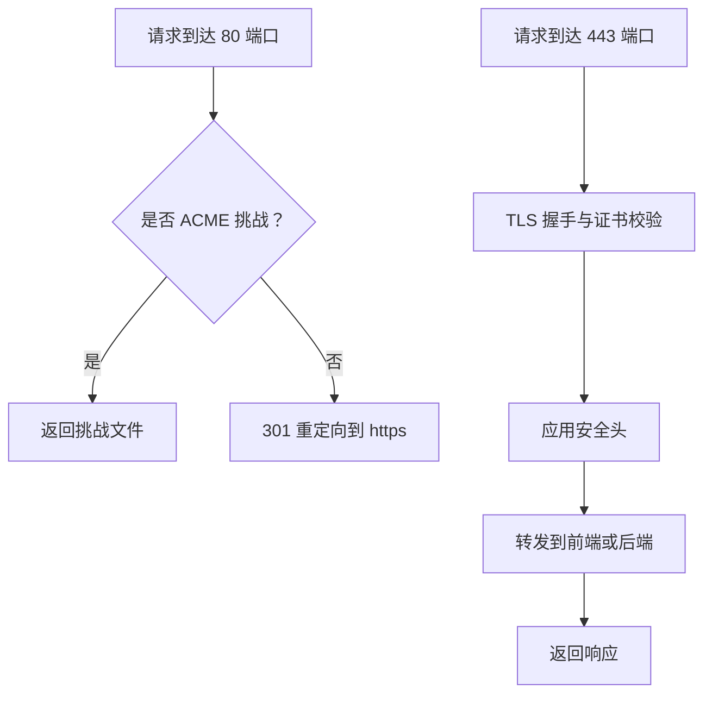
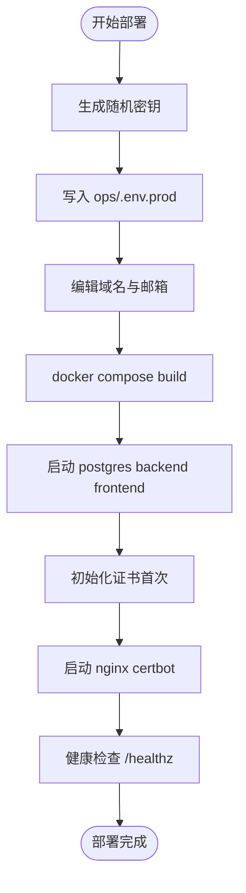
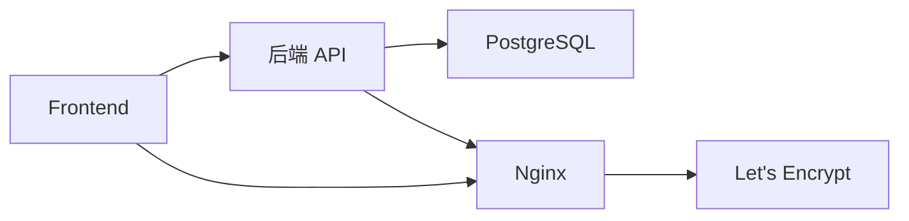

# 生产环境配置

<cite>
**本文档引用的文件**
- [README.md](file://README.md)
- [DEPLOYMENT.md](file://DEPLOYMENT.md)
- [开发与生产环境分离方案.md](file://开发与生产环境分离方案.md)
- [生产环境分离的部署方案.md](file://生产环境分离的部署方案.md)
- [backend/.env.example](file://backend/.env.example)
- [frontend/.env.example](file://frontend/.env.example)
- [backend/config/database.ts](file://backend/config/database.ts)
- [backend/config/middlewares.ts](file://backend/config/middlewares.ts)
</cite>

## 目录
1. [简介](#简介)
2. [项目结构](#项目结构)
3. [核心组件](#核心组件)
4. [架构总览](#架构总览)
5. [详细组件分析](#详细组件分析)
6. [依赖关系分析](#依赖关系分析)
7. [性能考虑](#性能考虑)
8. [故障排查指南](#故障排查指南)
9. [结论](#结论)
10. [附录](#附录)

## 简介
本文件面向运维团队，提供中创智控官网生产环境的完整部署与运维指南。内容涵盖生产环境架构设计、PostgreSQL 数据库配置、Docker 容器编排、Nginx 反向代理与 SSL 证书管理、配置文件与密钥管理策略、自动化部署流程、健康检查机制、监控与维护策略，以及故障应急处理方案。目标是帮助运维团队稳定可靠地运行生产环境服务。

## 项目结构
项目采用前后端分离架构，生产环境通过 Docker Compose 编排，Nginx 作为反向代理统一接入，后端 Strapi 通过 API 提供内容服务，数据库使用 PostgreSQL。

图表来源
- [DEPLOYMENT.md](file://DEPLOYMENT.md#L38-L67)
- [开发与生产环境分离方案.md](file://开发与生产环境分离方案.md#L92-L139)

章节来源
- [README.md](file://README.md#L229-L298)
- [DEPLOYMENT.md](file://DEPLOYMENT.md#L34-L100)

## 核心组件
- 前端（Next.js 15）：负责页面渲染与静态资源服务，监听 3000 端口。
- 后端（Strapi 5）：提供 RESTful API，监听 1337 端口；生产环境使用 PostgreSQL。
- 数据库（PostgreSQL 16）：生产环境使用，配合连接池与 SSL。
- 反向代理（Nginx 1.27）：统一入口，处理 HTTPS、安全头、静态资源与健康检查。
- 证书管理（Let's Encrypt）：自动申请与续期，通过 Certbot 管理。
- 容器编排（Docker Compose）：统一管理服务生命周期、网络与卷。

章节来源
- [开发与生产环境分离方案.md](file://开发与生产环境分离方案.md#L1-L62)
- [DEPLOYMENT.md](file://DEPLOYMENT.md#L1-L26)

## 架构总览
生产环境整体架构如下：

图表来源
- [DEPLOYMENT.md](file://DEPLOYMENT.md#L38-L67)
- [开发与生产环境分离方案.md](file://开发与生产环境分离方案.md#L92-L139)

章节来源
- [DEPLOYMENT.md](file://DEPLOYMENT.md#L34-L100)
- [开发与生产环境分离方案.md](file://开发与生产环境分离方案.md#L15-L27)

## 详细组件分析

### PostgreSQL 数据库配置
- 生产环境使用 PostgreSQL 16，支持连接池、SSL 与模式（schema）配置。
- 数据库连接参数通过环境变量注入，支持 DATABASE_URL 与主机/端口/凭据组合。
- 连接池默认最小 2、最大 10，可根据负载调优。
- 建议开启 SSL 连接以提升安全性。

图表来源
- [backend/config/database.ts](file://backend/config/database.ts#L3-L61)

章节来源
- [backend/config/database.ts](file://backend/config/database.ts#L1-L61)
- [开发与生产环境分离方案.md](file://开发与生产环境分离方案.md#L214-L246)

### Docker 容器编排与构建策略
- 多阶段构建：Builder 阶段安装依赖并构建应用；Production 阶段仅包含运行时依赖，减小镜像体积。
- 部署时构建：在部署服务器执行 docker compose build，确保构建环境一致。
- 构建产物不提交：.gitignore 排除 dist、build、.next 等目录。
- 健康检查：PostgreSQL、后端、前端、Nginx 均配置健康检查，周期 30s，超时与重试次数按服务特性设定。

图表来源
- [DEPLOYMENT.md](file://DEPLOYMENT.md#L278-L318)
- [开发与生产环境分离方案.md](file://开发与生产环境分离方案.md#L407-L457)

章节来源
- [DEPLOYMENT.md](file://DEPLOYMENT.md#L225-L320)
- [开发与生产环境分离方案.md](file://开发与生产环境分离方案.md#L291-L349)

### Nginx 反向代理与 SSL 证书管理
- HTTP 到 HTTPS 重定向：80 端口监听，重定向至 https。
- Let's Encrypt：Standalone 模式获取证书，支持 ACME 挑战路径。
- 安全头：Strict-Transport-Security、X-Frame-Options、X-Content-Type-Options、Referrer-Policy、Permissions-Policy。
- 证书续期：每日 3:00 检查续期，成功后自动重载 Nginx。
- 健康检查：/healthz 用于探活。

图表来源
- [DEPLOYMENT.md](file://DEPLOYMENT.md#L364-L411)
- [开发与生产环境分离方案.md](file://开发与生产环境分离方案.md#L541-L588)

章节来源
- [DEPLOYMENT.md](file://DEPLOYMENT.md#L322-L411)
- [开发与生产环境分离方案.md](file://开发与生产环境分离方案.md#L461-L588)

### 配置文件管理与密钥策略
- 配置分层：开发与生产环境配置文件分离，敏感信息不提交到 Git。
- 环境变量：生产环境变量通过 ops/.env.prod 注入，包含数据库、Strapi 密钥、域名与 Let's Encrypt 邮箱。
- 密钥生成：使用 OpenSSL 生成随机密钥，包含 APP_KEYS、API_TOKEN_SALT、ADMIN_JWT_SECRET、TRANSFER_TOKEN_SALT、JWT_SECRET、ENCRYPTION_KEY。
- 环境变量模板：提供 ops/.env.prod.example 与 ops/.env.dev.example，明确变量用途与占位符。

图表来源
- [DEPLOYMENT.md](file://DEPLOYMENT.md#L416-L500)
- [开发与生产环境分离方案.md](file://开发与生产环境分离方案.md#L624-L707)

章节来源
- [DEPLOYMENT.md](file://DEPLOYMENT.md#L148-L222)
- [开发与生产环境分离方案.md](file://开发与生产环境分离方案.md#L214-L287)

### 自动化部署脚本与流程
- 密钥生成脚本：生成生产环境所需密钥与环境变量文件。
- 部署脚本：拉取镜像、停止旧容器、启动基础服务、检查证书、启动代理与证书服务、健康检查。
- 开发环境脚本：一键启动开发环境容器。

章节来源
- [DEPLOYMENT.md](file://DEPLOYMENT.md#L414-L584)
- [开发与生产环境分离方案.md](file://开发与生产环境分离方案.md#L622-L792)

### 健康检查机制
- 容器健康检查：PostgreSQL、后端、前端、Nginx 均配置健康检查命令、间隔、超时与重试次数。
- API 健康端点：/healthz 用于 Nginx、前端与后端探活。
- 日志与状态：通过 docker compose logs 与 ps 辅助诊断。

章节来源
- [DEPLOYMENT.md](file://DEPLOYMENT.md#L587-L646)
- [开发与生产环境分离方案.md](file://开发与生产环境分离方案.md#L501-L542)

### 监控与告警
- 健康检查：容器层面健康检查 + 应用层面 /healthz。
- 日志管理：Docker json-file 驱动，配置日志轮转与保留策略。
- 监控指标：CPU、内存、磁盘、响应时间、数据库连接数、API 错误率、证书有效期。
- 建议：结合外部监控工具（如 Prometheus + Grafana）实现可视化与告警。

章节来源
- [DEPLOYMENT.md](file://DEPLOYMENT.md#L587-L646)
- [开发与生产环境分离方案.md](file://开发与生产环境分离方案.md#L501-L542)

### 数据备份与恢复
- 备份类型：数据库完整备份、上传文件归档、配置文件备份。
- 备份频率：数据库每日凌晨 2:00，文件每周日凌晨 2:30。
- 备份保留：保留最近 7 天。
- 恢复流程：使用 pg_restore 恢复数据库，解压归档恢复媒体文件。
- 定时任务：通过 cron 管理备份与清理。

章节来源
- [DEPLOYMENT.md](file://DEPLOYMENT.md#L649-L744)
- [开发与生产环境分离方案.md](file://开发与生产环境分离方案.md#L371-L426)

### 数据迁移流程
- 迁移场景：开发环境（SQLite）迁移到生产环境（PostgreSQL）、测试环境到生产环境、旧生产环境到新生产环境。
- 支持内容：Products、News、Media Files。
- 工具：backend/scripts/import-dev-seed.mjs 与 ops/import/dev-seed.sh。
- 流程：获取 API Token、验证环境可访问性、执行迁移脚本、验证数据完整性。

章节来源
- [DEPLOYMENT.md](file://DEPLOYMENT.md#L747-L800)
- [开发与生产环境分离方案.md](file://开发与生产环境分离方案.md#L350-L368)

## 依赖关系分析
- 前端依赖后端 API（NEXT_PUBLIC_STRAPI_URL），通过 Nginx 代理访问。
- 后端依赖 PostgreSQL 数据库，连接参数来自环境变量。
- Nginx 依赖 Let's Encrypt 证书，证书由 Certbot 管理并自动续期。
- Docker Compose 统一编排服务、网络与卷，确保服务间通信与数据持久化。

图表来源
- [README.md](file://README.md#L281-L298)
- [DEPLOYMENT.md](file://DEPLOYMENT.md#L38-L67)

章节来源
- [README.md](file://README.md#L281-L298)
- [DEPLOYMENT.md](file://DEPLOYMENT.md#L34-L100)

## 性能考虑
- 连接池：PostgreSQL 连接池默认 2-10，建议根据并发与实例规格调优。
- 镜像优化：多阶段构建、Alpine 基础镜像、清理 npm 缓存，降低镜像体积与启动时间。
- 缓存与静态资源：Nginx 提供静态资源缓存与压缩，减少后端压力。
- 健康检查与自动重启：容器健康检查与自动重启策略保障服务可用性。
- 监控与告警：通过指标阈值触发告警，及时发现性能瓶颈。

[本节为通用指导，无需列出章节来源]

## 故障排查指南
- 容器无法启动：检查端口占用、依赖服务健康状态、日志输出。
- 数据库连接失败：确认 PostgreSQL 已就绪、连接参数正确、网络连通。
- API 请求失败：检查 CORS 配置、后端日志、Nginx 反向代理配置。
- 前端无法访问：检查 Nginx 配置、证书有效性、/healthz 探活。
- SSL 证书过期：运行 certbot renew，确认定时任务与证书路径。
- 性能不达标：进行压力测试，优化数据库查询、增加资源或使用 CDN。

章节来源
- [开发与生产环境分离方案.md](file://开发与生产环境分离方案.md#L543-L571)
- [DEPLOYMENT.md](file://DEPLOYMENT.md#L587-L646)

## 结论
通过 Docker 容器化与 Nginx 反向代理，结合 Let's Encrypt 自动证书管理与严格的配置分层策略，中创智控官网生产环境实现了高可用、可扩展与安全可控的部署方案。配合完善的健康检查、监控告警与备份恢复机制，运维团队可以稳定可靠地运行生产环境服务。

[本节为总结性内容，无需列出章节来源]

## 附录

### 环境变量与配置模板
- 生产环境模板：ops/.env.prod.example
- 开发环境模板：ops/.env.dev.example
- 后端开发环境示例：backend/.env.example
- 前端开发环境示例：frontend/.env.example

章节来源
- [DEPLOYMENT.md](file://DEPLOYMENT.md#L181-L222)
- [开发与生产环境分离方案.md](file://开发与生产环境分离方案.md#L206-L287)
- [backend/.env.example](file://backend/.env.example#L1-L15)
- [frontend/.env.example](file://frontend/.env.example#L1-L2)

### CORS 与中间件配置
- CORS 中间件：Strapi 默认启用 CORS，确保前端跨域访问后端 API。
- 中间件顺序：logger → errors → security → cors → poweredBy → query → body → session → favicon → public。

章节来源
- [backend/config/middlewares.ts](file://backend/config/middlewares.ts#L1-L13)