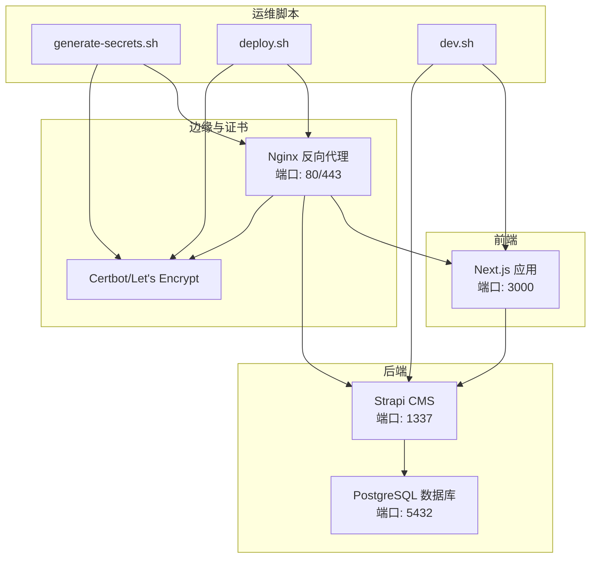
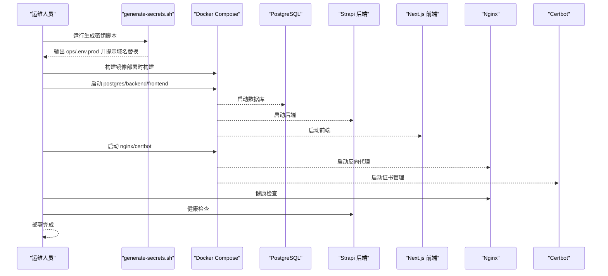
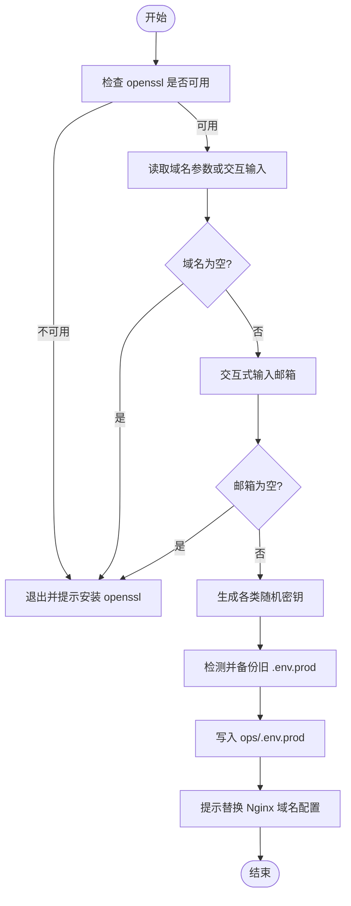
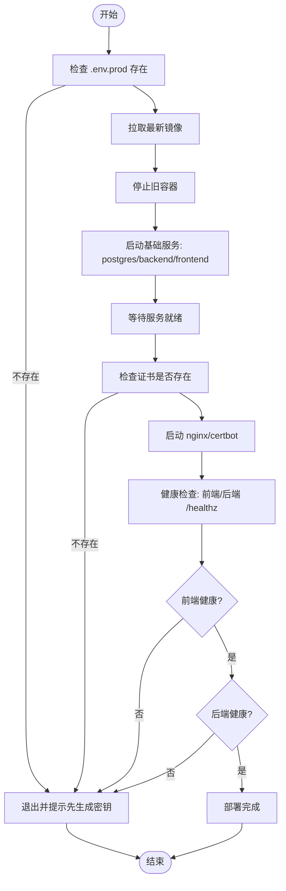
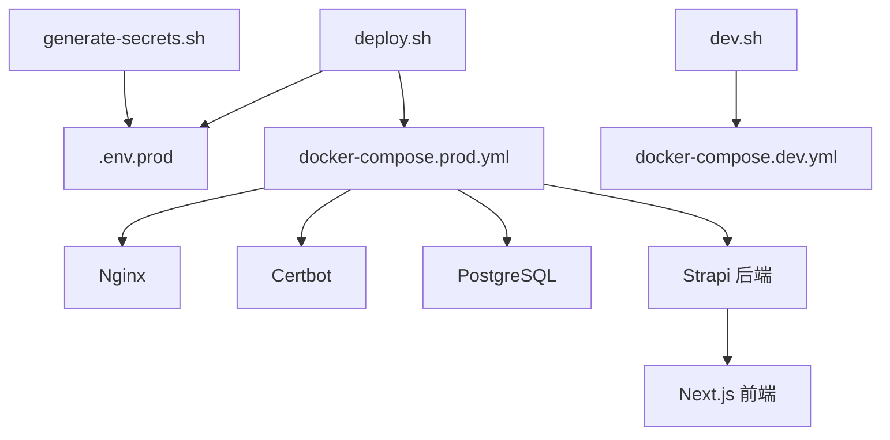

# 部署自动化

<cite>
**本文引用的文件**
- [DEPLOYMENT.md](file://DEPLOYMENT.md)
- [README.md](file://README.md)
- [download-images.sh](file://download-images.sh)
- [download-images-batch2.sh](file://download-images-batch2.sh)
</cite>

## 目录
1. [简介](#简介)
2. [项目结构](#项目结构)
3. [核心组件](#核心组件)
4. [架构总览](#架构总览)
5. [详细组件分析](#详细组件分析)
6. [依赖关系分析](#依赖关系分析)
7. [性能考虑](#性能考虑)
8. [故障排除指南](#故障排除指南)
9. [结论](#结论)
10. [附录](#附录)

## 简介
本文件面向运维团队，系统化梳理中创智控官网项目的自动化部署流程与脚本使用方法。重点覆盖以下方面：
- 部署脚本的设计原理与实现思路：generate-secrets.sh 的密钥生成机制、deploy.sh 的部署流程、dev.sh 的开发启动脚本
- 自动化部署的阶段划分：环境准备、镜像构建、服务启动、健康检查
- 参数配置与使用方法：域名配置、邮箱设置、部署选项
- 故障排除：常见部署错误、日志分析、回滚策略
- 最佳实践：如何高效可靠地使用自动化脚本完成部署

## 项目结构
项目采用前后端分离架构，生产环境通过 Docker Compose 编排 Nginx、PostgreSQL、Strapi 后端与 Next.js 前端服务。部署自动化文档以 DEPLOYMENT.md 为核心，配套脚本与配置文件位于 ops/ 目录（在 DEPLOYMENT.md 中有明确的目录结构说明）。

**图表来源**
- [DEPLOYMENT.md](file://DEPLOYMENT.md#L36-L85)

**章节来源**
- [DEPLOYMENT.md](file://DEPLOYMENT.md#L101-L144)

## 核心组件
- generate-secrets.sh：生成生产环境所需的密钥与环境变量，写入 ops/.env.prod，并提示后续 Nginx 配置替换
- deploy.sh：生产环境部署主脚本，负责拉取镜像、停止旧容器、启动基础服务、等待就绪、检查证书、启动 Nginx/Certbot、健康检查
- dev.sh：开发环境启动脚本，直接使用 docker compose 启动开发编排
- Nginx/Certbot：生产环境反向代理与 SSL 证书管理
- PostgreSQL：生产数据库
- Strapi/Next.js：后端 CMS 与前端应用

**章节来源**
- [DEPLOYMENT.md](file://DEPLOYMENT.md#L414-L584)

## 架构总览
生产环境采用“Nginx + Docker Compose”的编排架构，容器内服务通过健康检查保障可用性；证书通过 Certbot 自动获取与续期；部署流程强调“部署时构建”，避免将构建产物提交至代码库。

**图表来源**
- [DEPLOYMENT.md](file://DEPLOYMENT.md#L278-L318)
- [DEPLOYMENT.md](file://DEPLOYMENT.md#L500-L569)

## 详细组件分析

### generate-secrets.sh 密钥生成机制
- 输入参数与交互
  - 接收域名参数；若未提供则交互式输入
  - 交互式输入 Let's Encrypt 邮箱
- 密钥生成
  - 使用 openssl 生成随机十六进制字符串，覆盖 PostgreSQL 密码、Strapi 应用密钥组、API/JWT/加密相关盐与密钥等
- 环境变量注入
  - 生成 ops/.env.prod，包含 NODE_ENV、域名、数据库连接、Strapi 秘钥、Let's Encrypt 邮箱
  - 若已有 ops/.env.prod，会提示覆盖并备份旧文件
- 后续步骤提示
  - 提示将站点配置中的域名替换为实际域名

**图表来源**
- [DEPLOYMENT.md](file://DEPLOYMENT.md#L416-L498)

**章节来源**
- [DEPLOYMENT.md](file://DEPLOYMENT.md#L416-L498)

### deploy.sh 生产环境部署流程
- 环境校验
  - 检查 ops/.env.prod 是否存在
- 拉取镜像与停止旧容器
  - docker compose -f docker/docker-compose.prod.yml pull
  - docker compose -f docker/docker-compose.prod.yml down
- 启动基础服务
  - docker compose -f docker/docker-compose.prod.yml up -d postgres backend frontend
- 等待与健康检查
  - 等待服务启动后检查证书是否存在
  - 启动 nginx/certbot
  - 健康检查：访问前端与后端的 /healthz
- 输出结果
  - 成功后打印访问地址与容器状态

**图表来源**
- [DEPLOYMENT.md](file://DEPLOYMENT.md#L500-L569)

**章节来源**
- [DEPLOYMENT.md](file://DEPLOYMENT.md#L500-L569)

### dev.sh 开发环境启动脚本
- 作用
  - 直接使用 docker compose 启动开发编排文件，便于本地联调前端与后端
- 使用建议
  - 在项目根目录执行，确保 docker compose 能正确解析相对路径

**章节来源**
- [DEPLOYMENT.md](file://DEPLOYMENT.md#L571-L584)

### Nginx 与 Certbot 配置要点
- Nginx
  - HTTP 80 跳转 HTTPS，并允许 ACME 挑战路径
  - HTTPS 443 监听，配置 SSL 证书路径与安全头
- Certbot
  - 首次部署时初始化证书
  - 定时任务每日检查续期并重载 Nginx

**章节来源**
- [DEPLOYMENT.md](file://DEPLOYMENT.md#L322-L411)

### PostgreSQL 与数据库初始化
- 生产数据库使用 PostgreSQL 16
- 通过 docker compose 启动并挂载持久卷，确保数据不丢失
- 部署脚本在启动 nginx 前会等待基础服务就绪

**章节来源**
- [DEPLOYMENT.md](file://DEPLOYMENT.md#L17-L25)
- [DEPLOYMENT.md](file://DEPLOYMENT.md#L278-L318)

### 健康检查与监控
- 健康检查命令
  - PostgreSQL：pg_isready
  - 后端：/api/healthz
  - 前端：/healthz
  - Nginx：/healthz
- 日志管理
  - Docker 默认 json-file 驱动，建议配置日志轮转与保留策略
- 监控指标
  - CPU/内存/磁盘使用率、响应时间、数据库连接数、API 错误率、证书有效期

**章节来源**
- [DEPLOYMENT.md](file://DEPLOYMENT.md#L587-L646)

## 依赖关系分析
- 脚本依赖
  - generate-secrets.sh 依赖 openssl
  - deploy.sh 依赖 docker/compose
  - dev.sh 依赖 docker/compose
- 配置依赖
  - ops/.env.prod 为 deploy.sh 的前提条件
  - Nginx 配置需与域名一致
- 服务依赖
  - 前端依赖后端 API
  - Nginx 依赖 Certbot 证书
  - 后端依赖 PostgreSQL

**图表来源**
- [DEPLOYMENT.md](file://DEPLOYMENT.md#L101-L144)
- [DEPLOYMENT.md](file://DEPLOYMENT.md#L500-L584)

**章节来源**
- [DEPLOYMENT.md](file://DEPLOYMENT.md#L101-L144)

## 性能考虑
- 构建策略
  - 部署时构建，避免将构建产物提交到 Git，减少仓库体积
  - 使用多阶段构建减小镜像体积并提升安全性
- 缓存利用
  - 利用 Docker 层缓存加速构建
- 资源与日志
  - 合理配置 Docker 日志轮转，避免磁盘被日志占满
- 健康检查间隔
  - 建议根据服务响应特性调整健康检查间隔与超时参数

[本节为通用指导，无需具体文件分析]

## 故障排除指南
- 常见错误与排查
  - openssl 未安装：运行 generate-secrets.sh 前安装 openssl
  - ops/.env.prod 不存在：先运行 generate-secrets.sh
  - 证书不存在：先初始化证书，再启动 nginx/certbot
  - 健康检查失败：检查后端 API 与前端静态资源是否正常
- 日志分析
  - 查看所有服务日志与特定服务日志
  - 查看最近若干行日志以便快速定位问题
- 回滚策略
  - 使用 docker compose 停止当前版本并回退到上一镜像版本
  - 若涉及数据库变更，结合备份与恢复脚本进行数据回滚

**章节来源**
- [DEPLOYMENT.md](file://DEPLOYMENT.md#L587-L646)
- [DEPLOYMENT.md](file://DEPLOYMENT.md#L649-L744)

## 结论
通过 generate-secrets.sh、deploy.sh 与 dev.sh 的协同配合，中创智控官网项目实现了标准化、可重复的自动化部署流程。结合 Nginx/Certbot 的边缘能力与 PostgreSQL 的数据持久化，运维团队可以高效、可靠地完成生产与开发环境的部署与维护。建议在实际操作中严格遵循部署手册与健康检查流程，确保系统稳定运行。

[本节为总结性内容，无需具体文件分析]

## 附录
- 环境变量与配置模板
  - 生产环境模板：包含数据库、Strapi 秘钥、域名与邮箱等
  - 开发环境模板：包含本地 API URL、数据库客户端与端口等
- 目录结构参考
  - ops/ 目录包含密钥生成脚本、部署脚本、Docker 编排、Nginx 配置、备份脚本等

**章节来源**
- [DEPLOYMENT.md](file://DEPLOYMENT.md#L148-L222)
- [DEPLOYMENT.md](file://DEPLOYMENT.md#L101-L144)