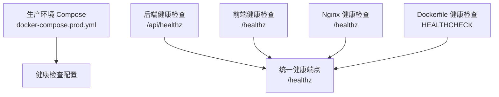
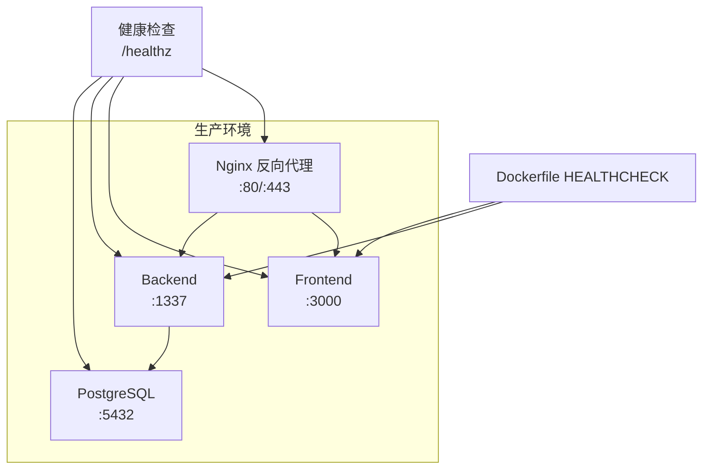
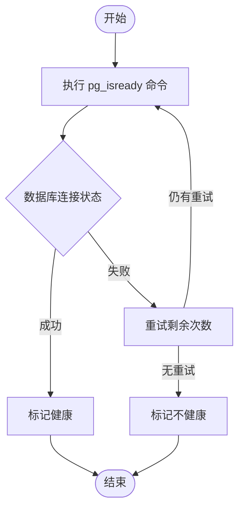
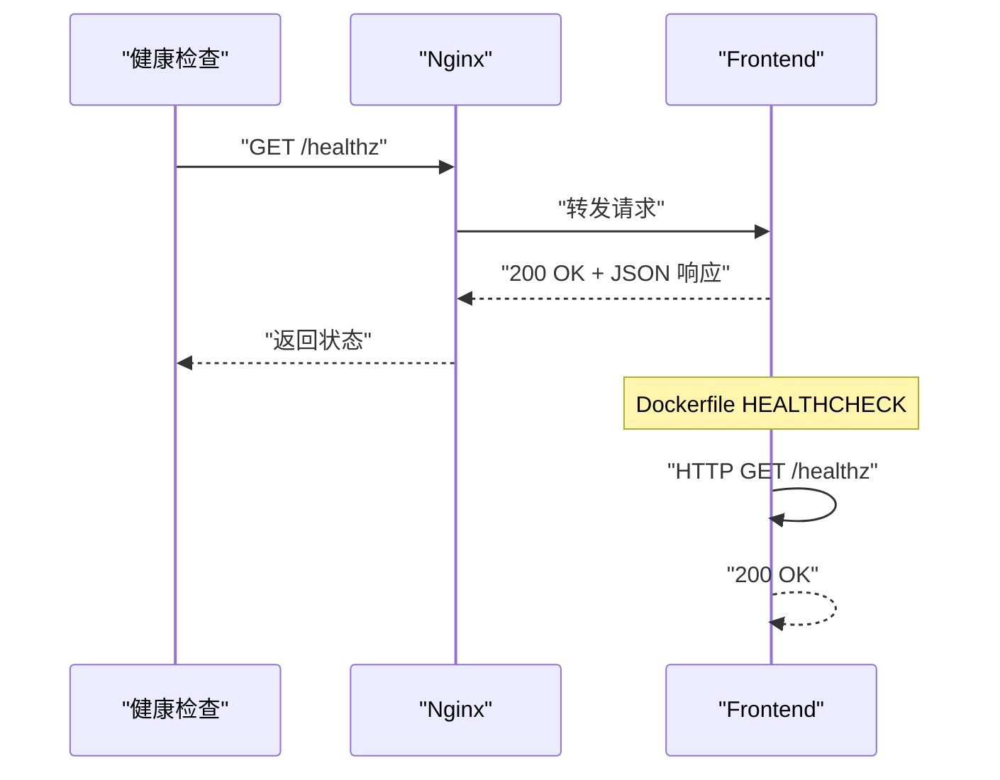
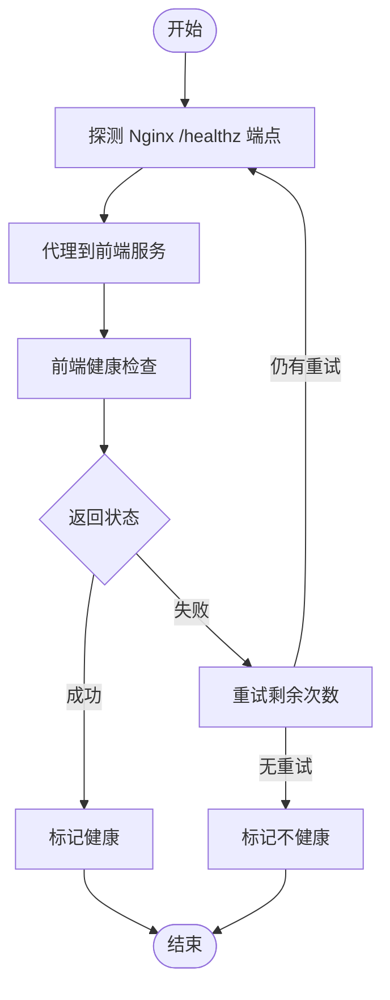
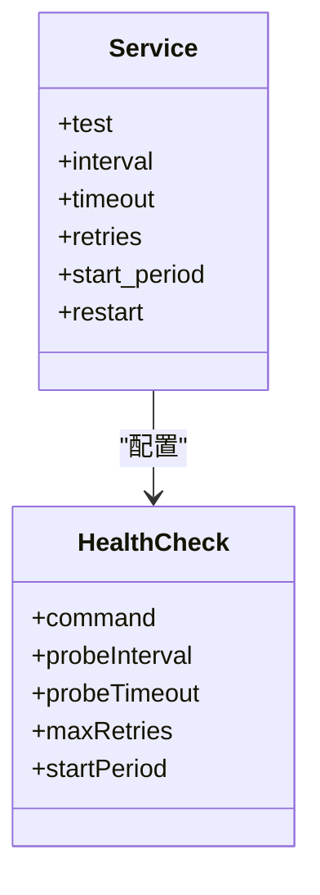

# 健康检查机制

<cite>
**本文引用的文件**
- [docker-compose.prod.yml](file://ops/docker/docker-compose.prod.yml)
- [docker-compose.dev.yml](file://ops/docker/docker-compose.dev.yml)
- [healthz.ts](file://backend/src/api/healthz/controllers/healthz.ts)
- [healthz.ts](file://backend/src/api/healthz/routes/healthz.ts)
- [healthz.ts](file://backend/src/api/healthz/services/healthz.ts)
- [route.ts](file://frontend/app/healthz/route.ts)
- [sites.conf](file://ops/nginx/sites.conf)
- [nginx.conf](file://ops/nginx/nginx.conf)
- [Dockerfile.backend](file://ops/docker/Dockerfile.backend)
- [Dockerfile.frontend](file://ops/docker/Dockerfile.frontend)
- [metrics.md](file://ops/monitoring/metrics.md)
- [runbook.md](file://ops/monitoring/runbook.md)
</cite>

## 更新摘要
**所做更改**
- 更新了生产环境健康检查配置，整合了新的健康检查端点和监控策略
- 删除了过时的旧健康检查实现，采用统一的 /healthz 端点标准
- 新增了 Dockerfile 中的 HEALTHCHECK 指令配置
- 完善了 Nginx 反向代理的健康检查路由配置
- 增强了监控指标与故障排除指南

## 目录
1. [简介](#简介)
2. [项目结构](#项目结构)
3. [核心组件](#核心组件)
4. [架构总览](#架构总览)
5. [详细组件分析](#详细组件分析)
6. [依赖分析](#依赖分析)
7. [性能考量](#性能考量)
8. [故障排除指南](#故障排除指南)
9. [结论](#结论)
10. [附录](#附录)

## 简介
本文件面向运维与开发人员，系统化梳理中创智控官网在生产环境中的健康检查机制与最佳实践。文档聚焦以下服务的健康检查配置与实现策略：
- PostgreSQL（数据库）
- Backend（Strapi 后端 API）
- Frontend（Next.js 前端）
- Nginx（反向代理与入口）

同时，文档总结了 Docker Compose 中健康检查的配置语法、参数含义与最佳实践，并阐述健康检查在容器编排中的作用（自动重启、服务发现与负载均衡的影响），最后提供故障排除清单与常见问题的解决思路。

## 项目结构
围绕健康检查的关键位置与文件如下：
- 生产环境部署与健康检查配置集中在生产环境 Compose 文件中
- 健康检查端点在后端和前端应用中统一实现
- Nginx 反向代理配置了专门的健康检查路由
- Dockerfile 中集成了容器级别的健康检查指令
- 监控指标与故障排除流程在独立文档中维护

**图表来源**
- [docker-compose.prod.yml](file://ops/docker/docker-compose.prod.yml#L18-L22)
- [healthz.ts](file://backend/src/api/healthz/controllers/healthz.ts#L1-L10)
- [route.ts](file://frontend/app/healthz/route.ts#L1-L9)
- [Dockerfile.backend](file://ops/docker/Dockerfile.backend#L29-L31)

**章节来源**
- [docker-compose.prod.yml](file://ops/docker/docker-compose.prod.yml#L1-L153)
- [healthz.ts](file://backend/src/api/healthz/controllers/healthz.ts#L1-L10)
- [route.ts](file://frontend/app/healthz/route.ts#L1-L9)

## 核心组件
- **PostgreSQL 健康检查**
  - 命令：使用 `pg_isready` 工具进行数据库连接验证
  - 间隔：30 秒
  - 超时：5 秒
  - 重试：5 次
- **Backend（Strapi）健康检查**
  - 命令：对 `/api/healthz` 端点发起 HTTP 请求
  - 间隔：30 秒
  - 超时：10 秒
  - 重试：3 次
  - Dockerfile 健康检查：集成在容器层的 HEALTHCHECK 指令中
- **Frontend（Next.js）健康检查**
  - 命令：对 `/healthz` 端点发起 HTTP 请求
  - 间隔：30 秒
  - 超时：10 秒
  - 重试：3 次
  - Dockerfile 健康检查：集成在容器层的 HEALTHCHECK 指令中
- **Nginx 健康检查**
  - 命令：使用 `wget` 工具访问 `/healthz` 端点
  - 间隔：30 秒
  - 超时：5 秒
  - 重试：3 次

**章节来源**
- [docker-compose.prod.yml](file://ops/docker/docker-compose.prod.yml#L18-L22)
- [docker-compose.prod.yml](file://ops/docker/docker-compose.prod.yml#L48-L52)
- [docker-compose.prod.yml](file://ops/docker/docker-compose.prod.yml#L78-L82)
- [docker-compose.prod.yml](file://ops/docker/docker-compose.prod.yml#L111-L115)
- [Dockerfile.backend](file://ops/docker/Dockerfile.backend#L29-L31)
- [Dockerfile.frontend](file://ops/docker/Dockerfile.frontend#L30-L32)

## 架构总览
健康检查在整体架构中的位置如下：
- Nginx 作为统一入口，负责将请求转发至前端与后端
- 健康检查通过统一的 `/healthz` 端点进行验证
- Dockerfile 中的 HEALTHCHECK 指令提供容器级别的健康检查
- Compose 文件中的 healthcheck 配置提供编排级别的健康检查

**图表来源**
- [docker-compose.prod.yml](file://ops/docker/docker-compose.prod.yml#L92-L123)
- [Dockerfile.backend](file://ops/docker/Dockerfile.backend#L29-L31)
- [Dockerfile.frontend](file://ops/docker/Dockerfile.frontend#L30-L32)

## 详细组件分析

### PostgreSQL 健康检查
- **健康检查命令**：使用 `pg_isready` 工具进行数据库连接验证
- **参数配置**
  - 间隔：30 秒
  - 超时：5 秒
  - 重试：5 次
- **实现要点**
  - 使用环境变量动态获取数据库凭据
  - 健康检查仅验证数据库可达性，不进行业务数据校验
  - 适用于容器编排的自动重启与服务发现联动

**图表来源**
- [docker-compose.prod.yml](file://ops/docker/docker-compose.prod.yml#L18-L22)

**章节来源**
- [docker-compose.prod.yml](file://ops/docker/docker-compose.prod.yml#L18-L22)

### Backend（Strapi）健康检查
- **健康检查命令**：对 `/api/healthz` 端点发起 HTTP 请求
- **参数配置**
  - 间隔：30 秒
  - 超时：10 秒
  - 重试：3 次
- **Dockerfile 健康检查**：集成在容器层的 HEALTHCHECK 指令中
  - 使用 `start-period=40s` 避免启动期间的误判
- **实现要点**
  - 健康端点返回标准的 JSON 响应包含状态和时间戳
  - 与 Nginx 层联用，确保 API 可达且响应正常
  - 支持容器级别和编排级别的双重健康检查

**图表来源**
- [docker-compose.prod.yml](file://ops/docker/docker-compose.prod.yml#L48-L52)
- [Dockerfile.backend](file://ops/docker/Dockerfile.backend#L29-L31)
- [healthz.ts](file://backend/src/api/healthz/controllers/healthz.ts#L1-L10)

**章节来源**
- [docker-compose.prod.yml](file://ops/docker/docker-compose.prod.yml#L48-L52)
- [Dockerfile.backend](file://ops/docker/Dockerfile.backend#L29-L31)
- [healthz.ts](file://backend/src/api/healthz/controllers/healthz.ts#L1-L10)
- [healthz.ts](file://backend/src/api/healthz/routes/healthz.ts#L1-L13)

### Frontend（Next.js）健康检查
- **健康检查命令**：对 `/healthz` 端点发起 HTTP 请求
- **参数配置**
  - 间隔：30 秒
  - 超时：10 秒
  - 重试：3 次
- **Dockerfile 健康检查**：集成在容器层的 HEALTHCHECK 指令中
  - 使用 `start-period=40s` 避免启动期间的误判
- **实现要点**
  - 健康端点返回标准的 JSON 响应包含状态和时间戳
  - 与 Nginx 层联用，确保静态资源与 SSR 能力正常
  - 支持容器级别和编排级别的双重健康检查

**图表来源**
- [docker-compose.prod.yml](file://ops/docker/docker-compose.prod.yml#L78-L82)
- [Dockerfile.frontend](file://ops/docker/Dockerfile.frontend#L30-L32)
- [route.ts](file://frontend/app/healthz/route.ts#L1-L9)

**章节来源**
- [docker-compose.prod.yml](file://ops/docker/docker-compose.prod.yml#L78-L82)
- [Dockerfile.frontend](file://ops/docker/Dockerfile.frontend#L30-L32)
- [route.ts](file://frontend/app/healthz/route.ts#L1-L9)

### Nginx 健康检查
- **健康检查命令**：使用 `wget` 工具访问 `/healthz` 端点
- **参数配置**
  - 间隔：30 秒
  - 超时：5 秒
  - 重试：3 次
- **实现要点**
  - 作为统一入口，Nginx 健康检查是服务可用性的前置条件
  - 配置了专门的 `/healthz` 路由代理到前端服务
  - 与证书、重定向、安全头等配置协同工作

**图表来源**
- [docker-compose.prod.yml](file://ops/docker/docker-compose.prod.yml#L111-L115)
- [sites.conf](file://ops/nginx/sites.conf#L31-L34)

**章节来源**
- [docker-compose.prod.yml](file://ops/docker/docker-compose.prod.yml#L111-L115)
- [sites.conf](file://ops/nginx/sites.conf#L31-L34)

### Docker Compose 健康检查语法与最佳实践
- **语法要点**
  - 健康检查命令（test）支持多种形式（字符串或数组）
  - 间隔（interval）、超时（timeout）、重试（retries）参数用于控制探测节奏与容忍度
  - 建议与 restart 策略配合，实现故障后的自动恢复
  - 支持 `start-period` 参数避免启动期间的误判
- **示例参考**
  - 生产环境 Compose 文件展示了健康检查的常用写法与参数
  - Dockerfile 中的 HEALTHCHECK 指令提供了容器级别的健康检查
- **最佳实践**
  - 命令应尽量轻量，避免对业务造成干扰
  - 间隔与超时应结合服务启动时间与网络状况合理设置
  - 重试次数不宜过高，以免掩盖长期性故障
  - 使用 `start-period` 避免应用启动期间的健康检查失败

**图表来源**
- [docker-compose.prod.yml](file://ops/docker/docker-compose.prod.yml#L18-L22)
- [Dockerfile.backend](file://ops/docker/Dockerfile.backend#L29-L31)
- [Dockerfile.frontend](file://ops/docker/Dockerfile.frontend#L30-L32)

**章节来源**
- [docker-compose.prod.yml](file://ops/docker/docker-compose.prod.yml#L1-L153)
- [Dockerfile.backend](file://ops/docker/Dockerfile.backend#L29-L31)
- [Dockerfile.frontend](file://ops/docker/Dockerfile.frontend#L30-L32)

## 依赖分析
- **健康检查与部署脚本的耦合**
  - 部署脚本在启动 Nginx/Certbot 后，调用 curl 对健康端点进行验证
  - 该流程体现了健康检查在自动化部署中的关键作用
- **健康检查与服务发现/负载均衡的关系**
  - 健康检查结果直接影响编排系统对容器状态的判定
  - 不健康的容器会被隔离或重启，从而避免流量进入故障实例
- **多层健康检查架构**
  - 容器级别 HEALTHCHECK 提供基础健康状态
  - 编排级别 healthcheck 提供服务间依赖管理
  - Nginx 层健康检查确保入口服务可用性

**图表来源**
- [docker-compose.prod.yml](file://ops/docker/docker-compose.prod.yml#L43-L45)
- [docker-compose.prod.yml](file://ops/docker/docker-compose.prod.yml#L75-L77)
- [docker-compose.prod.yml](file://ops/docker/docker-compose.prod.yml#L98-L102)

**章节来源**
- [docker-compose.prod.yml](file://ops/docker/docker-compose.prod.yml#L43-L45)
- [docker-compose.prod.yml](file://ops/docker/docker-compose.prod.yml#L75-L77)
- [docker-compose.prod.yml](file://ops/docker/docker-compose.prod.yml#L98-L102)

## 性能考量
- **健康检查的开销**
  - 命令应尽量轻量，避免占用过多 CPU/IO
  - 间隔与重试应平衡探测灵敏度与系统负载
- **端到端延迟**
  - 健康检查路径应尽可能短，减少对用户请求的影响
  - 使用 `start-period` 避免启动期间的额外延迟
- **超时与重试的权衡**
  - 过短的超时可能导致误判；过长的重试可能延长恢复时间
  - Dockerfile 中的 HEALTHCHECK 和 Compose 配置可以互补
- **网络与证书**
  - Nginx 健康检查涉及证书链与安全头，需确保配置正确以避免额外延迟
  - 统一的 `/healthz` 端点简化了证书管理和路由配置

## 故障排除指南
- **常见失败原因与解决思路**
  - **容器无法启动**
    - 检查端口占用与资源限制
    - 查看容器日志定位启动失败原因
    - 验证 Dockerfile 中的 HEALTHCHECK 配置
  - **数据库连接失败**
    - 检查数据库健康状态与网络连通性
    - 确认凭据与网络策略（容器内访问）
    - 验证 `pg_isready` 命令的执行权限
  - **API 请求失败**
    - 检查 CORS 配置与后端健康端点可达性
    - 验证 `/api/healthz` 路由配置
    - 确认 Dockerfile 中的 HEALTHCHECK 指令
  - **前端无法访问**
    - 检查 Nginx 配置与静态资源路径
    - 验证 `/healthz` 端点的代理配置
    - 确认 Dockerfile 中的 HEALTHCHECK 配置
  - **SSL 证书问题**
    - 检查证书是否存在与续期计划
    - 确认域名解析与 ACME 挑战路径
    - 验证 Nginx 的证书配置
- **排查流程建议**
  - 检查容器状态与日志：`docker compose ps / logs`
  - 使用 curl 直接探测健康端点：`curl http://localhost:80/healthz`
  - 检查网络连通与资源使用情况
  - 验证 Dockerfile 和 Compose 文件的配置一致性
  - 必要时执行回滚与恢复流程

**章节来源**
- [runbook.md](file://ops/monitoring/runbook.md#L1-L29)
- [docker-compose.prod.yml](file://ops/docker/docker-compose.prod.yml#L1-L153)

## 结论
- 健康检查是生产环境稳定运行的重要保障
- 明确的命令、合理的间隔/超时/重试参数以及与部署脚本的集成，能有效提升系统的自愈能力
- 采用统一的 `/healthz` 端点标准，结合容器级别和编排级别的双重健康检查机制
- 建议在不同服务之间差异化配置健康检查策略，并结合监控与告警形成闭环

## 附录
- **健康检查命令与参数汇总**
  - **PostgreSQL**：`pg_isready -U $${POSTGRES_USER} -d $${POSTGRES_DB}`，间隔 30s，超时 5s，重试 5 次
  - **Backend**：`node -e "require('http').get('http://localhost:1337/api/healthz', (r) => process.exit(r.statusCode === 200 ? 0 : 1))"`，间隔 30s，超时 10s，重试 3 次
  - **Frontend**：`node -e "require('http').get('http://localhost:3000/healthz', (r) => process.exit(r.statusCode === 200 ? 0 : 1))"`，间隔 30s，超时 10s，重试 3 次
  - **Nginx**：`wget --quiet --tries=1 --spider http://localhost/healthz`，间隔 30s，超时 5s，重试 3 次
- **Dockerfile 健康检查配置**
  - **Backend**：`HEALTHCHECK --interval=30s --timeout=10s --start-period=40s --retries=3`
  - **Frontend**：`HEALTHCHECK --interval=30s --timeout=10s --start-period=40s --retries=3`
- **监控指标与告警阈值**
  - 系统资源：CPU > 80%，内存 > 85%，磁盘 > 90%
  - 服务可用性：前端响应时间 > 3s，后端响应时间 > 2s，数据库连接数 > 80%
  - 业务指标：API 错误率 > 5%，证书有效期 < 7 天

**章节来源**
- [docker-compose.prod.yml](file://ops/docker/docker-compose.prod.yml#L18-L22)
- [docker-compose.prod.yml](file://ops/docker/docker-compose.prod.yml#L48-L52)
- [docker-compose.prod.yml](file://ops/docker/docker-compose.prod.yml#L78-L82)
- [docker-compose.prod.yml](file://ops/docker/docker-compose.prod.yml#L111-L115)
- [Dockerfile.backend](file://ops/docker/Dockerfile.backend#L29-L31)
- [Dockerfile.frontend](file://ops/docker/Dockerfile.frontend#L30-L32)
- [metrics.md](file://ops/monitoring/metrics.md#L1-L16)