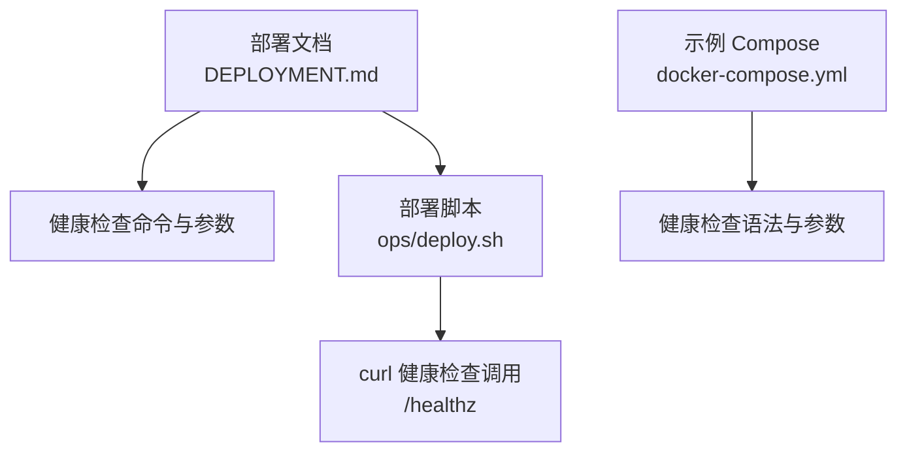
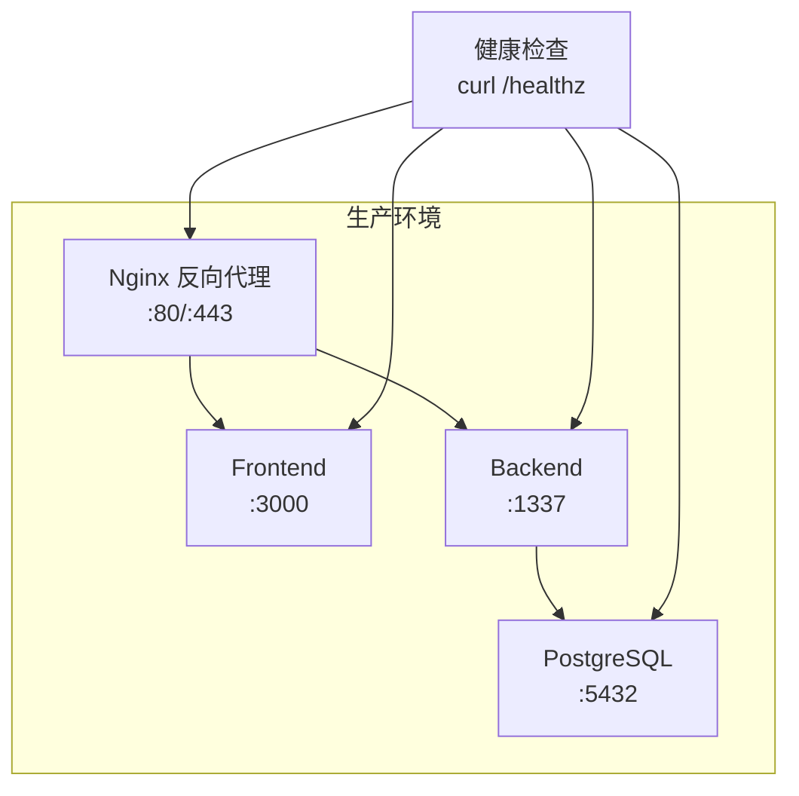
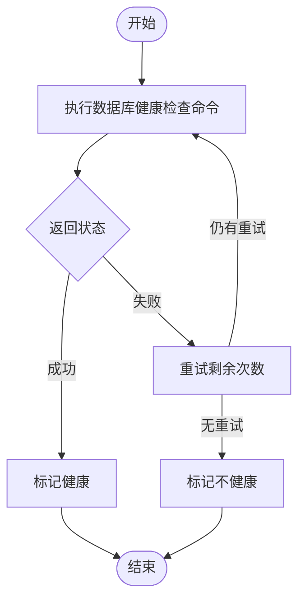
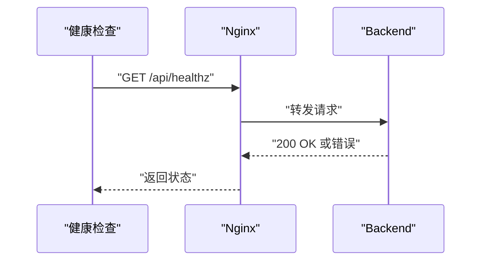
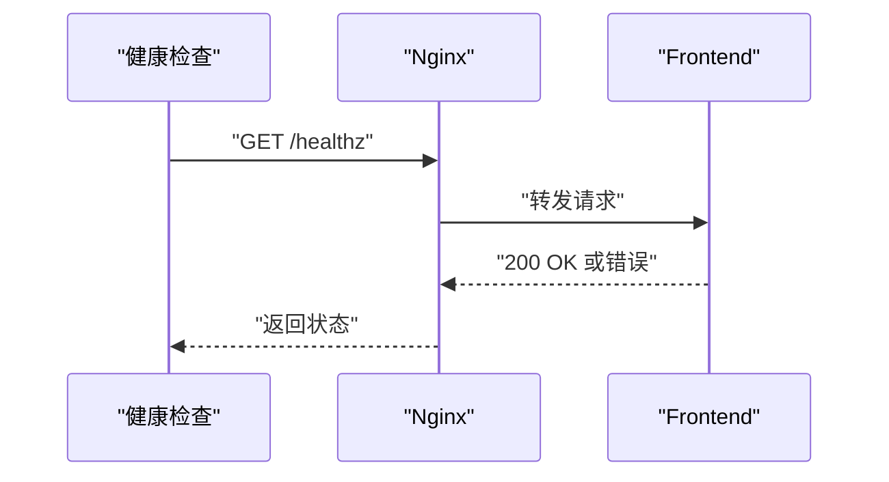
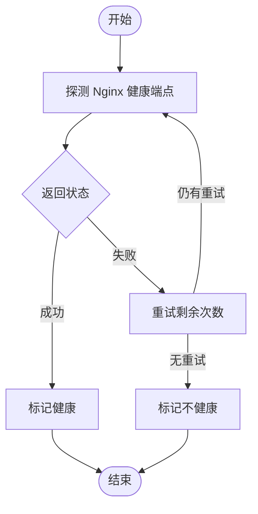
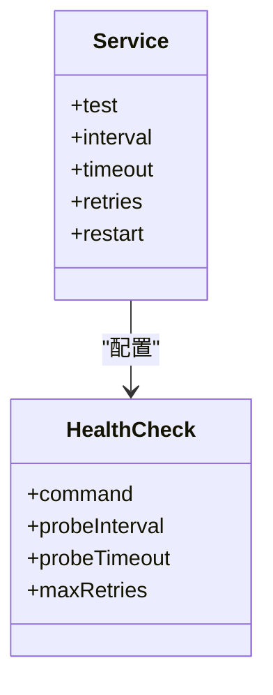

# 健康检查机制

<cite>
**本文引用的文件**
- [DEPLOYMENT.md](file://DEPLOYMENT.md)
- [README.md](file://README.md)
- [docker-compose.yml](file://backend/node_modules/knex/scripts/docker-compose.yml)
- [stress-test/docker-compose.yml](file://backend/node_modules/knex/scripts/stress-test/docker-compose.yml)
</cite>

## 目录
1. [简介](#简介)
2. [项目结构](#项目结构)
3. [核心组件](#核心组件)
4. [架构总览](#架构总览)
5. [详细组件分析](#详细组件分析)
6. [依赖分析](#依赖分析)
7. [性能考量](#性能考量)
8. [故障排除指南](#故障排除指南)
9. [结论](#结论)
10. [附录](#附录)

## 简介
本文件面向运维与开发人员，系统化梳理中创智控官网在生产环境中的健康检查机制与最佳实践。文档聚焦以下服务的健康检查配置与实现策略：
- PostgreSQL（数据库）
- Backend（Strapi 后端 API）
- Frontend（Next.js 前端）
- Nginx（反向代理与入口）

同时，文档总结了 Docker Compose 中健康检查的配置语法、参数含义与最佳实践，并阐述健康检查在容器编排中的作用（自动重启、服务发现与负载均衡的影响），最后提供故障排除清单与常见问题的解决思路。

## 项目结构
围绕健康检查的关键位置与文件如下：
- 生产环境部署与健康检查配置集中在部署文档中
- 健康检查命令与参数在部署文档“监控告警机制”章节明确列出
- 健康检查在部署脚本中被调用，用于自动化验证
- 示例 Docker Compose 文件展示了健康检查的语法与参数

图表来源
- [DEPLOYMENT.md](file://DEPLOYMENT.md#L589-L600)
- [DEPLOYMENT.md](file://DEPLOYMENT.md#L545-L568)
- [docker-compose.yml](file://backend/node_modules/knex/scripts/docker-compose.yml#L11-L52)

章节来源
- [DEPLOYMENT.md](file://DEPLOYMENT.md#L589-L600)
- [DEPLOYMENT.md](file://DEPLOYMENT.md#L545-L568)
- [docker-compose.yml](file://backend/node_modules/knex/scripts/docker-compose.yml#L11-L52)

## 核心组件
- PostgreSQL 健康检查
  - 命令：使用数据库自带工具进行连接与简单查询校验
  - 间隔：30 秒
  - 超时：5 秒
  - 重试：5 次
- Backend（Strapi）健康检查
  - 命令：对后端 API 的健康端点发起请求
  - 间隔：30 秒
  - 超时：10 秒
  - 重试：3 次
- Frontend（Next.js）健康检查
  - 命令：对前端根路径健康端点发起请求
  - 间隔：30 秒
  - 超时：10 秒
  - 重试：3 次
- Nginx 健康检查
  - 命令：对 Nginx 本地健康端点发起请求
  - 间隔：30 秒
  - 超时：5 秒
  - 重试：3 次

章节来源
- [DEPLOYMENT.md](file://DEPLOYMENT.md#L589-L600)

## 架构总览
健康检查在整体架构中的位置如下：
- Nginx 作为统一入口，负责将请求转发至前端与后端
- 健康检查通过 curl 或容器内置健康检查命令探测各服务状态
- 健康检查失败将触发自动重启与编排层面的故障隔离

图表来源
- [DEPLOYMENT.md](file://DEPLOYMENT.md#L38-L67)
- [DEPLOYMENT.md](file://DEPLOYMENT.md#L589-L600)

## 详细组件分析

### PostgreSQL 健康检查
- 健康检查命令：使用数据库工具进行连接与查询校验
- 参数
  - 间隔：30 秒
  - 超时：5 秒
  - 重试：5 次
- 实现要点
  - 健康检查仅验证数据库可达与基本查询能力，不进行业务数据校验
  - 适用于容器编排的自动重启与服务发现联动

图表来源
- [DEPLOYMENT.md](file://DEPLOYMENT.md#L595)

章节来源
- [DEPLOYMENT.md](file://DEPLOYMENT.md#L595)

### Backend（Strapi）健康检查
- 健康检查命令：对后端健康端点发起请求
- 参数
  - 间隔：30 秒
  - 超时：10 秒
  - 重试：3 次
- 实现要点
  - 健康端点通常返回服务可用状态
  - 与 Nginx 层联用，确保 API 可达且响应正常

图表来源
- [DEPLOYMENT.md](file://DEPLOYMENT.md#L596)
- [DEPLOYMENT.md](file://DEPLOYMENT.md#L559-L564)

章节来源
- [DEPLOYMENT.md](file://DEPLOYMENT.md#L596)
- [DEPLOYMENT.md](file://DEPLOYMENT.md#L559-L564)

### Frontend（Next.js）健康检查
- 健康检查命令：对前端根路径健康端点发起请求
- 参数
  - 间隔：30 秒
  - 超时：10 秒
  - 重试：3 次
- 实现要点
  - 健康端点通常返回静态页面或轻量响应
  - 与 Nginx 层联用，确保静态资源与 SSR 能力正常

图表来源
- [DEPLOYMENT.md](file://DEPLOYMENT.md#L597)
- [DEPLOYMENT.md](file://DEPLOYMENT.md#L552-L557)

章节来源
- [DEPLOYMENT.md](file://DEPLOYMENT.md#L597)
- [DEPLOYMENT.md](file://DEPLOYMENT.md#L552-L557)

### Nginx 健康检查
- 健康检查命令：对 Nginx 本地健康端点发起请求
- 参数
  - 间隔：30 秒
  - 超时：5 秒
  - 重试：3 次
- 实现要点
  - 作为统一入口，Nginx 健康检查是服务可用性的前置条件
  - 与证书、重定向、安全头等配置协同工作

图表来源
- [DEPLOYMENT.md](file://DEPLOYMENT.md#L598)

章节来源
- [DEPLOYMENT.md](file://DEPLOYMENT.md#L598)

### Docker Compose 健康检查语法与最佳实践
- 语法要点
  - 健康检查命令（test）支持多种形式（字符串或数组）
  - 间隔（interval）、超时（timeout）、重试（retries）参数用于控制探测节奏与容忍度
  - 建议与 restart 策略配合，实现故障后的自动恢复
- 示例参考
  - 示例 Compose 文件展示了健康检查的常用写法与参数
- 最佳实践
  - 命令应尽量轻量，避免对业务造成干扰
  - 间隔与超时应结合服务启动时间与网络状况合理设置
  - 重试次数不宜过高，以免掩盖长期性故障

图表来源
- [docker-compose.yml](file://backend/node_modules/knex/scripts/docker-compose.yml#L11-L52)

章节来源
- [docker-compose.yml](file://backend/node_modules/knex/scripts/docker-compose.yml#L11-L52)

## 依赖分析
- 健康检查与部署脚本的耦合
  - 部署脚本在启动 Nginx/Certbot 后，调用 curl 对健康端点进行验证
  - 该流程体现了健康检查在自动化部署中的关键作用
- 健康检查与服务发现/负载均衡的关系
  - 健康检查结果直接影响编排系统对容器状态的判定
  - 不健康的容器会被隔离或重启，从而避免流量进入故障实例

图表来源
- [DEPLOYMENT.md](file://DEPLOYMENT.md#L545-L568)

章节来源
- [DEPLOYMENT.md](file://DEPLOYMENT.md#L545-L568)

## 性能考量
- 健康检查的开销
  - 命令应尽量轻量，避免占用过多 CPU/IO
  - 间隔与重试应平衡探测灵敏度与系统负载
- 端到端延迟
  - 健康检查路径应尽可能短，减少对用户请求的影响
- 超时与重试的权衡
  - 过短的超时可能导致误判；过长的重试可能延长恢复时间
- 网络与证书
  - Nginx 健康检查涉及证书链与安全头，需确保配置正确以避免额外延迟

## 故障排除指南
- 常见失败原因与解决思路
  - 容器无法启动
    - 检查端口占用与资源限制
    - 查看容器日志定位启动失败原因
  - 数据库连接失败
    - 检查数据库健康状态与网络连通性
    - 确认凭据与网络策略（容器内访问）
  - API 请求失败
    - 检查 CORS 配置与后端健康端点可达性
  - 前端无法访问
    - 检查 Nginx 配置与静态资源路径
  - SSL 证书问题
    - 检查证书是否存在与续期计划
    - 确认域名解析与 ACME 挑战路径
- 排查流程建议
  - 检查容器状态与日志
  - 使用 curl 直接探测健康端点
  - 检查网络连通与资源使用情况
  - 必要时执行回滚与恢复流程

章节来源
- [DEPLOYMENT.md](file://DEPLOYMENT.md#L1100-L1128)

## 结论
- 健康检查是生产环境稳定运行的重要保障
- 明确的命令、合理的间隔/超时/重试参数以及与部署脚本的集成，能有效提升系统的自愈能力
- 建议在不同服务之间差异化配置健康检查策略，并结合监控与告警形成闭环

## 附录
- 健康检查命令与参数汇总
  - PostgreSQL：命令、间隔 30s、超时 5s、重试 5 次
  - Backend：命令、间隔 30s、超时 10s、重试 3 次
  - Frontend：命令、间隔 30s、超时 10s、重试 3 次
  - Nginx：命令、间隔 30s、超时 5s、重试 3 次

章节来源
- [DEPLOYMENT.md](file://DEPLOYMENT.md#L589-L600)