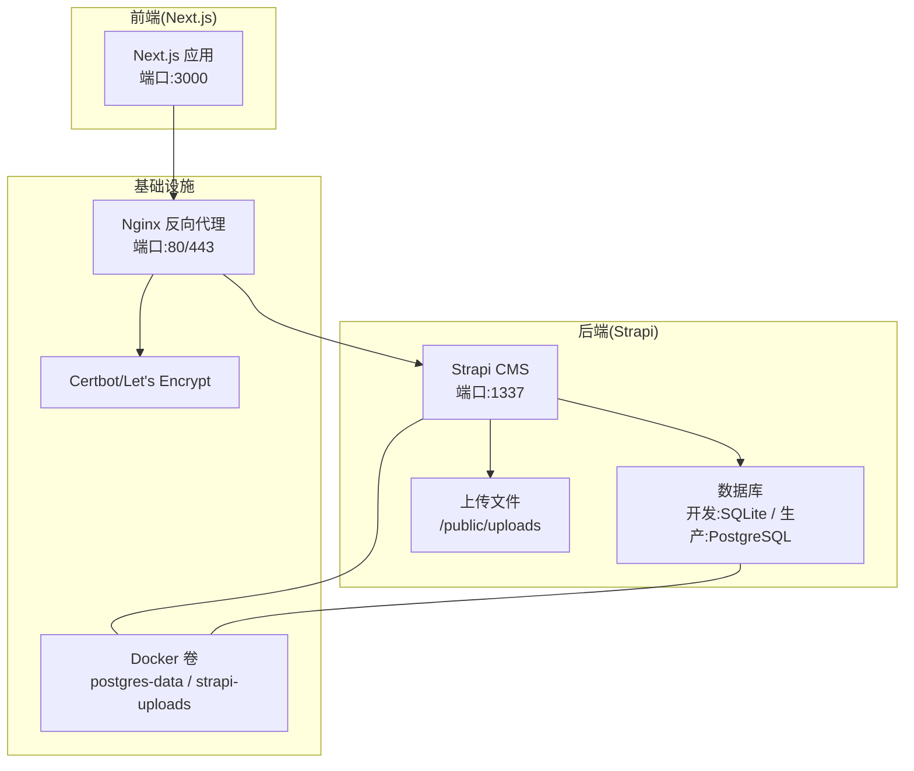
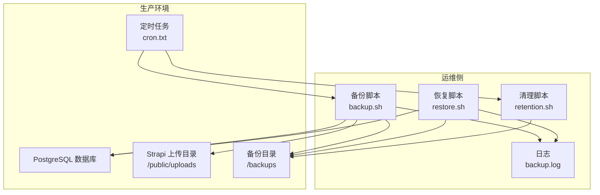
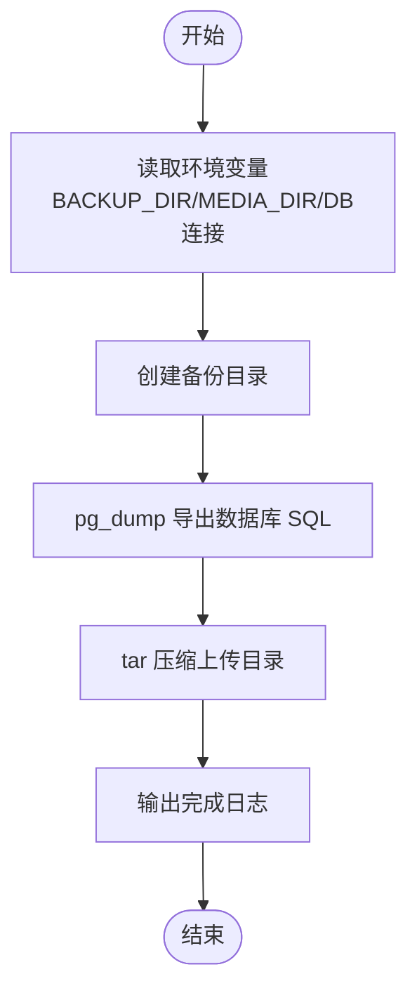
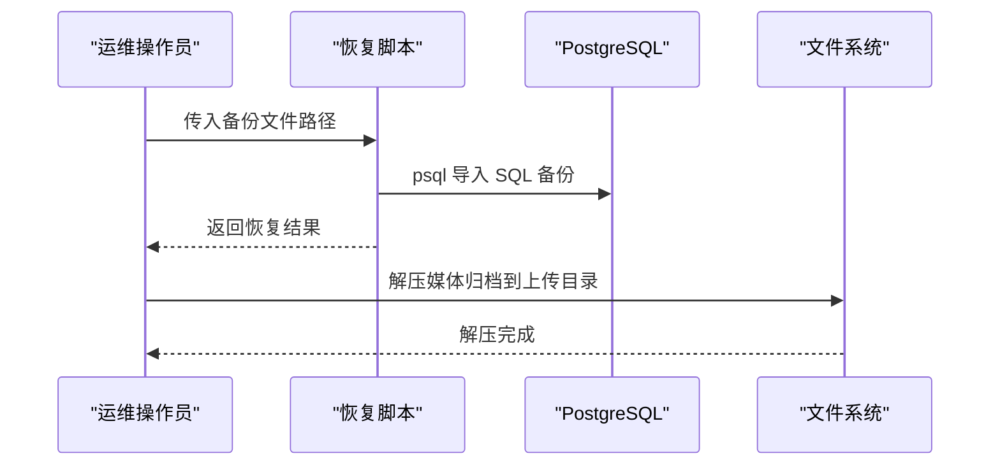
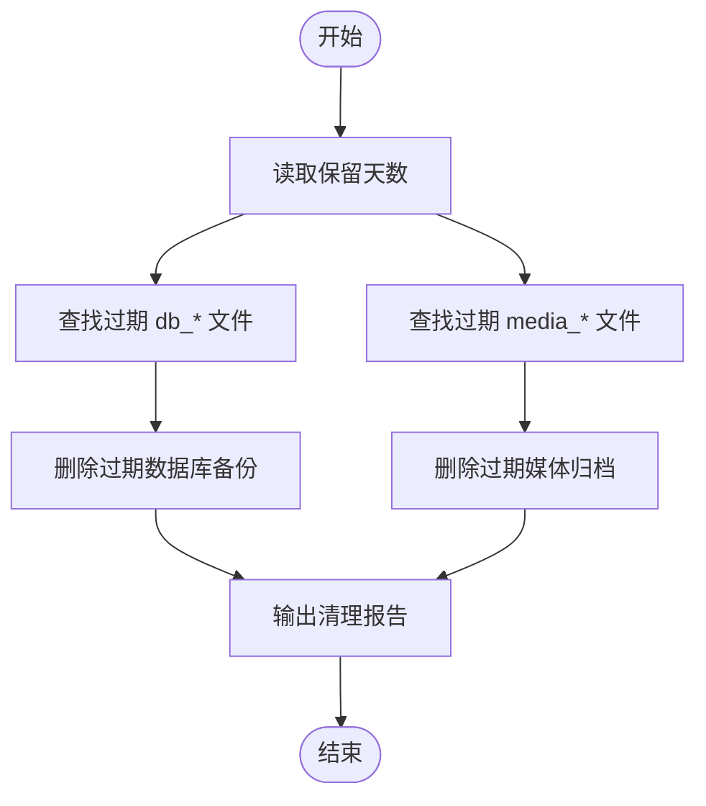
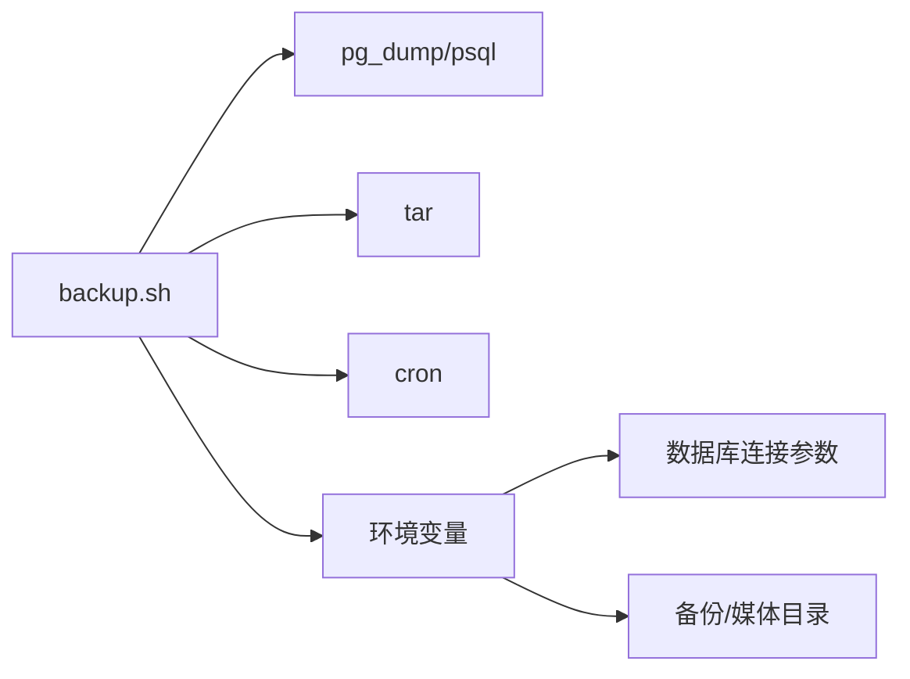

# 备份恢复策略

<cite>
**本文引用的文件**
- [DEPLOYMENT.md](file://DEPLOYMENT.md)
- [README.md](file://README.md)
- [backend/package.json](file://backend/package.json)
- [backend/config/database.ts](file://backend/config/database.ts)
- [backend/.env.example](file://backend/.env.example)
- [download-images.sh](file://download-images.sh)
- [download-images-batch2.sh](file://download-images-batch2.sh)
</cite>

## 目录
1. [简介](#简介)
2. [项目结构](#项目结构)
3. [核心组件](#核心组件)
4. [架构总览](#架构总览)
5. [详细组件分析](#详细组件分析)
6. [依赖关系分析](#依赖关系分析)
7. [性能考量](#性能考量)
8. [故障排查指南](#故障排查指南)
9. [结论](#结论)
10. [附录](#附录)

## 简介
本策略文档面向中创智控官网的运维团队，旨在建立一套标准化、可执行且可验证的备份与恢复管理体系。文档覆盖数据库备份、媒体文件备份与配置备份的策略、脚本实现原理、恢复流程、清理策略以及验证测试方法，帮助团队制定并落地可靠的备份恢复计划。

## 项目结构
官网由前后端分离架构组成，后端基于 Strapi 5，数据库在开发环境默认使用 SQLite，在生产环境建议使用 PostgreSQL；前端基于 Next.js 15。生产环境通过 Docker Compose 编排，使用 Nginx 作为反向代理，并通过 Let’s Encrypt 自动化管理 SSL 证书。运维脚本与配置集中于 ops 目录，其中包含备份、恢复与清理脚本及定时任务配置。

图表来源
- [DEPLOYMENT.md](file://DEPLOYMENT.md#L34-L85)
- [backend/config/database.ts](file://backend/config/database.ts#L1-L61)

章节来源
- [DEPLOYMENT.md](file://DEPLOYMENT.md#L1-L1366)
- [backend/config/database.ts](file://backend/config/database.ts#L1-L61)

## 核心组件
- 数据库备份：针对生产环境 PostgreSQL 的完整备份，使用 pg_dump 生成 SQL 备份文件。
- 媒体文件备份：对 Strapi 上传目录进行归档压缩，确保静态资源可恢复。
- 配置备份：包含后端环境变量(.env)、Strapi 密钥(APP_KEYS、JWT_SECRET 等)与生产环境配置文件。
- 备份脚本：封装备份流程，统一命名规范，便于检索与清理。
- 恢复脚本：按类型分别恢复数据库与媒体文件。
- 清理脚本：按保留期限自动删除过期备份。
- 定时任务：通过 cron 定时触发备份与清理任务。

章节来源
- [DEPLOYMENT.md](file://DEPLOYMENT.md#L649-L744)

## 架构总览
备份与恢复体系围绕“生产环境”展开，备份脚本在生产容器内执行，将备份文件写入持久化卷，再由运维人员或外部系统进行归档与异地保存。恢复时根据备份文件类型选择对应恢复流程，确保数据与媒体文件的一致性。

图表来源
- [DEPLOYMENT.md](file://DEPLOYMENT.md#L663-L744)

## 详细组件分析

### 备份策略
- 备份类型
  - 数据库备份：PostgreSQL 完整备份（SQL）
  - 文件备份：媒体文件归档（tar.gz）
  - 配置备份：后端环境变量与密钥
- 备份频率
  - 数据库：每日凌晨 2:00
  - 文件：每日凌晨 2:30
  - 清理：每周日凌晨 2:30（保留最近 7 天）
- 保留期限
  - 默认保留 7 天，可通过环境变量调整

章节来源
- [DEPLOYMENT.md](file://DEPLOYMENT.md#L651-L662)

### 备份脚本实现原理
- 脚本入口与参数
  - 通过环境变量 BACKUP_DIR、MEDIA_DIR、数据库连接参数控制备份路径与目标。
- 数据库备份
  - 使用 pg_dump 导出 SQL 文件，文件名包含数据库名与时间戳，便于识别与恢复。
- 媒体文件归档
  - 使用 tar -czf 对上传目录进行压缩归档，文件名包含时间戳。
- 命名规范
  - 数据库备份：db_{数据库名}_{YYYYMMDD_HHMMSS}.sql
  - 媒体归档：media_{YYYYMMDD_HHMMSS}.tar.gz
- 日志与退出
  - 输出完成提示，重定向至 backup.log 以便审计。

图表来源
- [DEPLOYMENT.md](file://DEPLOYMENT.md#L665-L690)

章节来源
- [DEPLOYMENT.md](file://DEPLOYMENT.md#L663-L690)

### 恢复流程
- 数据库恢复
  - 传入备份 SQL 文件路径，使用 psql 将其导入目标数据库。
- 媒体文件恢复
  - 解压 media_{timestamp}.tar.gz 至上传目录，覆盖历史文件。
- 恢复顺序建议
  - 先恢复数据库，再恢复媒体文件，最后重启服务以确保一致。
- 注意事项
  - 恢复前需确认数据库连接参数与目标数据库一致。
  - 恢复媒体文件前建议备份当前上传目录，防止覆盖丢失。

图表来源
- [DEPLOYMENT.md](file://DEPLOYMENT.md#L701-L727)

章节来源
- [DEPLOYMENT.md](file://DEPLOYMENT.md#L701-L727)

### 备份清理策略
- 清理逻辑
  - 基于文件名匹配 db_*.sql 与 media_*.tar.gz，按保留天数删除过期文件。
- 保留期限
  - 默认 7 天，可通过环境变量 RETENTION_DAYS 调整。
- 定时任务
  - 每周日凌晨 2:30 执行清理脚本，避免占用工作日带宽与存储。

图表来源
- [DEPLOYMENT.md](file://DEPLOYMENT.md#L729-L743)

章节来源
- [DEPLOYMENT.md](file://DEPLOYMENT.md#L729-L743)

### 备份验证与测试
- 验证清单
  - 备份文件存在且命名规范正确
  - 数据库 SQL 可被 psql 正常导入（建议在隔离环境验证）
  - 媒体归档可正常解压，关键文件可访问
  - 定时任务日志无错误
- 测试建议
  - 每月进行一次“还原演练”，模拟恢复流程，验证完整性与时效性
  - 对关键内容（产品、新闻）进行抽样比对，确保字段与索引一致

章节来源
- [DEPLOYMENT.md](file://DEPLOYMENT.md#L649-L744)

## 依赖关系分析
- 备份脚本依赖
  - PostgreSQL 客户端工具：pg_dump、psql
  - 压缩工具：tar
  - 定时任务：cron
- 配置依赖
  - 数据库连接参数：主机、端口、用户名、密码、数据库名
  - 备份目录与媒体目录路径
- 运行环境
  - Docker 容器内具备上述工具与权限
  - 备份目录映射到持久化卷，保证跨容器重启不丢失

图表来源
- [DEPLOYMENT.md](file://DEPLOYMENT.md#L663-L744)

章节来源
- [DEPLOYMENT.md](file://DEPLOYMENT.md#L663-L744)

## 性能考量
- 备份窗口
  - 选择业务低峰时段（凌晨）执行，避免影响线上性能
- 存储与带宽
  - 媒体文件体量较大，建议使用压缩与增量策略（如后续演进）
- I/O 影响
  - 数据库备份期间建议短暂停写，或评估在线备份方案
- 日志与监控
  - 定期检查 backup.log，关注耗时与错误

## 故障排查指南
- 常见问题
  - 备份脚本找不到工具：确认容器内已安装 PostgreSQL 客户端与 tar
  - 权限不足：检查备份目录与媒体目录的读写权限
  - 数据库连接失败：核对主机、端口、用户名、密码与数据库名
  - 定时任务未执行：检查 cron 是否启动、crontab 是否正确加载
- 恢复验证
  - 恢复后访问关键页面，确认内容与媒体资源可正常加载
  - 核对数据库版本与编码，避免兼容性问题

章节来源
- [DEPLOYMENT.md](file://DEPLOYMENT.md#L649-L744)

## 结论
通过标准化的备份类型、严格的命名规范、自动化的定时任务与清晰的恢复流程，中创智控官网可建立稳健的备份恢复体系。建议运维团队定期演练与验证，持续优化备份窗口与清理策略，确保在发生故障时能快速、可靠地恢复业务。

## 附录

### 备份与恢复操作指引
- 数据库备份
  - 执行备份脚本，确认输出包含数据库与媒体文件路径
- 媒体文件备份
  - 确认媒体归档已生成，校验关键目录结构
- 配置备份
  - 备份后端 .env 与生产环境配置文件，确保密钥与连接参数齐全
- 恢复数据库
  - 使用恢复脚本导入 SQL 备份，核对导入日志
- 恢复媒体文件
  - 解压媒体归档至上传目录，核对文件完整性
- 清理过期备份
  - 确认清理脚本按保留天数删除过期文件

章节来源
- [DEPLOYMENT.md](file://DEPLOYMENT.md#L649-L744)

### 环境变量与配置要点
- 数据库配置
  - 开发环境：SQLite（默认）
  - 生产环境：PostgreSQL（需在部署文档中配置）
- 密钥与安全
  - Strapi APP_KEYS、JWT_SECRET、ENCRYPTION_KEY 等需妥善保管
- 媒体目录
  - 默认上传目录为后端 public/uploads，备份时需一并归档

章节来源
- [backend/config/database.ts](file://backend/config/database.ts#L1-L61)
- [backend/.env.example](file://backend/.env.example#L1-L15)
- [DEPLOYMENT.md](file://DEPLOYMENT.md#L148-L222)

### 媒体资源准备（可选）
- 项目提供了批量下载图片的脚本，可用于本地开发或演示环境的媒体资源准备，便于验证媒体备份与恢复流程。

章节来源
- [download-images.sh](file://download-images.sh#L1-L107)
- [download-images-batch2.sh](file://download-images-batch2.sh#L1-L130)