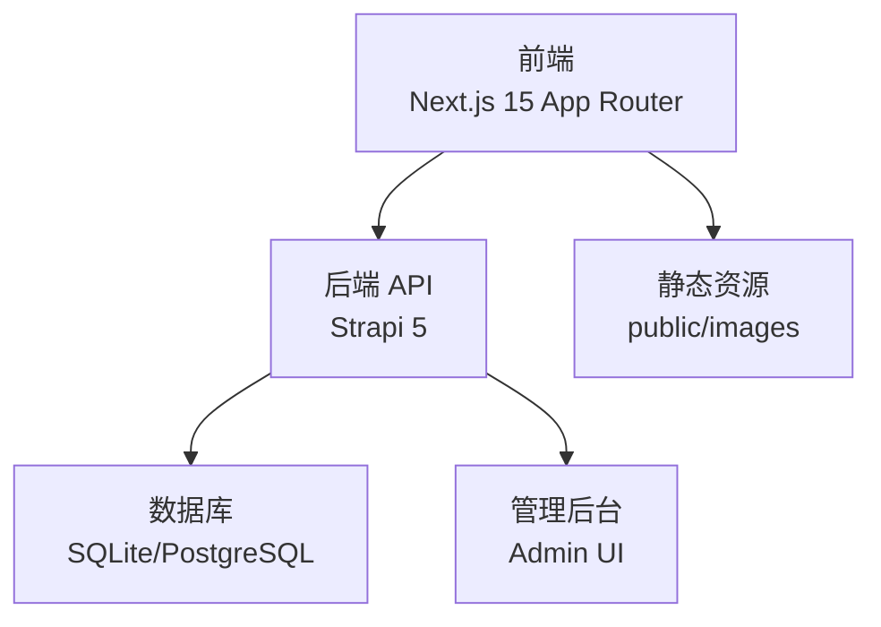
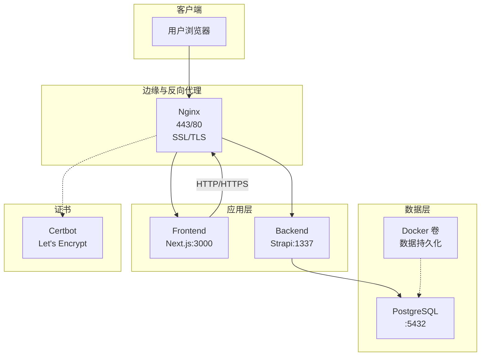
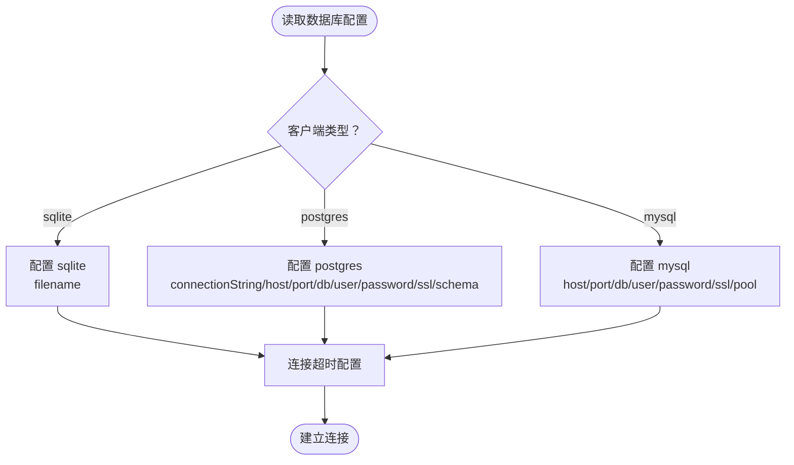
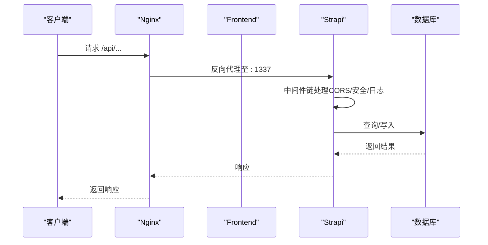
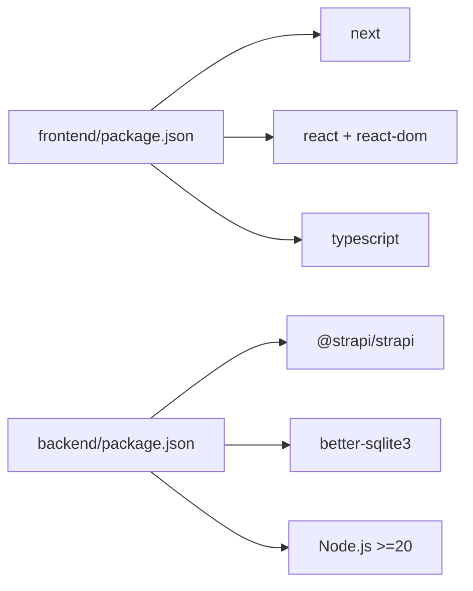

# 故障排查指南

<cite>
**本文引用的文件**
- [README.md](file://README.md)
- [DEPLOYMENT.md](file://DEPLOYMENT.md)
- [backend/.env.example](file://backend/.env.example)
- [frontend/.env.example](file://frontend/.env.example)
- [backend/package.json](file://backend/package.json)
- [frontend/package.json](file://frontend/package.json)
- [backend/config/database.ts](file://backend/config/database.ts)
- [backend/config/server.ts](file://backend/config/server.ts)
- [backend/config/middlewares.ts](file://backend/config/middlewares.ts)
</cite>

## 目录
1. [简介](#简介)
2. [项目结构](#项目结构)
3. [核心组件](#核心组件)
4. [架构总览](#架构总览)
5. [详细组件分析](#详细组件分析)
6. [依赖分析](#依赖分析)
7. [性能考虑](#性能考虑)
8. [故障排查指南](#故障排查指南)
9. [结论](#结论)
10. [附录](#附录)

## 简介
本指南面向中创智控官网（前后端分离架构）的运维与开发团队，提供系统化的故障排查流程与解决方案，覆盖容器启动失败、服务不可用、数据库连接异常、SSL 证书问题、性能瓶颈等常见问题。文档同时给出常用排查命令、工具与应急响应流程，帮助快速定位与恢复生产环境。

## 项目结构
项目采用前后端分离架构：
- 前端：Next.js 15 App Router，负责页面渲染与交互，通过 API 客户端与后端 Strapi CMS 通信。
- 后端：Strapi 5 CMS，提供 RESTful API 与 Admin UI，支持 SQLite（开发）与 PostgreSQL（生产）数据库。

图表来源
- [README.md](file://README.md#L231-L298)

章节来源
- [README.md](file://README.md#L66-L298)

## 核心组件
- 前后端分离：前端通过环境变量指向后端 API，支持静态内容与动态内容两种模式。
- 数据库配置：支持 SQLite（默认）与 PostgreSQL（生产），可通过环境变量切换。
- 中间件与 CORS：后端中间件链包含 CORS，确保跨域访问。
- 部署与容器化：生产环境采用 Docker Compose 编排，Nginx 反向代理 + Let's Encrypt 自动化证书管理。

章节来源
- [README.md](file://README.md#L555-L623)
- [backend/config/database.ts](file://backend/config/database.ts#L1-L61)
- [backend/config/middlewares.ts](file://backend/config/middlewares.ts#L1-L13)

## 架构总览
生产环境整体架构如下：

图表来源
- [DEPLOYMENT.md](file://DEPLOYMENT.md#L34-L100)
- [DEPLOYMENT.md](file://DEPLOYMENT.md#L322-L411)

章节来源
- [DEPLOYMENT.md](file://DEPLOYMENT.md#L34-L100)
- [DEPLOYMENT.md](file://DEPLOYMENT.md#L322-L411)

## 详细组件分析

### 数据库配置与连接
- 支持三种客户端：mysql、postgres、sqlite；默认 sqlite 用于开发。
- PostgreSQL 支持连接字符串与主机直连两种方式，可配置 SSL 参数与连接池。
- 开发环境默认 SQLite 文件路径在后端根目录下，生产环境默认使用 PostgreSQL。

图表来源
- [backend/config/database.ts](file://backend/config/database.ts#L1-L61)

章节来源
- [backend/config/database.ts](file://backend/config/database.ts#L1-L61)
- [backend/.env.example](file://backend/.env.example#L1-L15)

### 服务器与中间件
- 服务器监听地址与端口可配置，默认监听 0.0.0.0:1337。
- 中间件链包含日志、错误处理、安全、CORS、查询、Body、Session、静态资源等，确保跨域与基本安全。

图表来源
- [backend/config/middlewares.ts](file://backend/config/middlewares.ts#L1-L13)
- [backend/config/server.ts](file://backend/config/server.ts#L1-L8)

章节来源
- [backend/config/server.ts](file://backend/config/server.ts#L1-L8)
- [backend/config/middlewares.ts](file://backend/config/middlewares.ts#L1-L13)

### 健康检查与日志
- 健康检查端点：前端 /healthz、后端 /api/healthz。
- 日志查看：Docker Compose 日志命令支持按服务过滤与尾部行数查看。
- 健康检查周期与超时：容器健康检查配置包含数据库、后端、前端、Nginx 的检查参数。

章节来源
- [DEPLOYMENT.md](file://DEPLOYMENT.md#L587-L631)

## 依赖分析
- 前端依赖 Next.js 15、React 18、TypeScript，使用 pnpm 管理。
- 后端依赖 Strapi 5、better-sqlite3（开发）、Node.js 20+。
- 生产环境使用 PostgreSQL，Nginx 反向代理，Certbot 自动证书管理。

图表来源
- [frontend/package.json](file://frontend/package.json#L1-L88)
- [backend/package.json](file://backend/package.json#L1-L45)

章节来源
- [frontend/package.json](file://frontend/package.json#L1-L88)
- [backend/package.json](file://backend/package.json#L1-L45)

## 性能考虑
- 资源配置：根据监控指标（CPU、内存、磁盘）设定阈值，避免过载。
- 数据库连接池：合理设置最小/最大连接数，避免连接耗尽。
- 缓存策略：利用 Nginx 缓存静态资源，减少后端压力。
- 负载均衡：生产环境通过 Nginx 提供入口，必要时可横向扩展容器副本。

章节来源
- [DEPLOYMENT.md](file://DEPLOYMENT.md#L632-L646)

## 故障排查指南

### 一、问题识别与分类
- 容器启动失败：检查容器日志、端口占用、卷挂载、环境变量。
- 服务不可用：验证 Nginx 反代、健康检查端点、后端 API 可达性。
- 数据库连接异常：确认数据库类型、连接字符串、SSL 配置、连接池与超时。
- SSL 证书问题：检查证书文件存在性、续期脚本、Nginx 配置。
- 性能瓶颈：观察响应时间、错误率、资源使用率与数据库连接数。

章节来源
- [DEPLOYMENT.md](file://DEPLOYMENT.md#L587-L646)

### 二、系统化排查流程
1. 问题识别
   - 明确故障现象（页面空白、502/504、API 404/500、数据库报错、证书过期）。
   - 确定受影响范围（仅前端、仅后端、数据库、证书）。
2. 日志分析
   - 查看容器日志：按服务过滤、查看最近日志。
   - 检查 Nginx 访问/错误日志与健康检查日志。
3. 配置检查
   - 环境变量：确认域名、数据库连接、密钥、代理设置。
   - CORS 与中间件：确保跨域与安全中间件配置正确。
4. 环境验证
   - 端口连通性：curl 测试 /healthz 与 /api/healthz。
   - 数据库可达性：使用数据库客户端连接验证。
   - 证书有效性：检查证书文件与续期计划。

章节来源
- [DEPLOYMENT.md](file://DEPLOYMENT.md#L587-L631)
- [backend/config/middlewares.ts](file://backend/config/middlewares.ts#L1-L13)

### 三、常用排查命令与工具
- 容器状态与日志
  - 查看所有服务日志：docker compose logs -f
  - 查看特定服务日志：docker compose logs -f <service>
  - 查看最近 100 行日志：docker compose logs --tail=100
- 网络与健康检查
  - curl -f https://<domain>/healthz
  - curl -f https://<domain>/api/healthz
- 数据库连接验证
  - PostgreSQL：使用 psql 连接验证（主机、端口、数据库、用户、密码）。
  - SQLite：确认文件路径与权限。
- API 接口测试
  - curl -f https://<domain>/api/products
  - curl -f https://<domain>/api/news

章节来源
- [DEPLOYMENT.md](file://DEPLOYMENT.md#L618-L631)
- [backend/config/database.ts](file://backend/config/database.ts#L25-L44)

### 四、故障场景与处置

#### 1) 容器启动失败
- 现象：容器反复重启、日志报端口冲突、卷挂载失败。
- 步骤：
  - 查看日志：docker compose logs <service>
  - 检查端口占用：netstat/ss 命令确认 3000/1337/5432 是否被占用。
  - 检查卷与权限：确认数据卷存在且权限正确。
  - 检查环境变量：确认 .env.prod 与 .env 正确。
- 处置：修复端口/卷/权限后重建容器。

章节来源
- [DEPLOYMENT.md](file://DEPLOYMENT.md#L587-L631)

#### 2) 服务不可用（502/504/404）
- 现象：浏览器返回 502/504/404，健康检查失败。
- 步骤：
  - 检查 Nginx 配置与证书：确认站点配置与证书路径。
  - 检查后端 API：curl /api/healthz。
  - 检查前端：curl /healthz。
  - 检查 CORS：确认跨域白名单与中间件顺序。
- 处置：修复 Nginx 配置、后端服务或前端静态资源路径。

章节来源
- [DEPLOYMENT.md](file://DEPLOYMENT.md#L587-L631)
- [backend/config/middlewares.ts](file://backend/config/middlewares.ts#L1-L13)

#### 3) 数据库连接异常
- 现象：后端启动时报数据库连接错误、查询超时。
- 步骤：
  - 确认 DATABASE_CLIENT 与连接参数（PostgreSQL 连接字符串或主机直连）。
  - 检查 SSL 配置（生产环境建议开启并校验证书）。
  - 检查连接池大小与超时时间。
  - 验证数据库服务可达性与凭据。
- 处置：修正连接参数、增加连接池、修复凭据或网络策略。

章节来源
- [backend/config/database.ts](file://backend/config/database.ts#L1-L61)
- [backend/.env.example](file://backend/.env.example#L1-L15)

#### 4) SSL 证书问题
- 现象：浏览器提示证书不受信任、证书过期或 Nginx 加载失败。
- 步骤：
  - 检查证书文件是否存在：/etc/letsencrypt/live/<domain>/*。
  - 执行续期脚本：certbot renew。
  - 检查 Nginx 配置中的证书路径与协议版本。
  - 验证域名解析与 ACME 挑战路径。
- 处置：重新初始化证书、修复 Nginx 配置、更新 DNS。

章节来源
- [DEPLOYMENT.md](file://DEPLOYMENT.md#L322-L411)
- [DEPLOYMENT.md](file://DEPLOYMENT.md#L587-L631)

#### 5) 性能瓶颈
- 现象：页面加载缓慢、API 响应超时、错误率上升。
- 步骤：
  - 监控资源使用率（CPU/内存/磁盘）。
  - 检查数据库连接数与慢查询。
  - 评估缓存命中率与静态资源优化。
  - 调整连接池、增加副本或启用 CDN。
- 处置：优化数据库、提升资源配额、启用缓存与压缩。

章节来源
- [DEPLOYMENT.md](file://DEPLOYMENT.md#L632-L646)

### 五、应急响应流程
- 立即响应
  - 通知值班团队，隔离故障影响面（如临时关闭部分功能）。
  - 快速回滚：停止新版本容器，启动上一个稳定版本。
- 诊断与修复
  - 依据“系统化排查流程”逐项验证。
  - 修复后进行健康检查与回归测试。
- 验证与恢复
  - 端到端验证：浏览器访问首页、API 调用、数据库查询。
  - 监控告警：确认错误率、响应时间、资源使用率恢复正常。
- 复盘与改进
  - 输出故障报告，补充监控与告警策略。

章节来源
- [DEPLOYMENT.md](file://DEPLOYMENT.md#L587-L646)

## 结论
本指南提供了从架构理解到具体故障场景的系统化排查方法，配合常用命令与应急流程，能够帮助运维团队快速定位并恢复生产环境问题。建议结合监控与自动化脚本，持续优化部署与运维流程。

## 附录

### A. 环境变量与配置要点
- 前端
  - NEXT_PUBLIC_STRAPI_URL：指向后端 API 地址（开发/生产）。
- 后端
  - HOST/PORT：监听地址与端口。
  - DATABASE_CLIENT/DATABASE_URL/HOST/PORT/NAME/USERNAME/PASSWORD：数据库配置。
  - APP_KEYS/JWT_SECRET/ENCRYPTION_KEY：安全密钥（生产必须随机化）。
  - HTTP_PROXY/HTTPS_PROXY/NO_PROXY：网络代理（如需）。

章节来源
- [frontend/.env.example](file://frontend/.env.example#L1-L2)
- [backend/.env.example](file://backend/.env.example#L1-L15)
- [backend/config/server.ts](file://backend/config/server.ts#L1-L8)
- [backend/config/database.ts](file://backend/config/database.ts#L25-L44)

### B. 健康检查与日志参考
- 健康检查端点
  - 前端：/healthz
  - 后端：/api/healthz
- 日志查看
  - docker compose logs -f
  - docker compose logs -f <service>
  - docker compose logs --tail=100

章节来源
- [DEPLOYMENT.md](file://DEPLOYMENT.md#L587-L631)