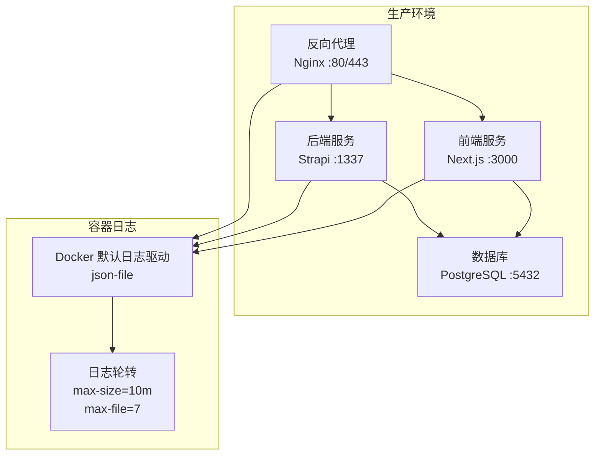
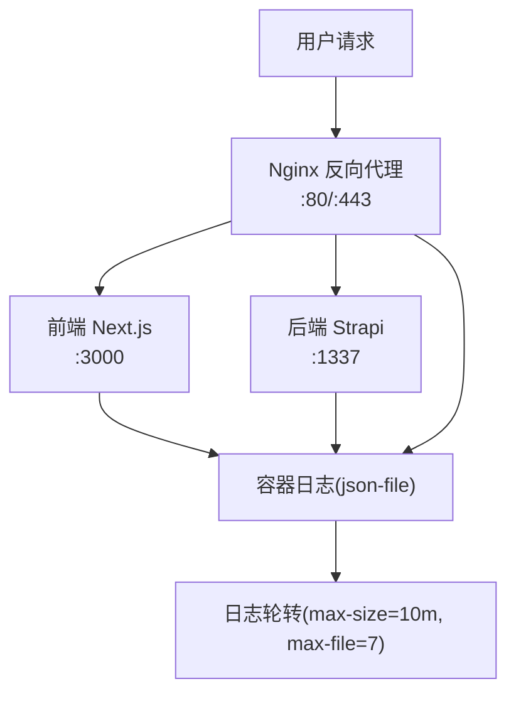
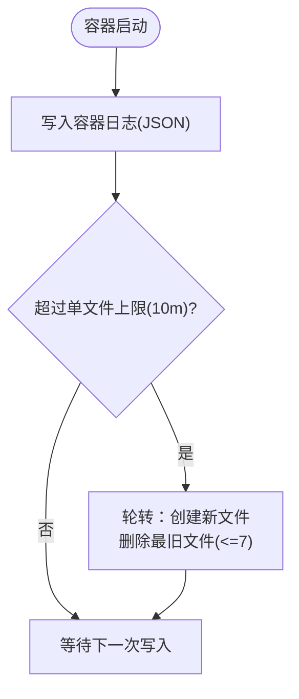
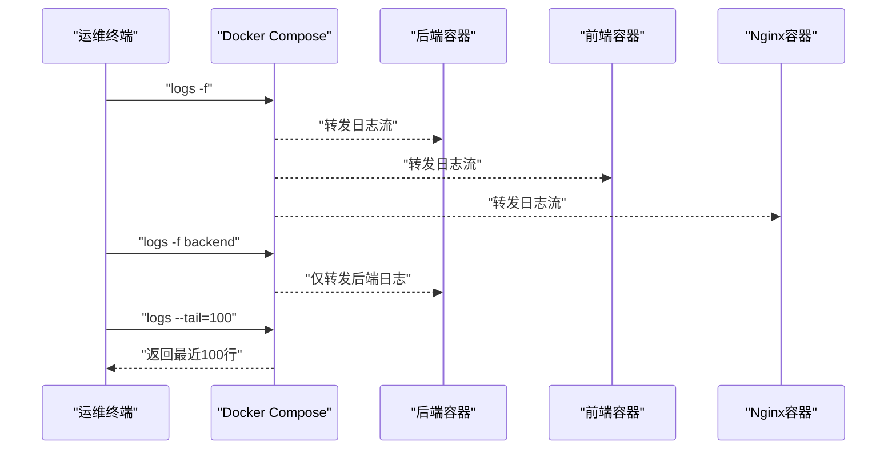
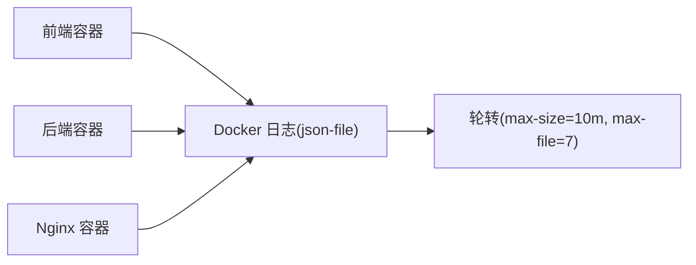

# 日志管理系统

<cite>
**本文引用的文件**
- [DEPLOYMENT.md](file://DEPLOYMENT.md)
- [开发与生产环境分离方案.md](file://开发与生产环境分离方案.md)
- [README.md](file://README.md)
- [backend/package.json](file://backend/package.json)
- [frontend/package.json](file://frontend/package.json)
</cite>

## 目录
1. [简介](#简介)
2. [项目结构](#项目结构)
3. [核心组件](#核心组件)
4. [架构总览](#架构总览)
5. [详细组件分析](#详细组件分析)
6. [依赖关系分析](#依赖关系分析)
7. [性能考量](#性能考量)
8. [故障排查指南](#故障排查指南)
9. [结论](#结论)
10. [附录](#附录)

## 简介
本文件面向中创智控官网的运维与开发团队，系统化梳理并说明日志收集、管理和分析策略。依据仓库中的部署与运维文档，当前生产环境采用 Docker Compose 编排，容器日志默认使用 json-file 驱动，并通过日志轮转参数控制单文件大小与保留文件数量；同时提供了统一的日志查看命令，便于快速定位问题。本文将围绕以下方面展开：
- Docker 默认日志驱动与轮转策略（最大日志大小与文件数量）
- 日志查看与管理命令（全量、按服务、按行数）
- 故障排查中的日志作用（错误定位、性能分析、安全审计）
- 日志分析工具与最佳实践（聚合、搜索、监控建议）

## 项目结构
中创智控官网采用前后端分离架构，生产环境通过 Docker Compose 编排，包含前端、后端、数据库与反向代理等服务。日志管理策略在部署文档中明确给出。

图表来源
- [DEPLOYMENT.md](file://DEPLOYMENT.md#L38-L85)
- [DEPLOYMENT.md](file://DEPLOYMENT.md#L600-L630)

章节来源
- [README.md](file://README.md#L229-L298)
- [DEPLOYMENT.md](file://DEPLOYMENT.md#L34-L100)

## 核心组件
- Docker 容器日志驱动：默认使用 json-file，便于结构化日志采集与后续处理。
- 日志轮转配置：通过 max-size 与 max-file 控制单文件大小与保留文件数量，避免磁盘占用无限增长。
- 日志查看命令：提供查看全部服务日志、特定服务日志以及最近若干行日志的常用命令。
- 健康检查与日志联动：健康检查失败时，优先通过日志定位根因，再结合指标监控进行深入分析。

章节来源
- [DEPLOYMENT.md](file://DEPLOYMENT.md#L600-L630)

## 架构总览
下图展示了生产环境的服务拓扑与日志流向，强调容器日志经由 Docker 默认驱动输出，并通过轮转策略进行容量控制。

图表来源
- [DEPLOYMENT.md](file://DEPLOYMENT.md#L38-L85)
- [DEPLOYMENT.md](file://DEPLOYMENT.md#L600-L630)

## 详细组件分析

### Docker 默认日志驱动与轮转策略
- 默认驱动：json-file，便于以结构化 JSON 形式输出容器标准输出与标准错误，利于后续采集与解析。
- 轮转参数：
  - 单文件最大大小：10MB
  - 最大保留文件数：7
- 作用：防止单容器日志文件过大导致磁盘压力，同时保留近期多份日志以便回溯。

图表来源
- [DEPLOYMENT.md](file://DEPLOYMENT.md#L607-L616)

章节来源
- [DEPLOYMENT.md](file://DEPLOYMENT.md#L600-L616)

### 日志查看与管理命令
- 查看所有服务日志（持续跟踪）
  - docker compose ... logs -f
- 查看特定服务日志（如后端、前端、Nginx）
  - docker compose ... logs -f backend
  - docker compose ... logs -f frontend
  - docker compose ... logs -f nginx
- 查看最近若干行日志
  - docker compose ... logs --tail=100

图表来源
- [DEPLOYMENT.md](file://DEPLOYMENT.md#L618-L630)

章节来源
- [DEPLOYMENT.md](file://DEPLOYMENT.md#L618-L630)

### 日志在故障排查中的作用
- 错误定位：通过查看对应服务容器日志，快速定位异常堆栈、错误码与上下文。
- 性能分析：结合日志中的请求耗时、数据库查询时间等字段，定位慢点与瓶颈。
- 安全审计：记录认证失败、越权访问、异常请求等事件，配合外部 SIEM/日志平台进行审计。

章节来源
- [DEPLOYMENT.md](file://DEPLOYMENT.md#L632-L646)

### 日志分析工具与最佳实践
- 日志聚合：建议使用集中式日志平台（如 ELK/EFK、Loki+Grafana、Cloud Logging 等）采集各容器日志，统一检索与可视化。
- 搜索与过滤：基于标签（service、level、trace-id）进行过滤，建立常用查询模板。
- 监控与告警：将日志指标（错误率、异常峰值、响应时间分布）接入监控系统，设置阈值告警。
- 最佳实践：
  - 统一日志格式（JSON），包含时间戳、服务名、级别、模块、请求 ID 等关键字段。
  - 为不同环境设置不同的日志级别（开发/测试/生产）。
  - 定期清理过期日志与归档历史数据，避免磁盘压力。
  - 对敏感信息脱敏（如密码、Token），遵守数据保护规范。

章节来源
- [DEPLOYMENT.md](file://DEPLOYMENT.md#L600-L646)

## 依赖关系分析
- 前端与后端均通过 Docker 容器运行，日志统一由 Docker 管理。
- Nginx 作为入口，其访问/错误日志可单独采集与分析。
- 数据库日志可通过容器内日志或数据库自身日志文件采集。

图表来源
- [DEPLOYMENT.md](file://DEPLOYMENT.md#L38-L85)
- [DEPLOYMENT.md](file://DEPLOYMENT.md#L600-L616)

章节来源
- [README.md](file://README.md#L281-L298)
- [DEPLOYMENT.md](file://DEPLOYMENT.md#L34-L100)

## 性能考量
- 日志轮转参数直接影响磁盘占用与 IO 压力，建议根据业务流量与磁盘容量评估并调优。
- 集中式日志平台的采集与索引会带来 CPU/内存开销，需结合日志量与查询频次进行容量规划。
- 建议对高频错误与异常进行采样降噪，避免日志风暴影响系统稳定性。

## 故障排查指南
- 健康检查失败
  - 通过 docker compose logs 查看对应服务日志，定位启动异常或依赖问题。
  - 若涉及数据库连接，检查数据库容器日志与网络连通性。
- 请求超时或错误
  - 从 Nginx 访问日志入手，确认请求路径与状态码；随后查看后端日志定位具体错误。
- 性能退化
  - 结合日志中的请求耗时与数据库查询时间，定位慢接口与慢查询。
- 安全事件
  - 检查认证失败、越权访问等异常日志，必要时联动防火墙与 WAF。

章节来源
- [DEPLOYMENT.md](file://DEPLOYMENT.md#L589-L646)

## 结论
本项目在生产环境中采用 Docker 默认日志驱动与合理的轮转策略，配合简洁的日志查看命令，能够满足日常运维与故障排查的基本需求。建议在现有基础上引入集中式日志平台，完善日志格式标准化、检索模板与监控告警体系，进一步提升可观测性与问题定位效率。

## 附录
- 常用命令参考
  - 查看全部服务日志：docker compose ... logs -f
  - 查看特定服务日志：docker compose ... logs -f backend / frontend / nginx
  - 查看最近100行：docker compose ... logs --tail=100
- 环境与版本要点
  - 前端：Next.js 15、Node.js
  - 后端：Strapi 5、Node.js
  - 基础设施：Docker 24+、Docker Compose 2.20+、Nginx 1.27、PostgreSQL 16（生产）

章节来源
- [DEPLOYMENT.md](file://DEPLOYMENT.md#L618-L630)
- [README.md](file://README.md#L53-L64)
- [backend/package.json](file://backend/package.json#L36-L43)
- [frontend/package.json](file://frontend/package.json#L12-L11)