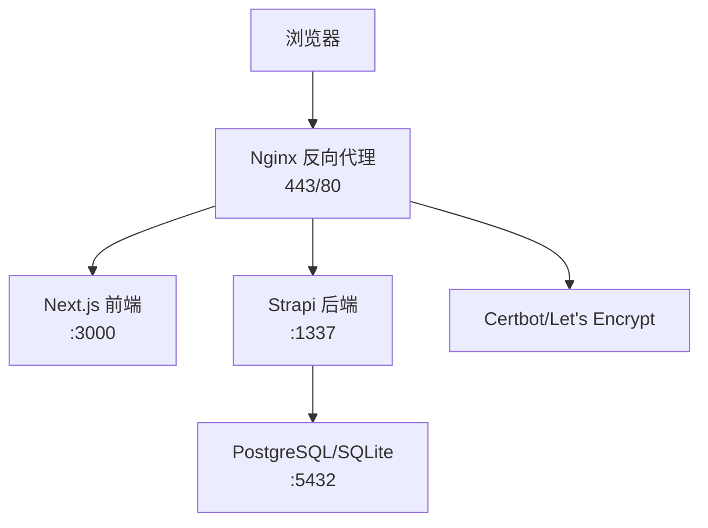
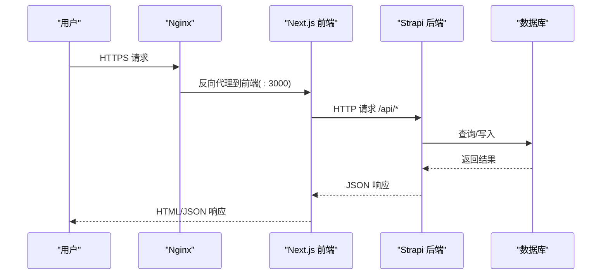
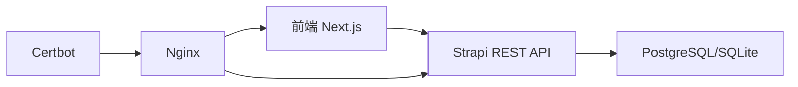

# 监控指标体系

<cite>
**本文引用的文件**
- [README.md](file://README.md)
- [DEPLOYMENT.md](file://DEPLOYMENT.md)
- [开发与生产环境分离方案.md](file://开发与生产环境分离方案.md)
- [backend/src/index.ts](file://backend/src/index.ts)
- [backend/config/middlewares.ts](file://backend/config/middlewares.ts)
- [backend/config/server.ts](file://backend/config/server.ts)
- [backend/config/api.ts](file://backend/config/api.ts)
- [backend/package.json](file://backend/package.json)
- [frontend/lib/strapi.ts](file://frontend/lib/strapi.ts)
- [frontend/package.json](file://frontend/package.json)
</cite>

## 目录
1. [简介](#简介)
2. [项目结构](#项目结构)
3. [核心组件](#核心组件)
4. [架构总览](#架构总览)
5. [详细组件分析](#详细组件分析)
6. [依赖关系分析](#依赖关系分析)
7. [性能考量](#性能考量)
8. [故障排查指南](#故障排查指南)
9. [结论](#结论)
10. [附录](#附录)

## 简介
本文件面向中创智控官网的运维与开发团队，系统化梳理并制定一套完整的监控指标体系。该体系涵盖系统资源监控、服务可用性监控、业务指标监控，并给出采集、存储与可视化的集成建议，帮助团队建立稳定、可观测、可预警的生产环境。

## 项目结构
官网采用前后端分离架构：
- 前端：Next.js 15 App Router，负责页面渲染与交互，通过 API 客户端与后端 Strapi 通信。
- 后端：Strapi 5 CMS，提供 REST API 与内容管理能力，使用 SQLite（开发）或 PostgreSQL（生产）。
- 基础设施：Nginx 作为反向代理与 SSL 终端，Docker Compose 编排容器，Let’s Encrypt 自动化证书管理。

图表来源
- [DEPLOYMENT.md](file://DEPLOYMENT.md#L38-L99)

章节来源
- [README.md](file://README.md#L229-L298)
- [DEPLOYMENT.md](file://DEPLOYMENT.md#L34-L99)

## 核心组件
- 前端 Next.js 应用：负责页面渲染、静态资源与 API 请求转发。
- 后端 Strapi 应用：提供 REST API、内容管理、权限控制与中间件链路。
- 数据库：开发环境使用 SQLite，生产环境使用 PostgreSQL。
- 反向代理与证书：Nginx 负责 HTTPS、CORS、超时与健康检查入口。
- 健康检查：容器层面的健康检查命令与外部健康检查端点。

章节来源
- [backend/src/index.ts](file://backend/src/index.ts#L1-L65)
- [backend/config/middlewares.ts](file://backend/config/middlewares.ts#L1-L13)
- [backend/config/server.ts](file://backend/config/server.ts#L1-L8)
- [backend/config/api.ts](file://backend/config/api.ts#L1-L8)
- [frontend/lib/strapi.ts](file://frontend/lib/strapi.ts#L1-L155)

## 架构总览
下图展示了生产环境的端到端数据流与监控关注点：

图表来源
- [DEPLOYMENT.md](file://DEPLOYMENT.md#L38-L99)

章节来源
- [DEPLOYMENT.md](file://DEPLOYMENT.md#L34-L99)

## 详细组件分析

### 系统资源监控指标
目标：保障容器与主机在峰值负载下的稳定性，避免资源耗尽导致的服务不可用。

- CPU 使用率
  - 监控范围：容器 CPU 使用率、宿主机 CPU 使用率
  - 告警阈值：> 80%（Warning），> 90%（Critical）
  - 采集建议：Prometheus Node Exporter + cAdvisor（容器级）

- 内存使用率
  - 监控范围：容器内存使用率、宿主机内存使用率
  - 告警阈值：> 85%（Warning），> 90%（Critical）
  - 采集建议：Prometheus Node Exporter + cAdvisor

- 磁盘使用率
  - 监控范围：根分区、数据库卷、日志卷
  - 告警阈值：> 90%（Critical），> 85%（Warning）
  - 采集建议：Node Exporter（df -h）

- 数据库连接数
  - 监控范围：PostgreSQL 连接数与最大连接数
  - 告警阈值：> 80%（Warning），> 90%（Critical）
  - 采集建议：pg_stat_activity + Prometheus Exporter

- Nginx 连接数与状态
  - 监控范围：active connections、accepts、handled、requests、Reading/Writing/Waiting
  - 告警阈值：异常飙升或 Waiting 持续过高（Warning/Critical）
  - 采集建议：nginx stub_status 或 Prometheus nginx_exporter

- 健康检查
  - 容器健康检查命令：参考部署文档中的健康检查配置
  - 外部健康检查端点：/healthz（前端与后端均应暴露）

章节来源
- [DEPLOYMENT.md](file://DEPLOYMENT.md#L587-L646)

### 服务可用性监控指标
目标：确保用户请求端到端的低延迟与高可用。

- 前端响应时间（P95/P99）
  - 监控范围：Next.js 前端 /healthz 响应时间
  - 告警阈值：> 3 秒（Warning），> 5 秒（Critical）
  - 采集建议：Prometheus Blackbox Exporter（ICMP/HTTP）或外部 SLO 工具

- 后端响应时间（P95/P99）
  - 监控范围：Strapi /api/healthz 响应时间
  - 告警阈值：> 2 秒（Warning），> 4 秒（Critical）
  - 采集建议：Blackbox Exporter 或应用内埋点（见“业务指标”）

- 数据库连接数
  - 监控范围：PostgreSQL 当前连接数
  - 告警阈值：> 80%（Warning），> 90%（Critical）
  - 采集建议：pg_exporter 或自定义查询

- Nginx 响应时间与错误率
  - 监控范围：反向代理层的 5xx/4xx 比例与平均响应时间
  - 告警阈值：> 5%（Warning），> 10%（Critical）
  - 采集建议：Nginx 访问/错误日志 + Promtail + Loki 或直接使用 nginx_exporter

- API 健康检查
  - 端点：/api/healthz（后端）、/healthz（前端）
  - 采集建议：curl + Blackbox Exporter 或容器健康检查

章节来源
- [DEPLOYMENT.md](file://DEPLOYMENT.md#L587-L646)
- [开发与生产环境分离方案.md](file://开发与生产环境分离方案.md#L795-L806)

### 业务指标监控
目标：以业务视角衡量系统表现，快速定位影响用户体验的问题。

- API 错误率（错误请求占比）
  - 指标定义：(5xx + 429 + 其他错误) / 总请求数
  - 告警阈值：> 5%（Critical），> 1%（Warning）
  - 采集建议：Nginx 访问日志 + Promtail + Loki + PromQL 聚合；或应用内埋点上报

- 证书有效期
  - 指标定义：距离 Let’s Encrypt 证书到期剩余天数
  - 告警阈值：< 7 天（Critical），< 30 天（Warning）
  - 采集建议：certbot renew + 自定义 exporter 或 shell 脚本 + Blackbox Exporter

- 前端关键页面加载时间
  - 指标定义：首页、产品页、新闻详情页的 TTFB/FCP/LCP
  - 告警阈值：根据业务 SLA 设定（如 > 3 秒）
  - 采集建议：应用内埋点（如使用 Web Vitals）或第三方 SaaS（如 SpeedCurve、Lighthouse CI）

- 后端关键接口延迟
  - 指标定义：/api/products、/api/news 等热点接口 P95/P99
  - 告警阈值：> 2 秒（Warning），> 4 秒（Critical）
  - 采集建议：应用内埋点或 Blackbox Exporter

- 媒体与静态资源可用性
  - 指标定义：/uploads/* 与静态资源 200/404 比例
  - 告警阈值：异常升高（Warning/Critical）
  - 采集建议：Blackbox Exporter + Nginx 日志分析

章节来源
- [DEPLOYMENT.md](file://DEPLOYMENT.md#L632-L646)
- [开发与生产环境分离方案.md](file://开发与生产环境分离方案.md#L795-L806)

### 监控指标的采集、存储与可视化方案
- 采集
  - Node Exporter：系统资源
  - cAdvisor：容器资源
  - pg_exporter：数据库指标
  - nginx_exporter：Nginx 指标
  - Blackbox Exporter：健康检查与外部可用性
  - Promtail + Loki：日志采集与聚合
  - 自定义 Exporter：证书有效期、业务埋点

- 存储
  - Prometheus：短期存储与告警规则
  - Cortex/Mimir/Thanos：长期归档（可选）

- 可视化
  - Grafana：仪表板与告警通知
  - Loki Explore：日志检索与关联

- 告警
  - Prometheus Alertmanager：分级告警与静默
  - 通知渠道：邮件、钉钉、企业微信、Slack

章节来源
- [DEPLOYMENT.md](file://DEPLOYMENT.md#L587-L646)

## 依赖关系分析
- 前端对后端的依赖
  - Next.js 通过 API 客户端调用 Strapi REST API，依赖 Nginx 反向代理与 CORS 配置。
- 后端对数据库的依赖
  - Strapi 使用 better-sqlite3（开发）或 PostgreSQL（生产），受连接池与查询性能影响。
- 基础设施对证书的依赖
  - Let’s Encrypt 证书由 Certbot 管理，需定期续期并重载 Nginx。

图表来源
- [DEPLOYMENT.md](file://DEPLOYMENT.md#L38-L99)

章节来源
- [frontend/lib/strapi.ts](file://frontend/lib/strapi.ts#L100-L155)
- [backend/config/middlewares.ts](file://backend/config/middlewares.ts#L1-L13)
- [backend/config/server.ts](file://backend/config/server.ts#L1-L8)
- [backend/config/api.ts](file://backend/config/api.ts#L1-L8)

## 性能考量
- 前端性能
  - 使用 Next.js App Router 的 SSR/SSG，减少首屏渲染时间。
  - 图片优化与静态资源缓存，降低带宽与延迟。
- 后端性能
  - 合理设置 API 限流与超时，避免雪崩。
  - 数据库连接池上限与查询优化，避免连接数耗尽。
- 反向代理性能
  - 合理配置超时、缓冲区与压缩，提升吞吐与稳定性。

## 故障排查指南
- 健康检查失败
  - 使用 curl 验证 /healthz 与 /api/healthz，确认 Nginx、前端、后端、数据库状态。
- 日志定位
  - 使用 docker compose logs 查看容器日志，结合 Promtail + Loki 快速检索。
- 证书问题
  - 检查 /etc/letsencrypt/live 域名证书是否存在，确认续期脚本与定时任务。
- 数据库连接异常
  - 检查当前连接数与最大连接数，必要时扩容或优化查询。

章节来源
- [DEPLOYMENT.md](file://DEPLOYMENT.md#L587-L646)
- [开发与生产环境分离方案.md](file://开发与生产环境分离方案.md#L795-L806)

## 结论
通过建立以系统资源、服务可用性与业务指标为核心的监控体系，结合 Prometheus + Grafana + Loki 的采集与可视化方案，中创智控官网可以在生产环境中实现“可观测、可预警、可追溯”的运维目标。建议按优先级逐步落地：健康检查与系统资源 → 服务可用性 → 业务指标 → 日志与追踪。

## 附录

### 关键端点与配置要点
- 健康检查端点
  - /healthz（前端）
  - /api/healthz（后端）
- CORS 与中间件
  - 后端中间件顺序包含 CORS、安全、查询、Body 等，确保跨域与请求处理正常。
- 服务器与 API 配置
  - 后端监听地址与端口、REST 默认限制与最大限制。
- 前端 API 客户端
  - Next.js 通过环境变量指向 Strapi 地址，请求失败时抛出错误便于观测。

章节来源
- [backend/config/middlewares.ts](file://backend/config/middlewares.ts#L1-L13)
- [backend/config/server.ts](file://backend/config/server.ts#L1-L8)
- [backend/config/api.ts](file://backend/config/api.ts#L1-L8)
- [frontend/lib/strapi.ts](file://frontend/lib/strapi.ts#L100-L155)
- [backend/package.json](file://backend/package.json#L1-L45)
- [frontend/package.json](file://frontend/package.json#L1-L88)