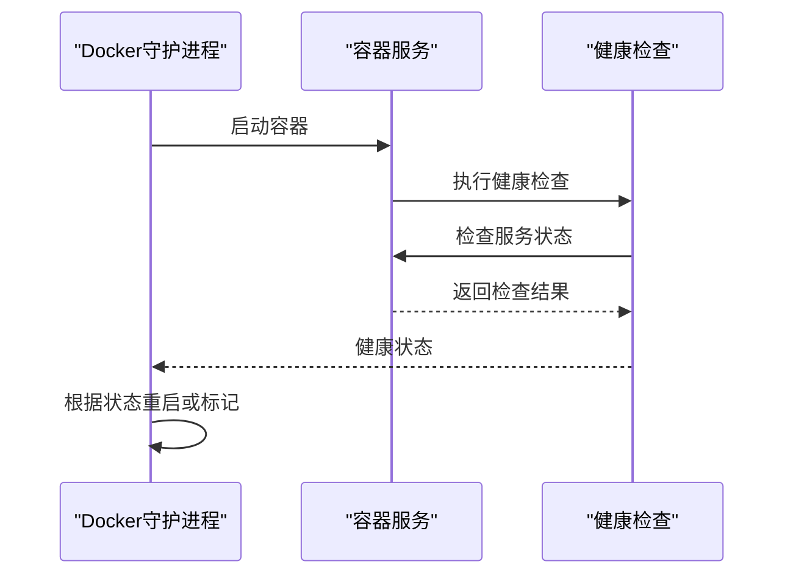
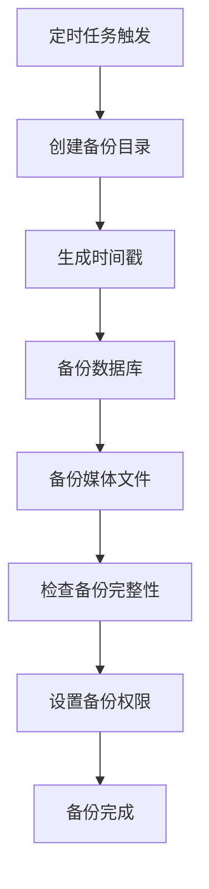
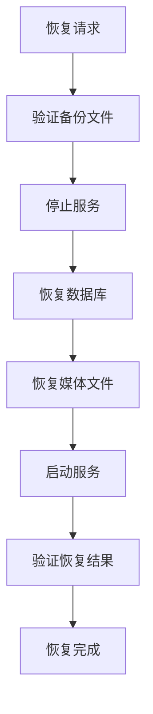
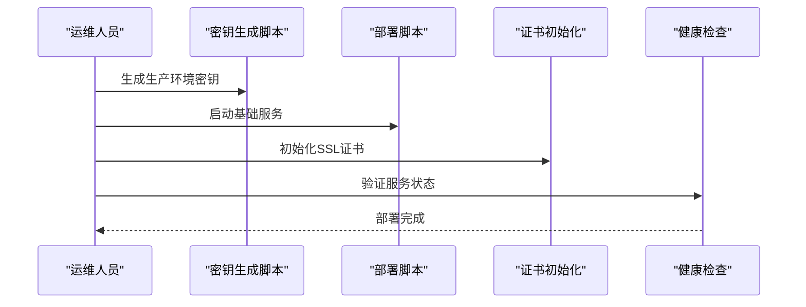
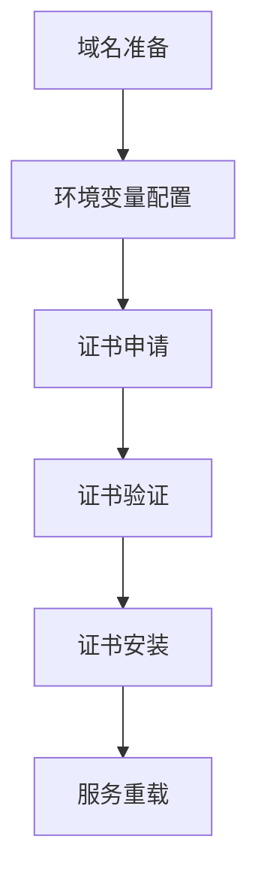

# 监控运维

<cite>
**本文引用的文件**
- [ops/monitoring/README.md](file://ops/monitoring/README.md)
- [ops/monitoring/metrics.md](file://ops/monitoring/metrics.md)
- [ops/monitoring/runbook.md](file://ops/monitoring/runbook.md)
- [ops/backups/README.md](file://ops/backups/README.md)
- [ops/backups/backup.sh](file://ops/backups/backup.sh)
- [ops/backups/restore.sh](file://ops/backups/restore.sh)
- [ops/backups/retention.sh](file://ops/backups/retention.sh)
- [ops/DEPLOYMENT-OPS-MANUAL.md](file://ops/DEPLOYMENT-OPS-MANUAL.md)
- [ops/docker/docker-compose.prod.yml](file://ops/docker/docker-compose.prod.yml)
- [ops/docker/certbot-renew.sh](file://ops/docker/certbot-renew.sh)
- [ops/docker/init-cert.sh](file://ops/docker/init-cert.sh)
- [ops/docker/Dockerfile.backend](file://ops/docker/Dockerfile.backend)
- [ops/docker/Dockerfile.frontend](file://ops/docker/Dockerfile.frontend)
- [ops/nginx/nginx.conf](file://ops/nginx/nginx.conf)
- [ops/nginx/sites.conf](file://ops/nginx/sites.conf)
- [ops/deploy.sh](file://ops/deploy.sh)
- [ops/rollback.sh](file://ops/rollback.sh)
- [ops/generate-secrets.sh](file://ops/generate-secrets.sh)
</cite>

## 更新摘要
**所做更改**
- 新增独立的监控运维模块，包含完整的监控指标体系和告警阈值
- 整合故障排查与应急响应流程，建立标准化的运维手册
- 完善备份恢复策略，包含数据库、媒体文件和配置文件的自动化保护机制
- 更新健康检查机制，涵盖容器级和应用级双重保障
- 增强证书管理流程，提供获取、续期和故障处理的完整方案

## 目录
1. [简介](#简介)
2. [监控运维体系](#监控运维体系)
3. [健康检查机制](#健康检查机制)
4. [监控指标与告警](#监控指标与告警)
5. [日志管理系统](#日志管理系统)
6. [备份恢复策略](#备份恢复策略)
7. [故障排查与应急响应](#故障排查与应急响应)
8. [部署与运维流程](#部署与运维流程)
9. [证书管理](#证书管理)
10. [性能优化建议](#性能优化建议)
11. [结论](#结论)

## 简介
本文档为中创智控官网的监控运维管理提供全面的技术指导，基于仓库中的ops目录脚本和配置文件，建立了涵盖监控指标、健康检查、日志管理、备份恢复、故障排查和证书管理的完整运维体系。文档强调生产环境的稳定性、安全性和可维护性，为运维团队提供可执行的操作手册和最佳实践。

## 监控运维体系
监控运维体系采用分层架构设计，包含三个核心层次：

**图表来源**
- [ops/monitoring/metrics.md](file://ops/monitoring/metrics.md#L1-L16)
- [ops/monitoring/runbook.md](file://ops/monitoring/runbook.md#L1-L29)

### 监控指标分类
- **系统资源指标**：CPU使用率、内存使用率、磁盘使用率
- **服务可用性指标**：前端响应时间、后端响应时间、数据库连接数
- **业务指标**：API错误率、证书有效期、备份成功率

**章节来源**
- [ops/monitoring/metrics.md](file://ops/monitoring/metrics.md#L3-L15)

### 告警级别定义
- **Warning级别**：需要关注但不影响业务的指标异常
- **Critical级别**：可能影响业务连续性的严重问题
- **Info级别**：正常状态的信息提示

**章节来源**
- [ops/monitoring/metrics.md](file://ops/monitoring/metrics.md#L4-L15)

## 健康检查机制
健康检查机制采用容器级和应用级双重保障策略，确保服务的高可用性。

### 容器级健康检查
各服务容器配置了专门的健康检查指令，通过Docker内置的healthcheck功能实现自动监控。

**图表来源**
- [ops/docker/docker-compose.prod.yml](file://ops/docker/docker-compose.prod.yml#L18-L22)
- [ops/docker/docker-compose.prod.yml](file://ops/docker/docker-compose.prod.yml#L48-L52)
- [ops/docker/docker-compose.prod.yml](file://ops/docker/docker-compose.prod.yml#L78-L82)
- [ops/docker/docker-compose.prod.yml](file://ops/docker/docker-compose.prod.yml#L111-L115)

### 应用级健康检查
后端和前端分别提供独立的健康检查接口，用于验证应用层的服务状态。

**后端健康检查**：`/api/healthz`
- 检查数据库连接状态
- 验证核心服务功能
- 返回JSON格式的健康状态

**前端健康检查**：`/healthz`
- 检查静态资源服务
- 验证API代理配置
- 返回基本的运行状态

**章节来源**
- [ops/docker/docker-compose.prod.yml](file://ops/docker/docker-compose.prod.yml#L48-L52)
- [ops/docker/docker-compose.prod.yml](file://ops/docker/docker-compose.prod.yml#L78-L82)
- [ops/DEPLOYMENT-OPS-MANUAL.md](file://ops/DEPLOYMENT-OPS-MANUAL.md#L90-L98)

### 健康检查配置详解
各服务的健康检查配置包含以下关键参数：

**检查间隔**：30秒执行一次，平衡检查频率与系统开销
**超时时间**：容器级5-10秒，应用级10秒，确保及时发现问题
**重试次数**：3-5次，避免临时性故障导致误判
**启动延迟**：40秒的start-period，确保服务充分启动

**章节来源**
- [ops/docker/docker-compose.prod.yml](file://ops/docker/docker-compose.prod.yml#L18-L22)
- [ops/docker/docker-compose.prod.yml](file://ops/docker/docker-compose.prod.yml#L48-L52)
- [ops/docker/docker-compose.prod.yml](file://ops/docker/docker-compose.prod.yml#L78-L82)
- [ops/docker/docker-compose.prod.yml](file://ops/docker/docker-compose.prod.yml#L111-L115)

## 监控指标与告警
监控指标体系基于实际业务需求设计，包含系统资源、服务可用性和业务指标三个维度。

### 系统资源监控
系统资源监控重点关注基础设施的健康状况，预防资源耗尽导致的服务中断。

**CPU使用率监控**
- 阈值：> 80% Warning
- 影响：可能导致服务响应变慢
- 处理：检查进程负载，考虑扩容或优化

**内存使用率监控**
- 阈值：> 85% Warning  
- 影响：内存不足可能导致服务崩溃
- 处理：分析内存泄漏，调整容器内存限制

**磁盘使用率监控**
- 阈值：> 90% Critical
- 影响：磁盘满可能导致服务完全不可用
- 处理：立即清理无用文件，扩展存储空间

**章节来源**
- [ops/monitoring/metrics.md](file://ops/monitoring/metrics.md#L4-L6)

### 服务可用性监控
服务可用性监控确保用户能够正常访问网站的各项功能。

**前端响应时间监控**
- 阈值：> 3秒 Warning
- 影响：用户体验下降，可能影响转化率
- 处理：检查CDN配置、优化图片资源、分析网络延迟

**后端响应时间监控**
- 阈值：> 2秒 Warning
- 影响：API调用延迟，影响前端功能
- 处理：优化数据库查询、检查缓存配置、分析服务负载

**数据库连接数监控**
- 阈值：> 80% Warning
- 影响：连接池耗尽可能导致请求排队
- 处理：调整连接池大小、优化查询性能、检查连接泄漏

**章节来源**
- [ops/monitoring/metrics.md](file://ops/monitoring/metrics.md#L8-L11)

### 业务指标监控
业务指标监控直接反映网站的核心业务表现和合规要求。

**API错误率监控**
- 阈值：> 5% Critical
- 影响：直接影响业务收入和用户满意度
- 处理：分析错误日志，修复服务缺陷，加强测试

**证书有效期监控**
- 阈值：> 7天 Critical
- 影响：证书过期导致HTTPS服务中断
- 处理：提前续期，检查续期脚本，设置提醒

**备份成功率监控**
- 阈值：> 99% Critical
- 影响：备份失败意味着数据丢失风险
- 处理：检查备份脚本，验证存储空间，测试恢复流程

**章节来源**
- [ops/monitoring/metrics.md](file://ops/monitoring/metrics.md#L13-L15)

## 日志管理系统
日志管理系统采用Docker原生日志驱动，结合日志轮转策略，确保日志数据的完整性、可追溯性和存储效率。

### 日志收集架构
所有容器服务统一使用json-file驱动进行日志收集，实现集中化的日志管理。

**图表来源**
- [ops/docker/docker-compose.prod.yml](file://ops/docker/docker-compose.prod.yml#L23-L28)
- [ops/docker/docker-compose.prod.yml](file://ops/docker/docker-compose.prod.yml#L53-L58)
- [ops/docker/docker-compose.prod.yml](file://ops/docker/docker-compose.prod.yml#L83-L88)
- [ops/docker/docker-compose.prod.yml](file://ops/docker/docker-compose.prod.yml#L116-L121)

### 日志轮转策略
日志轮转采用基于文件大小和数量的双重控制机制，防止磁盘空间被日志占用。

**轮转参数配置**
- 单文件最大大小：50MB
- 保留文件数量：5个
- 文件压缩：启用gzip压缩
- 存储位置：容器内部，通过卷挂载持久化

**轮转触发条件**
- 当单个日志文件达到50MB时触发轮转
- 保留最近5个日志文件
- 超过5个文件时自动删除最旧文件

**章节来源**
- [ops/docker/docker-compose.prod.yml](file://ops/docker/docker-compose.prod.yml#L23-L28)
- [ops/docker/docker-compose.prod.yml](file://ops/docker/docker-compose.prod.yml#L53-L58)
- [ops/docker/docker-compose.prod.yml](file://ops/docker/docker-compose.prod.yml#L83-L88)
- [ops/docker/docker-compose.prod.yml](file://ops/docker/docker-compose.prod.yml#L116-L121)

### 日志查看与分析
提供多种日志查看方式，满足不同场景下的问题排查需求。

**常用查看命令**
- 查看所有服务日志：`docker compose -f ops/docker/docker-compose.prod.yml logs -f`
- 查看特定服务日志：`docker compose -f ops/docker/docker-compose.prod.yml logs -f service-name`
- 查看最近N行日志：`docker compose -f ops/docker/docker-compose.prod.yml logs --tail=100 service-name`

**日志分析要点**
- 关注错误级别日志（error、critical）
- 分析时间戳关联的业务操作
- 监控异常模式和趋势变化
- 结合健康检查状态分析问题根因

**章节来源**
- [ops/DEPLOYMENT-OPS-MANUAL.md](file://ops/DEPLOYMENT-OPS-MANUAL.md#L102-L107)

## 备份恢复策略
备份恢复策略采用多层保护机制，确保数据的完整性和可恢复性，涵盖数据库、媒体文件和配置文件的自动化保护。

### 备份类型与范围
备份策略根据数据的重要性和恢复复杂度分为三个层次：

**数据库备份**
- 类型：完整数据库备份（SQL格式）
- 内容：所有业务数据、配置数据、用户数据
- 特点：可直接导入恢复，恢复速度快

**媒体文件备份**
- 类型：压缩归档备份
- 内容：用户上传的图片、文档等媒体资源
- 特点：占用空间大，需要单独管理

**配置文件备份**
- 类型：环境变量和配置文件
- 内容：生产环境配置、密钥文件、站点配置
- 特点：恢复相对简单，但重要性极高

**章节来源**
- [ops/backups/backup.sh](file://ops/backups/backup.sh#L22-L30)
- [ops/backups/README.md](file://ops/backups/README.md#L5-L8)

### 备份执行流程
备份执行采用自动化脚本，确保备份的一致性和可靠性。

**图表来源**
- [ops/backups/backup.sh](file://ops/backups/backup.sh#L14-L33)

**备份执行步骤**
1. **环境准备**：创建备份目录，生成时间戳标识
2. **数据库备份**：使用pg_dump导出完整数据库
3. **媒体文件备份**：打包上传目录中的所有文件
4. **备份验证**：检查备份文件的完整性和可读性
5. **权限设置**：确保备份文件的安全访问权限

**章节来源**
- [ops/backups/backup.sh](file://ops/backups/backup.sh#L14-L33)

### 恢复执行流程
恢复流程提供完整的数据恢复能力，支持部分恢复和全量恢复。

**图表来源**
- [ops/backups/restore.sh](file://ops/backups/restore.sh#L19-L31)

**恢复执行步骤**
1. **备份验证**：检查备份文件的完整性和有效性
2. **环境准备**：停止相关服务，准备恢复环境
3. **数据库恢复**：使用psql导入备份文件
4. **媒体文件恢复**：解压并恢复到指定目录
5. **服务启动**：启动各服务并验证功能正常
6. **结果验证**：检查数据完整性和业务功能

**章节来源**
- [ops/backups/restore.sh](file://ops/backups/restore.sh#L19-L31)

### 备份保留策略
备份保留采用基于时间的策略，平衡存储空间和恢复需求。

**保留规则**
- **默认保留周期**：7天
- **清理条件**：超过保留周期的备份文件
- **清理范围**：数据库备份文件和媒体备份文件
- **清理方式**：自动删除过期文件

**清理执行**
- 定期扫描备份目录
- 删除超过保留周期的文件
- 记录清理操作日志
- 监控剩余存储空间

**章节来源**
- [ops/backups/retention.sh](file://ops/backups/retention.sh#L12-L15)

## 故障排查与应急响应
故障排查与应急响应流程基于标准化的检查清单和应急预案，确保问题能够快速定位和解决。

### 快速检查清单
应急响应的第一步是执行标准化的快速检查，快速确定问题范围和性质。

**检查清单**
1. **容器状态检查**：查看所有容器的运行状态和健康检查结果
2. **日志分析**：检查最近的错误日志和异常记录
3. **健康检查验证**：验证前端和后端的健康检查接口
4. **证书状态检查**：确认SSL证书的有效性和续期状态
5. **数据库连接检查**：验证数据库连接和性能指标

**检查工具**
- 容器状态：`docker compose -f ops/docker/docker-compose.prod.yml ps`
- 容器日志：`docker compose -f ops/docker/docker-compose.prod.yml logs`
- 健康检查：`curl -f https://domain/healthz`

**章节来源**
- [ops/monitoring/runbook.md](file://ops/monitoring/runbook.md#L3-L7)
- [ops/DEPLOYMENT-OPS-MANUAL.md](file://ops/DEPLOYMENT-OPS-MANUAL.md#L90-L98)

### 常见故障场景
针对常见的故障场景提供标准化的处理方案。

**健康检查失败**
- **前端健康检查失败**：检查前端容器日志，验证API代理配置
- **后端健康检查失败**：检查数据库连接状态，验证服务启动日志
- **Nginx健康检查失败**：检查反向代理配置，验证端口监听状态

**证书相关问题**
- **证书获取失败**：检查域名DNS解析和80端口连通性
- **证书续期失败**：检查certbot日志和Nginx重载状态
- **证书过期**：立即执行手动续期并检查自动续期脚本

**数据库连接异常**
- **连接超时**：检查数据库容器状态和网络连接
- **认证失败**：核对环境变量中的数据库凭据
- **连接池耗尽**：分析应用程序的数据库使用模式

**章节来源**
- [ops/monitoring/runbook.md](file://ops/monitoring/runbook.md#L11-L23)

### 应急响应流程
建立标准化的应急响应流程，确保重大故障能够有序处理。

**响应流程**
1. **影响评估**：评估故障影响范围和业务损失程度
2. **通知机制**：按照级别通知相关人员和团队
3. **隔离措施**：必要时暂时停止相关服务以防止进一步影响
4. **问题定位**：通过检查清单和日志分析确定问题根因
5. **修复执行**：按照标准流程执行修复操作
6. **验证测试**：确认修复效果并进行全面的功能测试
7. **文档记录**：记录故障处理过程和改进措施

**章节来源**
- [ops/monitoring/runbook.md](file://ops/monitoring/runbook.md#L24-L29)

## 部署与运维流程
部署与运维流程基于自动化脚本和标准化操作，确保部署的一致性和可重复性。

### 首次部署流程
首次部署需要完成环境准备、服务启动和验证检查等关键步骤。

**图表来源**
- [ops/DEPLOYMENT-OPS-MANUAL.md](file://ops/DEPLOYMENT-OPS-MANUAL.md#L17-L35)

**部署步骤**
1. **密钥生成**：执行`./ops/generate-secrets.sh <domain>`生成生产环境密钥
2. **配置修改**：编辑Nginx站点配置文件，替换域名设置
3. **基础服务启动**：启动PostgreSQL、后端和前端服务
4. **证书初始化**：运行certbot初始化SSL证书
5. **代理服务启动**：启动Nginx和Certbot服务
6. **健康检查**：验证所有服务的健康状态

**章节来源**
- [ops/DEPLOYMENT-OPS-MANUAL.md](file://ops/DEPLOYMENT-OPS-MANUAL.md#L17-L35)

### 更新部署流程
更新部署采用零停机策略，确保业务连续性不受影响。

**更新步骤**
1. **代码更新**：拉取最新的代码版本
2. **镜像构建**：重新构建Docker镜像
3. **滚动更新**：逐步替换旧容器，保持至少一个容器在线
4. **健康检查**：验证新版本服务的健康状态
5. **回滚准备**：保留旧版本镜像以便快速回滚

**章节来源**
- [ops/DEPLOYMENT-OPS-MANUAL.md](file://ops/DEPLOYMENT-OPS-MANUAL.md#L38-L42)

### 回滚部署流程
回滚部署提供快速恢复机制，在新版本出现问题时能够立即恢复到稳定版本。

**回滚步骤**
1. **版本选择**：确定要回滚到的目标版本
2. **镜像准备**：确保目标版本的镜像可用
3. **服务替换**：停止当前版本服务，启动目标版本
4. **数据兼容**：检查数据库结构兼容性
5. **功能验证**：验证回滚后的功能完整性

**章节来源**
- [ops/DEPLOYMENT-OPS-MANUAL.md](file://ops/DEPLOYMENT-OPS-MANUAL.md#L46-L50)

## 证书管理
证书管理采用Let's Encrypt自动证书颁发和续期机制，确保HTTPS服务的安全性和持续可用性。

### 证书获取流程
证书获取通过certbot自动完成，支持多域名和批量申请。

**图表来源**
- [ops/docker/init-cert.sh](file://ops/docker/init-cert.sh#L14-L31)

**证书获取步骤**
1. **域名配置**：在环境变量中配置DOMAINS和LETSENCRYPT_EMAIL
2. **参数构建**：动态构建certbot命令参数
3. **证书申请**：执行certonly命令获取证书
4. **验证检查**：确认证书申请成功
5. **安装部署**：将证书部署到Nginx配置

**章节来源**
- [ops/docker/init-cert.sh](file://ops/docker/init-cert.sh#L14-L31)

### 证书续期机制
证书续期采用自动化脚本和定时任务，确保证书不会过期。

**续期流程**
1. **定时检查**：通过cron定时任务检查证书状态
2. **自动续期**：执行certbot renew命令续期证书
3. **服务重载**：续期成功后自动重载Nginx服务
4. **状态监控**：监控续期过程和结果

**续期脚本功能**
- 静默执行续期检查
- 自动部署证书更新
- 重载Nginx服务
- 记录续期日志

**章节来源**
- [ops/docker/certbot-renew.sh](file://ops/docker/certbot-renew.sh#L4-L6)

### 证书监控与告警
证书监控确保能够及时发现和处理证书相关问题。

**监控指标**
- 证书有效期剩余天数
- 证书续期状态
- 证书安装状态
- Nginx服务状态

**告警阈值**
- 有效期<7天：Critical
- 续期失败：Critical
- 证书缺失：Critical

**章节来源**
- [ops/monitoring/metrics.md](file://ops/monitoring/metrics.md#L15)

## 性能优化建议
基于实际部署经验，提供针对性的性能优化建议，提升系统的整体性能和用户体验。

### 容器资源配置优化
合理配置容器的CPU和内存资源，避免资源争用和性能瓶颈。

**资源配置原则**
- **CPU配额**：根据服务负载合理分配CPU核心数
- **内存限制**：设置合理的内存上限，防止内存泄漏
- **资源预留**：为系统和其他服务预留必要的资源
- **动态调整**：根据监控数据动态调整资源配置

**监控指标**
- CPU使用率和等待时间
- 内存使用率和交换频率
- 网络带宽使用情况
- 磁盘I/O性能

### 应用性能优化
优化应用层的性能配置，提升服务响应速度和并发处理能力。

**前端优化**
- 图片懒加载和压缩
- CDN加速和缓存策略
- 代码分割和按需加载
- 预渲染和静态资源优化

**后端优化**
- 数据库查询优化
- 缓存策略实施
- 连接池配置优化
- 异步任务处理

### 网络性能优化
优化网络配置和CDN设置，提升全球用户的访问体验。

**网络优化策略**
- CDN节点选择和配置
- TLS优化和会话复用
- 压缩算法选择（HTTP/2、Brotli）
- DNS优化和解析缓存

## 结论
本文档建立了完整的中创智控官网监控运维管理体系，涵盖了监控指标、健康检查、日志管理、备份恢复、故障排查和证书管理等各个方面。通过标准化的流程和自动化工具，确保生产环境的稳定性、安全性和可维护性。

**关键优势**
- **全面性**：覆盖了从基础设施到应用层的全方位监控
- **自动化**：大量使用脚本和定时任务，减少人工干预
- **标准化**：统一的检查清单和响应流程，提高处理效率
- **可扩展**：模块化的架构设计，便于后续功能扩展

**实施建议**
- 定期审查和更新监控指标和告警阈值
- 持续优化备份策略和恢复流程
- 加强团队培训和知识传承
- 建立完善的文档和知识库

通过严格执行这些运维策略和流程，能够有效保障中创智控官网的稳定运行和业务连续性。