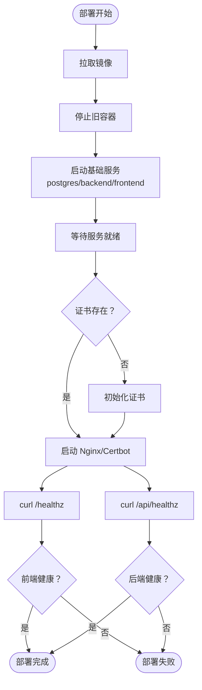

# 监控运维

<cite>
**本文引用的文件**
- [DEPLOYMENT.md](file://DEPLOYMENT.md)
- [README.md](file://README.md)
- [backend/package.json](file://backend/package.json)
- [frontend/package.json](file://frontend/package.json)
- [backend/.env.example](file://backend/.env.example)
- [frontend/.env.example](file://frontend/.env.example)
- [backend/config/database.ts](file://backend/config/database.ts)
- [backend/config/middlewares.ts](file://backend/config/middlewares.ts)
- [backend/config/server.ts](file://backend/config/server.ts)
- [backend/config/api.ts](file://backend/config/api.ts)
- [backend/config/plugins.ts](file://backend/config/plugins.ts)
- [backend/config/admin.ts](file://backend/config/admin.ts)
- [backend/src/api/news-item/controllers/news-item.ts](file://backend/src/api/news-item/controllers/news-item.ts)
- [backend/src/api/news-item/routes/news-item.ts](file://backend/src/api/news-item/routes/news-item.ts)
- [backend/src/api/news-item/services/news-item.ts](file://backend/src/api/news-item/services/news-item.ts)
- [backend/src/api/product/controllers/product.ts](file://backend/src/api/product/controllers/product.ts)
- [backend/src/api/product/routes/product.ts](file://backend/src/api/product/routes/product.ts)
- [backend/src/api/product/services/product.ts](file://backend/src/api/product/services/product.ts)
- [frontend/next.config.ts](file://frontend/next.config.ts)
- [frontend/lib/strapi.ts](file://frontend/lib/strapi.ts)
- [frontend/content/news.ts](file://frontend/content/news.ts)
- [frontend/content/products.ts](file://frontend/content/products.ts)
- [frontend/content/solutions.ts](file://frontend/content/solutions.ts)
- [specs/001-strapi-backend-cms/spec.md](file://specs/001-strapi-backend-cms/spec.md)
- [specs/001-nextjs-migration/spec.md](file://specs/001-nextjs-migration/spec.md)
</cite>

## 目录
1. [简介](#简介)
2. [项目结构](#项目结构)
3. [核心组件](#核心组件)
4. [架构总览](#架构总览)
5. [详细组件分析](#详细组件分析)
6. [依赖关系分析](#依赖关系分析)
7. [性能考量](#性能考量)
8. [故障排查指南](#故障排查指南)
9. [结论](#结论)
10. [附录](#附录)

## 简介
本文件面向中创智控官网的运维与监控团队，系统化梳理生产环境的健康检查、日志管理、监控指标、备份恢复与故障排查流程。文档以仓库中的部署与运维说明为基础，结合前后端架构与配置，形成可落地的运维策略与操作手册，确保生产环境稳定运行。

## 项目结构
项目采用前后端分离架构：
- 前端：Next.js 15 应用，负责页面渲染、静态资源与与后端 API 交互。
- 后端：Strapi 5 CMS，提供 REST API 与内容管理能力，使用 SQLite（开发）或 PostgreSQL（生产）。
- 运维：通过 Docker Compose 编排 Nginx、PostgreSQL、后端与前端；配合 Let’s Encrypt 实现 HTTPS；内置健康检查、日志轮转与备份脚本。

图表来源
- [DEPLOYMENT.md](file://DEPLOYMENT.md#L38-L99)

章节来源
- [DEPLOYMENT.md](file://DEPLOYMENT.md#L34-L144)
- [README.md](file://README.md#L229-L298)

## 核心组件
- 健康检查：容器层面（PostgreSQL、后端、前端、Nginx）与应用层面（/healthz）双维度保障。
- 日志管理：Docker json-file 驱动、日志轮转与集中查看命令。
- 监控指标：系统资源、服务可用性、业务指标三类关键指标与阈值。
- 备份恢复：数据库与媒体文件的定时备份、保留策略与恢复脚本。
- 部署流程：密钥生成、镜像构建、服务编排、证书初始化与续期。
- 配置管理：环境变量分层、生产密钥生成与 Nginx 域名替换。

章节来源
- [DEPLOYMENT.md](file://DEPLOYMENT.md#L587-L744)
- [backend/package.json](file://backend/package.json#L6-L18)
- [frontend/package.json](file://frontend/package.json#L6-L11)

## 架构总览
生产环境采用 Nginx 作为反向代理与入口，前端与后端分别运行在 3000 与 1337 端口，数据库使用 PostgreSQL。证书由 Certbot 管理，支持自动续期与 Nginx 重载。

图表来源
- [DEPLOYMENT.md](file://DEPLOYMENT.md#L94-L99)

章节来源
- [DEPLOYMENT.md](file://DEPLOYMENT.md#L34-L100)

## 详细组件分析

### 健康检查机制
- 容器健康检查：PostgreSQL、后端、前端、Nginx 均配置健康检查命令、间隔、超时与重试次数，确保容器层可用性。
- 应用健康检查：后端提供 /api/healthz，前端提供 /healthz，部署脚本通过 curl 验证返回状态，作为上线校验。
- 健康检查命令与参数来源于部署文档的“容器健康检查配置”表格。

图表来源
- [DEPLOYMENT.md](file://DEPLOYMENT.md#L502-L569)

章节来源
- [DEPLOYMENT.md](file://DEPLOYMENT.md#L589-L606)
- [DEPLOYMENT.md](file://DEPLOYMENT.md#L502-L569)

### 日志管理系统
- 日志收集：Docker 默认 json-file 驱动，便于集中采集与分析。
- 日志轮转：通过 max-size 与 max-file 参数限制单文件大小与保留数量，避免磁盘占用过大。
- 日志查看：提供查看全部与指定服务日志、查看最近行数等常用命令，便于快速定位问题。

图表来源
- [DEPLOYMENT.md](file://DEPLOYMENT.md#L607-L631)

章节来源
- [DEPLOYMENT.md](file://DEPLOYMENT.md#L600-L631)

### 监控指标体系
- 系统资源：CPU、内存、磁盘使用率，设定预警阈值，防止资源耗尽导致服务不可用。
- 服务可用性：前端/后端响应时间与数据库连接数，保障用户体验与系统稳定性。
- 业务指标：API 错误率与证书有效期，确保业务连续性与合规性。

图表来源
- [DEPLOYMENT.md](file://DEPLOYMENT.md#L632-L646)

章节来源
- [DEPLOYMENT.md](file://DEPLOYMENT.md#L632-L646)

### 备份恢复策略
- 备份类型：数据库完整备份与媒体文件归档备份，配置文件与环境变量单独备份。
- 备份频率：数据库每日凌晨 2:00，媒体文件每日 2:30，保留最近 7 天。
- 恢复流程：通过恢复脚本将备份导入数据库，媒体文件解压至对应目录。
- 清理策略：按保留天数定期清理过期备份，释放存储空间。

图表来源
- [DEPLOYMENT.md](file://DEPLOYMENT.md#L663-L743)

章节来源
- [DEPLOYMENT.md](file://DEPLOYMENT.md#L649-L743)

### 部署与证书管理
- 密钥生成：通过脚本生成 PostgreSQL 密码与 Strapi 密钥，写入生产环境变量文件。
- 部署脚本：拉取镜像、停止旧容器、启动基础服务、检查证书、启动代理与健康检查。
- 证书初始化与续期：首次部署初始化证书，定时任务检查续期并重载 Nginx。

图表来源
- [DEPLOYMENT.md](file://DEPLOYMENT.md#L416-L569)

章节来源
- [DEPLOYMENT.md](file://DEPLOYMENT.md#L414-L569)

### 配置与环境管理
- 环境变量分层：开发/生产环境变量文件与示例文件分离，敏感信息不提交到版本库。
- 自动变量：8 个 Strapi 密钥与 PostgreSQL 密码由脚本自动生成。
- 手动变量：域名与 Let’s Encrypt 邮箱需手动配置。

章节来源
- [DEPLOYMENT.md](file://DEPLOYMENT.md#L148-L222)
- [backend/.env.example](file://backend/.env.example#L1-L15)
- [frontend/.env.example](file://frontend/.env.example#L1-L2)

## 依赖关系分析
- 前后端通信：前端通过 NEXT_PUBLIC_STRAPI_URL 指向后端 API，后端提供 REST 接口。
- 数据库依赖：后端使用 better-sqlite3（开发）或 PostgreSQL（生产），数据库配置在后端配置文件中。
- 中间件与权限：后端中间件配置包含 CORS 等，权限通过 Strapi 插件与角色管理实现。
- 构建与运行：前端使用 pnpm，后端使用 npm；生产环境通过 Docker 多阶段构建。

图表来源
- [frontend/package.json](file://frontend/package.json#L1-L88)
- [backend/package.json](file://backend/package.json#L1-L45)
- [backend/config/database.ts](file://backend/config/database.ts)
- [backend/config/middlewares.ts](file://backend/config/middlewares.ts)
- [backend/config/plugins.ts](file://backend/config/plugins.ts)

章节来源
- [frontend/package.json](file://frontend/package.json#L1-L88)
- [backend/package.json](file://backend/package.json#L1-L45)
- [backend/config/database.ts](file://backend/config/database.ts)
- [backend/config/middlewares.ts](file://backend/config/middlewares.ts)
- [backend/config/plugins.ts](file://backend/config/plugins.ts)

## 性能考量
- 构建策略：采用“部署时构建”，避免将构建产物提交到仓库，利用 Docker 层缓存提升构建效率。
- 多阶段构建：减少最终镜像体积，降低攻击面与启动时间。
- 资源监控：对 CPU、内存、磁盘与数据库连接数进行监控，及时发现资源瓶颈。
- 响应时间：前端与后端响应时间阈值用于识别性能退化，必要时扩容或优化查询。

章节来源
- [DEPLOYMENT.md](file://DEPLOYMENT.md#L225-L276)
- [DEPLOYMENT.md](file://DEPLOYMENT.md#L632-L646)

## 故障排查指南
- 健康检查失败
  - 检查后端 /api/healthz 与前端 /healthz 是否可达。
  - 查看 Nginx 与容器日志，确认证书状态与服务启动顺序。
- 数据库连接问题
  - 确认 PostgreSQL 已启动并通过健康检查。
  - 检查数据库凭据与网络连通性。
- 证书相关问题
  - 首次部署需初始化证书；后续检查续期脚本与 Nginx 重载日志。
- 日志定位
  - 使用 docker compose logs 查看实时日志，必要时 tail 最近行数。
- 备份与恢复
  - 检查备份脚本输出与定时任务日志，确认备份成功。
  - 恢复时先验证目标数据库状态，再执行导入。

章节来源
- [DEPLOYMENT.md](file://DEPLOYMENT.md#L502-L569)
- [DEPLOYMENT.md](file://DEPLOYMENT.md#L618-L631)
- [DEPLOYMENT.md](file://DEPLOYMENT.md#L663-L743)

## 结论
本运维文档基于仓库中的部署与运维说明，建立了覆盖健康检查、日志管理、监控指标、备份恢复与故障排查的完整运维体系。建议在生产环境中严格执行密钥生成与轮换、健康检查与监控告警、定时备份与演练恢复流程，确保系统稳定与业务连续性。

## 附录
- 常用命令与路径
  - 健康检查：curl -f https://DOMAIN/healthz 与 curl -f https://DOMAIN/api/healthz
  - 日志查看：docker compose -f ops/docker/docker-compose.prod.yml logs -f
  - 备份脚本：ops/backups/backup.sh
  - 恢复脚本：ops/backups/restore.sh
  - 备份清理：ops/backups/retention.sh
  - 部署脚本：ops/deploy.sh
  - 密钥生成：ops/generate-secrets.sh
  - 证书续期：ops/docker/certbot-renew.sh

章节来源
- [DEPLOYMENT.md](file://DEPLOYMENT.md#L502-L569)
- [DEPLOYMENT.md](file://DEPLOYMENT.md#L618-L631)
- [DEPLOYMENT.md](file://DEPLOYMENT.md#L663-L743)