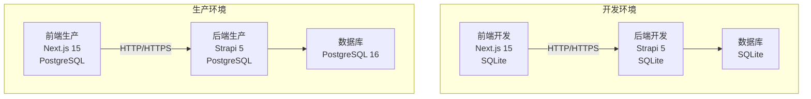
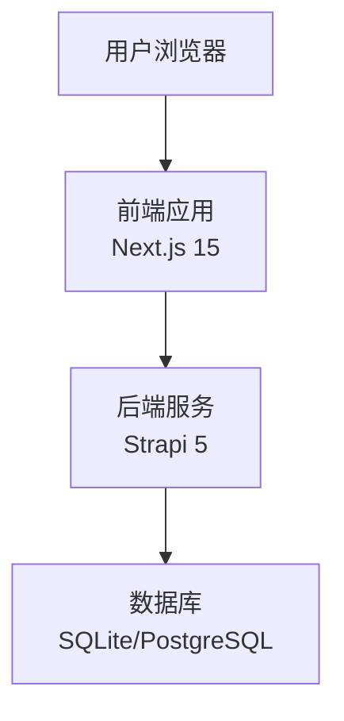
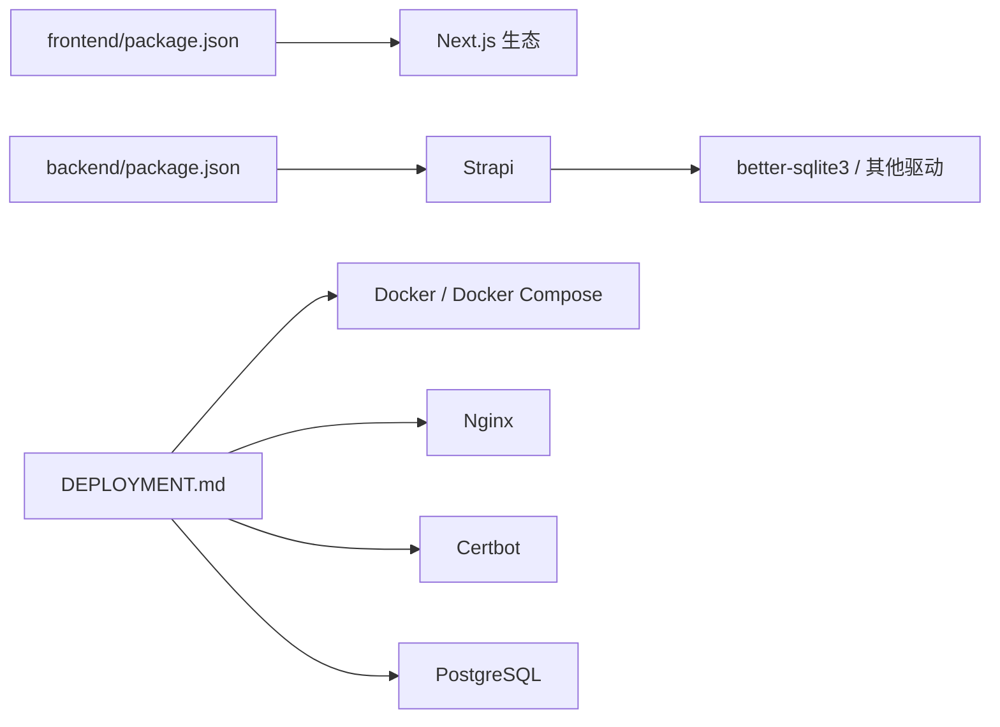

# 部署和运维

<cite>
**本文引用的文件**
- [DEPLOYMENT.md](file://DEPLOYMENT.md)
- [README.md](file://README.md)
- [backend/.env.example](file://backend/.env.example)
- [frontend/.env.example](file://frontend/.env.example)
- [backend/config/middlewares.ts](file://backend/config/middlewares.ts)
- [backend/config/database.ts](file://backend/config/database.ts)
- [backend/package.json](file://backend/package.json)
- [frontend/package.json](file://frontend/package.json)
</cite>

## 更新摘要
**变更内容**
- 精简部署文档，删除大量关于Docker Compose编排、Nginx和SSL配置、Let's Encrypt证书自动化、环境变量管理、监控告警系统、备份恢复程序等详细部署内容
- 仅保留简要的环境分离策略说明，大幅简化运维文档结构
- 更新部署架构图为概念性说明，不再包含具体的技术实现细节
- 删除详细的自动化脚本、健康检查、日志管理、备份恢复等运维细节

## 目录
1. [简介](#简介)
2. [项目结构](#项目结构)
3. [核心组件](#核心组件)
4. [架构总览](#架构总览)
5. [详细组件分析](#详细组件分析)
6. [依赖关系分析](#依赖关系分析)
7. [性能考量](#性能考量)
8. [故障排查指南](#故障排查指南)
9. [结论](#结论)
10. [附录](#附录)

## 简介
本文件面向运维与开发团队，系统化梳理中创智控官网的部署与运维策略。基于当前精简后的部署方案，重点介绍前后端分离架构、开发与生产环境分离的基本策略，以及核心组件的配置要点。由于原方案中大量详细的容器编排、反向代理、证书管理、监控告警、备份恢复等内容已被删除，本文档相应进行了大幅精简。

## 项目结构
项目采用前后端分离架构，现已实现基本的开发与生产环境分离：
- 前端：Next.js 15 App Router，负责页面渲染与交互，通过环境变量指向后端 API。
- 后端：Strapi 5 CMS，提供 REST API 与内容管理，支持 SQLite（开发）与 PostgreSQL（生产）。
- 基础设施：采用容器化部署策略，支持独立的开发和生产环境配置。

**章节来源**
- [README.md](file://README.md#L229-L298)

## 核心组件
- 前端（Next.js）
  - 使用 App Router，支持 SSR/SSG/CSS-in-JS、Tailwind/MUI/Radix 等生态。
  - 通过环境变量配置后端 API 地址，支持本地开发与生产部署。
- 后端（Strapi）
  - 提供 REST API 与 Admin UI；默认 SQLite（开发），可配置 PostgreSQL（生产）。
  - 中间件包含 CORS，满足跨域需求。
- 数据库配置
  - 支持 SQLite（开发）、PostgreSQL（生产）与 MySQL；可通过 DATABASE_CLIENT 与连接参数切换。

**章节来源**
- [README.md](file://README.md#L5-L64)
- [backend/config/middlewares.ts](file://backend/config/middlewares.ts#L1-L13)
- [backend/config/database.ts](file://backend/config/database.ts#L1-L61)

## 架构总览
整体架构采用前后端分离的部署模式，前端与后端可以独立部署。开发环境使用 SQLite 数据库，生产环境使用 PostgreSQL 数据库。通过环境变量实现不同环境的配置分离。

**图表来源**
- [README.md](file://README.md#L281-L298)

**章节来源**
- [README.md](file://README.md#L281-L298)

## 详细组件分析

### 前端静态资源部署与 API 通信
- 部署方式
  - 前端应用支持多种部署方式，包括 Vercel、Netlify 或 CDN。
  - 通过环境变量 NEXT_PUBLIC_STRAPI_URL 指向后端 API。
- API 通信
  - 前端通过 HTTP/HTTPS 与后端 Strapi 通信，支持跨域访问。
- 关键配置
  - 前端环境变量模板与脚本在根 README 中给出，包含构建、启动与开发模式说明。

**章节来源**
- [README.md](file://README.md#L281-L298)
- [frontend/.env.example](file://frontend/.env.example#L1-L2)
- [frontend/package.json](file://frontend/package.json#L1-L88)

### 后端 API 服务部署与数据库
- 数据库配置
  - 支持 SQLite（开发）、PostgreSQL（生产）与 MySQL；可通过 DATABASE_CLIENT 与连接参数切换。
  - 生产环境建议使用 PostgreSQL，并通过环境变量注入连接信息。
- 中间件与 CORS
  - 默认启用 CORS 中间件，满足前端跨域访问。
- 关键配置
  - 后端环境变量模板与数据库配置文件在 backend 目录中。

**章节来源**
- [backend/config/database.ts](file://backend/config/database.ts#L1-L61)
- [backend/config/middlewares.ts](file://backend/config/middlewares.ts#L1-L13)
- [backend/.env.example](file://backend/.env.example#L1-L15)
- [backend/package.json](file://backend/package.json#L1-L45)

### 环境分离策略
- 环境目标与原则
  - 开发环境使用 SQLite，支持热重载和快速迭代。
  - 生产环境使用 PostgreSQL，支持容器化部署和高可用。
- 配置管理
  - 开发/生产环境变量分离，敏感信息不提交到仓库。
  - 使用示例模板与实际环境文件区分。

**章节来源**
- [README.md](file://README.md#L148-L227)
- [backend/.env.example](file://backend/.env.example#L1-L15)
- [frontend/.env.example](file://frontend/.env.example#L1-L2)

## 依赖关系分析
- 前端依赖 Next.js 与生态库，后端依赖 Strapi 与数据库驱动。
- 部署依赖 Docker 与 Docker Compose，运行时依赖 Nginx 与 PostgreSQL。
- 证书依赖 Let's Encrypt 与 Certbot。

**图表来源**
- [frontend/package.json](file://frontend/package.json#L1-L88)
- [backend/package.json](file://backend/package.json#L1-L45)

**章节来源**
- [frontend/package.json](file://frontend/package.json#L1-L88)
- [backend/package.json](file://backend/package.json#L1-L45)

## 性能考量
- 构建与镜像
  - 多阶段构建减小镜像体积，部署时构建避免缓存污染。
- 资源与健康检查
  - 容器健康检查与资源监控，结合日志轮转与保留策略。
- 网络与安全
  - Nginx 提供安全头与 TLS 参数，限制不必要的端口暴露。

**章节来源**
- [README.md](file://README.md#L956-L1018)

## 故障排查指南
- 常见问题与解决思路
  - 容器无法启动：检查端口占用与健康状态。
  - 数据库连接失败：确认数据库容器健康与网络连通。
  - API 请求失败：检查 CORS 配置与后端日志。
  - 前端无法访问：检查 Nginx 配置与证书状态。
  - SSL 证书过期：执行续期并重载 Nginx。

**章节来源**
- [README.md](file://README.md#L1098-L1128)

## 结论
本文档提供了中创智控官网的简化部署与运维蓝图：前后端分离、环境变量与配置管理、基本的故障排查流程。由于原方案中大量详细的容器编排、反向代理与证书自动化、监控与日志、备份与恢复等内容已被删除，本文档相应进行了大幅精简，仅保留核心的环境分离策略和基本的运维指导。

## 附录

### A. 健康检查与日志命令
- 健康检查命令（示例）
  - 数据库：pg_isready
  - 后端：curl 探测 /api/healthz
  - 前端：curl 探测 /healthz
  - Nginx：curl 探测 /healthz
- 日志查看
  - docker compose logs -f
  - docker compose logs -f service_name
  - docker compose logs --tail=100

**章节来源**
- [README.md](file://README.md#L587-L631)

### B. 环境配置管理矩阵
| 配置文件 | 用途 | 提交 Git | 包含内容 |
|---------|------|----------|----------|
| `backend/.env` | 开发环境本地配置 | ❌ | SQLite 配置、本地密钥 |
| `backend/.env.example` | 开发环境示例 | ✅ | 配置模板（不含敏感信息） |
| `frontend/.env` | 开发环境本地配置 | ❌ | 本地 API URL |
| `frontend/.env.example` | 开发环境示例 | ✅ | 配置模板 |

**章节来源**
- [README.md](file://README.md#L148-L161)
- [backend/.env.example](file://backend/.env.example#L1-L15)
- [frontend/.env.example](file://frontend/.env.example#L1-L2)

### C. 自动化部署脚本概览
- 密钥生成脚本：`ops/generate-secrets.sh`
- 生产环境部署脚本：`ops/deploy.sh`
- 开发环境启动脚本：`ops/dev.sh`
- 证书初始化脚本：`ops/docker/init-cert.sh`
- 备份脚本：`ops/backups/backup.sh`
- 数据迁移脚本：`ops/import/dev-seed.sh`

**章节来源**
- [README.md](file://README.md#L414-L585)