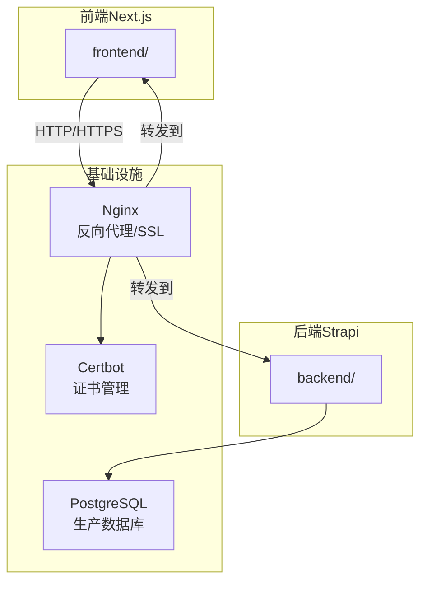
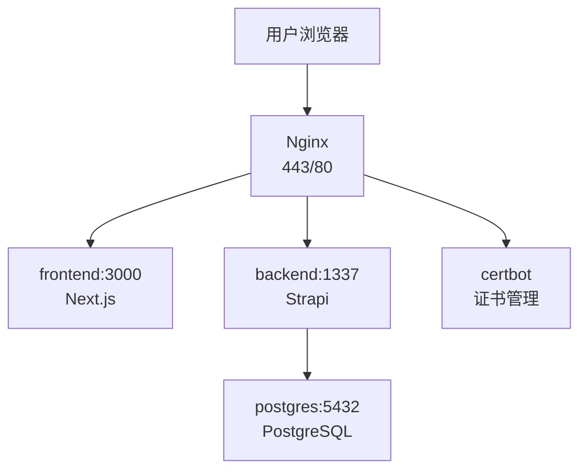
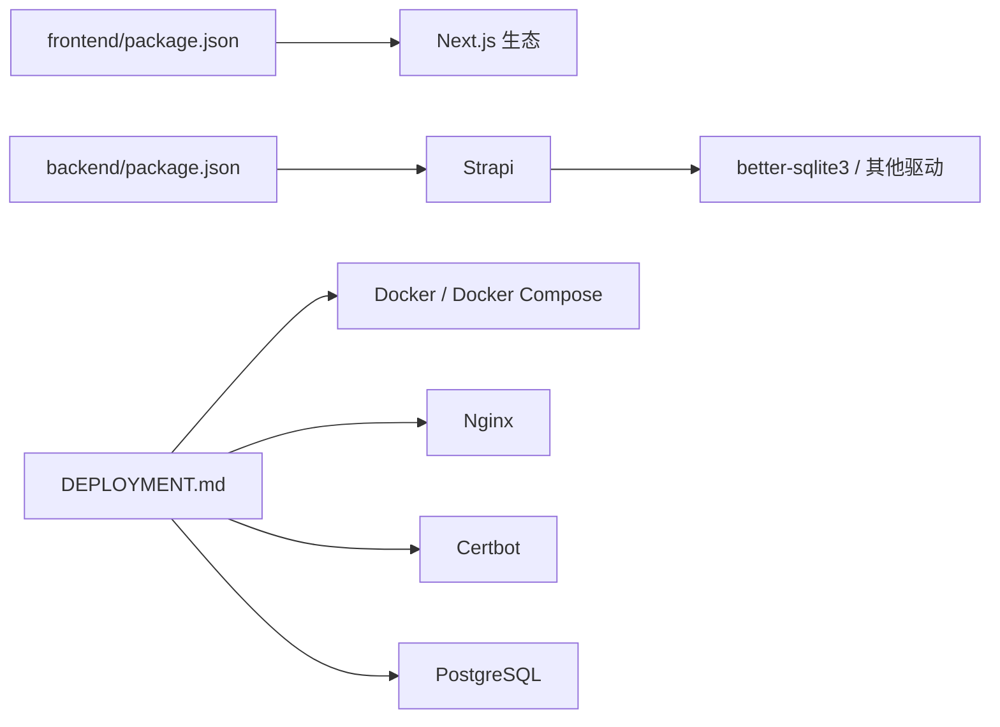
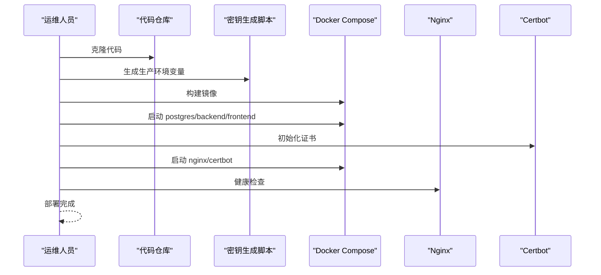

# 部署和运维

<cite>
**本文引用的文件**
- [DEPLOYMENT.md](file://DEPLOYMENT.md)
- [开发与生产环境分离方案.md](file://开发与生产环境分离方案.md)
- [生产环境分离的部署方案.md](file://生产环境分离的部署方案.md)
- [README.md](file://README.md)
- [backend/.env.example](file://backend/.env.example)
- [frontend/.env.example](file://frontend/.env.example)
- [backend/config/middlewares.ts](file://backend/config/middlewares.ts)
- [backend/config/database.ts](file://backend/config/database.ts)
- [backend/package.json](file://backend/package.json)
- [frontend/package.json](file://frontend/package.json)
</cite>

## 目录
1. [简介](#简介)
2. [项目结构](#项目结构)
3. [核心组件](#核心组件)
4. [架构总览](#架构总览)
5. [详细组件分析](#详细组件分析)
6. [依赖关系分析](#依赖关系分析)
7. [性能考量](#性能考量)
8. [故障排查指南](#故障排查指南)
9. [结论](#结论)
10. [附录](#附录)

## 简介
本文件面向运维与开发团队，系统化梳理中创智控官网的部署与运维策略，覆盖前后端分离架构、生产与开发/测试环境分离、容器化与反向代理、跨域与安全、监控与日志、备份与恢复、以及自动化部署与证书管理。目标是帮助运维团队稳定地运行与维护生产环境。

## 项目结构
项目采用前后端分离架构：
- 前端：Next.js 15 App Router，负责页面渲染与交互，通过环境变量指向后端 API。
- 后端：Strapi 5 CMS，提供 REST API 与内容管理，支持 SQLite（开发）与 PostgreSQL（生产）。
- 基础设施：Nginx 作为反向代理与 SSL 终端，Docker Compose 编排容器，Let’s Encrypt 自动化证书管理。

图表来源
- [DEPLOYMENT.md](file://DEPLOYMENT.md#L38-L67)
- [README.md](file://README.md#L229-L298)

章节来源
- [README.md](file://README.md#L66-L227)
- [DEPLOYMENT.md](file://DEPLOYMENT.md#L1-L145)

## 核心组件
- 前端（Next.js）
  - 使用 App Router，支持 SSR/SSG/CSS-in-JS、Tailwind/MUI/Radix 等生态。
  - 通过环境变量配置后端 API 地址，支持本地开发与生产部署。
- 后端（Strapi）
  - 提供 REST API 与 Admin UI；默认 SQLite（开发），可配置 PostgreSQL（生产）。
  - 中间件包含 CORS，满足跨域需求。
- 反向代理与证书
  - Nginx 负责 80/443、HTTP→HTTPS 跳转、安全头、TLS 配置。
  - Certbot 自动申请与续期 Let’s Encrypt 证书。
- 容器编排
  - Docker Compose 编排前端、后端、数据库与证书服务，支持健康检查与日志轮转。

章节来源
- [README.md](file://README.md#L5-L64)
- [backend/config/middlewares.ts](file://backend/config/middlewares.ts#L1-L13)
- [backend/config/database.ts](file://backend/config/database.ts#L1-L61)
- [DEPLOYMENT.md](file://DEPLOYMENT.md#L322-L411)

## 架构总览
整体生产环境采用“Nginx 反向代理 + Docker Compose 编排”的部署模型，前端与后端分别容器化，数据库为 PostgreSQL，证书由 Certbot 管理并自动续期。

图表来源
- [DEPLOYMENT.md](file://DEPLOYMENT.md#L94-L99)
- [DEPLOYMENT.md](file://DEPLOYMENT.md#L364-L410)

章节来源
- [DEPLOYMENT.md](file://DEPLOYMENT.md#L34-L100)

## 详细组件分析

### 前端静态资源部署与 API 通信
- 部署方式
  - 生产构建后，静态资源与 public 目录可部署至任意静态托管或反向代理。
  - 通过环境变量 NEXT_PUBLIC_STRAPI_URL 指向后端 API。
- API 通信
  - 前端通过 HTTP/HTTPS 与后端 Strapi 通信，支持跨域访问（开发环境已配置）。
- 关键配置
  - 前端环境变量模板与脚本在根 README 中给出，包含构建、启动与开发模式说明。

章节来源
- [README.md](file://README.md#L281-L298)
- [frontend/.env.example](file://frontend/.env.example#L1-L2)
- [frontend/package.json](file://frontend/package.json#L1-L11)

### 后端 API 服务部署与数据库
- 数据库配置
  - 支持 SQLite（开发）、PostgreSQL（生产）与 MySQL；可通过 DATABASE_CLIENT 与连接参数切换。
  - 生产环境建议使用 PostgreSQL，并通过环境变量注入连接信息。
- 中间件与 CORS
  - 默认启用 CORS 中间件，满足前端跨域访问。
- 关键配置
  - 后端环境变量模板与数据库配置文件在 backend 目录中。

章节来源
- [backend/config/database.ts](file://backend/config/database.ts#L1-L61)
- [backend/config/middlewares.ts](file://backend/config/middlewares.ts#L1-L13)
- [backend/.env.example](file://backend/.env.example#L1-L15)
- [backend/package.json](file://backend/package.json#L1-L45)

### 反向代理与跨域配置
- Nginx
  - 提供 HTTP→HTTPS 跳转、安全头、TLS 参数与证书路径配置。
  - 通过站点配置将请求转发至前端与后端容器。
- CORS
  - 后端中间件包含 CORS，开发环境示例中已允许本地与内网地址访问。

章节来源
- [DEPLOYMENT.md](file://DEPLOYMENT.md#L364-L410)
- [backend/config/middlewares.ts](file://backend/config/middlewares.ts#L1-L13)
- [backend/.env.example](file://backend/.env.example#L6-L8)

### 生产环境部署流程
- 首次部署
  - 生成生产环境变量（包含数据库与密钥），替换 Nginx 配置中的域名，构建镜像并按顺序启动服务，最后初始化并启动 Nginx 与 Certbot。
- 更新部署
  - 拉取镜像、停止旧容器、重建并启动新容器，执行健康检查。
- 健康检查
  - 容器层面提供健康检查命令，支持对数据库、后端、前端与 Nginx 的探测。

章节来源
- [DEPLOYMENT.md](file://DEPLOYMENT.md#L278-L318)
- [DEPLOYMENT.md](file://DEPLOYMENT.md#L587-L646)

### 环境变量与配置管理
- 配置分层
  - 开发/生产环境变量分离，敏感信息不提交到仓库，使用示例模板与实际环境文件区分。
- 变量类别
  - 自动生成（数据库密码、应用密钥、JWT/加密密钥等）与手动定义（域名、邮箱等）两类。
- 示例模板
  - 前后端均提供 .env.example，生产环境模板在 ops 目录中。

章节来源
- [DEPLOYMENT.md](file://DEPLOYMENT.md#L148-L222)
- [开发与生产环境分离方案.md](file://开发与生产环境分离方案.md#L214-L288)
- [backend/.env.example](file://backend/.env.example#L1-L15)
- [frontend/.env.example](file://frontend/.env.example#L1-L2)

### 证书自动化与 SSL 管理
- Certbot
  - 使用 Standalone 模式申请证书，支持定时续期与自动重载 Nginx。
- Nginx 配置
  - 包含 ACME 挑战路径、HTTP→HTTPS 跳转、TLS 参数与安全头。
- 域名与邮箱
  - 通过环境变量配置域名与 Let’s Encrypt 通知邮箱。

章节来源
- [DEPLOYMENT.md](file://DEPLOYMENT.md#L322-L411)
- [开发与生产环境分离方案.md](file://开发与生产环境分离方案.md#L461-L589)

### 监控与日志管理
- 健康检查
  - 容器健康检查命令与间隔、超时、重试次数明确，便于自动化巡检。
- 日志收集
  - Docker 默认 json-file 驱动，支持日志轮转与保留策略。
- 健康检查命令
  - 提供 curl/ wget 命令验证前端与后端 API 的可用性。

章节来源
- [DEPLOYMENT.md](file://DEPLOYMENT.md#L587-L646)

### 备份与恢复策略
- 备份类型
  - 数据库完整备份、上传文件归档、配置文件备份。
- 备份频率与保留
  - 数据库每日凌晨 2:00 备份，文件每日 2:30 备份，保留最近 7 天。
- 脚本与定时任务
  - 提供备份、恢复与清理脚本，配合定时任务执行。

章节来源
- [DEPLOYMENT.md](file://DEPLOYMENT.md#L649-L744)

### 开发/测试/生产环境分离策略
- 环境目标与原则
  - 明确开发（SQLite、热重载）、生产（PostgreSQL、容器化、高可用）与配置隔离的目标与原则。
- 目录与网络
  - Docker 网络隔离，数据库不对外暴露，Nginx 作为唯一入口。
- 部署脚本
  - 提供开发环境启动脚本与生产部署脚本，简化操作。

章节来源
- [开发与生产环境分离方案.md](file://开发与生产环境分离方案.md#L65-L85)
- [开发与生产环境分离方案.md](file://开发与生产环境分离方案.md#L141-L211)
- [开发与生产环境分离方案.md](file://开发与生产环境分离方案.md#L780-L792)

### 自动化部署脚本与密钥生成
- 密钥生成
  - 自动生成数据库密码与应用密钥，支持交互式输入域名与邮箱。
- 部署脚本
  - 自动拉取镜像、停止旧容器、启动基础服务、检查证书、启动 Nginx/Certbot 并执行健康检查。
- 开发脚本
  - 一键启动开发环境（前后端）。

章节来源
- [DEPLOYMENT.md](file://DEPLOYMENT.md#L414-L585)
- [开发与生产环境分离方案.md](file://开发与生产环境分离方案.md#L622-L792)

## 依赖关系分析
- 前端依赖 Next.js 与生态库，后端依赖 Strapi 与数据库驱动。
- 部署依赖 Docker 与 Docker Compose，运行时依赖 Nginx 与 PostgreSQL。
- 证书依赖 Let’s Encrypt 与 Certbot。

图表来源
- [frontend/package.json](file://frontend/package.json#L1-L88)
- [backend/package.json](file://backend/package.json#L1-L45)
- [DEPLOYMENT.md](file://DEPLOYMENT.md#L1-L26)

章节来源
- [frontend/package.json](file://frontend/package.json#L1-L88)
- [backend/package.json](file://backend/package.json#L1-L45)
- [DEPLOYMENT.md](file://DEPLOYMENT.md#L1-L26)

## 性能考量
- 构建与镜像
  - 多阶段构建减小镜像体积，部署时构建避免缓存污染，利用层缓存加速构建。
- 资源与健康检查
  - 容器健康检查与资源监控，结合日志轮转与保留策略，保障长期稳定运行。
- 网络与安全
  - Nginx 提供安全头与 TLS 参数，限制不必要的端口暴露，降低攻击面。

章节来源
- [DEPLOYMENT.md](file://DEPLOYMENT.md#L225-L277)
- [DEPLOYMENT.md](file://DEPLOYMENT.md#L587-L646)
- [DEPLOYMENT.md](file://DEPLOYMENT.md#L364-L410)

## 故障排查指南
- 常见问题与解决思路
  - 容器无法启动：检查端口占用与健康状态。
  - 数据库连接失败：确认数据库容器健康与网络连通。
  - API 请求失败：检查 CORS 配置与后端日志。
  - 前端无法访问：检查 Nginx 配置与证书状态。
  - SSL 证书过期：执行续期并重载 Nginx。
- 排查流程
  - 检查容器状态与日志，验证网络连通与资源使用，必要时重启服务或回滚。

章节来源
- [开发与生产环境分离方案.md](file://开发与生产环境分离方案.md#L543-L571)
- [DEPLOYMENT.md](file://DEPLOYMENT.md#L649-L744)

## 结论
本文档提供了中创智控官网的完整部署与运维蓝图：前后端分离、容器化编排、反向代理与证书自动化、环境变量与配置管理、监控与日志、备份与恢复，以及标准化的故障排查流程。遵循该方案可显著提升生产环境的稳定性与可维护性。

## 附录

### A. 健康检查与日志命令
- 健康检查命令（示例）
  - 数据库：pg_isready
  - 后端：curl 探测 /api/healthz
  - 前端：curl 探测 /healthz
  - Nginx：curl 探测 /healthz
- 日志查看
  - docker compose logs -f
  - docker compose logs -f service_name
  - docker compose logs --tail=100

章节来源
- [DEPLOYMENT.md](file://DEPLOYMENT.md#L587-L631)

### B. 部署序列图（首次部署）

图表来源
- [DEPLOYMENT.md](file://DEPLOYMENT.md#L280-L306)
- [DEPLOYMENT.md](file://DEPLOYMENT.md#L333-L342)
- [DEPLOYMENT.md](file://DEPLOYMENT.md#L308-L318)