# 部署运维手册

<cite>
**本文档引用的文件**
- [DEPLOYMENT-OPS-MANUAL.md](file://ops/DEPLOYMENT-OPS-MANUAL.md)
- [docker-compose.prod.yml](file://ops/docker/docker-compose.prod.yml)
- [docker-compose.dev.yml](file://ops/docker/docker-compose.dev.yml)
- [deploy.sh](file://ops/deploy.sh)
- [rollback.sh](file://ops/rollback.sh)
- [generate-secrets.sh](file://ops/generate-secrets.sh)
- [Dockerfile.backend](file://ops/docker/Dockerfile.backend)
- [Dockerfile.frontend](file://ops/docker/Dockerfile.frontend)
- [.env.prod.example](file://ops/.env.prod.example)
- [.env.dev.example](file://ops/.env.dev.example)
- [sites.conf](file://ops/nginx/sites.conf)
- [backup.sh](file://ops/backups/backup.sh)
- [restore.sh](file://ops/backups/restore.sh)
- [init-cert.sh](file://ops/docker/init-cert.sh)
- [package.json (后端)](file://backend/package.json)
- [package.json (前端)](file://frontend/package.json)
</cite>

## 目录
1. [简介](#简介)
2. [项目结构](#项目结构)
3. [核心组件](#核心组件)
4. [架构概览](#架构概览)
5. [详细组件分析](#详细组件分析)
6. [依赖关系分析](#依赖关系分析)
7. [性能考虑](#性能考虑)
8. [故障排除指南](#故障排除指南)
9. [结论](#结论)
10. [附录](#附录)

## 简介

本部署运维手册旨在为生产环境提供完整的部署、更新、回滚、备份与证书管理指导。该系统采用前后端分离架构，使用 Docker 容器化部署，包含 Nginx 反向代理、PostgreSQL 数据库、Strapi 内容管理系统和 Next.js 前端应用。

## 项目结构

系统采用模块化组织方式，主要分为三个核心部分：

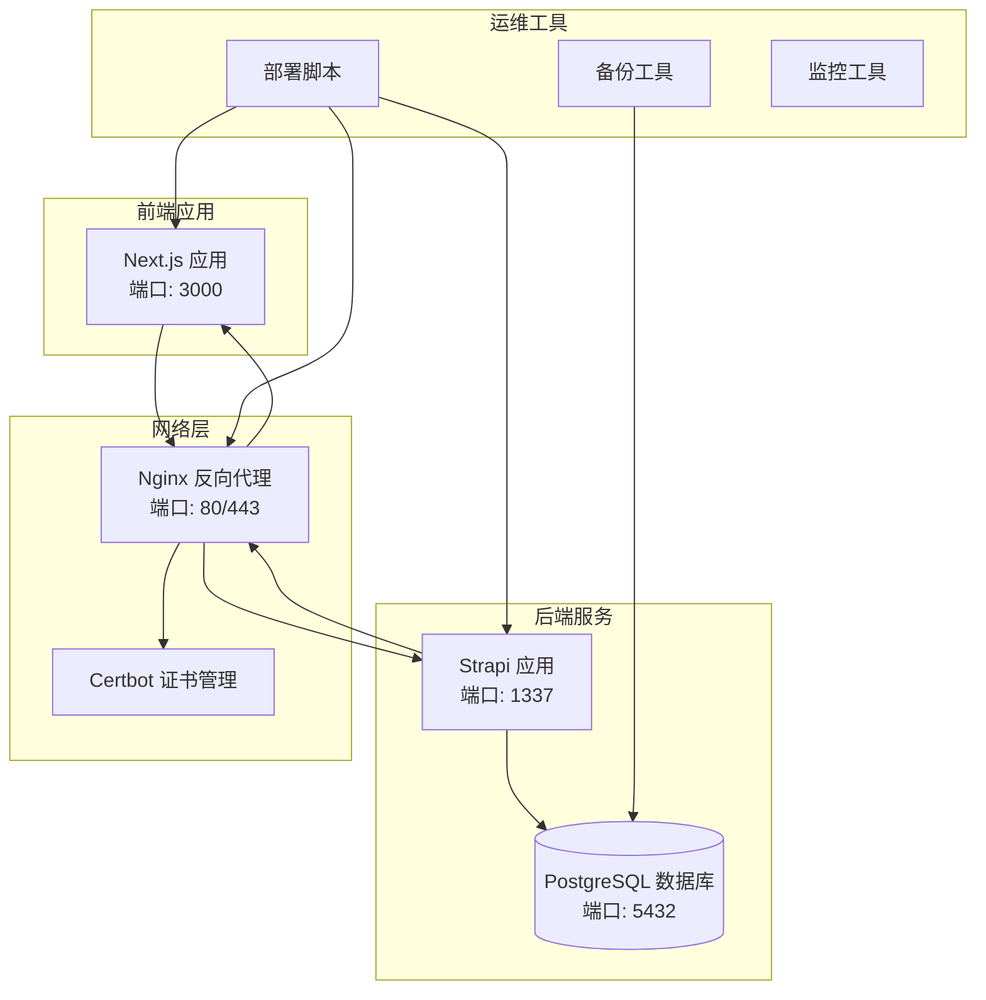

**图表来源**
- [docker-compose.prod.yml](file://ops/docker/docker-compose.prod.yml#L1-L153)
- [sites.conf](file://ops/nginx/sites.conf#L1-L63)

**章节来源**
- [docker-compose.prod.yml](file://ops/docker/docker-compose.prod.yml#L1-L153)
- [docker-compose.dev.yml](file://ops/docker/docker-compose.dev.yml#L1-L55)

## 核心组件

### 容器编排组件

系统使用 Docker Compose 进行容器编排，包含以下核心服务：

| 组件 | 版本 | 端口 | 功能描述 |
|------|------|------|----------|
| PostgreSQL | 16 | 5432 | 主数据库存储 |
| Backend | Strapi 5.33.4 | 1337 | 内容管理系统 |
| Frontend | Next.js 15.1.0 | 3000 | 前端静态站点 |
| Nginx | 1.27-alpine | 80/443 | 反向代理和负载均衡 |
| Certbot | Latest | - | SSL/TLS 证书管理 |

### 环境配置

系统支持多环境配置，包括开发和生产环境：

**生产环境配置 (.env.prod)**
- 数据库连接：PostgreSQL 16
- 应用密钥：自动生成的随机密钥
- 证书配置：Let's Encrypt 自动证书
- 性能优化：内存限制和 CPU 亲和性

**开发环境配置 (.env.dev)**
- 数据库连接：SQLite 文件数据库
- 开发工具：热重载和调试功能
- 端口映射：本地端口直连

**章节来源**
- [.env.prod.example](file://ops/.env.prod.example#L1-L27)
- [.env.dev.example](file://ops/.env.dev.example#L1-L15)

## 架构概览

系统采用微服务架构，通过 Nginx 进行统一入口管理：

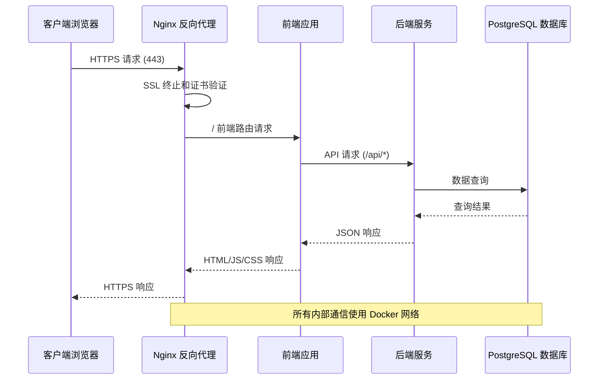

**图表来源**
- [docker-compose.prod.yml](file://ops/docker/docker-compose.prod.yml#L32-L123)
- [sites.conf](file://ops/nginx/sites.conf#L31-L61)

**章节来源**
- [docker-compose.prod.yml](file://ops/docker/docker-compose.prod.yml#L1-L153)
- [sites.conf](file://ops/nginx/sites.conf#L1-L63)

## 详细组件分析

### 部署流程组件

#### 首次部署流程

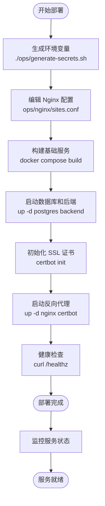

**图表来源**
- [DEPLOYMENT-OPS-MANUAL.md](file://ops/DEPLOYMENT-OPS-MANUAL.md#L17-L35)
- [deploy.sh](file://ops/deploy.sh#L16-L38)

#### 更新部署流程

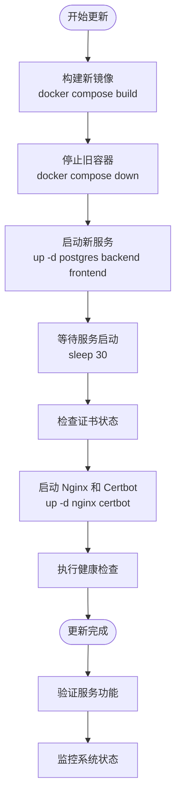

**图表来源**
- [deploy.sh](file://ops/deploy.sh#L18-L38)

#### 回滚部署流程

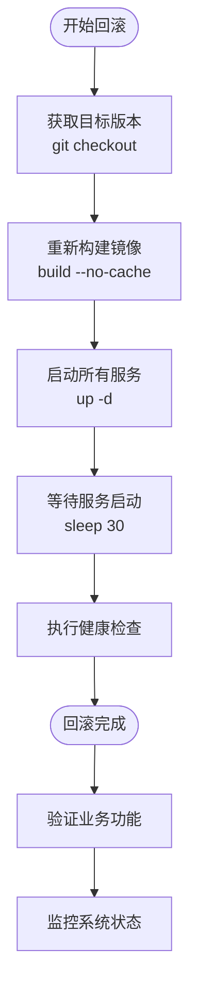

**图表来源**
- [rollback.sh](file://ops/rollback.sh#L23-L31)

**章节来源**
- [DEPLOYMENT-OPS-MANUAL.md](file://ops/DEPLOYMENT-OPS-MANUAL.md#L17-L51)
- [deploy.sh](file://ops/deploy.sh#L1-L61)
- [rollback.sh](file://ops/rollback.sh#L1-L53)

### 备份与恢复组件

#### 备份策略

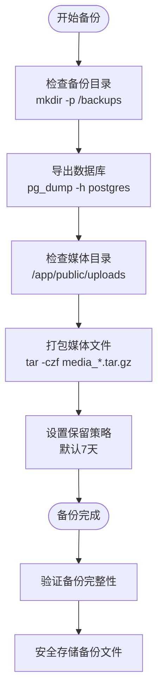

**图表来源**
- [backup.sh](file://ops/backups/backup.sh#L14-L33)

#### 恢复流程

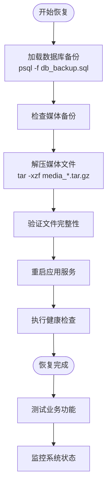

**图表来源**
- [restore.sh](file://ops/backups/restore.sh#L21-L30)

**章节来源**
- [backup.sh](file://ops/backups/backup.sh#L1-L33)
- [restore.sh](file://ops/backups/restore.sh#L1-L31)

### 证书管理组件

#### 证书获取流程

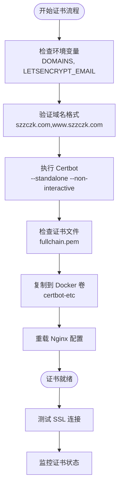

**图表来源**
- [init-cert.sh](file://ops/docker/init-cert.sh#L14-L30)

#### 证书续期流程

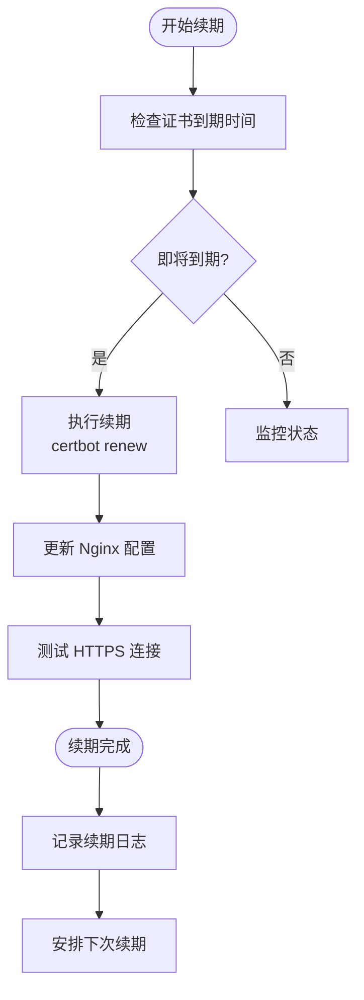

**图表来源**
- [init-cert.sh](file://ops/docker/init-cert.sh#L28-L30)

**章节来源**
- [init-cert.sh](file://ops/docker/init-cert.sh#L1-L31)

## 依赖关系分析

### 技术栈依赖

```mermaid
graph TB
subgraph "前端技术栈"
NextJS[Next.js 15.1.0]
React[React 18.3.1]
MaterialUI[@mui/material 7.3.5]
Emotion[@emotion/react 11.14.0]
end
subgraph "后端技术栈"
Strapi[Strapi 5.33.4]
NodeJS[Node.js 24]
PostgreSQL[PostgreSQL 16]
BetterSQLite[better-sqlite3 12.4.1]
end
subgraph "运维技术栈"
Docker[Docker 24]
Compose[Docker Compose]
Nginx[Nginx 1.27-alpine]
Certbot[Certbot]
end
NextJS --> React
NextJS --> MaterialUI
NextJS --> Emotion
Strapi --> NodeJS
Strapi --> PostgreSQL
Strapi --> BetterSQLite
NextJS --> Docker
Strapi --> Docker
Docker --> Compose
Docker --> Nginx
Nginx --> Certbot
```

**图表来源**
- [package.json (前端)](file://frontend/package.json#L12-L74)
- [package.json (后端)](file://backend/package.json#L20-L29)

### 容器间依赖关系

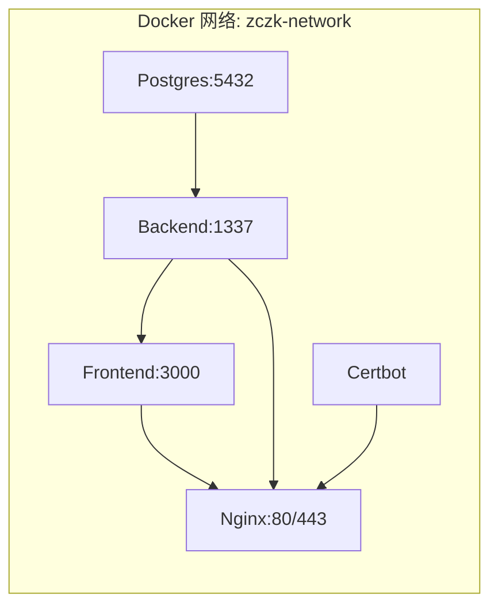

**图表来源**
- [docker-compose.prod.yml](file://ops/docker/docker-compose.prod.yml#L150-L153)

**章节来源**
- [package.json (前端)](file://frontend/package.json#L1-L88)
- [package.json (后端)](file://backend/package.json#L1-L45)

## 性能考虑

### 资源限制配置

系统为各容器设置了合理的资源限制：

| 容器 | 内存限制 | CPU 限制 | 内存预留 |
|------|----------|----------|----------|
| PostgreSQL | 1GB | 1.0 | 512MB |
| Backend | 1GB | 1.0 | 512MB |
| Frontend | 512MB | 0.5 | 256MB |
| Nginx | 256MB | 0.5 | 128MB |
| Certbot | - | - | - |

### 健康检查配置

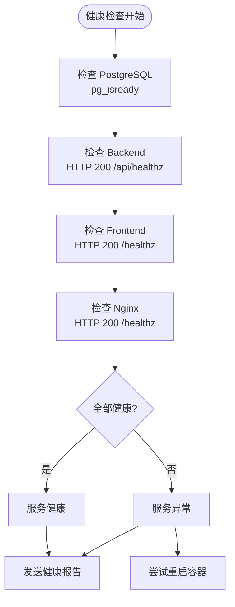

**图表来源**
- [docker-compose.prod.yml](file://ops/docker/docker-compose.prod.yml#L18-L115)

### 性能优化建议

1. **数据库优化**
   - 使用连接池管理
   - 定期执行 VACUUM 分析
   - 监控慢查询日志

2. **缓存策略**
   - Nginx 静态文件缓存
   - CDN 加速静态资源
   - API 响应缓存

3. **监控指标**
   - CPU 和内存使用率
   - 数据库连接数
   - 请求响应时间

**章节来源**
- [docker-compose.prod.yml](file://ops/docker/docker-compose.prod.yml#L7-L28)
- [docker-compose.prod.yml](file://ops/docker/docker-compose.prod.yml#L48-L82)

## 故障排除指南

### 常见问题诊断

#### 证书相关问题

| 问题症状 | 可能原因 | 解决方案 |
|----------|----------|----------|
| 证书获取失败 | DNS 未解析或端口被占用 | 检查域名解析和 80 端口可用性 |
| 证书续期失败 | Let's Encrypt 服务问题 | 检查 certbot 日志和网络连接 |
| SSL 配置错误 | 证书文件路径错误 | 验证证书卷挂载和权限设置 |

#### 数据库连接问题

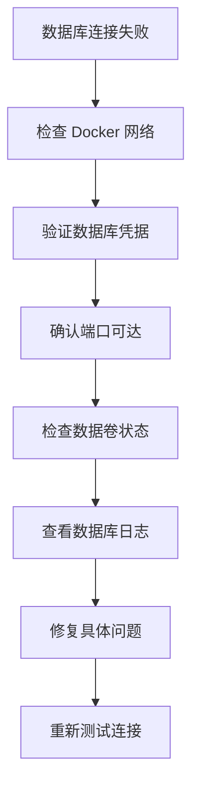

#### 应用启动问题

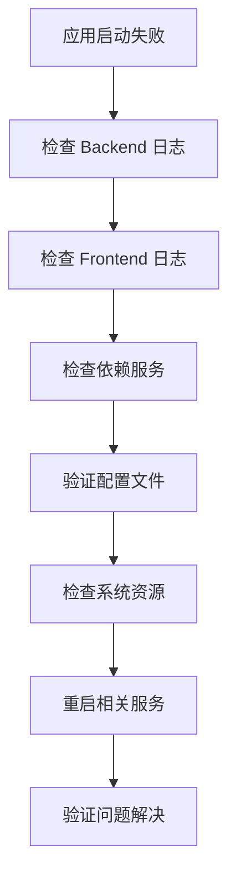

### 日志分析方法

1. **查看容器日志**
   ```bash
   docker compose -f ops/docker/docker-compose.prod.yml logs -f backend
   docker compose -f ops/docker/docker-compose.prod.yml logs -f frontend
   ```

2. **检查健康状态**
   ```bash
   docker compose -f ops/docker/docker-compose.prod.yml ps
   docker compose -f ops/docker/docker-compose.prod.yml healthcheck
   ```

3. **网络连接测试**
   ```bash
   docker compose -f ops/docker/docker-compose.prod.yml exec nginx wget --spider http://backend:1337/api/healthz
   docker compose -f ops/docker/docker-compose.prod.yml exec nginx wget --spider http://frontend:3000/healthz
   ```

**章节来源**
- [DEPLOYMENT-OPS-MANUAL.md](file://ops/DEPLOYMENT-OPS-MANUAL.md#L102-L108)

## 结论

本部署运维手册提供了完整的生产环境管理指导，涵盖了从初始部署到日常维护的各个方面。通过标准化的容器化部署、自动化脚本和完善的监控机制，确保了系统的稳定性、可维护性和可扩展性。

关键要点包括：
- 使用 Docker Compose 实现服务编排和依赖管理
- 通过自动化脚本简化部署和运维流程
- 建立完善的备份和恢复机制
- 实施 SSL/TLS 证书的自动化管理
- 建立全面的监控和告警体系

建议定期审查和更新运维流程，根据实际运行情况进行优化调整。

## 附录

### 快速参考命令

```bash
# 首次部署
./ops/generate-secrets.sh <domain>
docker compose -f ops/docker/docker-compose.prod.yml build
docker compose -f ops/docker/docker-compose.prod.yml up -d postgres backend frontend
docker compose -f ops/docker/docker-compose.prod.yml run --rm certbot /opt/init-cert.sh
docker compose -f ops/docker/docker-compose.prod.yml up -d nginx certbot

# 日常维护
./ops/deploy.sh                    # 更新部署
./ops/rollback.sh <git-ref>        # 回滚部署
./ops/backups/backup.sh            # 创建备份
./ops/backups/restore.sh <file>    # 恢复备份
docker compose -f ops/docker/docker-compose.prod.yml exec -T certbot /opt/certbot-renew.sh  # 证书续期
```

### 监控检查清单

- [ ] HTTPS 强制启用且证书有效
- [ ] 前端健康检查：`/healthz`
- [ ] 后端健康检查：`/api/healthz`
- [ ] 数据库连接正常
- [ ] 备份任务按计划执行
- [ ] 系统资源使用率正常
- [ ] 错误日志无异常