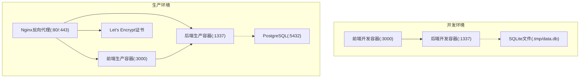
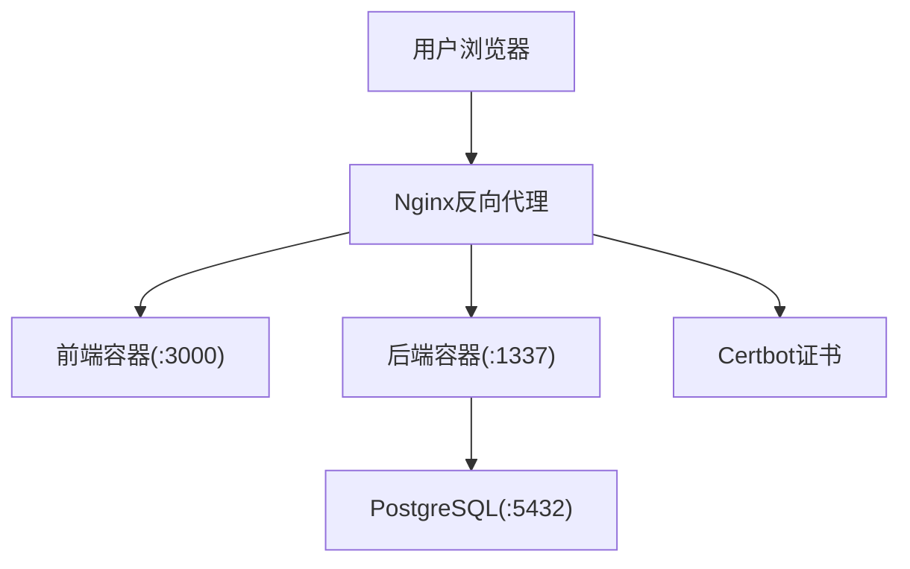
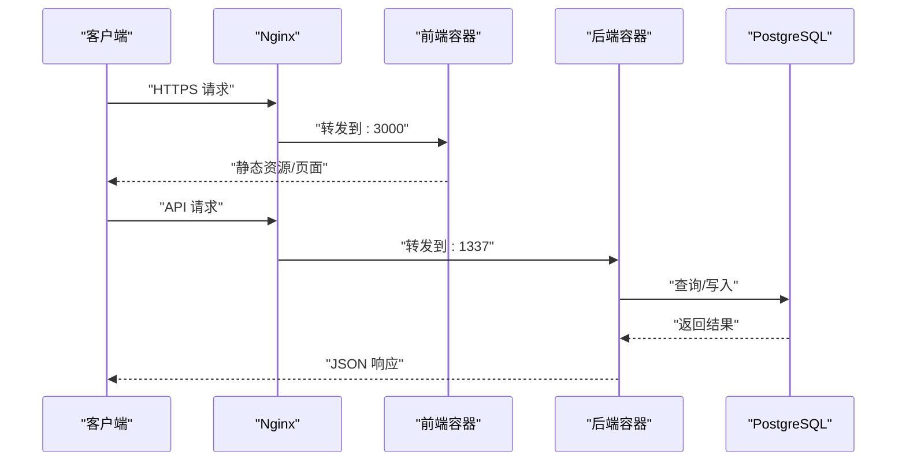
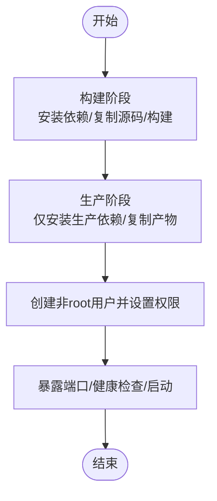
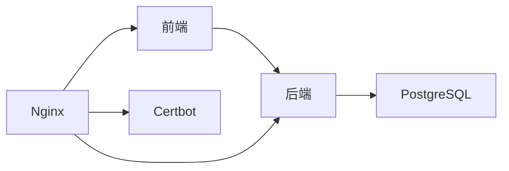

# Docker Compose编排配置

<cite>
**本文档引用的文件**
- [DEPLOYMENT.md](file://DEPLOYMENT.md)
- [开发与生产环境分离方案.md](file://开发与生产环境分离方案.md)
- [生产环境分离的部署方案.md](file://生产环境分离的部署方案.md)
- [backend/.env.example](file://backend/.env.example)
- [frontend/.env.example](file://frontend/.env.example)
- [Dockerfile.backend](file://开发与生产环境分离方案.md)
- [Dockerfile.frontend](file://开发与生产环境分离方案.md)
- [docker-compose.dev.yml](file://开发与生产环境分离方案.md)
- [docker-compose.prod.yml](file://DEPLOYMENT.md)
- [nginx.conf](file://开发与生产环境分离方案.md)
- [sites.conf](file://开发与生产环境分离方案.md)
</cite>

## 目录
1. [简介](#简介)
2. [项目结构](#项目结构)
3. [核心组件](#核心组件)
4. [架构总览](#架构总览)
5. [详细组件分析](#详细组件分析)
6. [依赖关系分析](#依赖关系分析)
7. [性能考量](#性能考量)
8. [故障排除指南](#故障排除指南)
9. [结论](#结论)
10. [附录](#附录)

## 简介
本文件面向运维团队，系统化阐述本项目的Docker Compose容器编排策略，涵盖生产环境与开发环境的差异化配置、服务定义、网络与卷管理、环境变量治理、多阶段构建策略、容器间依赖与服务发现、健康检查与重启策略，以及最佳实践与故障排除建议。读者无需深入编程背景即可理解并正确使用该编排方案。

## 项目结构
项目采用前后端分离架构，通过Docker Compose在开发与生产环境分别编排服务，实现数据库、后端CMS、前端应用与反向代理的协同运行。开发环境使用SQLite，生产环境使用PostgreSQL，并通过Nginx统一对外提供HTTPS服务。

**图表来源**
- [docker-compose.dev.yml](file://开发与生产环境分离方案.md#L1785-L1825)
- [docker-compose.prod.yml](file://DEPLOYMENT.md#L821-L919)
- [sites.conf](file://开发与生产环境分离方案.md#L1974-L2026)

**章节来源**
- [DEPLOYMENT.md](file://DEPLOYMENT.md#L34-L100)
- [开发与生产环境分离方案.md](file://开发与生产环境分离方案.md#L88-L211)

## 核心组件
- 前端应用（Next.js）：生产环境通过Nginx反向代理对外提供服务，开发环境直接监听3000端口。
- 后端应用（Strapi CMS）：提供REST API，开发环境使用SQLite，生产环境使用PostgreSQL。
- 数据库（PostgreSQL）：生产环境专用，使用Docker命名卷持久化数据。
- 反向代理（Nginx）：统一入口，负责HTTPS终止、证书管理与请求转发。
- 证书管理（Certbot）：自动化获取与续期Let's Encrypt证书，配合Nginx重载生效。

**章节来源**
- [DEPLOYMENT.md](file://DEPLOYMENT.md#L101-L144)
- [开发与生产环境分离方案.md](file://开发与生产环境分离方案.md#L141-L211)

## 架构总览
生产环境采用“Nginx反向代理 + 前端 + 后端 + PostgreSQL”的四层架构；开发环境采用“前端 + 后端 + SQLite”的三层架构。两者均通过独立Docker网络隔离，确保服务间通信安全可控。

**图表来源**
- [docker-compose.prod.yml](file://DEPLOYMENT.md#L821-L919)
- [sites.conf](file://开发与生产环境分离方案.md#L1974-L2026)

**章节来源**
- [DEPLOYMENT.md](file://DEPLOYMENT.md#L34-L100)

## 详细组件分析

### 1) 服务定义与依赖关系
- 前端服务（frontend）
  - 开发：直接运行开发服务器，端口映射至宿主机3000。
  - 生产：构建后运行生产服务器，端口映射至宿主机3000，依赖后端服务。
- 后端服务（backend）
  - 开发：直接运行开发服务器，端口映射至宿主机1337，使用SQLite。
  - 生产：构建后运行生产服务器，端口映射至宿主机1337，依赖PostgreSQL健康就绪。
- 数据库服务（postgres）
  - 生产：使用PostgreSQL镜像，挂载命名卷持久化数据，配置健康检查。
- 反向代理（nginx）
  - 生产：监听80/443，转发请求至前端与后端，挂载证书与站点配置。

**图表来源**
- [docker-compose.prod.yml](file://DEPLOYMENT.md#L821-L919)
- [sites.conf](file://开发与生产环境分离方案.md#L1974-L2026)

**章节来源**
- [开发与生产环境分离方案.md](file://开发与生产环境分离方案.md#L1785-L1825)
- [DEPLOYMENT.md](file://DEPLOYMENT.md#L821-L919)

### 2) 网络配置
- 独立桥接网络：所有服务运行在同一Docker网络中，实现服务间DNS解析与通信隔离。
- 端口映射：
  - 开发：前端3000、后端1337、数据库5432。
  - 生产：Nginx 80/443，后端1337，前端3000（仅内部访问）。

**章节来源**
- [开发与生产环境分离方案.md](file://开发与生产环境分离方案.md#L1822-L1825)
- [DEPLOYMENT.md](file://DEPLOYMENT.md#L916-L919)

### 3) 卷挂载与数据持久化
- PostgreSQL数据卷：使用命名卷持久化数据库文件，避免容器重建导致数据丢失。
- 上传文件卷：后端容器挂载上传目录，确保媒体文件持久化。
- 配置卷：Nginx挂载站点配置与证书目录，便于热更新与证书管理。

**章节来源**
- [DEPLOYMENT.md](file://DEPLOYMENT.md#L912-L919)
- [开发与生产环境分离方案.md](file://开发与生产环境分离方案.md#L1974-L2026)

### 4) 环境变量管理
- 开发环境：
  - 前端：NEXT_PUBLIC_STRAPI_URL指向本地后端。
  - 后端：DATABASE_CLIENT=sqlite，DATABASE_FILENAME指定数据库文件。
- 生产环境：
  - 通过ops/.env.prod集中管理数据库密码、应用密钥、域名等敏感信息。
  - 后端与前端通过env_file与environment字段注入变量。
- 变量分类：
  - 自动生成：数据库密码、应用密钥等。
  - 手动定义：域名、Let's Encrypt邮箱等。

**章节来源**
- [backend/.env.example](file://backend/.env.example#L1-L15)
- [frontend/.env.example](file://frontend/.env.example#L1-L2)
- [DEPLOYMENT.md](file://DEPLOYMENT.md#L148-L222)

### 5) 多阶段构建策略
- 后端（Strapi）：
  - 构建阶段：安装依赖、复制源码、执行构建。
  - 生产阶段：仅安装生产依赖、复制构建产物、以非root用户运行。
- 前端（Next.js）：
  - 构建阶段：安装pnpm与依赖、复制源码、执行构建。
  - 生产阶段：仅安装生产依赖、复制构建产物、以非root用户运行。
- 优化要点：
  - 使用Alpine基础镜像减小体积。
  - 仅复制必要文件，避免打包node_modules。
  - 使用dumb-init处理信号，提升稳定性。

**图表来源**
- [Dockerfile.backend](file://开发与生产环境分离方案.md#L1827-L1886)
- [Dockerfile.frontend](file://开发与生产环境分离方案.md#L1888-L1949)

**章节来源**
- [开发与生产环境分离方案.md](file://开发与生产环境分离方案.md#L291-L458)
- [DEPLOYMENT.md](file://DEPLOYMENT.md#L225-L320)

### 6) 容器间依赖与服务发现
- 依赖声明：
  - 前端依赖后端服务，确保后端就绪后再启动。
  - 后端依赖数据库健康检查，确保数据库可用后再启动。
- 服务发现：
  - 同一Docker网络内，服务可通过服务名进行内部通信（如backend:1337）。

**章节来源**
- [开发与生产环境分离方案.md](file://开发与生产环境分离方案.md#L1817-L1820)
- [DEPLOYMENT.md](file://DEPLOYMENT.md#L868-L891)

### 7) 健康检查与重启策略
- 健康检查：
  - PostgreSQL：使用pg_isready检测数据库就绪。
  - 后端/前端/Nginx：使用wget探测健康端点。
- 重启策略：unless-stopped，保证容器异常退出后自动重启。

**章节来源**
- [DEPLOYMENT.md](file://DEPLOYMENT.md#L587-L646)
- [开发与生产环境分离方案.md](file://开发与生产环境分离方案.md#L795-L807)

### 8) 证书自动化与HTTPS
- 证书获取：Certbot Standalone模式首次获取证书。
- 证书续期：每日定时检查并自动续期，成功后重载Nginx。
- Nginx配置：强制HTTPS跳转、安全头部、TLS参数优化。

**章节来源**
- [DEPLOYMENT.md](file://DEPLOYMENT.md#L322-L411)
- [开发与生产环境分离方案.md](file://开发与生产环境分离方案.md#L461-L590)

## 依赖关系分析
- 组件耦合度：前端与后端通过API耦合，数据库为后端数据存储依赖。
- 直接依赖链：
  - 前端 → 后端 → 数据库
  - Nginx → 前端/后端
- 间接依赖：Nginx依赖Let's Encrypt证书；后端依赖数据库健康状态。

**图表来源**
- [docker-compose.prod.yml](file://DEPLOYMENT.md#L821-L919)
- [sites.conf](file://开发与生产环境分离方案.md#L1974-L2026)

**章节来源**
- [DEPLOYMENT.md](file://DEPLOYMENT.md#L821-L919)

## 性能考量
- 镜像体积：多阶段构建+Alpine基础镜像显著减小最终镜像。
- 启动速度：生产环境使用健康检查与依赖顺序，避免冷启动抖动。
- 资源限制：建议在生产环境为各服务配置CPU/内存限制与预留，防止资源争抢。
- 日志轮转：Docker日志驱动配置限制单文件大小与保留份数，避免磁盘膨胀。

**章节来源**
- [开发与生产环境分离方案.md](file://开发与生产环境分离方案.md#L377-L458)
- [DEPLOYMENT.md](file://DEPLOYMENT.md#L956-L1020)

## 故障排除指南
- 常见问题与解决思路：
  - 容器无法启动：检查端口占用、依赖服务健康状态、环境变量是否正确。
  - 数据库连接失败：确认PostgreSQL已就绪并通过健康检查。
  - API请求失败：检查CORS配置、后端日志、Token权限。
  - 前端无法访问：检查Nginx配置、证书有效性、上游服务状态。
  - SSL证书过期：执行certbot续期并重载Nginx。
- 排查流程：
  - 查看容器状态与日志。
  - 检查Docker网络连通性。
  - 验证资源使用情况（CPU/内存/磁盘）。
  - 重启对应服务并观察恢复情况。

**章节来源**
- [DEPLOYMENT.md](file://DEPLOYMENT.md#L587-L646)
- [开发与生产环境分离方案.md](file://开发与生产环境分离方案.md#L501-L590)

## 结论
本编排方案通过清晰的环境分离、严格的多阶段构建、完善的健康检查与证书自动化，实现了开发与生产的高效协同与稳定运行。运维团队可依据本文档的配置与最佳实践，快速完成部署、升级与故障处理。

## 附录

### A. 开发环境编排（docker-compose.dev.yml）
- 服务：backend、frontend
- 端口：1337、3000
- 网络：zczk-network
- 特点：直接运行开发服务器，支持热重载

**章节来源**
- [开发与生产环境分离方案.md](file://开发与生产环境分离方案.md#L1785-L1825)

### B. 生产环境编排（docker-compose.prod.yml）
- 服务：postgres、backend、frontend、nginx
- 端口：80/443、1337、3000
- 网络：zczk-network
- 特点：多阶段构建、健康检查、重启策略、卷持久化

**章节来源**
- [DEPLOYMENT.md](file://DEPLOYMENT.md#L821-L919)

### C. Nginx配置要点
- 反向代理：将前端与后端服务暴露给外部。
- HTTPS：强制跳转、安全头部、TLS参数。
- 证书：挂载Let's Encrypt证书目录。

**章节来源**
- [开发与生产环境分离方案.md](file://开发与生产环境分离方案.md#L1951-L2026)

### D. 环境变量模板
- 开发：前端NEXT_PUBLIC_STRAPI_URL，后端DATABASE_CLIENT/FILENAME。
- 生产：ops/.env.prod集中管理数据库密码、应用密钥、域名等。

**章节来源**
- [backend/.env.example](file://backend/.env.example#L1-L15)
- [frontend/.env.example](file://frontend/.env.example#L1-L2)
- [DEPLOYMENT.md](file://DEPLOYMENT.md#L148-L222)