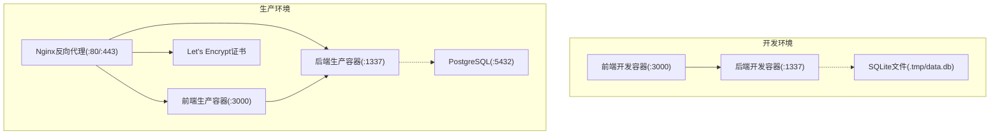
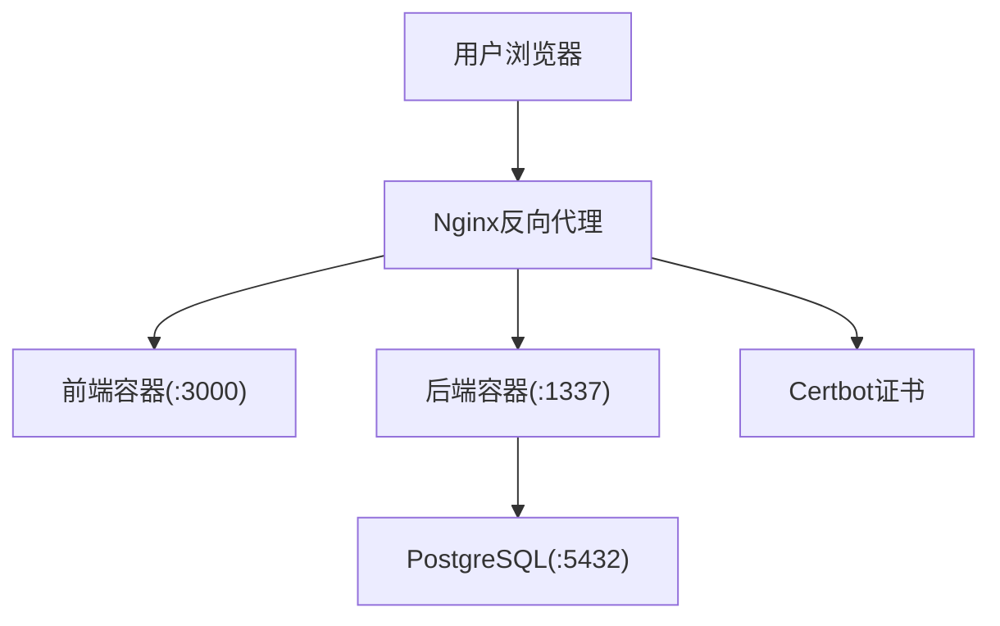

# Docker Compose编排配置

<cite>
**本文档引用的文件**
- [docker-compose.dev.yml](file://ops/docker/docker-compose.dev.yml)
- [docker-compose.prod.yml](file://ops/docker/docker-compose.prod.yml)
- [Dockerfile.backend](file://ops/docker/Dockerfile.backend)
- [Dockerfile.frontend](file://ops/docker/Dockerfile.frontend)
- [.env.dev.example](file://ops/.env.dev.example)
- [.env.prod.example](file://ops/.env.prod.example)
- [nginx.conf](file://ops/nginx/nginx.conf)
- [sites.conf](file://ops/nginx/sites.conf)
- [init-cert.sh](file://ops/docker/init-cert.sh)
- [certbot-renew.sh](file://ops/docker/certbot-renew.sh)
- [deploy.sh](file://ops/deploy.sh)
- [rollback.sh](file://ops/rollback.sh)
- [generate-secrets.sh](file://ops/generate-secrets.sh)
- [healthz.ts](file://backend/src/api/healthz/controllers/healthz.ts)
- [route.ts](file://frontend/app/healthz/route.ts)
</cite>

## 更新摘要
**变更内容**
- 新增完整的生产环境Docker Compose编排配置
- 新增多阶段构建的Dockerfile配置
- 新增开发环境与生产环境的完整服务定义
- 新增健康检查与重启策略配置
- 新增证书自动化管理流程
- 新增部署和回滚脚本

## 目录
1. [简介](#简介)
2. [项目结构](#项目结构)
3. [核心组件](#核心组件)
4. [架构总览](#架构总览)
5. [开发环境编排](#开发环境编排)
6. [生产环境编排](#生产环境编排)
7. [多阶段构建策略](#多阶段构建策略)
8. [容器间依赖与服务发现](#容器间依赖与服务发现)
9. [健康检查与重启策略](#健康检查与重启策略)
10. [证书自动化与HTTPS](#证书自动化与https)
11. [部署与运维脚本](#部署与运维脚本)
12. [故障排除指南](#故障排除指南)
13. [结论](#结论)

## 简介
本文件面向运维团队，系统化阐述本项目的Docker Compose容器编排策略。项目采用开发与生产环境分离的架构设计，通过Docker Compose在不同环境中编排服务，实现数据库、后端CMS、前端应用与反向代理的协同运行。开发环境使用SQLite，生产环境使用PostgreSQL，并通过Nginx统一对外提供HTTPS服务。

## 项目结构
项目采用前后端分离架构，通过Docker Compose在开发与生产环境分别编排服务。开发环境使用SQLite，生产环境使用PostgreSQL，并通过Nginx统一对外提供HTTPS服务。



**章节来源**
- [docker-compose.dev.yml](file://ops/docker/docker-compose.dev.yml#L1-L55)
- [docker-compose.prod.yml](file://ops/docker/docker-compose.prod.yml#L1-L153)

## 核心组件
- 前端应用（Next.js）：生产环境通过Nginx反向代理对外提供服务，开发环境直接监听3000端口。
- 后端应用（Strapi CMS）：提供REST API，开发环境使用SQLite，生产环境使用PostgreSQL。
- 数据库（PostgreSQL）：生产环境专用，使用Docker命名卷持久化数据。
- 反向代理（Nginx）：统一入口，负责HTTPS终止、证书管理与请求转发。
- 证书管理（Certbot）：自动化获取与续期Let's Encrypt证书，配合Nginx重载生效。

**章节来源**
- [docker-compose.prod.yml](file://ops/docker/docker-compose.prod.yml#L4-L31)

## 架构总览
生产环境采用"nginx反向代理 + 前端 + 后端 + PostgreSQL"的四层架构；开发环境采用"前端 + 后端 + SQLite"的三层架构。两者均通过独立Docker网络隔离，确保服务间通信安全可控。



**章节来源**
- [docker-compose.prod.yml](file://ops/docker/docker-compose.prod.yml#L92-L123)

## 开发环境编排
开发环境通过Docker Compose实现前后端联调，支持热重载和实时同步。

### 服务配置特点
- **后端服务**：使用开发阶段镜像，映射本地代码目录，启用文件监控
- **前端服务**：使用开发阶段镜像，支持TurboPack加速开发
- **网络配置**：共享zczk-network网络，便于服务间通信
- **卷挂载**：本地代码目录挂载到容器，实现热重载
- **环境变量**：通过.env.dev文件管理开发配置

### 开发环境服务定义
```yaml
backend:
  build:
    dockerfile: ops/docker/Dockerfile.backend
    target: dev
  env_file: [../.env.dev]
  command: ["npm", "run", "develop"]
  ports: ["1337:1337"]
  volumes:
    - ../../backend:/app
    - /app/node_modules
  depends_on: [frontend]

frontend:
  build:
    dockerfile: ops/docker/Dockerfile.frontend
    target: dev
  env_file: [../.env.dev]
  command: ["pnpm", "dev", "--turbopack"]
  ports: ["3000:3000"]
  volumes:
    - ../../frontend:/app
    - /app/node_modules
  depends_on: [backend]
```

**章节来源**
- [docker-compose.dev.yml](file://ops/docker/docker-compose.dev.yml#L3-L47)

## 生产环境编排
生产环境通过多阶段构建和健康检查实现高可用部署。

### 服务编排架构
- **PostgreSQL服务**：生产数据库，配置资源限制和健康检查
- **后端服务**：Strapi CMS，配置健康检查和资源限制
- **前端服务**：Next.js应用，配置健康检查和资源限制
- **Nginx服务**：反向代理，配置SSL和请求转发
- **Certbot服务**：证书管理，支持自动续期

### 生产环境服务定义
```yaml
postgres:
  image: postgres:16-alpine
  restart: unless-stopped
  mem_limit: 1g
  healthcheck:
    test: ["CMD-SHELL", "pg_isready -U $${POSTGRES_USER} -d $${POSTGRES_DB}"]

backend:
  restart: unless-stopped
  build:
    dockerfile: ops/docker/Dockerfile.backend
    target: runner
  env_file: [../.env.prod]
  depends_on:
    postgres:
      condition: service_healthy
  healthcheck:
    test: ["CMD-SHELL", "node -e \"require('http').get('http://localhost:1337/api/healthz', (r) => process.exit(r.statusCode === 200 ? 0 : 1)).on('error', () => process.exit(1))\""]

nginx:
  image: nginx:1.27-alpine
  depends_on:
    frontend:
      condition: service_healthy
    backend:
      condition: service_healthy
  ports: ["80:80", "443:443"]
  volumes:
    - ../nginx/nginx.conf:/etc/nginx/nginx.conf:ro
    - ../nginx/sites.conf:/etc/nginx/conf.d/default.conf:ro
  healthcheck:
    test: ["CMD-SHELL", "wget --quiet --tries=1 --spider http://localhost/healthz"]
```

**章节来源**
- [docker-compose.prod.yml](file://ops/docker/docker-compose.prod.yml#L3-L123)

## 多阶段构建策略
项目采用多阶段构建策略，通过Docker多阶段构建优化镜像体积和安全性。

### 后端多阶段构建
- **base阶段**：基础Node.js环境，设置工作目录和标签信息
- **deps阶段**：安装构建依赖，包括Python3、Make、G++等编译工具
- **build阶段**：复制源码并执行构建命令
- **runner阶段**：仅包含运行时依赖，使用非root用户运行
- **dev阶段**：开发环境专用，支持热重载

### 前端多阶段构建
- **base阶段**：基于Alpine Linux的轻量级Node.js环境
- **deps阶段**：安装pnpm和依赖包，使用Corepack启用pnpm
- **build阶段**：复制源码并执行构建命令，禁用遥测数据收集
- **runner阶段**：复制构建产物，配置静态文件和公共资源
- **dev阶段**：开发环境专用，支持TurboPack加速

### 构建优化特性
- **镜像分层**：按功能划分构建阶段，减少最终镜像大小
- **依赖管理**：开发和生产依赖分离，避免生产环境包含开发工具
- **安全配置**：使用非root用户运行，降低安全风险
- **性能优化**：启用HTTP/2和缓存策略

**章节来源**
- [Dockerfile.backend](file://ops/docker/Dockerfile.backend#L1-L38)
- [Dockerfile.frontend](file://ops/docker/Dockerfile.frontend#L1-L39)

## 容器间依赖与服务发现
项目通过Docker Compose的依赖声明和网络配置实现服务间的自动发现和通信。

### 依赖声明策略
- **开发环境**：前端依赖后端服务，确保后端就绪后再启动
- **生产环境**：后端依赖数据库健康检查，前端依赖后端健康检查
- **Nginx依赖**：依赖所有上游服务健康检查通过

### 服务发现机制
- **网络隔离**：所有服务位于zczk-network网络中
- **服务名称**：服务可通过服务名进行内部通信
- **端口映射**：开发环境使用主机端口映射，生产环境通过Nginx代理

### 环境变量配置
- **开发环境**：NEXT_PUBLIC_STRAPI_URL=http://localhost:1337
- **生产环境**：NEXT_PUBLIC_STRAPI_URL=https://szzczk.com
- **数据库连接**：开发环境使用SQLite，生产环境使用PostgreSQL

**章节来源**
- [docker-compose.dev.yml](file://ops/docker/docker-compose.dev.yml#L42-L43)
- [docker-compose.prod.yml](file://ops/docker/docker-compose.prod.yml#L75-L77)

## 健康检查与重启策略
项目配置了完善的健康检查和重启策略，确保服务的高可用性。

### 健康检查配置
- **PostgreSQL**：使用pg_isready检测数据库就绪状态
- **后端服务**：通过/api/healthz端点检测服务状态
- **前端服务**：通过/healthz端点检测Next.js应用状态
- **Nginx**：通过/healthz端点检测反向代理状态

### 重启策略
- **unless-stopped**：容器异常退出后自动重启
- **资源限制**：配置内存上限和CPU配额
- **日志轮转**：配置JSON日志驱动和轮转策略

### 健康检查参数
- **间隔时间**：30秒检查一次
- **超时时间**：5-10秒不等
- **重试次数**：3-5次
- **启动延迟**：40秒启动期

**章节来源**
- [docker-compose.prod.yml](file://ops/docker/docker-compose.prod.yml#L18-L22)
- [docker-compose.prod.yml](file://ops/docker/docker-compose.prod.yml#L48-L52)
- [docker-compose.prod.yml](file://ops/docker/docker-compose.prod.yml#L78-L82)
- [docker-compose.prod.yml](file://ops/docker/docker-compose.prod.yml#L111-L115)

## 证书自动化与HTTPS
项目实现了完整的Let's Encrypt证书自动化管理流程。

### 证书管理架构
- **证书获取**：Certbot Standalone模式，支持ACME挑战
- **自动化流程**：首次部署手动获取证书，自动续期（每天检查）
- **证书存储**：使用Docker命名卷持久化证书文件

### 证书续期配置
- **定时任务**：每天凌晨3点检查证书续期
- **自动重载**：续期成功后自动重载Nginx
- **多域名支持**：支持主域名和www子域名

### Nginx SSL配置
- **强制HTTPS**：HTTP请求自动重定向到HTTPS
- **安全头部**：配置HSTS、X-Frame-Options等安全头
- **TLS参数**：支持TLSv1.2和TLSv1.3协议
- **证书挂载**：从Certbot卷挂载证书文件

**章节来源**
- [docker-compose.prod.yml](file://ops/docker/docker-compose.prod.yml#L125-L142)
- [sites.conf](file://ops/nginx/sites.conf#L1-L63)
- [init-cert.sh](file://ops/docker/init-cert.sh#L1-L31)
- [certbot-renew.sh](file://ops/docker/certbot-renew.sh#L1-L7)

## 部署与运维脚本
项目提供了完整的部署和运维自动化脚本。

### 部署脚本功能
- **环境检查**：验证.env.prod文件存在性
- **镜像构建**：构建所有服务的Docker镜像
- **服务启动**：按顺序启动数据库、后端、前端服务
- **证书验证**：检查Let's Encrypt证书是否存在
- **健康检查**：验证前端和后端服务状态

### 回滚脚本功能
- **版本切换**：切换到指定的Git版本
- **重新构建**：使用--no-cache选项重新构建镜像
- **服务重启**：启动所有服务并进行健康检查
- **状态验证**：验证回滚后的服务状态

### 密钥生成脚本
- **交互式输入**：提示输入域名和邮箱信息
- **随机生成**：使用openssl生成安全的随机密钥
- **配置文件**：生成.env.prod配置文件
- **备份机制**：自动备份现有配置文件

**章节来源**
- [deploy.sh](file://ops/deploy.sh#L1-L61)
- [rollback.sh](file://ops/rollback.sh#L1-L53)
- [generate-secrets.sh](file://ops/generate-secrets.sh#L1-L74)

## 故障排除指南
项目提供了完整的故障排除指南和应急预案。

### 常见故障及解决方案
- **容器无法启动**：检查端口占用、依赖服务健康状态、环境变量是否正确
- **数据库连接失败**：确认PostgreSQL已就绪并通过健康检查
- **API请求失败**：检查CORS配置、后端日志、Token权限
- **前端无法访问**：检查Nginx配置、证书有效性、上游服务状态
- **SSL证书过期**：执行certbot续期并重载Nginx

### 故障排查流程
1. **状态检查**：`docker compose ps`
2. **日志查看**：`docker compose logs -f`
3. **网络诊断**：`docker network inspect`
4. **资源监控**：`docker stats`
5. **服务重启**：`docker compose restart [service_name]`

### 健康检查验证
- **后端健康**：`curl -f https://DOMAIN/api/healthz`
- **前端健康**：`curl -f https://DOMAIN/healthz`
- **Nginx健康**：`curl -f https://DOMAIN/healthz`

**章节来源**
- [deploy.sh](file://ops/deploy.sh#L39-L56)
- [rollback.sh](file://ops/rollback.sh#L33-L50)

## 结论
本编排方案通过清晰的环境分离、严格的多阶段构建、完善的健康检查与证书自动化，实现了开发与生产的高效协同与稳定运行。运维团队可依据本文档的配置与最佳实践，快速完成部署、升级与故障处理。开发环境支持热重载和实时同步，生产环境提供高可用性和安全性保障。