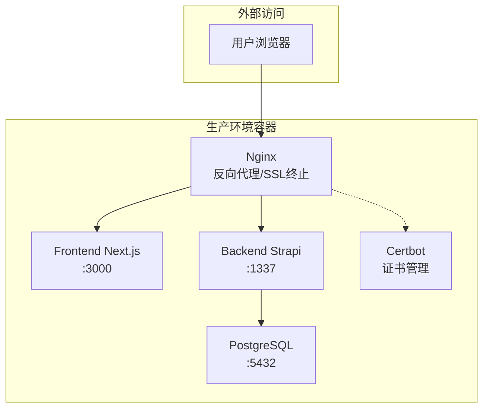
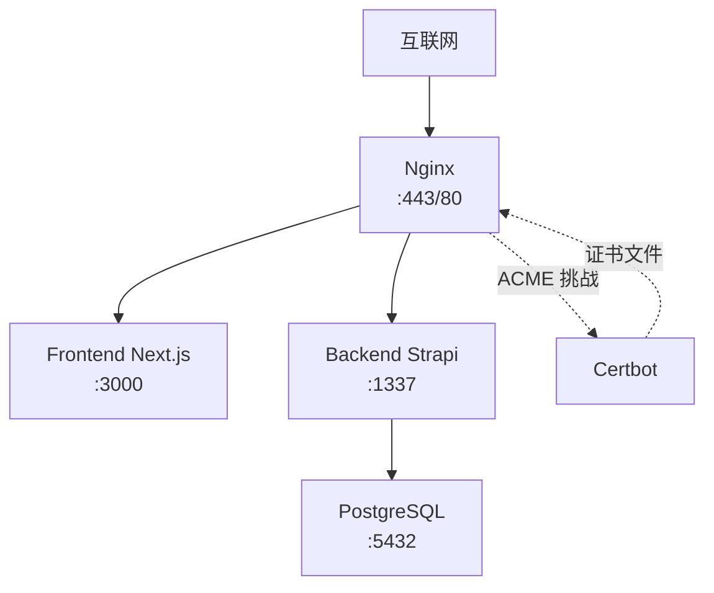
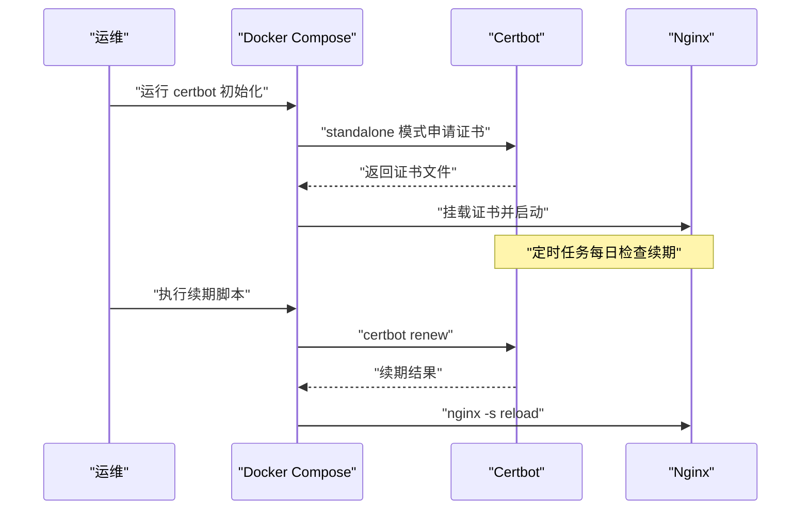
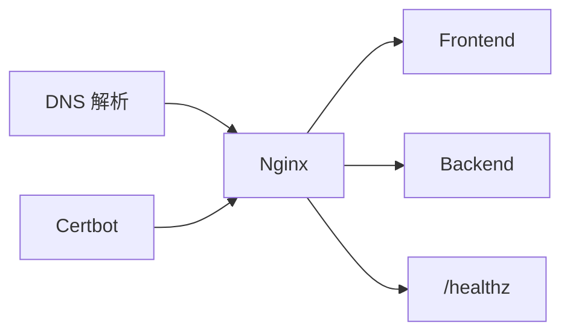

# Nginx和SSL配置

<cite>
**本文引用的文件**
- [DEPLOYMENT.md](file://DEPLOYMENT.md)
- [README.md](file://README.md)
</cite>

## 目录
1. [简介](#简介)
2. [项目结构](#项目结构)
3. [核心组件](#核心组件)
4. [架构总览](#架构总览)
5. [详细组件分析](#详细组件分析)
6. [依赖关系分析](#依赖关系分析)
7. [性能考虑](#性能考虑)
8. [故障排除指南](#故障排除指南)
9. [结论](#结论)
10. [附录](#附录)

## 简介
本文件面向运维团队，系统化梳理本项目的 Nginx 反向代理与 SSL 证书自动化管理方案。内容涵盖：
- Nginx 主配置与站点配置的结构与职责
- HTTP 到 HTTPS 的重定向策略与虚拟主机配置
- 静态资源与健康检查的路径组织
- Let’s Encrypt 证书的获取、安装与自动续期流程
- 安全头设置、缓存与性能优化建议
- 证书初始化脚本与续期脚本的使用方法
- 常见问题排查步骤

## 项目结构
本项目采用“容器化 + 反向代理”的生产部署架构，Nginx 作为统一入口，负责：
- HTTP/HTTPS 流量接入与重定向
- 反向代理到前端 Next.js 与后端 Strapi
- SSL/TLS 终止与证书管理（通过 Certbot）

图表来源
- [DEPLOYMENT.md](file://DEPLOYMENT.md#L36-L99)

章节来源
- [DEPLOYMENT.md](file://DEPLOYMENT.md#L21-L26)
- [DEPLOYMENT.md](file://DEPLOYMENT.md#L36-L99)

## 核心组件
- Nginx 反向代理与 SSL 终止
  - HTTP 80 端口监听，处理 Let’s Encrypt ACME 挑战与全站 301 重定向至 HTTPS
  - HTTPS 443 端口监听，启用 http2，配置 TLS 协议与密码套件，加载 Let’s Encrypt 证书
  - 设置安全响应头，强化传输安全与浏览器防护
- Certbot 证书管理
  - 首次部署时通过 standalone 模式申请证书
  - 定时任务每日检查续期，成功后自动触发 Nginx 重载
- 健康检查与静态资源
  - 提供 /healthz 与 /.well-known/acme-challenge/ 路径，便于探活与挑战验证

章节来源
- [DEPLOYMENT.md](file://DEPLOYMENT.md#L364-L410)
- [DEPLOYMENT.md](file://DEPLOYMENT.md#L322-L363)

## 架构总览
下图展示了生产环境的网络与服务交互关系，以及 Nginx 在整体架构中的定位。

图表来源
- [DEPLOYMENT.md](file://DEPLOYMENT.md#L36-L99)

章节来源
- [DEPLOYMENT.md](file://DEPLOYMENT.md#L36-L99)

## 详细组件分析

### Nginx 主配置与站点配置
- HTTP 到 HTTPS 重定向
  - 80 端口 server 块：允许 ACME 挑战路径访问；对其他请求返回 301 至 https://$host$request_uri
- HTTPS 主站点
  - 443 端口 server 块：绑定生产域名，启用 http2
  - SSL 参数：指定证书链与私钥路径、TLS 协议版本、密码套件、会话缓存与超时等
  - 安全响应头：HSTS、X-Frame-Options、X-Content-Type-Options、X-XSS-Protection、Referrer-Policy、Permissions-Policy
- 健康检查与静态资源
  - 提供 /healthz 以供健康检查
  - 提供 /.well-known/acme-challenge/ 以供 Certbot ACME 挑战验证

章节来源
- [DEPLOYMENT.md](file://DEPLOYMENT.md#L364-L410)

### SSL 证书自动化管理
- 证书获取与安装
  - 首次部署：通过 docker compose 运行 certbot 容器，使用 standalone 模式申请证书
  - 证书文件挂载至 Nginx，路径指向 /etc/letsencrypt/live/<domain> 下的 fullchain.pem 与 privkey.pem
- 自动续期
  - 使用 cron 定时任务每天凌晨 3 点执行续期脚本
  - 续期成功后通过 Nginx 信号触发重载，避免中断服务
- 证书初始化脚本
  - 通过环境变量传入域名与邮箱，完成证书初始化与后续部署流程

图表来源
- [DEPLOYMENT.md](file://DEPLOYMENT.md#L322-L363)

章节来源
- [DEPLOYMENT.md](file://DEPLOYMENT.md#L322-L363)

### 环境变量与域名配置
- 生产环境变量模板中包含域名与 Let’s Encrypt 邮箱
- 部署流程要求将站点配置中的示例域名替换为实际生产域名
- 健康检查与 API 健康检查均基于生产域名进行验证

章节来源
- [DEPLOYMENT.md](file://DEPLOYMENT.md#L175-L206)
- [DEPLOYMENT.md](file://DEPLOYMENT.md#L280-L318)

### 容器编排与部署流程
- 首次部署：生成密钥 → 替换站点域名 → 构建镜像 → 启动基础服务 → 初始化证书 → 启动 Nginx 与 Certbot → 健康检查
- 更新部署：拉取镜像 → 停止旧容器 → 启动基础服务 → 等待就绪 → 检查证书存在 → 启动 Nginx 与 Certbot → 健康检查

章节来源
- [DEPLOYMENT.md](file://DEPLOYMENT.md#L280-L318)
- [DEPLOYMENT.md](file://DEPLOYMENT.md#L500-L569)

## 依赖关系分析
- Nginx 依赖 Certbot 提供的证书文件
- Nginx 依赖后端服务（Frontend/Backend）正常运行
- Certbot 依赖 DNS 解析到服务器 IP，以便 ACME 挑战验证
- 健康检查依赖 Nginx 暴露的 /healthz 路由

图表来源
- [DEPLOYMENT.md](file://DEPLOYMENT.md#L36-L99)

章节来源
- [DEPLOYMENT.md](file://DEPLOYMENT.md#L36-L99)

## 性能考虑
- 启用 http2：提升连接复用与头部压缩，降低延迟
- 合理的 SSL 参数：限定 TLS 版本与密码套件，兼顾安全与兼容性
- 会话缓存与超时：减少握手开销，提升并发能力
- 静态资源与缓存：建议在上游服务或 CDN 层面配置缓存策略，减轻 Nginx 压力
- 日志轮转：容器日志驱动与大小限制，避免磁盘占用过高

章节来源
- [DEPLOYMENT.md](file://DEPLOYMENT.md#L364-L410)
- [DEPLOYMENT.md](file://DEPLOYMENT.md#L608-L616)

## 故障排除指南
- 证书未签发或过期
  - 检查域名解析是否正确指向服务器
  - 确认 80 端口可被外网访问，以便 ACME 挑战
  - 查看 Certbot 日志与续期脚本输出
  - 手动执行续期并重载 Nginx
- Nginx 启动失败或证书加载失败
  - 核对证书路径与文件权限
  - 确认 ssl_certificate 与 ssl_certificate_key 指向正确
- 健康检查失败
  - 检查 /healthz 是否可达
  - 确认上游服务（Frontend/Backend）已启动并监听对应端口
- 部署脚本报错
  - 确认 .env.prod 存在且包含必要变量
  - 检查容器编排文件中的卷挂载与网络配置

章节来源
- [DEPLOYMENT.md](file://DEPLOYMENT.md#L534-L569)
- [DEPLOYMENT.md](file://DEPLOYMENT.md#L618-L630)

## 结论
本方案通过 Nginx 实现统一入口与 SSL 终止，并借助 Certbot 完成证书的自动化获取与续期。配合健康检查与定时任务，形成闭环的运维保障。建议在生产环境中持续关注证书有效期、日志轮转与上游服务健康状态，确保稳定运行。

## 附录

### A. 配置与脚本清单
- 站点配置（HTTPS/重定向/安全头）
  - 参考路径：ops/nginx/sites.conf
  - 关键点：监听 80/443、ACME 挑战路径、证书路径、安全头
- 证书初始化脚本
  - 参考路径：ops/docker/init-cert.sh
  - 关键点：standalone 模式申请证书
- 证书续期脚本与定时任务
  - 参考路径：ops/docker/certbot-renew.sh、ops/docker/cron.txt
  - 关键点：每日定时执行、续期成功后重载 Nginx
- 部署与健康检查脚本
  - 参考路径：ops/deploy.sh、ops/dev.sh
  - 关键点：拉取镜像、启动基础服务、检查证书、启动 Nginx/Certbot、健康检查

章节来源
- [DEPLOYMENT.md](file://DEPLOYMENT.md#L117-L143)
- [DEPLOYMENT.md](file://DEPLOYMENT.md#L322-L363)
- [DEPLOYMENT.md](file://DEPLOYMENT.md#L500-L569)

### B. 环境变量与域名替换
- 生产环境变量模板包含域名与 Let’s Encrypt 邮箱
- 部署流程要求将站点配置中的示例域名替换为实际域名
- 健康检查基于生产域名进行验证

章节来源
- [DEPLOYMENT.md](file://DEPLOYMENT.md#L175-L206)
- [DEPLOYMENT.md](file://DEPLOYMENT.md#L280-L318)