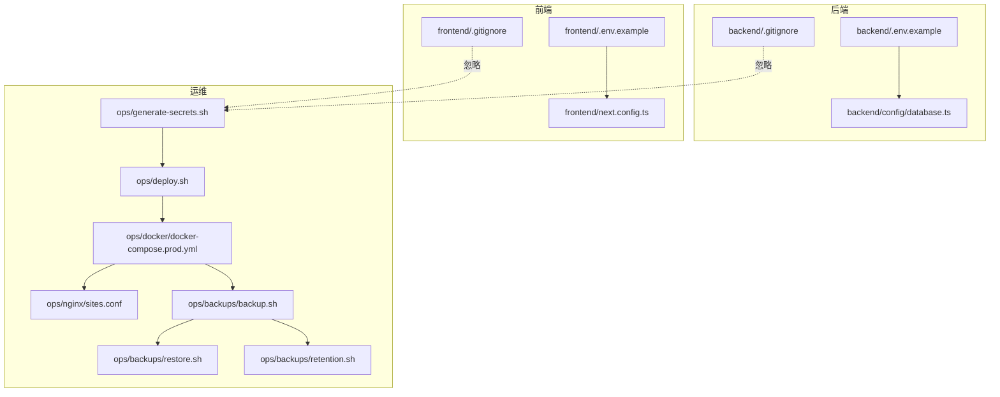
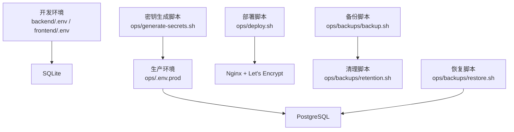
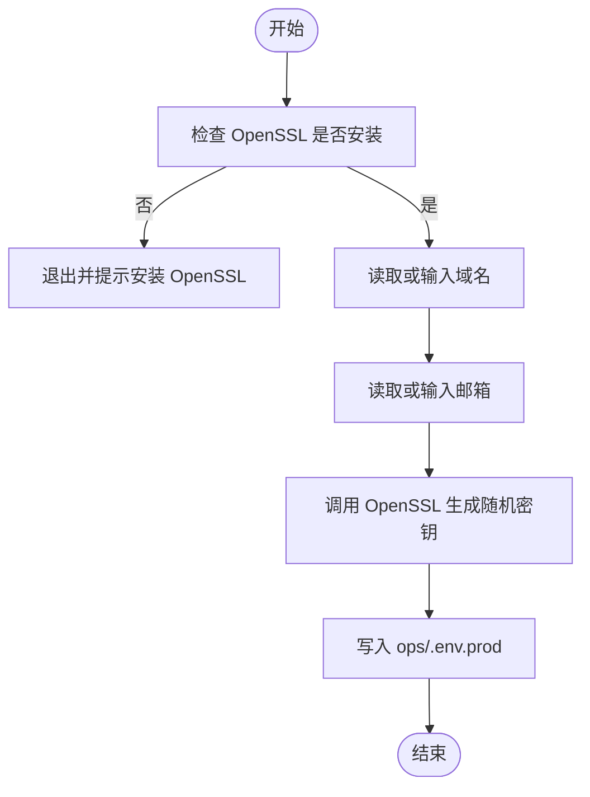
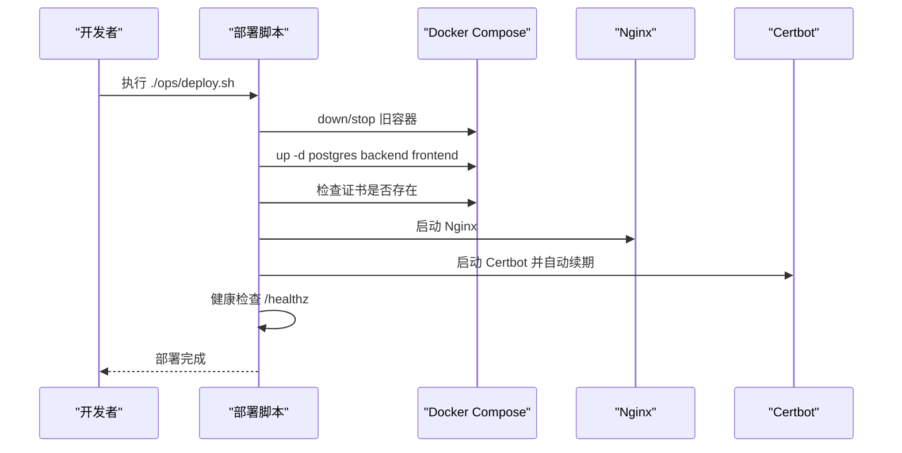
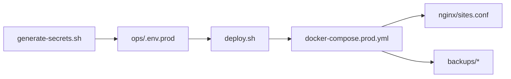

# 环境变量管理

<cite>
**本文档引用的文件**
- [backend/.env.example](file://backend/.env.example)
- [frontend/.env.example](file://frontend/.env.example)
- [backend/.gitignore](file://backend/.gitignore)
- [frontend/.gitignore](file://frontend/.gitignore)
- [开发与生产环境分离方案.md](file://开发与生产环境分离方案.md)
- [生产环境分离的部署方案.md](file://生产环境分离的部署方案.md)
- [DEPLOYMENT.md](file://DEPLOYMENT.md)
- [backend/config/database.ts](file://backend/config/database.ts)
- [frontend/next.config.ts](file://frontend/next.config.ts)
- [ops/generate-secrets.sh](file://ops/generate-secrets.sh)
- [ops/deploy.sh](file://ops/deploy.sh)
- [ops/docker/docker-compose.prod.yml](file://ops/docker/docker-compose.prod.yml)
- [ops/nginx/sites.conf](file://ops/nginx/sites.conf)
- [ops/backups/backup.sh](file://ops/backups/backup.sh)
- [ops/backups/restore.sh](file://ops/backups/restore.sh)
- [ops/backups/retention.sh](file://ops/backups/retention.sh)
</cite>

## 目录
1. [简介](#简介)
2. [项目结构](#项目结构)
3. [核心组件](#核心组件)
4. [架构总览](#架构总览)
5. [详细组件分析](#详细组件分析)
6. [依赖分析](#依赖分析)
7. [性能考量](#性能考量)
8. [故障排查指南](#故障排查指南)
9. [结论](#结论)
10. [附录](#附录)

## 简介
本文件系统化梳理了项目的环境变量管理策略，涵盖生产与开发环境的分层配置、密钥生成与管理、敏感信息保护、Git 忽略规则、备份与恢复机制，并给出最佳实践与安全建议。读者可据此建立标准化的环境变量生命周期管理流程，确保开发与生产的配置隔离、安全可控与可追溯。

## 项目结构
围绕环境变量管理的关键文件与目录如下：
- 后端与前端示例环境变量文件：用于定义变量模板与默认值
- Git 忽略规则：确保敏感文件不被提交
- 运维脚本：密钥生成、部署、证书管理、备份与恢复
- 配置文件：数据库连接、Nginx SSL、Docker Compose 等

图表来源
- [backend/.env.example](file://backend/.env.example#L1-L15)
- [frontend/.env.example](file://frontend/.env.example#L1-L2)
- [backend/config/database.ts](file://backend/config/database.ts#L1-L61)
- [frontend/next.config.ts](file://frontend/next.config.ts#L1-L39)
- [ops/generate-secrets.sh](file://ops/generate-secrets.sh#L1-L100)
- [ops/deploy.sh](file://ops/deploy.sh#L1-L120)
- [ops/docker/docker-compose.prod.yml](file://ops/docker/docker-compose.prod.yml#L1-L120)
- [ops/nginx/sites.conf](file://ops/nginx/sites.conf#L1-L120)
- [ops/backups/backup.sh](file://ops/backups/backup.sh#L1-L120)
- [ops/backups/restore.sh](file://ops/backups/restore.sh#L1-L120)
- [ops/backups/retention.sh](file://ops/backups/retention.sh#L1-L120)

章节来源
- [backend/.env.example](file://backend/.env.example#L1-L15)
- [frontend/.env.example](file://frontend/.env.example#L1-L2)
- [backend/.gitignore](file://backend/.gitignore#L120-L131)
- [frontend/.gitignore](file://frontend/.gitignore#L15-L19)

## 核心组件
- 环境变量模板与示例
  - 后端示例：定义开发环境默认值与占位符，便于本地快速启动
  - 前端示例：定义前端访问后端 API 的默认 URL
- Git 忽略规则
  - 明确忽略 .env、.env.local、.env.*.local 等敏感文件，防止泄露
- 密钥生成脚本
  - 使用 OpenSSL 生成高强度随机密钥，覆盖生产环境所需变量
- 部署与证书管理
  - 自动化部署脚本负责拉取镜像、启动服务、健康检查与证书校验
  - Nginx 配置与 Let's Encrypt 自动续期保障 HTTPS
- 备份与恢复
  - 数据库与媒体文件的定时备份、清理与恢复脚本

章节来源
- [开发与生产环境分离方案.md](file://开发与生产环境分离方案.md#L214-L288)
- [DEPLOYMENT.md](file://DEPLOYMENT.md#L148-L222)
- [生产环境分离的部署方案.md](file://生产环境分离的部署方案.md#L173-L283)

## 架构总览
下图展示了环境变量在开发与生产环境中的分层与流转：

图表来源
- [开发与生产环境分离方案.md](file://开发与生产环境分离方案.md#L214-L288)
- [DEPLOYMENT.md](file://DEPLOYMENT.md#L414-L570)
- [生产环境分离的部署方案.md](file://生产环境分离的部署方案.md#L977-L1037)

## 详细组件分析

### 环境变量分层策略
- 开发环境
  - 使用 SQLite，便于本地快速启动与热重载
  - 示例文件提供默认值，本地 .env 保存私有配置
- 生产环境
  - 使用 PostgreSQL，容器化部署，数据持久化
  - 通过 ops/.env.prod 管理生产密钥与数据库连接参数
- 前后端分离
  - 前端 NEXT_PUBLIC_STRAPI_URL 指向生产后端 API
  - 后端 DATABASE_CLIENT 与连接参数按环境切换

章节来源
- [开发与生产环境分离方案.md](file://开发与生产环境分离方案.md#L214-L288)
- [DEPLOYMENT.md](file://DEPLOYMENT.md#L148-L222)
- [生产环境分离的部署方案.md](file://生产环境分离的部署方案.md#L173-L283)

### 环境变量分类与作用域
- 自动生成的密钥变量（8 个）
  - POSTGRES_PASSWORD：数据库密码
  - APP_KEYS：Strapi 应用密钥（4 个，逗号分隔）
  - API_TOKEN_SALT：API 令牌盐
  - ADMIN_JWT_SECRET：Admin JWT 密钥
  - TRANSFER_TOKEN_SALT：Transfer 令牌盐
  - JWT_SECRET：JWT 密钥
  - ENCRYPTION_KEY：加密密钥
- 手动定义的配置变量（2 个）
  - DOMAIN：网站域名
  - LETSENCRYPT_EMAIL：Let's Encrypt 通知邮箱

章节来源
- [开发与生产环境分离方案.md](file://开发与生产环境分离方案.md#L228-L246)
- [DEPLOYMENT.md](file://DEPLOYMENT.md#L162-L179)
- [生产环境分离的部署方案.md](file://生产环境分离的部署方案.md#L188-L204)

### 配置文件内容与模板
- 后端开发示例：包含主机、端口、数据库客户端与默认密钥占位
- 前端开发示例：NEXT_PUBLIC_STRAPI_URL 指向本地后端
- 生产环境模板：包含 NODE_ENV、数据库连接、Strapi 密钥与域名等

章节来源
- [backend/.env.example](file://backend/.env.example#L1-L15)
- [frontend/.env.example](file://frontend/.env.example#L1-L2)
- [开发与生产环境分离方案.md](file://开发与生产环境分离方案.md#L247-L287)
- [DEPLOYMENT.md](file://DEPLOYMENT.md#L181-L221)
- [生产环境分离的部署方案.md](file://生产环境分离的部署方案.md#L206-L256)

### 密钥生成脚本工作原理
- 依赖 OpenSSL 生成高强度随机十六进制字符串
- 生成顺序：数据库密码、APP_KEYS（4 个）、API_TOKEN_SALT、ADMIN_JWT_SECRET、TRANSFER_TOKEN_SALT、JWT_SECRET、ENCRYPTION_KEY
- 输入：域名与邮箱（用于 Nginx 与证书）
- 输出：ops/.env.prod（覆盖或备份旧文件）

图表来源
- [ops/generate-secrets.sh](file://ops/generate-secrets.sh#L1-L100)

章节来源
- [ops/generate-secrets.sh](file://ops/generate-secrets.sh#L1-L100)
- [开发与生产环境分离方案.md](file://开发与生产环境分离方案.md#L624-L706)
- [DEPLOYMENT.md](file://DEPLOYMENT.md#L416-L498)
- [生产环境分离的部署方案.md](file://生产环境分离的部署方案.md#L977-L1037)

### 部署与证书管理流程
- 部署脚本职责
  - 检查 ops/.env.prod 是否存在
  - 拉取镜像、停止旧容器、启动基础服务（PostgreSQL、后端、前端）
  - 等待服务就绪、检查证书、启动 Nginx 与 Certbot
  - 健康检查：前端与后端 /healthz
- 证书自动化
  - Nginx 将 80 端口重定向至 443
  - Let's Encrypt 证书初始化与每日续期
  - 安全头配置与 TLS 参数

图表来源
- [ops/deploy.sh](file://ops/deploy.sh#L1-L120)
- [ops/docker/docker-compose.prod.yml](file://ops/docker/docker-compose.prod.yml#L1-L120)
- [ops/nginx/sites.conf](file://ops/nginx/sites.conf#L1-L120)

章节来源
- [ops/deploy.sh](file://ops/deploy.sh#L1-L120)
- [DEPLOYMENT.md](file://DEPLOYMENT.md#L500-L570)
- [开发与生产环境分离方案.md](file://开发与生产环境分离方案.md#L461-L588)

### 数据库连接与环境适配
- 后端根据 DATABASE_CLIENT 切换 SQLite、PostgreSQL 或 MySQL
- 开发环境默认 SQLite，生产环境默认 PostgreSQL
- 支持连接超时、池大小、SSL 等高级配置

章节来源
- [backend/config/database.ts](file://backend/config/database.ts#L1-L61)
- [开发与生产环境分离方案.md](file://开发与生产环境分离方案.md#L228-L246)
- [DEPLOYMENT.md](file://DEPLOYMENT.md#L162-L179)

### 前端环境变量与图片优化
- NEXT_PUBLIC_STRAPI_URL 指向后端 API
- Next.js 图片优化白名单与现代图片格式支持

章节来源
- [frontend/.env.example](file://frontend/.env.example#L1-L2)
- [frontend/next.config.ts](file://frontend/next.config.ts#L1-L39)

### Git 忽略规则与安全边界
- 忽略 .env、.env.local、.env.*.local 等敏感文件
- 忽略构建产物与日志，降低泄露面
- Docker 与 Nginx 配置也纳入忽略范围

章节来源
- [backend/.gitignore](file://backend/.gitignore#L120-L131)
- [frontend/.gitignore](file://frontend/.gitignore#L15-L19)
- [开发与生产环境分离方案.md](file://开发与生产环境分离方案.md#L356-L375)

### 备份与恢复机制
- 备份脚本：导出数据库、打包媒体文件
- 恢复脚本：从备份文件恢复数据库
- 清理脚本：按保留策略删除过期备份
- 定时任务：每天凌晨 2:00 备份数据库；每周日凌晨 2:30 清理过期备份

章节来源
- [ops/backups/backup.sh](file://ops/backups/backup.sh#L1-L120)
- [ops/backups/restore.sh](file://ops/backups/restore.sh#L1-L120)
- [ops/backups/retention.sh](file://ops/backups/retention.sh#L1-L120)
- [DEPLOYMENT.md](file://DEPLOYMENT.md#L649-L743)

## 依赖分析
- 组件耦合
  - 密钥生成脚本与部署脚本强耦合：前者生成 ops/.env.prod，后者依赖该文件
  - Nginx 与 Certbot 依赖域名与邮箱配置
  - 数据库配置与 Docker Compose 服务绑定
- 外部依赖
  - OpenSSL：密钥生成
  - Docker Compose：容器编排
  - Let's Encrypt：证书自动化

图表来源
- [ops/generate-secrets.sh](file://ops/generate-secrets.sh#L1-L100)
- [ops/deploy.sh](file://ops/deploy.sh#L1-L120)
- [ops/docker/docker-compose.prod.yml](file://ops/docker/docker-compose.prod.yml#L1-L120)
- [ops/nginx/sites.conf](file://ops/nginx/sites.conf#L1-L120)
- [ops/backups/backup.sh](file://ops/backups/backup.sh#L1-L120)

章节来源
- [ops/generate-secrets.sh](file://ops/generate-secrets.sh#L1-L100)
- [ops/deploy.sh](file://ops/deploy.sh#L1-L120)
- [ops/docker/docker-compose.prod.yml](file://ops/docker/docker-compose.prod.yml#L1-L120)
- [ops/nginx/sites.conf](file://ops/nginx/sites.conf#L1-L120)
- [ops/backups/backup.sh](file://ops/backups/backup.sh#L1-L120)

## 性能考量
- 构建策略
  - 多阶段构建减小镜像体积，部署时构建确保一致性
  - 生产阶段仅安装必要依赖，清理缓存
- 网络与证书
  - Nginx 作为单一入口，隐藏后端服务
  - Let's Encrypt 自动续期，避免人工干预
- 数据库连接
  - 合理设置连接池与超时，避免资源耗尽

章节来源
- [开发与生产环境分离方案.md](file://开发与生产环境分离方案.md#L291-L457)
- [DEPLOYMENT.md](file://DEPLOYMENT.md#L225-L457)
- [生产环境分离的部署方案.md](file://生产环境分离的部署方案.md#L744-L1037)

## 故障排查指南
- 常见问题与解决
  - 端口冲突：检查宿主端口占用，调整 docker-compose.yml
  - 数据库连接失败：确认 PostgreSQL 健康状态与网络连通
  - CORS 配置错误：检查后端中间件与前端请求头
  - Nginx 配置错误：核对站点配置与证书路径
  - 证书过期：执行续期脚本或重新初始化
- 健康检查与日志
  - 使用 /healthz 接口验证服务可用性
  - 查看容器日志定位异常

章节来源
- [DEPLOYMENT.md](file://DEPLOYMENT.md#L587-L631)
- [开发与生产环境分离方案.md](file://开发与生产环境分离方案.md#L501-L572)

## 结论
通过明确的环境分层、严格的密钥生成与管理、完善的 Git 忽略与备份恢复机制，以及自动化部署与证书管理，项目实现了开发与生产的安全隔离与高效运维。建议团队遵循本文档的最佳实践，确保环境变量的机密性、一致性与可追溯性。

## 附录

### 环境变量清单与用途
- 自动变量（8 个）
  - POSTGRES_PASSWORD：数据库密码
  - APP_KEYS：Strapi 应用密钥（4 个）
  - API_TOKEN_SALT：API 令牌盐
  - ADMIN_JWT_SECRET：Admin JWT 密钥
  - TRANSFER_TOKEN_SALT：Transfer 令牌盐
  - JWT_SECRET：JWT 密钥
  - ENCRYPTION_KEY：加密密钥
- 手动变量（2 个）
  - DOMAIN：网站域名
  - LETSENCRYPT_EMAIL：Let's Encrypt 通知邮箱

章节来源
- [开发与生产环境分离方案.md](file://开发与生产环境分离方案.md#L228-L246)
- [DEPLOYMENT.md](file://DEPLOYMENT.md#L162-L179)
- [生产环境分离的部署方案.md](file://生产环境分离的部署方案.md#L188-L204)