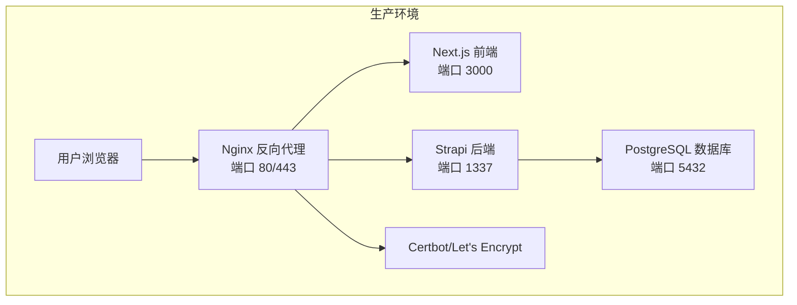
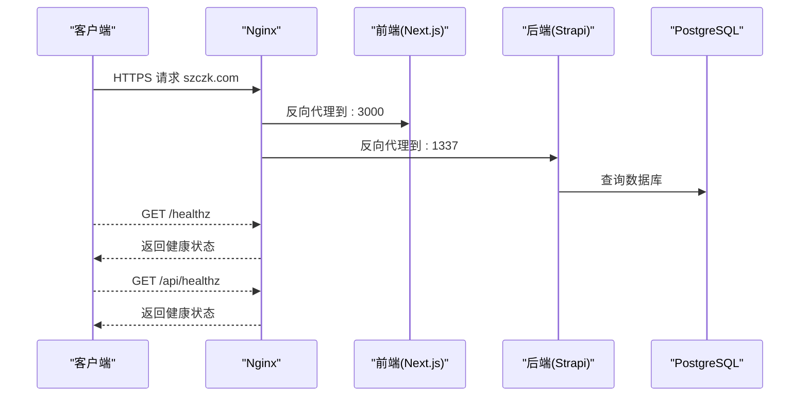
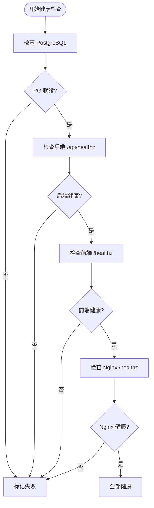
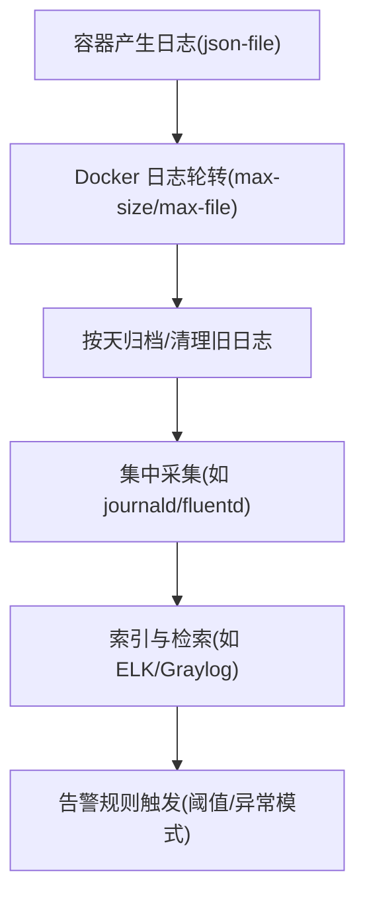
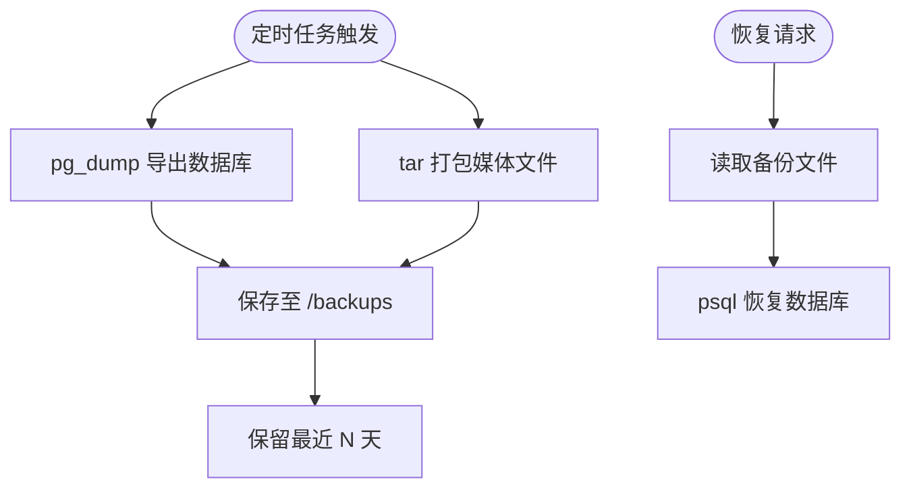
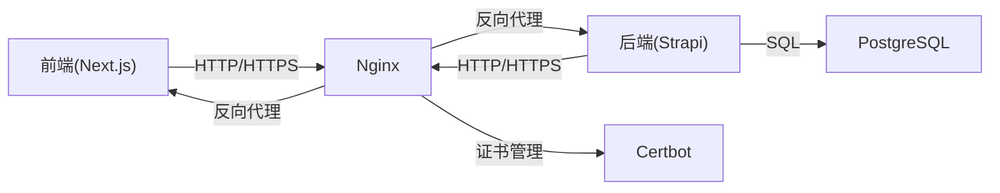

# 监控告警系统

<cite>
**本文引用的文件**
- [DEPLOYMENT.md](file://DEPLOYMENT.md)
- [README.md](file://README.md)
- [backend/.env.example](file://backend/.env.example)
- [frontend/.env.example](file://frontend/.env.example)
</cite>

## 目录
1. [简介](#简介)
2. [项目结构](#项目结构)
3. [核心组件](#核心组件)
4. [架构总览](#架构总览)
5. [详细组件分析](#详细组件分析)
6. [依赖关系分析](#依赖关系分析)
7. [性能考量](#性能考量)
8. [故障排除指南](#故障排除指南)
9. [结论](#结论)
10. [附录](#附录)

## 简介
本文件面向生产环境运维团队，系统化梳理监控告警体系，涵盖健康检查机制、日志管理、备份与恢复、监控指标与阈值设定，并提供可落地的配置示例与故障排除方法，帮助快速建立完善的监控告警体系。

## 项目结构
本项目采用前后端分离架构，生产环境通过反向代理统一接入，后端为 Strapi CMS，前端为 Next.js 应用，数据库为 PostgreSQL。生产部署与运维脚本集中在 ops 目录中，包含证书管理、健康检查、日志轮转、备份与恢复等能力。

图表来源
- [DEPLOYMENT.md](file://DEPLOYMENT.md#L38-L99)

章节来源
- [DEPLOYMENT.md](file://DEPLOYMENT.md#L34-L100)
- [README.md](file://README.md#L229-L298)

## 核心组件
- 健康检查：容器层面的健康检查策略，覆盖数据库、应用服务与反向代理。
- 日志管理：容器日志收集、轮转与保留策略。
- 备份与恢复：数据库、上传文件与配置的自动化备份与恢复流程。
- 监控指标与阈值：系统资源、服务可用性与业务指标的告警阈值建议。
- 部署与验证：自动化部署脚本与健康检查验证流程。

章节来源
- [DEPLOYMENT.md](file://DEPLOYMENT.md#L587-L744)

## 架构总览
生产环境通过 Nginx 提供统一入口，前端与后端分别暴露健康检查端点，数据库通过容器健康检查保障可用性。证书由 Certbot 管理，支持自动续期与 Nginx 重载。

图表来源
- [DEPLOYMENT.md](file://DEPLOYMENT.md#L589-L599)
- [DEPLOYMENT.md](file://DEPLOYMENT.md#L545-L568)

章节来源
- [DEPLOYMENT.md](file://DEPLOYMENT.md#L587-L599)
- [DEPLOYMENT.md](file://DEPLOYMENT.md#L545-L568)

## 详细组件分析

### 健康检查配置
- PostgreSQL：使用内置工具进行就地检测，具备合理的间隔、超时与重试次数。
- 后端 Strapi：通过 HTTP GET /api/healthz 进行健康检查。
- 前端 Next.js：通过 HTTP GET /healthz 进行健康检查。
- Nginx：通过 HTTP GET /healthz 进行健康检查。

图表来源
- [DEPLOYMENT.md](file://DEPLOYMENT.md#L589-L599)
- [DEPLOYMENT.md](file://DEPLOYMENT.md#L545-L568)

章节来源
- [DEPLOYMENT.md](file://DEPLOYMENT.md#L589-L599)
- [DEPLOYMENT.md](file://DEPLOYMENT.md#L545-L568)

### 日志管理系统
- 日志收集：容器默认使用 json-file 驱动，便于集中采集与分析。
- 日志轮转：限制单文件大小与保留文件数量，避免磁盘占用过大。
- 日志保留：建议保留最近若干天的日志以便审计与排查。
- 日志查看：提供查看所有服务与指定服务日志的命令，支持查看最近若干行。

图表来源
- [DEPLOYMENT.md](file://DEPLOYMENT.md#L600-L631)

章节来源
- [DEPLOYMENT.md](file://DEPLOYMENT.md#L600-L631)

### 备份与恢复机制
- 备份类型：数据库完整备份、上传文件打包备份、配置文件备份。
- 备份频率：数据库每日凌晨 2:00；文件每周日凌晨 2:30；保留最近 7 天。
- 备份脚本：包含数据库导出与媒体文件打包。
- 恢复脚本：从备份文件恢复数据库。
- 清理脚本：定期清理超过保留期限的备份。

图表来源
- [DEPLOYMENT.md](file://DEPLOYMENT.md#L663-L744)

章节来源
- [DEPLOYMENT.md](file://DEPLOYMENT.md#L649-L744)

### 监控指标与告警阈值
- 系统资源：CPU 使用率 > 80%（警告）、内存使用率 > 85%（警告）、磁盘使用率 > 90%（严重）。
- 服务可用性：前端响应时间 > 3 秒（警告）、后端响应时间 > 2 秒（警告）、数据库连接数 > 80%（警告）。
- 业务指标：API 错误率 > 5%（严重）、证书有效期 < 7 天（严重）。

章节来源
- [DEPLOYMENT.md](file://DEPLOYMENT.md#L632-L646)

### 部署与健康检查验证
- 自动化部署脚本负责拉取镜像、停止旧容器、启动基础服务、等待就绪、检查证书、启动 Nginx/Certbot，并对前端与后端健康检查进行验证。
- 健康检查通过后输出成功信息并列出容器状态。

章节来源
- [DEPLOYMENT.md](file://DEPLOYMENT.md#L500-L569)

## 依赖关系分析
- 前端 Next.js 与后端 Strapi 通过 HTTP/HTTPS API 通信，Nginx 作为反向代理统一入口。
- 数据库 PostgreSQL 通过容器健康检查保障可用性。
- Certbot 负责证书获取与续期，自动重载 Nginx。
- Docker Compose 负责容器编排与健康检查配置。

图表来源
- [DEPLOYMENT.md](file://DEPLOYMENT.md#L38-L99)

章节来源
- [DEPLOYMENT.md](file://DEPLOYMENT.md#L34-L100)

## 性能考量
- 健康检查间隔与超时应平衡探测频率与系统负载，避免频繁探测造成额外压力。
- 日志轮转参数需根据业务流量与磁盘容量合理设置，防止日志风暴导致磁盘占满。
- 备份窗口应避开业务高峰期，数据库备份与媒体文件打包可错峰执行。
- 证书续期任务建议固定在低峰时段，确保续期成功后及时重载 Nginx。

## 故障排除指南
- 健康检查失败
  - 检查容器日志，确认服务端口是否正常监听。
  - 验证健康检查端点是否可达，确认 Nginx 反向代理配置正确。
  - 核对数据库连接参数与网络连通性。
- 证书问题
  - 确认 Certbot 容器内证书路径与 Nginx 配置一致。
  - 检查续期脚本执行日志，确认定时任务正常运行。
- 备份失败
  - 检查备份脚本的环境变量与权限，确认数据库连接正常。
  - 核对备份目录权限与磁盘空间。
- 日志异常
  - 检查 Docker 日志驱动与轮转配置，确认单文件大小与保留数量符合预期。
  - 若日志过多导致磁盘压力，适当缩短保留天数或增大轮转大小。

章节来源
- [DEPLOYMENT.md](file://DEPLOYMENT.md#L500-L569)
- [DEPLOYMENT.md](file://DEPLOYMENT.md#L663-L744)
- [DEPLOYMENT.md](file://DEPLOYMENT.md#L600-L631)

## 结论
通过容器健康检查、日志轮转与保留、自动化备份与恢复以及明确的监控指标与阈值，运维团队可在生产环境中建立稳定可靠的监控告警体系。建议结合实际业务流量与资源情况持续优化健康检查参数、日志轮转策略与备份保留周期，确保系统高可用与可追溯性。

## 附录
- 环境变量模板参考
  - 后端环境变量模板：[backend/.env.example](file://backend/.env.example)
  - 前端环境变量模板：[frontend/.env.example](file://frontend/.env.example)
- 生产部署与监控相关文档
  - [DEPLOYMENT.md](file://DEPLOYMENT.md)