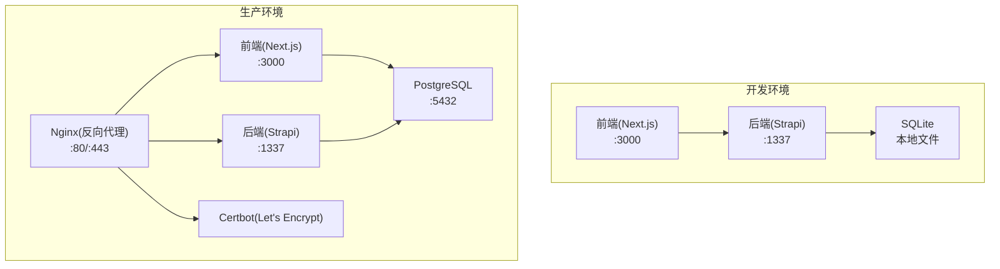
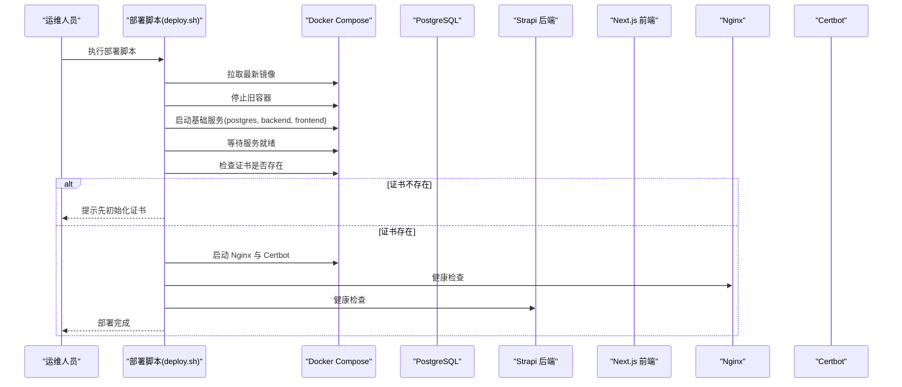
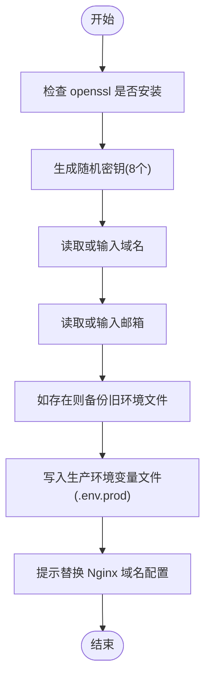
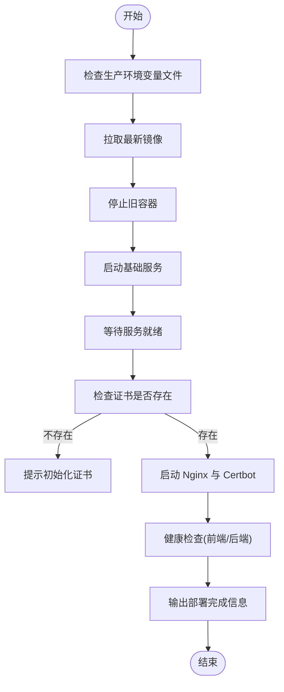
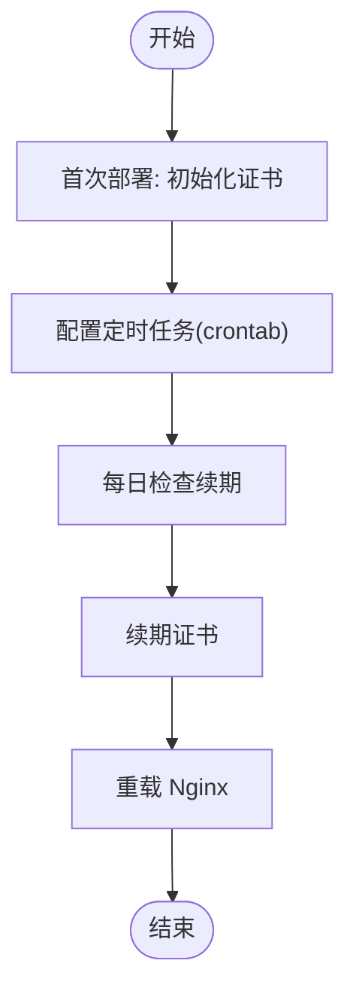
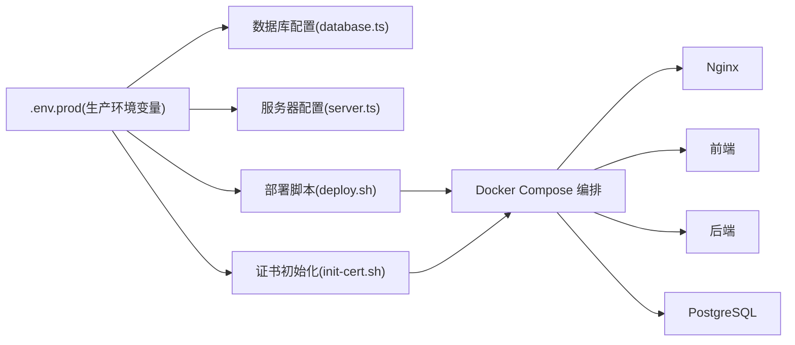

# 自动化部署脚本

<cite>
**本文引用的文件**
- [DEPLOYMENT.md](file://DEPLOYMENT.md)
- [开发与生产环境分离方案.md](file://开发与生产环境分离方案.md)
- [生产环境分离的部署方案.md](file://生产环境分离的部署方案.md)
- [download-images.sh](file://download-images.sh)
- [download-images-batch2.sh](file://download-images-batch2.sh)
- [backend/config/database.ts](file://backend/config/database.ts)
- [backend/config/server.ts](file://backend/config/server.ts)
</cite>

## 目录
1. [简介](#简介)
2. [项目结构](#项目结构)
3. [核心组件](#核心组件)
4. [架构总览](#架构总览)
5. [详细组件分析](#详细组件分析)
6. [依赖关系分析](#依赖关系分析)
7. [性能考虑](#性能考虑)
8. [故障排除指南](#故障排除指南)
9. [结论](#结论)
10. [附录](#附录)

## 简介
本文件面向运维团队，系统化梳理并说明项目的自动化部署脚本与流程，覆盖生产环境与开发环境的部署步骤、脚本使用方法、镜像拉取、容器停止、服务启动、健康检查验证、证书初始化与自动续期机制、定时任务配置、参数说明、错误处理与故障排除，以及最佳实践建议。读者无需深入编程背景即可按步骤完成部署与维护。

## 项目结构
项目采用前后端分离与环境隔离的设计，生产环境通过 Docker Compose 编排 Nginx、前端、后端与 PostgreSQL，并集成 Let's Encrypt 自动化证书管理；开发环境使用 SQLite，支持热重载与快速启动。

图表来源
- [DEPLOYMENT.md](file://DEPLOYMENT.md#L34-L85)
- [开发与生产环境分离方案.md](file://开发与生产环境分离方案.md#L90-L139)

章节来源
- [DEPLOYMENT.md](file://DEPLOYMENT.md#L1-L145)
- [开发与生产环境分离方案.md](file://开发与生产环境分离方案.md#L1-L191)

## 核心组件
- 密钥生成脚本：自动生成生产环境所需的敏感变量并写入环境文件，供部署脚本与容器编排使用。
- 生产环境部署脚本：负责拉取镜像、停止旧容器、启动基础服务、检查证书、启动 Nginx/Certbot 并进行健康检查。
- 开发环境启动脚本：一键启动开发环境（前端+后端+SQLite），支持热重载。
- 证书初始化与续期脚本：首次部署时初始化证书，后续由定时任务自动续期并重载 Nginx。
- 备份与恢复脚本：提供数据库与媒体文件的备份、恢复与保留策略。
- 健康检查与日志管理：容器健康检查配置与日志轮转策略，便于监控与排障。

章节来源
- [DEPLOYMENT.md](file://DEPLOYMENT.md#L414-L585)
- [开发与生产环境分离方案.md](file://开发与生产环境分离方案.md#L622-L793)

## 架构总览
下图展示生产环境的自动化部署流程与关键交互：

图表来源
- [DEPLOYMENT.md](file://DEPLOYMENT.md#L500-L569)

章节来源
- [DEPLOYMENT.md](file://DEPLOYMENT.md#L278-L319)

## 详细组件分析

### 密钥生成脚本
- 功能：生成生产环境所需的一组随机密钥（含数据库密码、应用密钥、JWT 密钥等），并写入生产环境变量文件。
- 输入：域名、邮箱（用于 Let's Encrypt）。
- 输出：生产环境变量文件，包含数据库与应用密钥等。
- 安全要点：生成的密钥不提交至代码仓库，部署前务必手动替换 Nginx 配置中的域名。

图表来源
- [DEPLOYMENT.md](file://DEPLOYMENT.md#L416-L498)

章节来源
- [DEPLOYMENT.md](file://DEPLOYMENT.md#L416-L498)

### 生产环境部署脚本
- 功能：自动化完成镜像拉取、容器停止、基础服务启动、证书检查、Nginx/Certbot 启动与健康检查。
- 关键步骤：
  - 拉取最新镜像
  - 停止旧容器
  - 启动 postgres、backend、frontend
  - 等待服务就绪
  - 检查证书是否存在
  - 启动 nginx 与 certbot
  - 健康检查（前端与后端）
- 参数：无显式命令行参数，依赖环境变量文件与容器编排文件。

图表来源
- [DEPLOYMENT.md](file://DEPLOYMENT.md#L500-L569)

章节来源
- [DEPLOYMENT.md](file://DEPLOYMENT.md#L500-L569)

### 开发环境启动脚本
- 功能：一键启动开发环境（前端+后端+SQLite），支持热重载。
- 使用：直接运行脚本，Docker Compose 将启动对应服务。
- 注意：开发环境使用 SQLite，不涉及 PostgreSQL 与 Nginx。

章节来源
- [开发与生产环境分离方案.md](file://开发与生产环境分离方案.md#L779-L792)

### 证书初始化与自动续期
- 证书初始化：首次部署时通过 Certbot standalone 模式获取证书，随后将证书持久化到卷中。
- 自动续期：通过定时任务每日检查并续期，成功后自动重载 Nginx。
- 配置要点：Nginx 配置允许 ACME 挑战路径，生产站点启用安全头与 TLS 参数。

图表来源
- [DEPLOYMENT.md](file://DEPLOYMENT.md#L322-L411)
- [开发与生产环境分离方案.md](file://开发与生产环境分离方案.md#L461-L521)

章节来源
- [DEPLOYMENT.md](file://DEPLOYMENT.md#L322-L411)
- [开发与生产环境分离方案.md](file://开发与生产环境分离方案.md#L461-L521)

### 备份与恢复
- 备份策略：数据库与媒体文件分别备份，保留最近若干天的备份。
- 备份脚本：支持自定义数据库连接参数，生成 SQL 与压缩的媒体归档。
- 恢复脚本：从备份文件恢复数据库。
- 定时任务：每日凌晨定时执行备份与清理。

章节来源
- [DEPLOYMENT.md](file://DEPLOYMENT.md#L649-L744)

### 健康检查与日志管理
- 健康检查：容器层面配置健康检查命令，定期探测服务可用性。
- 日志管理：Docker 日志驱动与轮转策略，支持查看与追踪日志。
- 监控指标：CPU、内存、磁盘、响应时间、API 错误率、证书有效期等。

章节来源
- [DEPLOYMENT.md](file://DEPLOYMENT.md#L587-L647)

## 依赖关系分析
- 环境变量与配置：
  - 生产环境变量文件包含数据库、应用密钥、域名与 Let's Encrypt 邮箱等。
  - 后端数据库配置支持 sqlite、postgres、mysql，生产环境使用 postgres。
- 容器编排：
  - Docker Compose 编排 Nginx、前端、后端、PostgreSQL、Certbot。
- 脚本依赖：
  - 部署脚本依赖环境变量文件与 Docker Compose 配置。
  - 证书脚本依赖域名与邮箱环境变量。

图表来源
- [DEPLOYMENT.md](file://DEPLOYMENT.md#L148-L222)
- [backend/config/database.ts](file://backend/config/database.ts#L1-L61)
- [backend/config/server.ts](file://backend/config/server.ts#L1-L8)

章节来源
- [DEPLOYMENT.md](file://DEPLOYMENT.md#L148-L222)
- [backend/config/database.ts](file://backend/config/database.ts#L1-L61)
- [backend/config/server.ts](file://backend/config/server.ts#L1-L8)

## 性能考虑
- 构建策略：采用“部署时构建”与多阶段构建，减小镜像体积并提升安全性。
- 构建缓存：利用 Docker 层缓存加速构建。
- 资源限制：建议为各服务设置合理的资源限制与健康检查，避免资源争抢。
- 网络隔离：生产环境通过 Nginx 单一入口，隐藏后端服务，降低攻击面。

章节来源
- [DEPLOYMENT.md](file://DEPLOYMENT.md#L225-L277)

## 故障排除指南
- 证书相关
  - 症状：访问 HTTPS 返回证书错误或 404。
  - 排查：确认证书卷挂载、Nginx SSL 配置与 ACME 挑战路径。
  - 处理：重新初始化证书或检查定时续期任务。
- 数据库连接
  - 症状：后端无法连接数据库。
  - 排查：确认 PostgreSQL 已启动、网络连通、凭据正确。
- 健康检查失败
  - 症状：容器健康检查失败。
  - 排查：查看容器日志，确认服务监听端口与健康检查命令。
- 部署脚本错误
  - 症状：脚本报错或中断。
  - 排查：检查环境变量文件是否存在、Docker Compose 文件路径与权限、镜像拉取权限。

章节来源
- [DEPLOYMENT.md](file://DEPLOYMENT.md#L587-L647)

## 结论
该自动化部署方案通过脚本化与容器化实现了生产与开发环境的清晰分离，配合健康检查、证书自动化与备份策略，显著降低了运维复杂度与人为错误风险。建议在生产环境中严格执行密钥与配置管理、定期巡检与演练回滚流程，以保障系统的高可用与可维护性。

## 附录

### 使用示例与最佳实践
- 首次部署（生产）
  - 生成密钥并写入环境变量文件。
  - 替换 Nginx 配置中的域名。
  - 构建镜像并启动基础服务。
  - 初始化证书并启动 Nginx 与 Certbot。
  - 执行健康检查，确认服务可用。
- 更新部署（生产）
  - 拉取最新镜像，停止旧容器，启动新容器。
  - 如需，重新构建并启用缓存禁用选项。
- 开发环境
  - 直接运行开发启动脚本，访问前端与后端服务。
- 备份与恢复
  - 配置定时任务，定期执行备份与清理。
  - 发生故障时，使用恢复脚本从备份恢复数据库。

章节来源
- [DEPLOYMENT.md](file://DEPLOYMENT.md#L278-L319)
- [DEPLOYMENT.md](file://DEPLOYMENT.md#L649-L744)

### 脚本参数与环境变量说明
- 密钥生成脚本
  - 输入：域名、邮箱。
  - 输出：生产环境变量文件。
- 部署脚本
  - 依赖：生产环境变量文件、Docker Compose 配置。
  - 行为：拉取镜像、停止旧容器、启动基础服务、检查证书、启动代理与证书服务、健康检查。
- 证书脚本
  - 输入：域名列表、Let's Encrypt 邮箱。
  - 行为：获取/续期证书并重载 Nginx。
- 备份脚本
  - 输入：数据库连接参数、备份目录。
  - 行为：导出数据库与打包媒体文件。

章节来源
- [DEPLOYMENT.md](file://DEPLOYMENT.md#L416-L569)
- [开发与生产环境分离方案.md](file://开发与生产环境分离方案.md#L461-L521)
- [DEPLOYMENT.md](file://DEPLOYMENT.md#L649-L744)

### 图片下载脚本（辅助资源）
- 作用：批量下载示例图片到本地 public/images 目录，便于前端展示与测试。
- 使用：直接运行脚本，按类别创建目录并下载图片。

章节来源
- [download-images.sh](file://download-images.sh#L1-L107)
- [download-images-batch2.sh](file://download-images-batch2.sh#L1-L130)