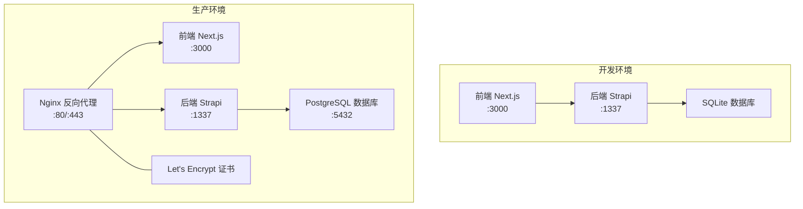
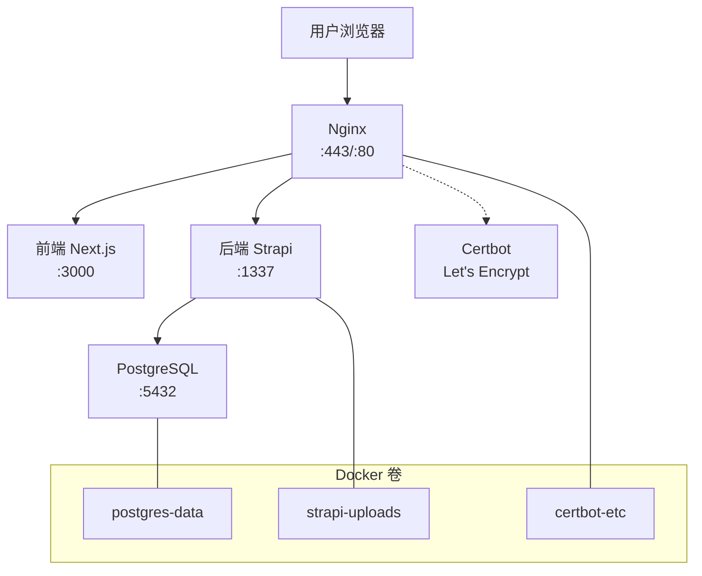
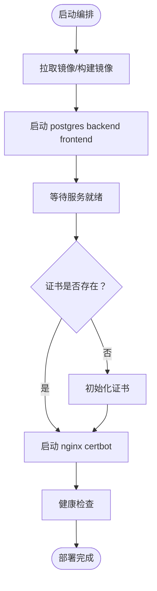
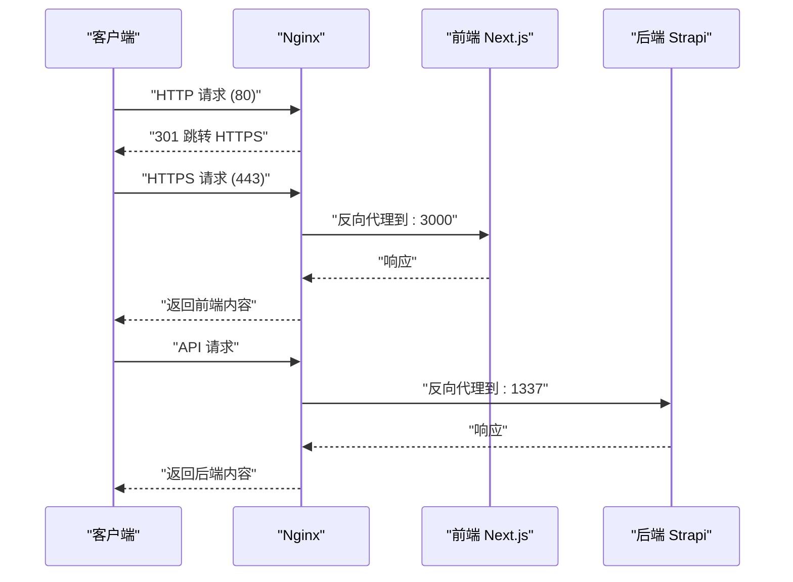
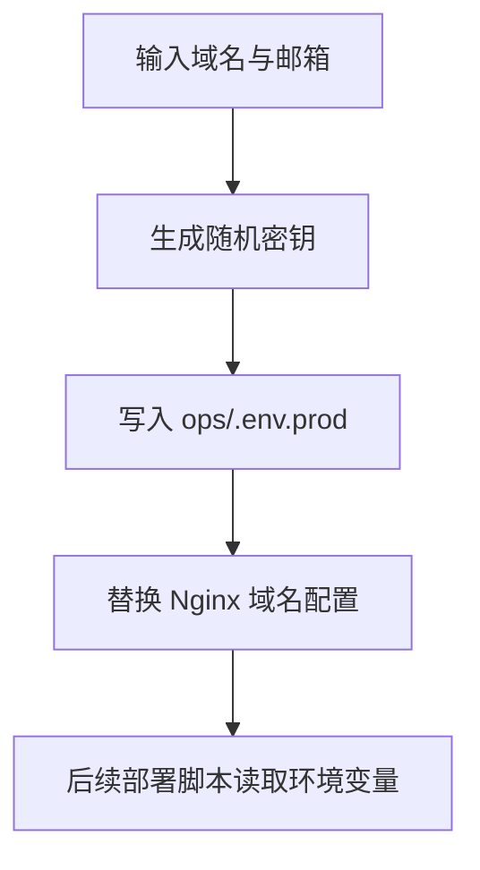
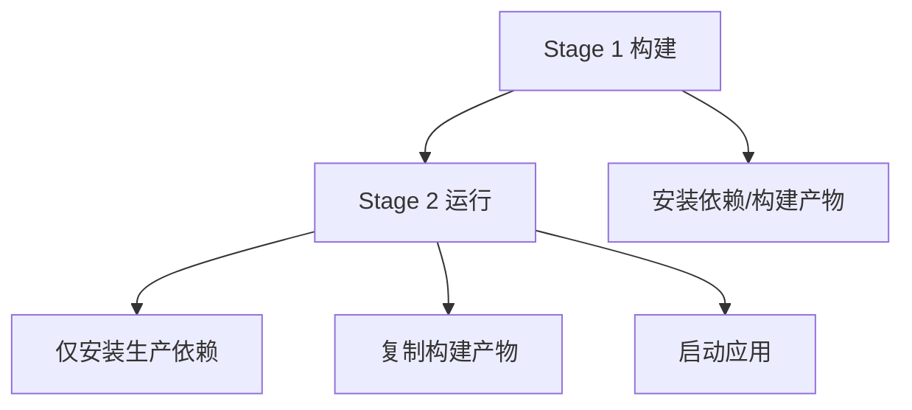
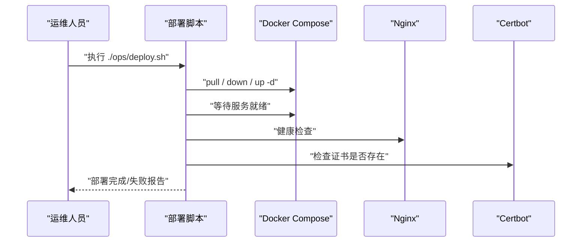

# 部署配置

<cite>
**本文引用的文件**
- [DEPLOYMENT.md](file://DEPLOYMENT.md)
- [README.md](file://README.md)
- [开发与生产环境分离方案.md](file://开发与生产环境分离方案.md)
- [生产环境分离的部署方案.md](file://生产环境分离的部署方案.md)
- [backend/.env.example](file://backend/.env.example)
- [frontend/.env.example](file://frontend/.env.example)
</cite>

## 目录
1. [简介](#简介)
2. [项目结构](#项目结构)
3. [核心组件](#核心组件)
4. [架构总览](#架构总览)
5. [详细组件分析](#详细组件分析)
6. [依赖关系分析](#依赖关系分析)
7. [性能考量](#性能考量)
8. [故障排查指南](#故障排查指南)
9. [结论](#结论)
10. [附录](#附录)

## 简介
本文件面向运维团队，提供中创智控官网的完整部署配置与实施指南，涵盖生产与开发双环境的容器编排、Nginx 反向代理与 SSL 证书自动化、环境变量与敏感信息管理、多阶段构建策略、以及首次部署、更新部署与回滚流程。目标是确保生产环境安全、稳定、可自动化、可追溯。

## 项目结构
- 前后端分离架构，前端基于 Next.js 15，后端基于 Strapi 5，数据库在开发环境使用 SQLite，生产环境使用 PostgreSQL。
- 运维脚本与配置集中在 ops 目录（在部分文档中体现），包含 Dockerfile、docker-compose 编排、Nginx 配置、证书与定时任务、备份与恢复脚本等。
- 环境变量采用分层策略：开发与生产分别维护独立的 .env 文件，敏感信息不提交至代码库。



**章节来源**
- file://DEPLOYMENT.md#L34-L100
- file://开发与生产环境分离方案.md#L13-L27
- file://生产环境分离的部署方案.md#L13-L19

## 核心组件
- 容器编排：Docker Compose 生产与开发双套编排文件，定义服务、网络、卷与健康检查。
- 反向代理：Nginx 提供 HTTP→HTTPS 重定向、SSL 终止、安全头注入与站点配置。
- 证书管理：Certbot Standalone 模式获取与续期，配合定时任务自动重载 Nginx。
- 环境变量：分层配置，生产环境变量由脚本生成，敏感信息不提交。
- 多阶段构建：前后端 Dockerfile 使用多阶段构建，仅在部署时构建，减小镜像体积并提升安全性。
- 自动化脚本：密钥生成、部署、备份与恢复脚本，简化运维流程。

**章节来源**
- file://DEPLOYMENT.md#L148-L222
- file://DEPLOYMENT.md#L225-L320
- file://DEPLOYMENT.md#L322-L411
- file://DEPLOYMENT.md#L414-L584
- file://开发与生产环境分离方案.md#L214-L288
- file://开发与生产环境分离方案.md#L291-L458
- file://开发与生产环境分离方案.md#L461-L589
- file://开发与生产环境分离方案.md#L622-L792

## 架构总览
生产环境通过 Nginx 作为统一入口，将请求转发至前端与后端服务，并由 PostgreSQL 存储数据。Certbot 负责证书获取与续期，所有服务运行在独立 Docker 网络中，数据通过命名卷持久化。



**图表来源**
- [DEPLOYMENT.md](file://DEPLOYMENT.md#L36-L67)

**章节来源**
- file://DEPLOYMENT.md#L34-L100

## 详细组件分析

### Docker Compose 编排（生产与开发）
- 生产环境编排要点
  - 服务：frontend、backend、postgres、nginx、certbot。
  - 网络：独立 Docker 网络隔离服务。
  - 卷：postgres-data、strapi-uploads、certbot-etc 持久化。
  - 健康检查：PostgreSQL、后端、前端、Nginx 健康检查策略。
- 开发环境编排要点
  - 前端与后端直接互联，数据库为 SQLite，便于快速启动与热重载。



**图表来源**
- [DEPLOYMENT.md](file://DEPLOYMENT.md#L278-L320)
- [DEPLOYMENT.md](file://DEPLOYMENT.md#L500-L570)

**章节来源**
- file://DEPLOYMENT.md#L101-L145
- file://DEPLOYMENT.md#L278-L320
- file://DEPLOYMENT.md#L500-L570
- file://开发与生产环境分离方案.md#L141-L212
- file://开发与生产环境分离方案.md#L407-L458

### Nginx 反向代理与 SSL 配置
- HTTP→HTTPS 重定向：监听 80 端口，允许 ACME 挑战路径，其余流量 301 跳转至 HTTPS。
- HTTPS 服务：监听 443 端口，启用 TLSv1.2/1.3、指定证书与私钥、配置会话缓存与禁用会话票据。
- 安全头：Strict-Transport-Security、X-Frame-Options、X-Content-Type-Options、X-XSS-Protection、Referrer-Policy、Permissions-Policy。
- 证书来源：Let's Encrypt，通过 Certbot 自动获取与续期，定时任务触发并自动重载 Nginx。



**图表来源**
- [DEPLOYMENT.md](file://DEPLOYMENT.md#L364-L411)

**章节来源**
- file://DEPLOYMENT.md#L364-L411
- file://开发与生产环境分离方案.md#L541-L589

### 环境变量管理策略
- 配置分层
  - 开发：backend/.env、frontend/.env（不提交），示例文件 backend/.env.example、frontend/.env.example。
  - 生产：ops/.env.prod（不提交），示例 ops/.env.prod.example；另有 ops/.env.dev.example。
- 自动化生成
  - generate-secrets.sh 脚本生成 PostgreSQL 密码与 Strapi 应用密钥（APP_KEYS、API_TOKEN_SALT、ADMIN_JWT_SECRET、TRANSFER_TOKEN_SALT、JWT_SECRET、ENCRYPTION_KEY），并写入 ops/.env.prod。
- 手动定义
  - DOMAIN（域名）、LETSENCRYPT_EMAIL（证书通知邮箱）等。



**图表来源**
- [DEPLOYMENT.md](file://DEPLOYMENT.md#L416-L500)

**章节来源**
- file://DEPLOYMENT.md#L148-L222
- file://DEPLOYMENT.md#L416-L500
- file://开发与生产环境分离方案.md#L214-L288
- file://backend/.env.example#L1-L15
- file://frontend/.env.example#L1-L2

### 多阶段构建策略
- 原则
  - 部署时构建，不提前构建并提交；使用多阶段构建减小镜像体积；利用 Docker 层缓存加速构建；不提交构建产物（dist、build、.next 等）。
- 后端（Strapi）
  - Stage 1：安装依赖并构建应用，生成 dist/build。
  - Stage 2：仅安装生产依赖，复制构建产物并启动应用。
- 前端（Next.js）
  - Stage 1：安装 pnpm 与依赖，构建 .next。
  - Stage 2：仅安装生产依赖，复制构建产物并启动。



**图表来源**
- [DEPLOYMENT.md](file://DEPLOYMENT.md#L225-L277)

**章节来源**
- file://DEPLOYMENT.md#L225-L277
- file://开发与生产环境分离方案.md#L291-L343

### 部署流程指南（首次、更新、回滚）
- 首次部署
  - 生成生产环境变量（generate-secrets.sh）。
  - 替换 Nginx 配置中的域名。
  - 构建镜像（docker compose build）。
  - 启动基础服务（postgres、backend、frontend）。
  - 初始化证书（certbot init-cert.sh）。
  - 启动 nginx 与 certbot。
  - 验证部署（curl -I https://<domain>）。
- 更新部署
  - 拉取最新代码，重新构建镜像（可选择 --no-cache）。
  - 重启容器（up -d）。
- 回滚策略
  - 停止当前版本容器，恢复旧镜像标签，重新启动，验证状态。



**图表来源**
- [DEPLOYMENT.md](file://DEPLOYMENT.md#L500-L570)

**章节来源**
- file://DEPLOYMENT.md#L278-L320
- file://DEPLOYMENT.md#L500-L570
- file://开发与生产环境分离方案.md#L313-L368

### 监控与日志
- 健康检查：PostgreSQL、后端、前端、Nginx 的健康检查命令、间隔、超时与重试次数。
- 日志管理：Docker 默认 json-file 驱动，配置日志轮转与保留策略；提供查看所有/特定服务日志的命令。
- 监控指标：CPU、内存、磁盘、响应时间、数据库连接数、API 错误率、证书有效期等。

**章节来源**
- file://DEPLOYMENT.md#L587-L646

### 备份与恢复
- 备份策略：数据库完整备份、上传文件归档、配置备份；定时任务每日凌晨 2:00 备份数据库，每周日凌晨 2:30 清理过期备份。
- 备份脚本：备份数据库与媒体文件，支持自定义目录与凭据。
- 恢复脚本：从备份文件恢复数据库。
- 清理脚本：按保留天数清理过期备份。

**章节来源**
- file://DEPLOYMENT.md#L649-L744
- file://开发与生产环境分离方案.md#L397-L426

## 依赖关系分析
- 前后端服务通过 Nginx 反向代理对外提供服务，后端与数据库之间通过 Docker 内部网络通信。
- 证书由 Certbot 管理并通过 Nginx 加载，Nginx 与 Certbot 通过共享卷持久化证书。
- 环境变量通过 ops/.env.prod 注入各服务，敏感信息由脚本生成并避免提交。

```mermaid
graph LR
FE["前端 Next.js"] <- --> N["Nginx"]
BE["后端 Strapi"] <- --> N
BE --> DB["PostgreSQL"]
N --> CERT["Let's Encrypt 证书"]
ENV["ops/.env.prod"] --> FE
ENV --> BE
ENV --> N
```

**图表来源**
- [DEPLOYMENT.md](file://DEPLOYMENT.md#L36-L67)

**章节来源**
- file://DEPLOYMENT.md#L34-L100

## 性能考量
- 多阶段构建降低镜像体积，减少启动与传输时间。
- Docker 层缓存与仅生产依赖安装提升构建效率。
- Nginx 启用 HTTP/2 与 TLS 优化参数，提升传输性能。
- 健康检查与日志轮转保障服务稳定性与可观测性。

[本节为通用指导，无需具体文件分析]

## 故障排查指南
- 常见问题
  - 容器无法启动：检查端口占用与 Docker 网络配置。
  - 数据库连接失败：确认 PostgreSQL 健康状态与凭据。
  - API 请求失败：检查 CORS 配置与后端日志。
  - 前端无法访问：检查 Nginx 配置与证书加载。
  - SSL 证书过期：执行 certbot renew 并重载 Nginx。
- 排查流程
  - 检查容器状态与日志。
  - 检查网络连通性与资源使用。
  - 重启服务并观察健康检查结果。

**章节来源**
- file://DEPLOYMENT.md#L587-L646
- file://开发与生产环境分离方案.md#L543-L572

## 结论
通过分层的环境变量管理、严格的敏感信息保护、多阶段构建与自动化脚本，中创智控官网实现了可重复、可审计、可扩展的生产部署方案。结合 Nginx 反向代理与 Let's Encrypt 自动化证书管理，系统具备高可用与高安全性的基础能力。建议在生产环境中持续完善监控与告警体系，并定期演练备份与回滚流程以确保业务连续性。

[本节为总结性内容，无需具体文件分析]

## 附录
- 技术栈与版本
  - 前端：Next.js 15.1.0、React 18、TypeScript、pnpm。
  - 后端：Strapi 5.33.4、Node.js 24。
  - 数据库：开发环境 SQLite，生产环境 PostgreSQL 16。
  - 基础设施：Docker 24+、Docker Compose 2.20+、Nginx 1.27、Let's Encrypt。
- 快速参考
  - 首次部署：生成密钥 → 替换域名 → 构建镜像 → 启动基础服务 → 初始化证书 → 启动代理 → 健康检查。
  - 更新部署：拉取代码 → 重建镜像 → 重启容器。
  - 回滚策略：停止当前 → 恢复旧镜像标签 → 启动旧版本 → 验证。

**章节来源**
- file://DEPLOYMENT.md#L1-L32
- file://README.md#L1-L60