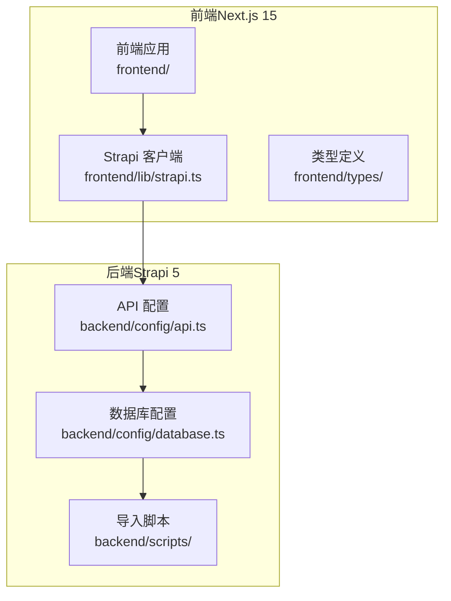
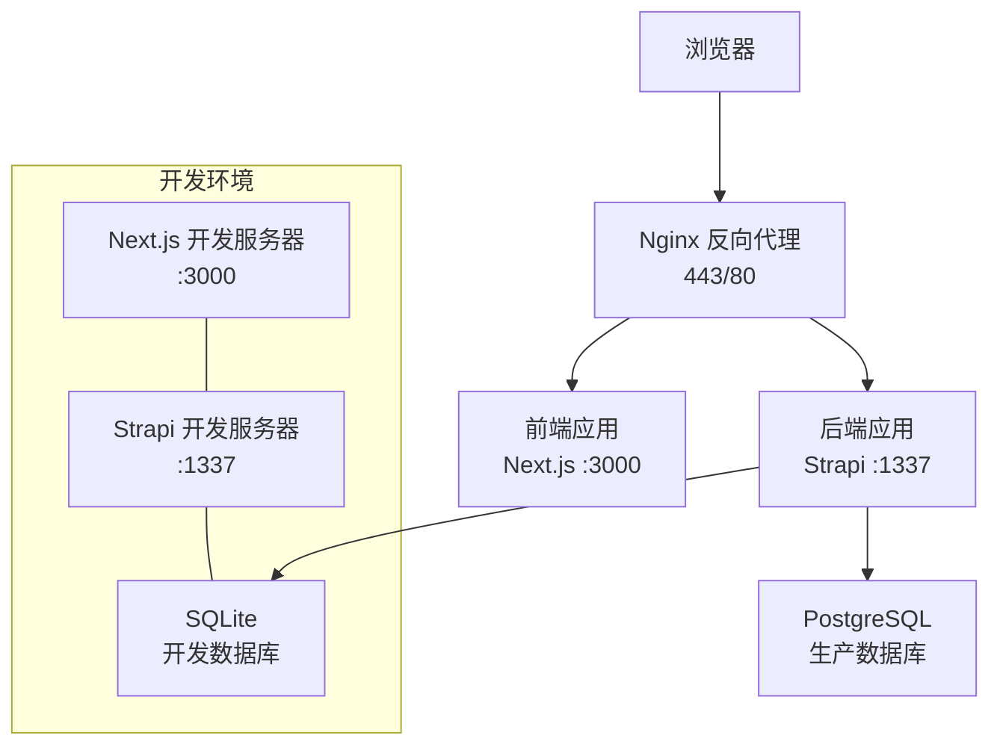
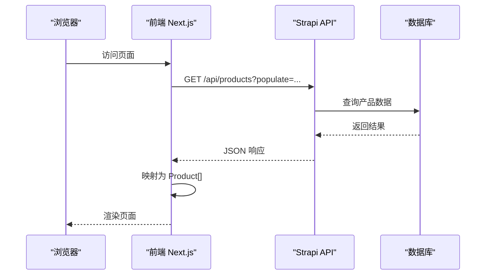
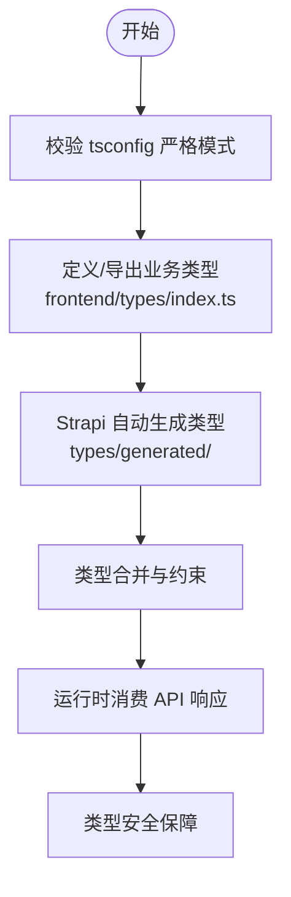
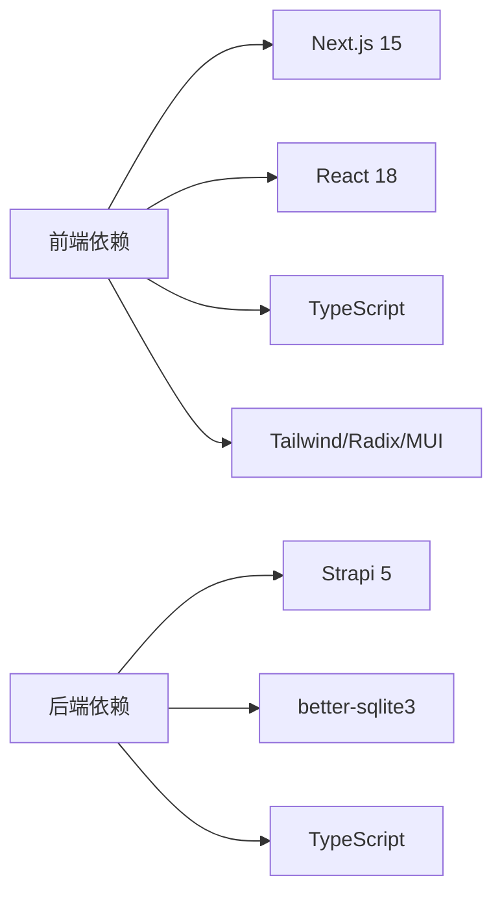

# 开发流程说明

<cite>
**本文引用的文件**
- [README.md](file://README.md)
- [DEPLOYMENT.md](file://DEPLOYMENT.md)
- [QODER.md](file://QODER.md)
- [specs/001-nextjs-migration/spec.md](file://specs/001-nextjs-migration/spec.md)
- [specs/001-strapi-backend-cms/spec.md](file://specs/001-strapi-backend-cms/spec.md)
- [frontend/package.json](file://frontend/package.json)
- [backend/package.json](file://backend/package.json)
- [frontend/tsconfig.json](file://frontend/tsconfig.json)
- [backend/tsconfig.json](file://backend/tsconfig.json)
- [frontend/.eslintrc.json](file://frontend/.eslintrc.json)
- [frontend/next.config.ts](file://frontend/next.config.ts)
- [backend/config/api.ts](file://backend/config/api.ts)
- [backend/config/database.ts](file://backend/config/database.ts)
- [frontend/lib/strapi.ts](file://frontend/lib/strapi.ts)
- [frontend/types/index.ts](file://frontend/types/index.ts)
</cite>

## 目录
1. [简介](#简介)
2. [项目结构](#项目结构)
3. [核心组件](#核心组件)
4. [架构总览](#架构总览)
5. [详细组件分析](#详细组件分析)
6. [依赖关系分析](#依赖关系分析)
7. [性能考量](#性能考量)
8. [故障排查指南](#故障排查指南)
9. [结论](#结论)
10. [附录](#附录)

## 简介
本文件面向中创智控官网项目，系统化阐述开发协作模式、前后端职责分工与协作方式、基于 API 契约的开发流程、TypeScript 类型安全保障、代码审查与分支管理策略、版本控制最佳实践、CI/CD 与自动化测试策略、开发环境搭建与调试技巧，以及 AI 辅助开发工具（GitHub Agents 与 Prompts）的配置与应用建议。目标是帮助跨团队协作高效、高质量地交付产品。

## 项目结构
项目采用前后端分离架构：
- 前端：Next.js 15 App Router，负责页面路由、渲染与交互，通过 lib/strapi.ts 与后端 Strapi CMS 通信。
- 后端：Strapi 5 CMS，提供 RESTful API 管理产品与新闻内容，支持 SQLite（开发）与 PostgreSQL（生产）数据库。

图表来源
- [frontend/lib/strapi.ts](file://frontend/lib/strapi.ts#L1-L155)
- [backend/config/api.ts](file://backend/config/api.ts#L1-L8)
- [backend/config/database.ts](file://backend/config/database.ts#L1-L61)

章节来源
- [README.md](file://README.md#L66-L227)

## 核心组件
- 前端 Next.js 应用：负责页面路由、渲染策略（SSR/SSG）、图片优化、主题与 UI 组件集成。
- Strapi CMS 后端：提供 REST API、内容管理、权限控制、数据库迁移与内容导入。
- 类型系统：前后端均使用 TypeScript，前端通过 types/ 与自动生成的 types/generated/ 确保类型安全。
- 开发工具链：ESLint、Turbopack、pnpm/npm、Docker Compose、Nginx、Let's Encrypt。

章节来源
- [frontend/package.json](file://frontend/package.json#L1-L88)
- [backend/package.json](file://backend/package.json#L1-L45)
- [frontend/tsconfig.json](file://frontend/tsconfig.json#L1-L42)
- [backend/tsconfig.json](file://backend/tsconfig.json#L1-L44)
- [frontend/.eslintrc.json](file://frontend/.eslintrc.json#L1-L7)

## 架构总览
前后端通过 HTTP/HTTPS API 协作，前端通过 NEXT_PUBLIC_STRAPI_URL 指向后端 API。开发与生产环境分别采用 SQLite 与 PostgreSQL，配合 Nginx 反向代理与 HTTPS 证书自动化管理。

图表来源
- [DEPLOYMENT.md](file://DEPLOYMENT.md#L38-L99)
- [README.md](file://README.md#L281-L298)

章节来源
- [README.md](file://README.md#L229-L298)
- [DEPLOYMENT.md](file://DEPLOYMENT.md#L34-L99)

## 详细组件分析

### 前后端协作与 API 契约
- 前端通过 lib/strapi.ts 封装 Strapi API，统一处理媒体资源 URL、分页与排序参数，并将响应映射为前端类型。
- 后端通过 config/api.ts 控制 REST API 的默认分页与最大限制，确保前端稳定消费。
- 前后端通过 TypeScript 类型定义协同：前端 types/ 定义业务模型，后端 types/generated/ 由 Strapi 自动生成，二者共同构成契约。

图表来源
- [frontend/lib/strapi.ts](file://frontend/lib/strapi.ts#L100-L125)
- [backend/config/api.ts](file://backend/config/api.ts#L1-L8)
- [backend/config/database.ts](file://backend/config/database.ts#L1-L61)

章节来源
- [frontend/lib/strapi.ts](file://frontend/lib/strapi.ts#L1-L155)
- [backend/config/api.ts](file://backend/config/api.ts#L1-L8)
- [backend/config/database.ts](file://backend/config/database.ts#L1-L61)

### 类型安全与契约
- 前端 tsconfig.json 启用严格模式与 bundler 模块解析，路径别名 @/* 指向项目根，确保类型检查与导入一致性。
- 后端 tsconfig.json 配置 CommonJS 与 Node 解析，排除 admin 与测试目录，聚焦服务端编译。
- 前端类型导出入口 types/index.ts 汇总业务类型，便于跨模块复用。
- Strapi 自动生成 types/generated/，建议在前端通过类型合并或声明合并的方式纳入整体类型体系，减少运行时风险。

图表来源
- [frontend/tsconfig.json](file://frontend/tsconfig.json#L1-L42)
- [backend/tsconfig.json](file://backend/tsconfig.json#L1-L44)
- [frontend/types/index.ts](file://frontend/types/index.ts#L1-L28)

章节来源
- [frontend/tsconfig.json](file://frontend/tsconfig.json#L1-L42)
- [backend/tsconfig.json](file://backend/tsconfig.json#L1-L44)
- [frontend/types/index.ts](file://frontend/types/index.ts#L1-L28)

### 开发环境与调试
- 前端：pnpm dev 启动 Turbopack 加速的开发服务器；next.config.ts 配置图片优化与远程域名白名单；.eslintrc.json 继承 next/core-web-vitals 与 TypeScript 规则。
- 后端：npm run develop 启动 Strapi 开发服务器；默认 SQLite，支持 MySQL/PostgreSQL；可通过 scripts/ 导入初始内容。
- 调试建议：利用 Next.js 的错误与加载状态页面（app/error.tsx、app/loading.tsx）快速定位问题；Strapi Admin UI 进行内容与权限验证。

章节来源
- [README.md](file://README.md#L306-L398)
- [frontend/next.config.ts](file://frontend/next.config.ts#L1-L39)
- [frontend/.eslintrc.json](file://frontend/.eslintrc.json#L1-L7)
- [backend/package.json](file://backend/package.json#L1-L45)

### CI/CD 与自动化测试策略
- 容器化与多阶段构建：后端与前端均采用多阶段 Docker 构建，部署时构建，避免提交构建产物。
- 部署流程：使用 docker compose 编排，先启动数据库与后端，再启动前端与 Nginx/Certbot；提供健康检查脚本与证书自动化。
- 自动化脚本：部署脚本、密钥生成脚本、备份与恢复脚本、证书续期脚本、定时任务配置。
- 建议补充：在 CI 中增加 ESLint、TypeScript 类型检查与端到端测试步骤，结合 Docker Compose 在流水线中验证健康检查与 API 可用性。

章节来源
- [DEPLOYMENT.md](file://DEPLOYMENT.md#L225-L318)
- [DEPLOYMENT.md](file://DEPLOYMENT.md#L414-L569)
- [DEPLOYMENT.md](file://DEPLOYMENT.md#L648-L743)

### 代码审查与分支管理
- 分支策略：建议采用 Git Flow 或 GitHub Flow，主分支受保护，功能分支从 develop 切出，合并前强制审查。
- 代码审查清单：类型安全检查、API 契约一致性、错误处理与加载状态、SEO 元数据、性能与可访问性。
- 版本控制最佳实践：提交信息清晰、小步提交、关联需求与缺陷编号；使用 PR 模plate 统一审查维度。

章节来源
- [QODER.md](file://QODER.md#L1-L30)

### AI 辅助开发工具
- GitHub Agents：可配置用于自动化 PR 审查、生成变更摘要、识别潜在类型不匹配与 API 不一致问题。
- Prompts：建议维护标准化的审查与生成 Prompt，涵盖类型契约校验、错误处理规范、性能与可访问性检查。
- 配置建议：在 .github/agents 与 .github/prompts 下集中管理，结合仓库工作流触发自动化任务。

章节来源
- [README.md](file://README.md#L218-L226)

## 依赖关系分析
- 前端依赖 Next.js 15、React 18、TypeScript、Tailwind CSS v4、Radix UI、MUI、Framer Motion 等，强调类型安全与组件化。
- 后端依赖 Strapi 5、better-sqlite3、React Admin UI、TypeScript，强调内容管理与权限控制。
- 开发工具：ESLint、pnpm、npm、Docker、Nginx、Let's Encrypt。

图表来源
- [frontend/package.json](file://frontend/package.json#L1-L88)
- [backend/package.json](file://backend/package.json#L1-L45)

章节来源
- [frontend/package.json](file://frontend/package.json#L1-L88)
- [backend/package.json](file://backend/package.json#L1-L45)

## 性能考量
- 图片优化：Next.js 图片优化与现代格式支持，合理配置 remotePatterns 与 sizes。
- 渲染策略：首页与静态页采用 SSG，列表页采用 SSR/ISR，交互组件使用客户端渲染，平衡首屏与交互性能。
- 构建与缓存：Docker 多阶段构建与层缓存，部署时构建减少镜像体积与提升安全性。
- 健康检查：容器健康检查与日志轮转，保障线上稳定性。

章节来源
- [README.md](file://README.md#L496-L543)
- [DEPLOYMENT.md](file://DEPLOYMENT.md#L225-L276)
- [DEPLOYMENT.md](file://DEPLOYMENT.md#L587-L631)

## 故障排查指南
- 常见问题：
  - 前端无法访问 Strapi：确认 NEXT_PUBLIC_STRAPI_URL 与 CORS 配置；检查 Admin UI 权限与 API Token。
  - 数据库迁移：开发环境 SQLite，生产环境 PostgreSQL；迁移前备份与验证 API 可用性。
  - 证书问题：使用 Certbot 自动化证书初始化与续期；检查 Nginx SSL 配置与域名解析。
- 建议流程：
  - 健康检查：curl /healthz 验证前后端可用性。
  - 日志查看：docker compose logs -f 查看实时日志，定位异常。
  - 回滚策略：使用备份脚本恢复数据库与媒体文件。

章节来源
- [README.md](file://README.md#L624-L800)
- [DEPLOYMENT.md](file://DEPLOYMENT.md#L587-L743)

## 结论
本项目通过前后端分离与 API 契约实现高效协作，借助 TypeScript 与类型生成确保类型安全，结合容器化与自动化脚本实现稳定的 CI/CD 与运维。建议持续完善代码审查与分支管理规范，强化 AI 辅助工具的应用，以进一步提升开发效率与质量。

## 附录
- 快速开始与开发模式参见项目自述文件与部署文档。
- 规格文档（Next.js 迁移、Strapi 后端）为需求与验收提供依据。

章节来源
- [README.md](file://README.md#L306-L398)
- [specs/001-nextjs-migration/spec.md](file://specs/001-nextjs-migration/spec.md#L1-L162)
- [specs/001-strapi-backend-cms/spec.md](file://specs/001-strapi-backend-cms/spec.md#L1-L124)