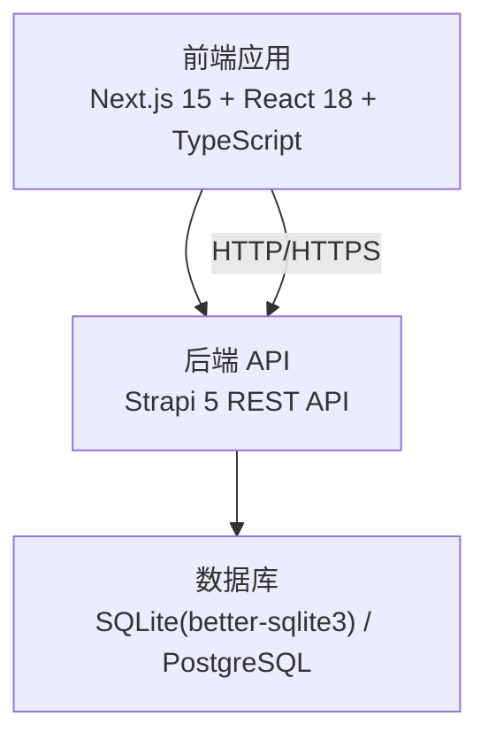
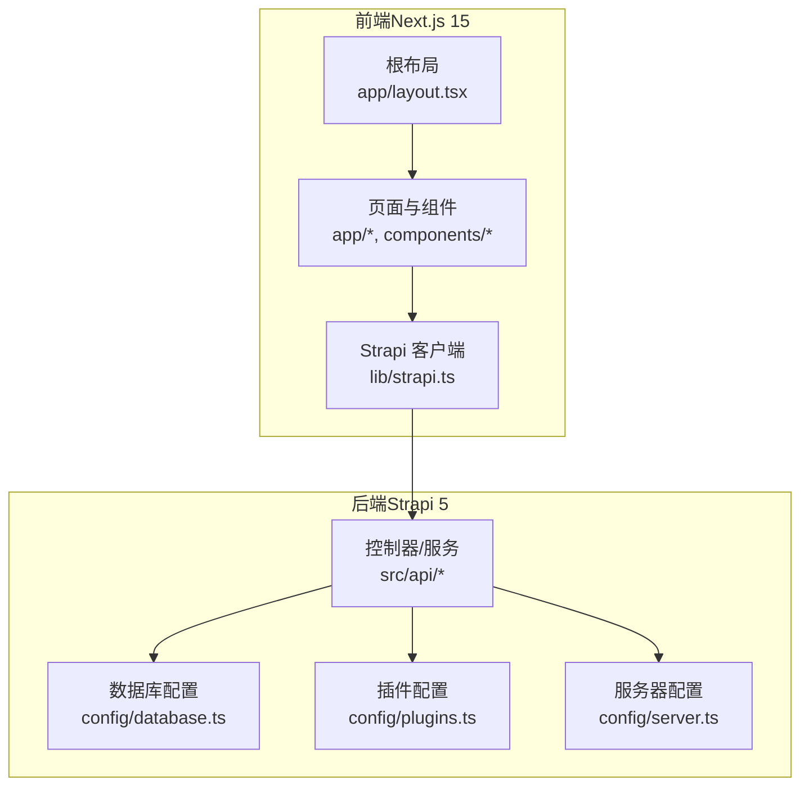
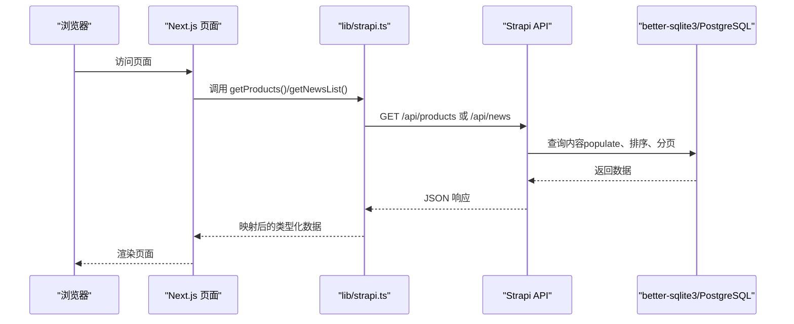
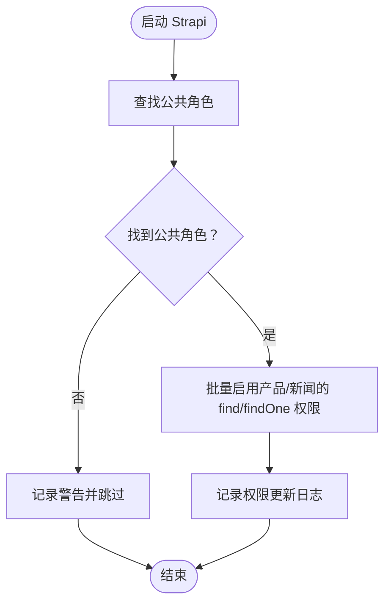
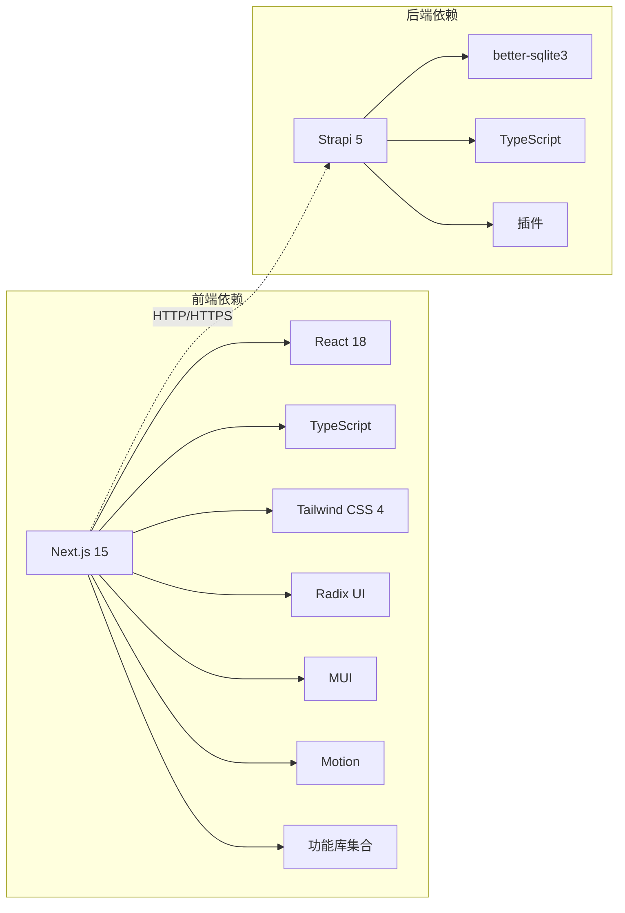

# 技术栈介绍

<cite>
**本文引用的文件**
- [frontend/package.json](file://frontend/package.json)
- [backend/package.json](file://backend/package.json)
- [frontend/next.config.ts](file://frontend/next.config.ts)
- [backend/config/database.ts](file://backend/config/database.ts)
- [backend/config/server.ts](file://backend/config/server.ts)
- [frontend/lib/strapi.ts](file://frontend/lib/strapi.ts)
- [frontend/app/layout.tsx](file://frontend/app/layout.tsx)
- [frontend/postcss.config.mjs](file://frontend/postcss.config.mjs)
- [frontend/tsconfig.json](file://frontend/tsconfig.json)
- [backend/tsconfig.json](file://backend/tsconfig.json)
- [README.md](file://README.md)
- [DEPLOYMENT.md](file://DEPLOYMENT.md)
- [specs/001-nextjs-migration/spec.md](file://specs/001-nextjs-migration/spec.md)
- [specs/001-strapi-backend-cms/spec.md](file://specs/001-strapi-backend-cms/spec.md)
- [frontend/content/site-config.ts](file://frontend/content/site-config.ts)
- [backend/src/index.ts](file://backend/src/index.ts)
- [backend/config/plugins.ts](file://backend/config/plugins.ts)
</cite>

## 目录
1. [简介](#简介)
2. [项目结构](#项目结构)
3. [核心组件](#核心组件)
4. [架构总览](#架构总览)
5. [组件详解](#组件详解)
6. [依赖关系分析](#依赖关系分析)
7. [性能考量](#性能考量)
8. [故障排查指南](#故障排查指南)
9. [结论](#结论)
10. [附录](#附录)

## 简介
本项目为中创智控官网，采用前后端分离架构：前端基于 Next.js 15 App Router + React 18 + TypeScript，配合 Tailwind CSS 4 实现现代化、响应式的用户界面；后端基于 Strapi 5 无头 CMS，提供 REST API 与内容管理能力，数据库默认使用 better-sqlite3（开发环境），生产环境可切换为 PostgreSQL。技术栈在性能、可维护性与扩展性之间取得平衡，支持混合渲染模式（SSG/SSR/CSR），并提供完善的开发与生产部署方案。

## 项目结构
项目采用清晰的分层组织：
- 前端（frontend/）：Next.js 15 应用，App Router 路由，TypeScript，Tailwind CSS 4，组件与页面按功能模块划分。
- 后端（backend/）：Strapi 5 应用，配置与 API 控制器、服务、内容类型定义，以及数据库与插件配置。
- 规格文档（specs/）：Next.js 迁移与 Strapi CMS 后端的功能规格说明。
- 运维与部署（DEPLOYMENT.md）：生产环境容器化部署、证书、备份与监控方案。

图表来源
- [frontend/next.config.ts](file://frontend/next.config.ts#L1-L39)
- [backend/config/database.ts](file://backend/config/database.ts#L1-L61)
- [backend/config/server.ts](file://backend/config/server.ts#L1-L8)
- [frontend/lib/strapi.ts](file://frontend/lib/strapi.ts#L1-L155)

章节来源
- [README.md](file://README.md#L66-L227)

## 核心组件
- 前端框架与构建
  - Next.js 15：App Router、混合渲染（SSG/SSR/CSR）、图片优化、严格模式。
  - React 18：并发特性与服务端组件支持。
  - TypeScript：类型安全与更好的开发体验。
  - Turbopack：开发服务器加速（通过脚本启用）。
- 样式与 UI
  - Tailwind CSS 4：原子化 CSS，PostCSS 插件自动配置。
  - Radix UI：无障碍 UI 组件库（对话框、导航菜单、滚动区域等）。
  - MUI（Material UI）：Material Design 组件与图标。
  - Motion（Framer Motion）：动画与过渡效果。
- 功能与工具库
  - date-fns、recharts、react-hook-form、react-dnd、embla-carousel-react、sonner、cmdk、vaul、react-day-picker、react-resizable-panels、react-responsive-masonry、react-router-dom、input-OTP、react-popper、@popperjs/core 等。
- 包管理器
  - 前端：pnpm；后端：npm。
- 后端框架与数据库
  - Strapi 5：无头 CMS，REST API，用户权限插件，云插件。
  - better-sqlite3：开发环境默认数据库驱动；生产环境可切换 PostgreSQL。
  - React 18 与 styled-components：Admin UI 框架与样式库。

章节来源
- [README.md](file://README.md#L5-L64)
- [frontend/package.json](file://frontend/package.json#L1-L88)
- [backend/package.json](file://backend/package.json#L1-L45)

## 架构总览
系统采用前后端分离架构，前端负责页面渲染与交互，后端提供内容与媒体资源的统一 API。数据流从前端发起 HTTP 请求，经由后端 API 返回 JSON 数据，前端映射为页面组件。

图表来源
- [frontend/app/layout.tsx](file://frontend/app/layout.tsx#L1-L83)
- [frontend/lib/strapi.ts](file://frontend/lib/strapi.ts#L1-L155)
- [backend/config/database.ts](file://backend/config/database.ts#L1-L61)
- [backend/config/plugins.ts](file://backend/config/plugins.ts#L1-L11)
- [backend/config/server.ts](file://backend/config/server.ts#L1-L8)

章节来源
- [README.md](file://README.md#L229-L298)

## 组件详解

### 前端技术栈与职责
- Next.js 15
  - App Router：基于文件系统的路由，支持页面级 SSR/SSG 与客户端组件。
  - 图片优化：远程域名白名单、现代图片格式（AVIF/WebP）、响应式尺寸。
  - 严格模式：提升开发阶段的健壮性。
- React 18
  - 支持并发特性与服务端组件。
- TypeScript
  - 严格模式、路径别名、模块解析方式为 bundler，目标 ES2017。
- Tailwind CSS 4 + PostCSS
  - 通过 @tailwindcss/postcss 插件自动配置，全局样式集中于 app/globals.css。
- UI 组件库
  - Radix UI：无障碍组件（对话框、导航菜单、滚动区域等）。
  - MUI：Material Design 组件与图标。
  - Motion：动画与过渡。
- 功能库
  - recharts、react-hook-form、react-dnd、embla-carousel-react、sonner、cmdk、vaul、react-day-picker、react-resizable-panels、react-responsive-masonry、react-router-dom、input-OTP、react-popper、@popperjs/core 等。

章节来源
- [frontend/next.config.ts](file://frontend/next.config.ts#L1-L39)
- [frontend/tsconfig.json](file://frontend/tsconfig.json#L1-L42)
- [frontend/postcss.config.mjs](file://frontend/postcss.config.mjs#L1-L9)
- [frontend/app/layout.tsx](file://frontend/app/layout.tsx#L1-L83)
- [README.md](file://README.md#L13-L51)

### 后端技术栈与职责
- Strapi 5
  - 无头 CMS，提供 REST API 管理产品与新闻内容。
  - 用户权限插件：基于角色的访问控制（RBAC）。
  - 云插件：云服务集成。
- better-sqlite3
  - 开发环境默认数据库驱动，支持迁移系统。
- React 18 与 styled-components
  - Admin UI 框架与样式库。
- TypeScript
  - 严格模式、目标 ES2020、自动生成类型。

章节来源
- [backend/package.json](file://backend/package.json#L1-L45)
- [backend/tsconfig.json](file://backend/tsconfig.json#L1-L44)
- [README.md](file://README.md#L57-L64)

### 数据流与 API 客户端
前端通过 lib/strapi.ts 与后端 Strapi API 交互，封装了产品与新闻的查询、映射与错误处理，并支持按 slug 查询详情与获取所有 slug 列表。该客户端在 Next.js 中使用 fetch 并利用 revalidate 参数实现增量静态再生成（ISR）。

图表来源
- [frontend/lib/strapi.ts](file://frontend/lib/strapi.ts#L100-L155)
- [backend/config/database.ts](file://backend/config/database.ts#L1-L61)

章节来源
- [frontend/lib/strapi.ts](file://frontend/lib/strapi.ts#L1-L155)

### 权限与公开访问
后端在启动时为公共角色启用产品与新闻的 find/findOne 权限，确保未认证用户可读取公开内容；认证用户可进行写操作。此逻辑位于入口扩展中，便于统一初始化。

图表来源
- [backend/src/index.ts](file://backend/src/index.ts#L19-L63)

章节来源
- [backend/src/index.ts](file://backend/src/index.ts#L1-L65)

### 配置与环境变量
- 前端
  - next.config.ts：图片优化、远程域名白名单、现代图片格式、响应式尺寸。
  - tsconfig.json：严格模式、路径别名、模块解析方式、目标 ES2017。
  - postcss.config.mjs：Tailwind CSS v4 自动配置。
  - 环境变量：NEXT_PUBLIC_STRAPI_URL（可选，使用 Strapi 时需要）。
- 后端
  - config/server.ts：主机、端口、应用密钥。
  - config/database.ts：支持 sqlite/mysql/postgres，SQLite 默认文件路径与连接超时。
  - config/plugins.ts：上传插件本地存储与大小限制。
  - tsconfig.json：严格模式、目标 ES2020、自动生成类型。
  - 环境变量：HOST、PORT、DATABASE_CLIENT、DATABASE_FILENAME、APP_KEYS 等。

章节来源
- [frontend/next.config.ts](file://frontend/next.config.ts#L1-L39)
- [frontend/tsconfig.json](file://frontend/tsconfig.json#L1-L42)
- [frontend/postcss.config.mjs](file://frontend/postcss.config.mjs#L1-L9)
- [backend/config/server.ts](file://backend/config/server.ts#L1-L8)
- [backend/config/database.ts](file://backend/config/database.ts#L1-L61)
- [backend/config/plugins.ts](file://backend/config/plugins.ts#L1-L11)
- [backend/tsconfig.json](file://backend/tsconfig.json#L1-L44)
- [README.md](file://README.md#L511-L581)

## 依赖关系分析
- 前端依赖
  - Next.js 15、React 18、TypeScript、Tailwind CSS 4、Radix UI、MUI、Motion、各类功能库。
  - 通过 pnpm 管理，开发脚本启用 Turbopack。
- 后端依赖
  - Strapi 5、better-sqlite3、React 18、styled-components、TypeScript。
  - 通过 npm 管理，支持插件与数据库配置。
- 前后端耦合点
  - 前端通过 NEXT_PUBLIC_STRAPI_URL 指向后端 API，支持跨域（localhost、127.0.0.1、192.168.0.2）。
  - 后端提供 REST API，前端使用 fetch 与 revalidate 实现 ISR。

图表来源
- [frontend/package.json](file://frontend/package.json#L12-L88)
- [backend/package.json](file://backend/package.json#L20-L29)

章节来源
- [frontend/package.json](file://frontend/package.json#L1-L88)
- [backend/package.json](file://backend/package.json#L1-L45)

## 性能考量
- 渲染策略
  - 首页与静态页面采用 SSG，列表页支持 SSR/ISR，交互组件使用客户端渲染，兼顾首屏速度与交互体验。
- 图片优化
  - Next.js 图片优化：远程域名白名单、现代图片格式（AVIF/WebP）、响应式尺寸，减少带宽与加载时间。
- 构建与开发
  - Turbopack 加速开发服务器，提升迭代效率。
- 数据缓存与再生成
  - 前端 lib/strapi.ts 使用 fetch 的 revalidate 参数，实现增量静态再生成（ISR），降低后端压力。
- 生产部署
  - Docker 多阶段构建，部署时构建，避免提交构建产物，提高安全性与一致性。
  - Nginx 反向代理 + Let's Encrypt 自动证书管理，保障 HTTPS 与安全传输。

章节来源
- [README.md](file://README.md#L444-L472)
- [frontend/next.config.ts](file://frontend/next.config.ts#L5-L33)
- [frontend/lib/strapi.ts](file://frontend/lib/strapi.ts#L100-L111)
- [DEPLOYMENT.md](file://DEPLOYMENT.md#L225-L276)

## 故障排查指南
- 前端常见问题
  - 图片加载失败：确认 remotePatterns 是否包含目标域名，或使用 ImageWithFallback 组件回退。
  - SEO 元数据缺失：检查页面导出的 metadata 对象或动态生成函数。
  - 主题颜色不生效：检查 app/globals.css 中 CSS 变量定义。
- 后端常见问题
  - 数据库连接失败：检查 DATABASE_CLIENT 与 DATABASE_FILENAME（SQLite）或 DATABASE_URL（PostgreSQL）。
  - API 权限不足：确认公共角色已启用产品/新闻的 find/findOne 权限。
  - 上传文件异常：检查 upload 插件 provider 与大小限制配置。
- 部署与运维
  - 证书续期失败：检查 Certbot 定时任务与 Nginx 配置。
  - 健康检查失败：查看容器日志，确认服务端口与健康检查路径。

章节来源
- [frontend/next.config.ts](file://frontend/next.config.ts#L5-L33)
- [frontend/app/layout.tsx](file://frontend/app/layout.tsx#L9-L61)
- [backend/config/database.ts](file://backend/config/database.ts#L45-L50)
- [backend/src/index.ts](file://backend/src/index.ts#L29-L60)
- [backend/config/plugins.ts](file://backend/config/plugins.ts#L2-L9)
- [DEPLOYMENT.md](file://DEPLOYMENT.md#L587-L631)

## 结论
本项目的技术栈围绕 Next.js 15 与 Strapi 5 构建，结合 Tailwind CSS 4 与丰富的 UI/功能库，形成高性能、可维护、可扩展的现代化官网解决方案。通过混合渲染模式与 ISR，兼顾首屏性能与内容更新效率；通过 Docker 多阶段构建与 Nginx/Certbot 自动化，确保生产环境的安全与稳定。版本与升级路径遵循各框架官方建议，结合项目实际进行平滑演进。

## 附录

### 技术选型理由与优势
- Next.js 15 + React 18 + TypeScript
  - App Router 与服务端组件带来更好的 SEO 与性能；TypeScript 提升类型安全与开发体验。
- Tailwind CSS 4
  - 原子化 CSS，快速样式迭代，与 PostCSS 插件无缝集成。
- Radix UI + MUI
  - 无障碍与 Material Design 组件互补，覆盖复杂交互场景。
- Motion
  - 简洁强大的动画库，提升用户体验。
- Strapi 5 + better-sqlite3
  - 无头 CMS 提供灵活的内容管理；SQLite 适合开发与小型生产；可平滑迁移到 PostgreSQL。
- 功能库
  - recharts、react-hook-form、react-dnd、sonner、cmdk、vaul、react-day-picker、react-resizable-panels、react-responsive-masonry、react-router-dom、input-OTP、react-popper、@popperjs/core 等，覆盖图表、表单、拖拽、通知、命令面板、日期选择、面板调整、瀑布流、路由与定位等丰富场景。

章节来源
- [README.md](file://README.md#L5-L64)

### 版本兼容性与升级路径
- 前端
  - Next.js 15.1.0、React 18.3.1、TypeScript 5.7.0、Tailwind CSS 4.1.0。
  - 升级建议：遵循 Next.js 官方迁移指南，逐步升级 React 与 TypeScript，保持 Tailwind CSS 与 PostCSS 插件同步。
- 后端
  - Strapi 5.33.4、better-sqlite3 12.4.1、TypeScript 5.x。
  - 升级建议：使用 Strapi 官方升级工具，先在开发环境验证，再迁移至生产；数据库从 SQLite 平滑迁移到 PostgreSQL。
- 生产环境
  - Node.js 24、Docker 24+、Docker Compose 2.20+、Nginx 1.27、Let's Encrypt。
  - 升级建议：容器镜像与依赖版本遵循官方 LTS，定期更新并进行灰度验证。

章节来源
- [README.md](file://README.md#L8-L64)
- [DEPLOYMENT.md](file://DEPLOYMENT.md#L5-L26)

### 学习路径与最佳实践
- 学习路径
  - Next.js：App Router、服务端组件、SSR/SSG/ISR、图片优化、元数据。
  - Strapi：内容类型、API 控制器、服务、权限与插件。
  - Tailwind CSS：原子化样式、响应式断点、主题变量。
  - TypeScript：严格模式、类型推导、泛型与工具类型。
- 最佳实践
  - 前端：合理划分页面渲染策略（SSG/SSR/CSR），使用 ISR 与 revalidate；组件化与类型安全优先；SEO 元数据集中管理。
  - 后端：RBAC 权限最小化、API 设计契约化、数据库迁移规范化、插件与上传配置安全。
  - 运维：多阶段构建、容器化部署、证书自动化、健康检查与日志轮转、备份与恢复策略。

章节来源
- [specs/001-nextjs-migration/spec.md](file://specs/001-nextjs-migration/spec.md#L109-L162)
- [specs/001-strapi-backend-cms/spec.md](file://specs/001-strapi-backend-cms/spec.md#L76-L124)
- [README.md](file://README.md#L496-L623)
- [DEPLOYMENT.md](file://DEPLOYMENT.md#L414-L570)