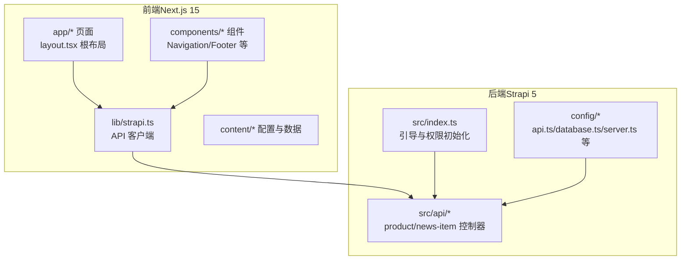
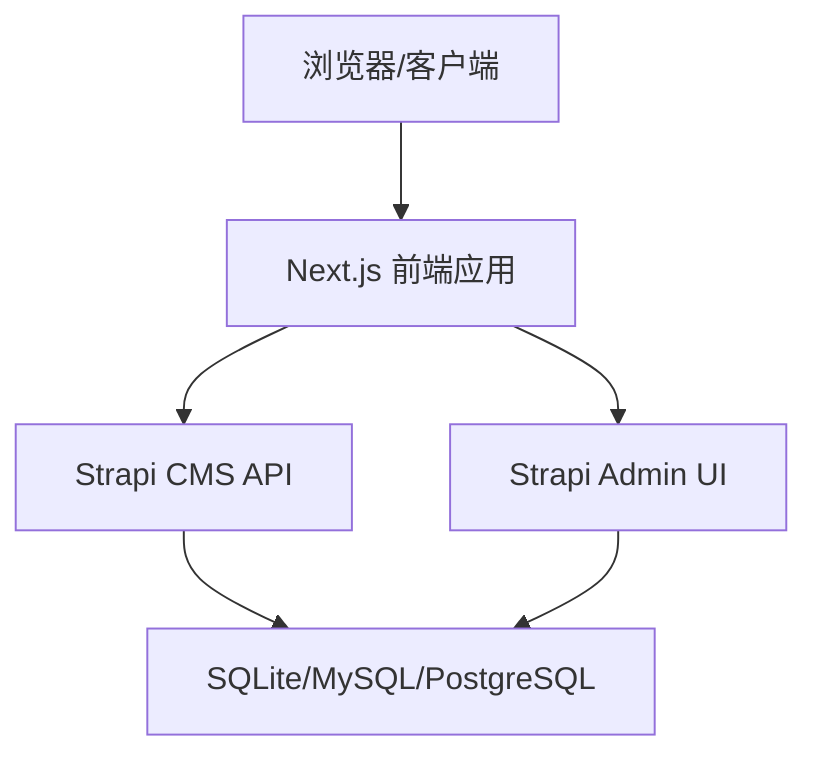
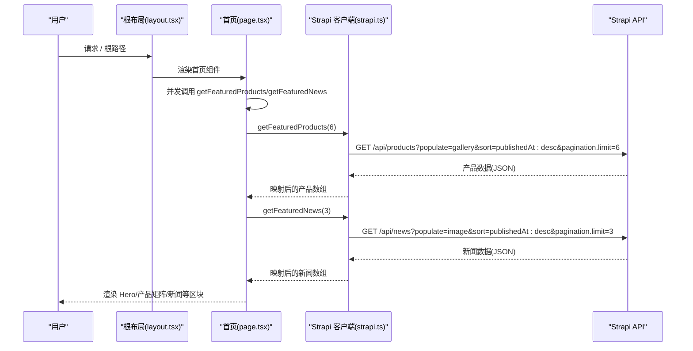
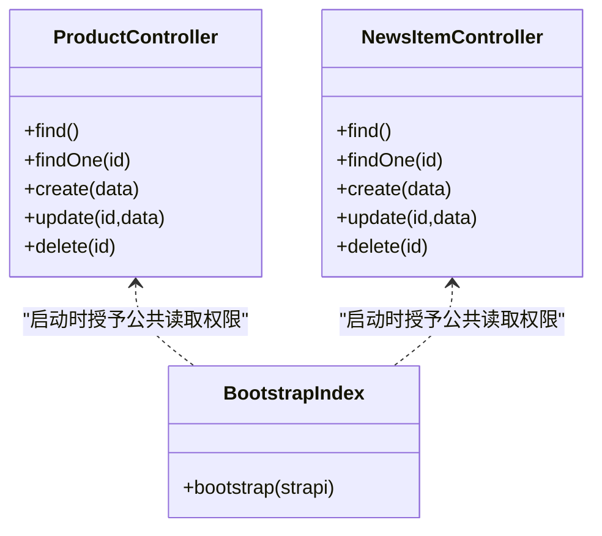
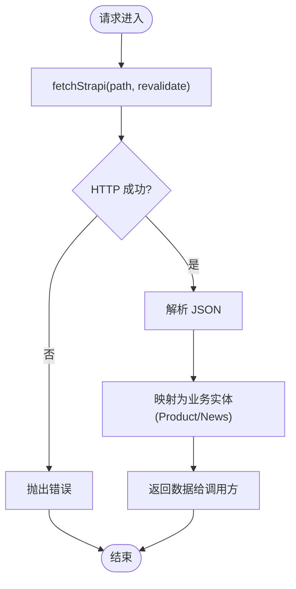
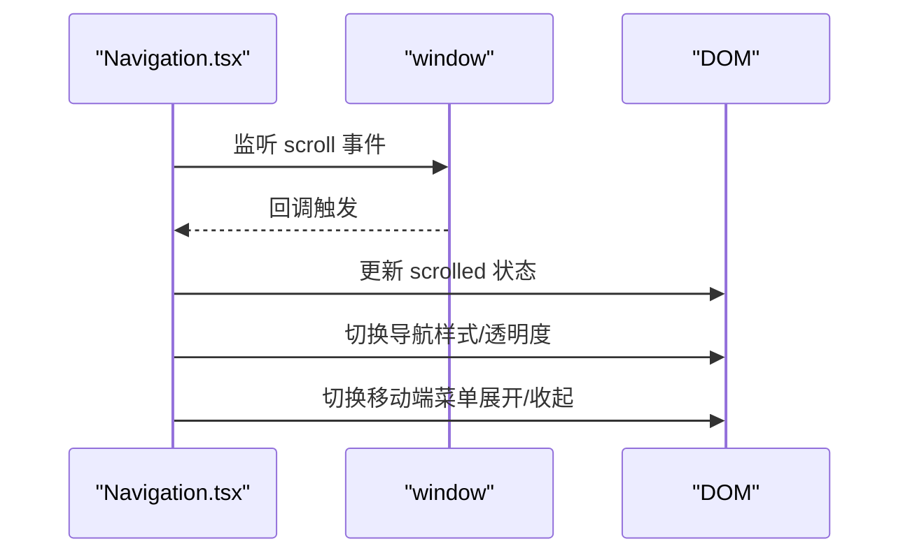
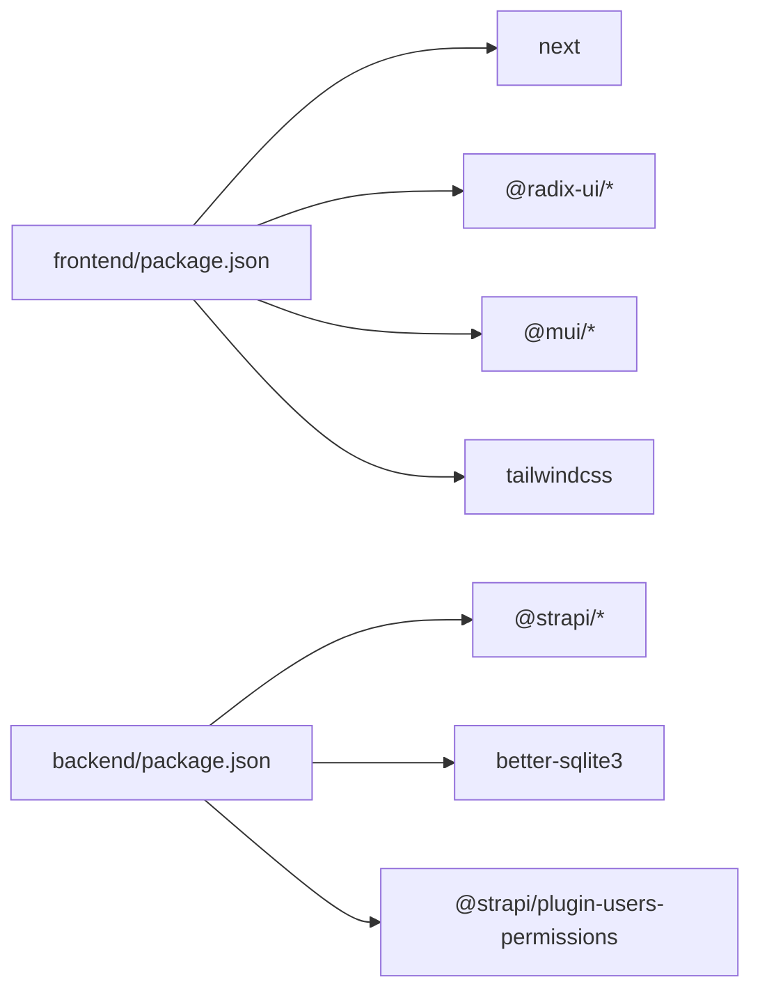

# 架构设计理念

<cite>
**本文引用的文件**
- [README.md](file://README.md)
- [frontend/package.json](file://frontend/package.json)
- [backend/package.json](file://backend/package.json)
- [frontend/next.config.ts](file://frontend/next.config.ts)
- [backend/src/index.ts](file://backend/src/index.ts)
- [frontend/lib/strapi.ts](file://frontend/lib/strapi.ts)
- [frontend/app/layout.tsx](file://frontend/app/layout.tsx)
- [backend/config/api.ts](file://backend/config/api.ts)
- [backend/config/database.ts](file://backend/config/database.ts)
- [specs/001-nextjs-migration/spec.md](file://specs/001-nextjs-migration/spec.md)
- [frontend/content/site-config.ts](file://frontend/content/site-config.ts)
- [backend/src/api/product/controllers/product.ts](file://backend/src/api/product/controllers/product.ts)
- [backend/src/api/news-item/controllers/news-item.ts](file://backend/src/api/news-item/controllers/news-item.ts)
- [frontend/components/layout/Navigation.tsx](file://frontend/components/layout/Navigation.tsx)
- [frontend/app/page.tsx](file://frontend/app/page.tsx)
</cite>

## 目录
1. [引言](#引言)
2. [项目结构](#项目结构)
3. [核心组件](#核心组件)
4. [架构总览](#架构总览)
5. [详细组件分析](#详细组件分析)
6. [依赖分析](#依赖分析)
7. [性能考量](#性能考量)
8. [故障排查指南](#故障排查指南)
9. [结论](#结论)
10. [附录](#附录)

## 引言
本项目为中创智控官网，采用前后端分离架构，前端基于 Next.js 15 App Router 构建，后端采用 Strapi 5 无头 CMS。整体设计遵循“API 优先”的理念，通过清晰的分层与契约化接口实现前后端解耦，兼顾可扩展性、可维护性与性能优化。本文档系统阐述架构设计理念、技术选型考量、数据流与组件交互模式，并提供可视化图表帮助开发者快速理解系统设计。

## 项目结构
项目采用双仓库结构：frontend 与 backend 分离，分别负责前端 SPA 与后端 CMS。前端使用 Next.js App Router 实现文件系统路由与混合渲染（SSG/SSR/CSR），后端通过 Strapi 提供 RESTful API 与 Admin UI，支持内容管理与权限控制。

**图表来源**
- [frontend/app/layout.tsx](file://frontend/app/layout.tsx#L63-L82)
- [frontend/lib/strapi.ts](file://frontend/lib/strapi.ts#L100-L155)
- [backend/src/index.ts](file://backend/src/index.ts#L19-L63)
- [backend/src/api/product/controllers/product.ts](file://backend/src/api/product/controllers/product.ts#L1-L4)
- [backend/src/api/news-item/controllers/news-item.ts](file://backend/src/api/news-item/controllers/news-item.ts#L1-L4)
- [backend/config/api.ts](file://backend/config/api.ts#L1-L8)
- [backend/config/database.ts](file://backend/config/database.ts#L1-L61)

**章节来源**
- [README.md](file://README.md#L66-L227)
- [frontend/package.json](file://frontend/package.json#L1-L88)
- [backend/package.json](file://backend/package.json#L1-L45)

## 核心组件
- 前端 Next.js 应用
  - 根布局与元数据：通过根布局统一注入站点配置与 SEO 元数据，支持 Open Graph 与 Twitter Cards。
  - 页面与路由：基于 App Router 的文件系统路由，支持静态页（SSG）、列表页（SSR/ISR）与详情页（动态路由）。
  - 组件体系：布局组件（导航、页脚、滚动进度条）、区块组件（Hero、产品矩阵、新闻等）、基础 UI 组件（基于 Radix/MUI）。
  - 图片优化与严格模式：开启图片远程域名白名单、现代格式支持与严格模式。
- 后端 Strapi CMS
  - API 层：基于控制器工厂生成的 Core Controller，提供产品与新闻的 CRUD 能力。
  - 配置层：REST 限制、数据库连接（SQLite/MySQL/PostgreSQL）、中间件与插件。
  - 引导层：启动时自动为公共角色授予公开读取权限，确保前端可访问。
- API 客户端
  - 统一封装：提供产品与新闻的查询方法，内置媒体 URL 解析与映射。
  - 缓存与重验证：利用 fetch 的 next.revalidate 实现 ISR 缓存策略。

**章节来源**
- [frontend/app/layout.tsx](file://frontend/app/layout.tsx#L9-L61)
- [frontend/next.config.ts](file://frontend/next.config.ts#L3-L36)
- [backend/src/api/product/controllers/product.ts](file://backend/src/api/product/controllers/product.ts#L1-L4)
- [backend/src/api/news-item/controllers/news-item.ts](file://backend/src/api/news-item/controllers/news-item.ts#L1-L4)
- [backend/config/api.ts](file://backend/config/api.ts#L1-L8)
- [backend/config/database.ts](file://backend/config/database.ts#L4-L61)
- [backend/src/index.ts](file://backend/src/index.ts#L19-L63)
- [frontend/lib/strapi.ts](file://frontend/lib/strapi.ts#L100-L155)

## 架构总览
本项目采用“前端 SPA + 无头 CMS 后端”的前后端分离架构，遵循 API 优先设计原则。前端通过 Strapi 提供的 REST API 获取内容，后端负责内容管理与数据持久化，两者通过 HTTP/HTTPS 协议通信。系统支持静态内容与动态内容两种模式，满足不同场景需求。

**图表来源**
- [README.md](file://README.md#L249-L262)
- [backend/config/database.ts](file://backend/config/database.ts#L4-L61)
- [frontend/lib/strapi.ts](file://frontend/lib/strapi.ts#L100-L155)

**章节来源**
- [README.md](file://README.md#L229-L298)

## 详细组件分析

### 前端数据流与组件交互
前端页面通过根布局注入全局元数据与主题配置，页面组件在服务端并发拉取精选产品与新闻，随后渲染为页面区块。导航组件负责响应式交互与滚动状态管理，配合滚动进度条提升用户体验。

**图表来源**
- [frontend/app/layout.tsx](file://frontend/app/layout.tsx#L63-L82)
- [frontend/app/page.tsx](file://frontend/app/page.tsx#L40-L71)
- [frontend/lib/strapi.ts](file://frontend/lib/strapi.ts#L100-L155)

**章节来源**
- [frontend/app/layout.tsx](file://frontend/app/layout.tsx#L9-L61)
- [frontend/app/page.tsx](file://frontend/app/page.tsx#L40-L71)
- [frontend/lib/strapi.ts](file://frontend/lib/strapi.ts#L100-L155)

### 后端 API 与权限模型
后端通过控制器工厂生成 API 控制器，提供产品与新闻的标准 CRUD 能力；配置层定义 REST 限制与数据库连接参数；引导逻辑在启动时为公共角色授予公开读取权限，确保前端可直接访问。

**图表来源**
- [backend/src/api/product/controllers/product.ts](file://backend/src/api/product/controllers/product.ts#L1-L4)
- [backend/src/api/news-item/controllers/news-item.ts](file://backend/src/api/news-item/controllers/news-item.ts#L1-L4)
- [backend/src/index.ts](file://backend/src/index.ts#L19-L63)

**章节来源**
- [backend/src/api/product/controllers/product.ts](file://backend/src/api/product/controllers/product.ts#L1-L4)
- [backend/src/api/news-item/controllers/news-item.ts](file://backend/src/api/news-item/controllers/news-item.ts#L1-L4)
- [backend/src/index.ts](file://backend/src/index.ts#L19-L63)

### 数据流与缓存策略
前端通过 Strapi 客户端封装 API 请求，使用 fetch 的 next.revalidate 参数实现增量静态再生成（ISR）缓存策略，提升页面加载性能与 SEO 友好度。媒体资源 URL 统一解析，支持本地与远端存储。

**图表来源**
- [frontend/lib/strapi.ts](file://frontend/lib/strapi.ts#L100-L155)

**章节来源**
- [frontend/lib/strapi.ts](file://frontend/lib/strapi.ts#L100-L155)

### 组件交互与导航
导航组件在客户端运行，监听滚动事件以切换样式，并在移动端提供抽屉式菜单。组件通过动画库实现平滑过渡，配合全局 Provider 提供主题与上下文能力。

**图表来源**
- [frontend/components/layout/Navigation.tsx](file://frontend/components/layout/Navigation.tsx#L9-L19)

**章节来源**
- [frontend/components/layout/Navigation.tsx](file://frontend/components/layout/Navigation.tsx#L1-L126)

## 依赖分析
- 前端依赖
  - Next.js 15 与 React 18：提供 App Router、服务端组件与混合渲染能力。
  - 图片优化与严格模式：提升性能与稳定性。
  - UI 生态：Radix UI、MUI、Motion、Tailwind CSS 等。
- 后端依赖
  - Strapi 5：无头 CMS，提供 Admin UI 与 REST API。
  - 数据库驱动：better-sqlite3，支持 MySQL/PostgreSQL。
  - 权限插件：users-permissions，实现 RBAC。

**图表来源**
- [frontend/package.json](file://frontend/package.json#L12-L74)
- [backend/package.json](file://backend/package.json#L20-L28)

**章节来源**
- [frontend/package.json](file://frontend/package.json#L1-L88)
- [backend/package.json](file://backend/package.json#L1-L45)

## 性能考量
- 渲染策略
  - 首页采用静态生成（SSG），减少首屏渲染时间。
  - 列表页采用服务端渲染（SSR）或增量静态再生成（ISR），平衡实时性与性能。
  - 交互组件使用客户端渲染，保证用户体验。
- 图片优化
  - 远程域名白名单与现代图片格式（AVIF/WebP）支持，响应式尺寸配置。
- 缓存与重验证
  - 通过 fetch 的 next.revalidate 实现缓存与再生成策略，降低后端压力。
- 严格模式与类型安全
  - React 严格模式与 TypeScript 提升开发体验与运行时稳定性。

**章节来源**
- [specs/001-nextjs-migration/spec.md](file://specs/001-nextjs-migration/spec.md#L124-L128)
- [frontend/next.config.ts](file://frontend/next.config.ts#L3-L36)
- [frontend/lib/strapi.ts](file://frontend/lib/strapi.ts#L100-L111)

## 故障排查指南
- CORS 与跨域
  - 前端通过 NEXT_PUBLIC_STRAPI_URL 指向后端 API，确保开发环境允许 localhost/127.0.0.1/指定 IP 的跨域访问。
- 权限与公开访问
  - 启动时自动为公共角色授予产品与新闻的 find/findOne 权限，若访问 403，请确认引导逻辑执行成功。
- 数据库连接
  - 默认使用 SQLite，可通过 DATABASE_CLIENT 切换 MySQL/PostgreSQL，并配置相应连接参数。
- 环境变量
  - 前端需设置 NEXT_PUBLIC_STRAPI_URL；后端需设置 HOST/PORT、DATABASE_* 与密钥等。

**章节来源**
- [README.md](file://README.md#L295-L297)
- [backend/src/index.ts](file://backend/src/index.ts#L19-L63)
- [backend/config/database.ts](file://backend/config/database.ts#L4-L61)
- [backend/config/api.ts](file://backend/config/api.ts#L1-L8)

## 结论
本项目通过前后端分离与 API 优先设计，实现了清晰的职责划分与高效的协作模式。前端利用 Next.js 的混合渲染与图片优化能力，后端依托 Strapi 的无头 CMS 与权限体系，共同构建了可扩展、可维护且高性能的企业官网。该架构既满足当前业务需求，也为未来扩展与演进提供了坚实基础。

## 附录
- 技术选型总结
  - 前端：Next.js 15 App Router、React 18、TypeScript、Tailwind CSS、Radix UI、MUI、Motion。
  - 后端：Strapi 5、better-sqlite3、users-permissions 插件。
- 开发与部署
  - 前后端可独立开发与部署，前端建议使用 Vercel/CDN，后端可容器化或云服务器部署。
- 内容管理
  - 支持静态内容与动态内容两种模式，动态内容通过 Strapi Admin UI 管理。

**章节来源**
- [README.md](file://README.md#L5-L65)
- [README.md](file://README.md#L281-L298)
- [frontend/content/site-config.ts](file://frontend/content/site-config.ts#L1-L47)