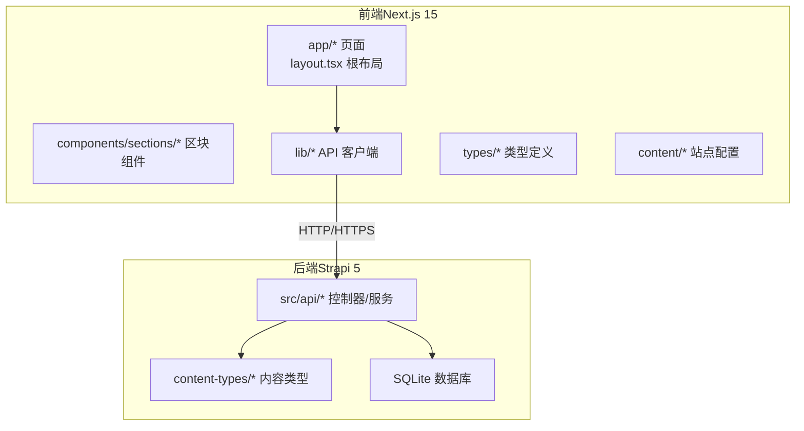
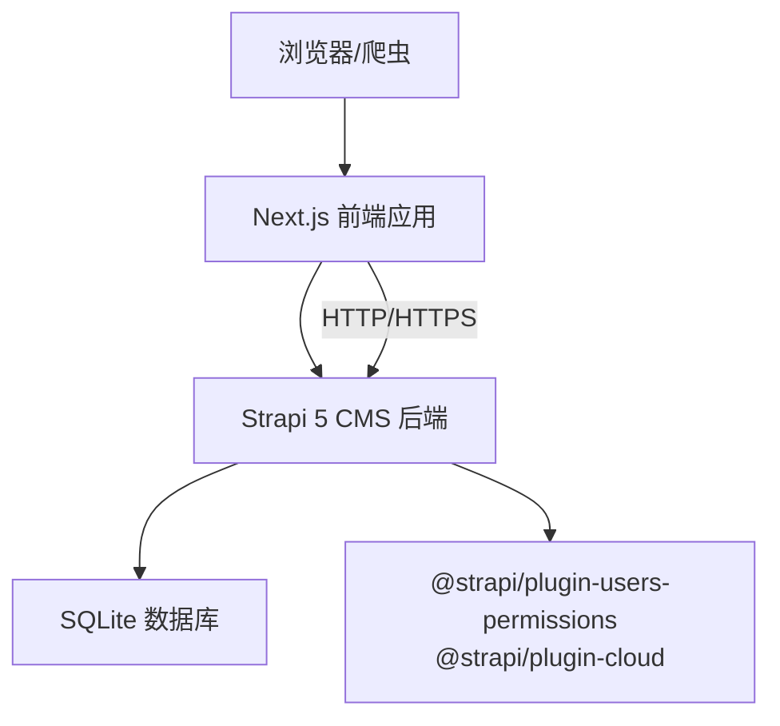
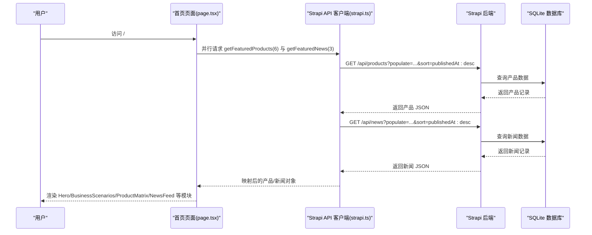
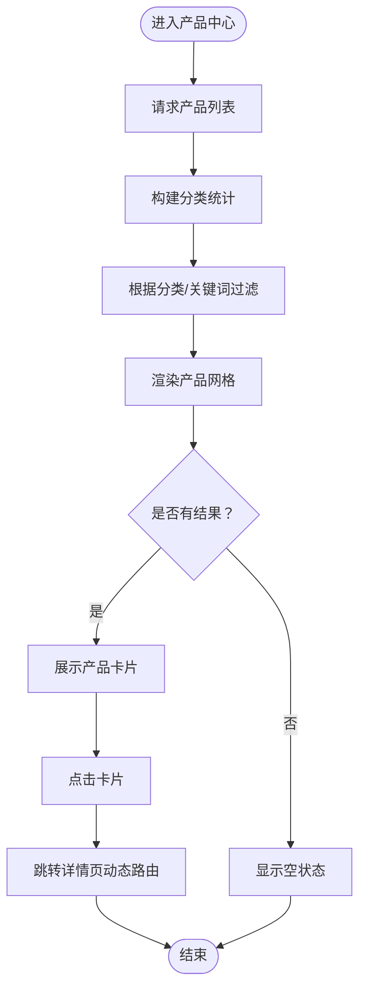
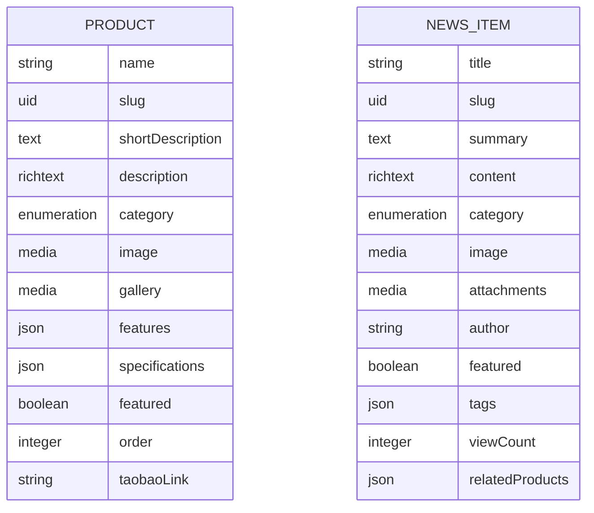
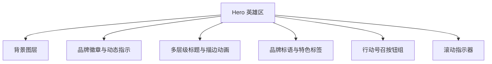
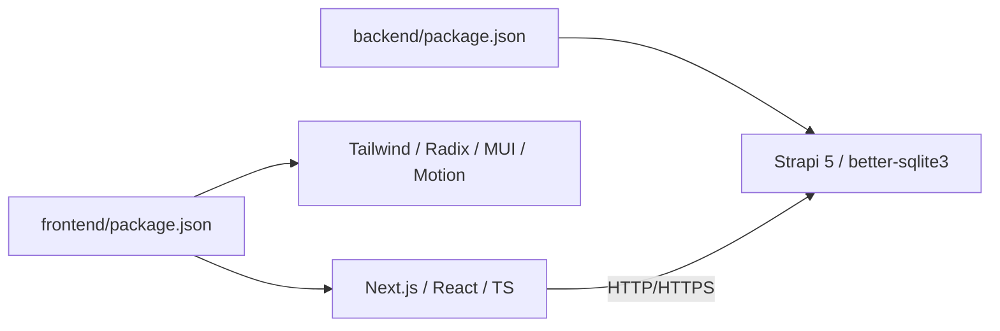

# 项目介绍

<cite>
**本文引用的文件**
- [README.md](file://README.md)
- [backend/README.md](file://backend/README.md)
- [frontend/package.json](file://frontend/package.json)
- [backend/package.json](file://backend/package.json)
- [specs/001-strapi-backend-cms/spec.md](file://specs/001-strapi-backend-cms/spec.md)
- [specs/001-nextjs-migration/spec.md](file://specs/001-nextjs-migration/spec.md)
- [frontend/content/site-config.ts](file://frontend/content/site-config.ts)
- [frontend/lib/strapi.ts](file://frontend/lib/strapi.ts)
- [frontend/app/layout.tsx](file://frontend/app/layout.tsx)
- [frontend/app/page.tsx](file://frontend/app/page.tsx)
- [frontend/app/products/page.tsx](file://frontend/app/products/page.tsx)
- [frontend/app/news/page.tsx](file://frontend/app/news/page.tsx)
- [backend/src/api/product/content-types/product/schema.json](file://backend/src/api/product/content-types/product/schema.json)
- [backend/src/api/news-item/content-types/news-item/schema.json](file://backend/src/api/news-item/content-types/news-item/schema.json)
- [frontend/types/product.ts](file://frontend/types/product.ts)
- [frontend/components/sections/Hero.tsx](file://frontend/components/sections/Hero.tsx)
- [frontend/components/sections/Products.tsx](file://frontend/components/sections/Products.tsx)
</cite>

## 目录
1. [引言](#引言)
2. [项目结构](#项目结构)
3. [核心组件](#核心组件)
4. [架构总览](#架构总览)
5. [详细组件分析](#详细组件分析)
6. [依赖关系分析](#依赖关系分析)
7. [性能考量](#性能考量)
8. [故障排查指南](#故障排查指南)
9. [结论](#结论)
10. [附录](#附录)

## 引言
本项目是为“中创智控”打造的专业化智慧交通安全预警设备企业官网，旨在通过现代化技术栈为企业提供高效、专业、可扩展的数字展示平台。项目面向智慧交通行业，围绕产品展示、新闻资讯、解决方案等核心业务模块，构建统一的品牌门户，支撑企业数字化转型与对外营销传播。

项目的核心目标与业务价值体现在：
- 以“产品为中心”的内容体系：通过 Strapi 动态内容管理，实现产品与新闻的灵活发布与维护，满足市场快速变化的需求。
- 以“用户体验为核心”的前端体验：基于 Next.js App Router 的混合渲染模式，兼顾 SEO、性能与交互体验，确保首屏速度与流畅动画。
- 以“品牌调性为准绳”的视觉呈现：统一品牌色彩与设计语言，强化“智能交通安全预警领航者”的企业形象。
- 以“可运维性为导向”的工程实践：前后端分离、权限控制、内容迁移脚本与部署规范，降低运营成本并提升交付效率。

## 项目结构
项目采用前后端分离架构，前端使用 Next.js 15 App Router，后端采用 Strapi 5 无头 CMS，配合 SQLite 数据库存储内容与媒体资源。整体结构清晰、职责分明，便于团队协作与独立演进。

图表来源
- [frontend/app/layout.tsx](file://frontend/app/layout.tsx#L63-L82)
- [frontend/lib/strapi.ts](file://frontend/lib/strapi.ts#L100-L155)
- [backend/src/api/product/content-types/product/schema.json](file://backend/src/api/product/content-types/product/schema.json#L1-L63)
- [backend/src/api/news-item/content-types/news-item/schema.json](file://backend/src/api/news-item/content-types/news-item/schema.json#L1-L65)

章节来源
- [README.md](file://README.md#L66-L227)

## 核心组件
- 前端核心页面与布局
  - 根布局与元数据：负责全局样式、主题、滚动进度条与导航/页脚的注入。
  - 首页：聚合品牌展示、业务场景、产品矩阵、技术实力、案例研究、服务介绍与新闻动态等模块。
  - 产品中心：支持分类筛选、搜索与产品卡片展示，提供“查看详情”跳转。
  - 资讯中心：支持新闻列表与精选内容展示，提供动态路由详情页。
- 后端内容模型
  - 产品内容类型：包含名称、唯一标识、简介、富文本描述、分类、主图/图库、特性、规格、是否首页精选、排序权重、外部链接等字段。
  - 新闻内容类型：包含标题、唯一标识、摘要、富文本正文、分类、主图/附件、作者、是否精选、标签、浏览量、关联产品等字段。
- API 客户端
  - 提供产品与新闻的列表、精选、详情查询与 slug 列表获取能力，封装媒体 URL 解析与映射逻辑。
- 站点配置
  - 统一品牌名称、标语、联系方式、品牌色彩、SEO 默认配置与版权信息，确保前端页面元数据一致性。

章节来源
- [frontend/app/layout.tsx](file://frontend/app/layout.tsx#L9-L52)
- [frontend/app/page.tsx](file://frontend/app/page.tsx#L40-L71)
- [frontend/app/products/page.tsx](file://frontend/app/products/page.tsx#L43-L48)
- [frontend/app/news/page.tsx](file://frontend/app/news/page.tsx#L25-L30)
- [backend/src/api/product/content-types/product/schema.json](file://backend/src/api/product/content-types/product/schema.json#L13-L62)
- [backend/src/api/news-item/content-types/news-item/schema.json](file://backend/src/api/news-item/content-types/news-item/schema.json#L13-L63)
- [frontend/lib/strapi.ts](file://frontend/lib/strapi.ts#L113-L154)
- [frontend/content/site-config.ts](file://frontend/content/site-config.ts#L2-L44)

## 架构总览
系统采用前后端分离架构，前端通过 Strapi 提供的 REST API 获取动态内容，后端提供内容管理与权限控制，数据库采用 SQLite（可替换为 PostgreSQL/MySQL）。项目支持静态内容与动态内容双模式，满足不同阶段的运营需求。

图表来源
- [README.md](file://README.md#L229-L298)
- [backend/package.json](file://backend/package.json#L20-L29)
- [frontend/package.json](file://frontend/package.json#L12-L74)

章节来源
- [README.md](file://README.md#L229-L298)
- [backend/README.md](file://backend/README.md#L1-L91)

## 详细组件分析

### 前端页面与数据流（首页）
首页通过并行请求获取“精选产品”和“精选新闻”，并在各模块中渲染相应区块组件，确保首屏内容快速到达。

图表来源
- [frontend/app/page.tsx](file://frontend/app/page.tsx#L40-L71)
- [frontend/lib/strapi.ts](file://frontend/lib/strapi.ts#L120-L139)

章节来源
- [frontend/app/page.tsx](file://frontend/app/page.tsx#L40-L71)
- [frontend/lib/strapi.ts](file://frontend/lib/strapi.ts#L120-L139)

### 产品中心页面与交互
产品中心页面支持分类筛选、关键词搜索与产品卡片展示，提供良好的浏览与发现体验。

图表来源
- [frontend/app/products/page.tsx](file://frontend/app/products/page.tsx#L43-L48)
- [frontend/components/sections/Products.tsx](file://frontend/components/sections/Products.tsx#L21-L36)

章节来源
- [frontend/app/products/page.tsx](file://frontend/app/products/page.tsx#L43-L48)
- [frontend/components/sections/Products.tsx](file://frontend/components/sections/Products.tsx#L21-L36)

### 后端内容模型与权限
后端通过内容类型定义产品与新闻的字段结构，并提供公开与认证访问的权限策略，支持内容导入与媒体管理。

图表来源
- [backend/src/api/product/content-types/product/schema.json](file://backend/src/api/product/content-types/product/schema.json#L13-L62)
- [backend/src/api/news-item/content-types/news-item/schema.json](file://backend/src/api/news-item/content-types/news-item/schema.json#L13-L63)

章节来源
- [backend/src/api/product/content-types/product/schema.json](file://backend/src/api/product/content-types/product/schema.json#L1-L63)
- [backend/src/api/news-item/content-types/news-item/schema.json](file://backend/src/api/news-item/content-types/news-item/schema.json#L1-L65)

### 品牌展示与视觉体验
首页英雄区通过动画与渐变背景营造科技感，强调“智能交通安全预警”的品牌定位。

图表来源
- [frontend/components/sections/Hero.tsx](file://frontend/components/sections/Hero.tsx#L8-L137)

章节来源
- [frontend/components/sections/Hero.tsx](file://frontend/components/sections/Hero.tsx#L8-L137)

## 依赖关系分析
- 前端依赖
  - Next.js 15、React 18、TypeScript、Tailwind CSS 4、Radix UI、MUI、Motion、Lucide React、next-themes 等，构成现代化 UI 与交互基础。
- 后端依赖
  - Strapi 5、better-sqlite3、用户权限插件与云插件，提供内容管理与部署能力。
- 开发与运行
  - 前端使用 pnpm，后端使用 npm；开发模式分别启动前端 Next.js 与后端 Strapi；生产模式分别构建与启动。

图表来源
- [frontend/package.json](file://frontend/package.json#L12-L86)
- [backend/package.json](file://backend/package.json#L20-L44)

章节来源
- [frontend/package.json](file://frontend/package.json#L1-L88)
- [backend/package.json](file://backend/package.json#L1-L45)

## 性能考量
- 渲染策略
  - 首页采用混合渲染，核心区块在服务端渲染，确保首屏内容快速到达；交互组件在客户端渲染，保证动画与交互体验。
  - 产品中心与资讯中心采用 SSR/ISR，兼顾 SEO 与内容新鲜度。
- 图片优化
  - 使用 Next.js Image 组件与现代图片格式（AVIF/WebP），支持响应式尺寸与远程域名白名单。
- 动画与交互
  - 基于 Motion/Framer Motion 的滚动触发动画与卡片过渡，确保流畅体验。
- API 与缓存
  - Strapi API 客户端内置 revalidate 参数，支持增量静态再生成与缓存控制。

章节来源
- [README.md](file://README.md#L444-L495)
- [frontend/app/layout.tsx](file://frontend/app/layout.tsx#L54-L61)
- [frontend/lib/strapi.ts](file://frontend/lib/strapi.ts#L100-L111)

## 故障排查指南
- 前端无法获取内容
  - 检查 NEXT_PUBLIC_STRAPI_URL 环境变量是否指向正确的后端地址。
  - 确认后端已启动并可访问，API 端点返回 2xx。
- 权限问题
  - 公开访问：产品与新闻的列表/详情需对 Public 角色开放。
  - 写入操作：新增/更新/删除需认证，确认认证 Token 有效。
- 内容迁移
  - 使用导入脚本将现有静态内容迁移至 Strapi，确保 slug 唯一且媒体资源可达。
- 部署问题
  - 前端构建产物与静态资源需正确部署；后端需设置生产环境变量并暴露 1337 端口。
- SEO 与元数据
  - 页面元数据通过 generateMetadata 或静态 metadata 导出，确保 Open Graph/Twitter 卡片与站点标题/描述一致。

章节来源
- [README.md](file://README.md#L428-L488)
- [backend/README.md](file://backend/README.md#L12-L31)
- [specs/001-strapi-backend-cms/spec.md](file://specs/001-strapi-backend-cms/spec.md#L83-L96)

## 结论
本项目以“中创智控”为核心，通过 Next.js 与 Strapi 的现代化组合，构建了可维护、可扩展、可运营的企业官网。项目不仅满足当前的产品展示与资讯传播需求，也为未来的业务增长与内容运营提供了坚实的技术基础。通过清晰的架构、完善的权限与部署规范，以及优秀的前端体验，项目能够有效支撑企业的数字化转型与品牌建设。

## 附录
- 受众群体
  - 企业访客：了解产品与解决方案，获取合作信息。
  - 行业媒体与合作伙伴：获取企业动态与技术观点。
  - 搜索引擎：抓取 SEO 元数据，提升自然排名。
- 预期效果
  - 首页与核心页面在弱网环境下仍具备良好首屏体验。
  - 产品与新闻内容可由运营团队快速更新，减少开发介入。
  - 品牌调性统一，视觉与交互体验一致，增强专业度与信任感。