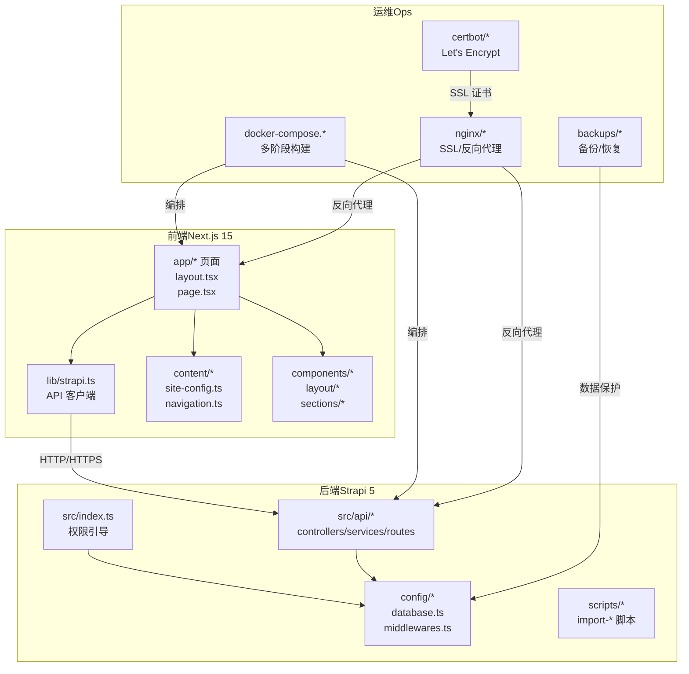
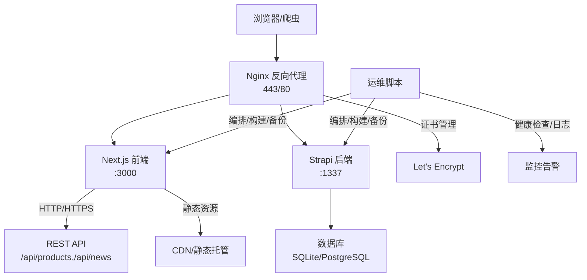
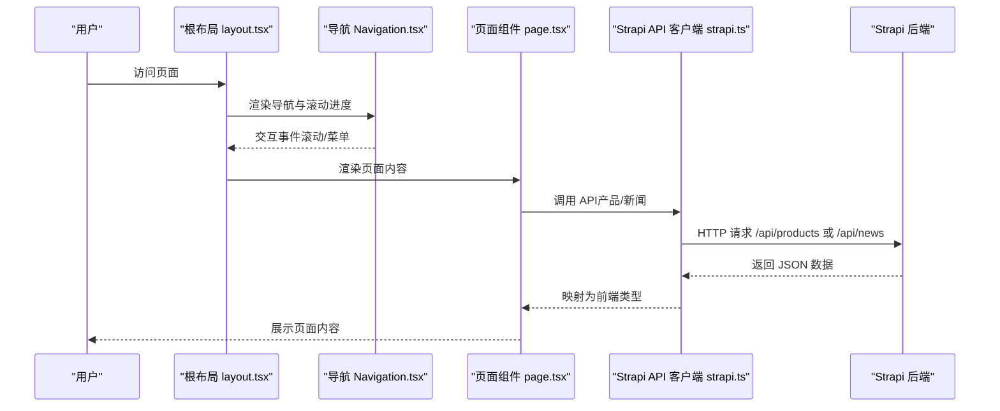
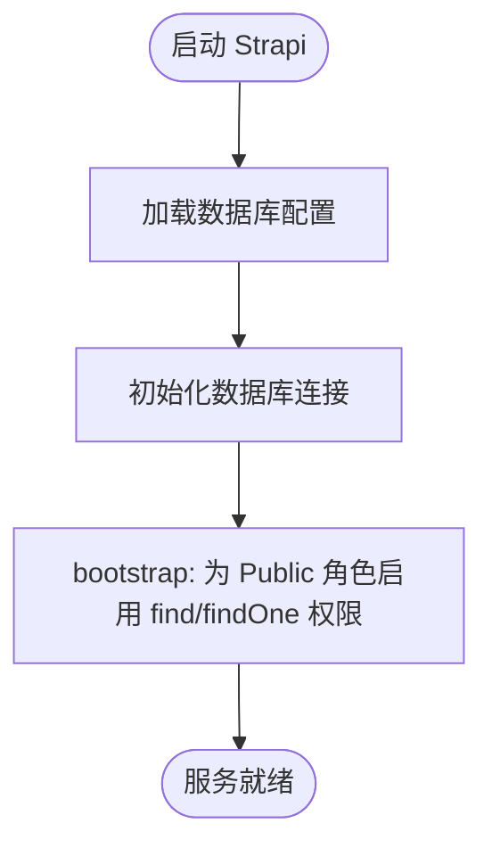
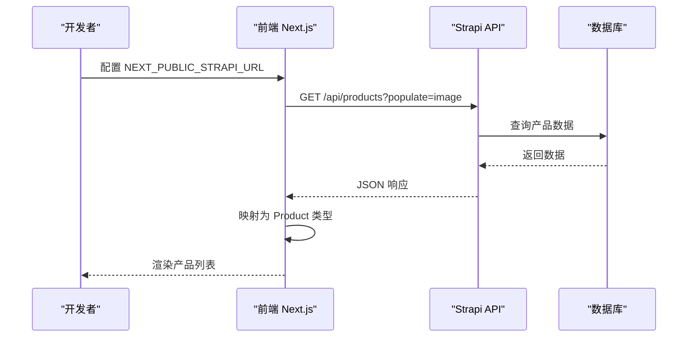
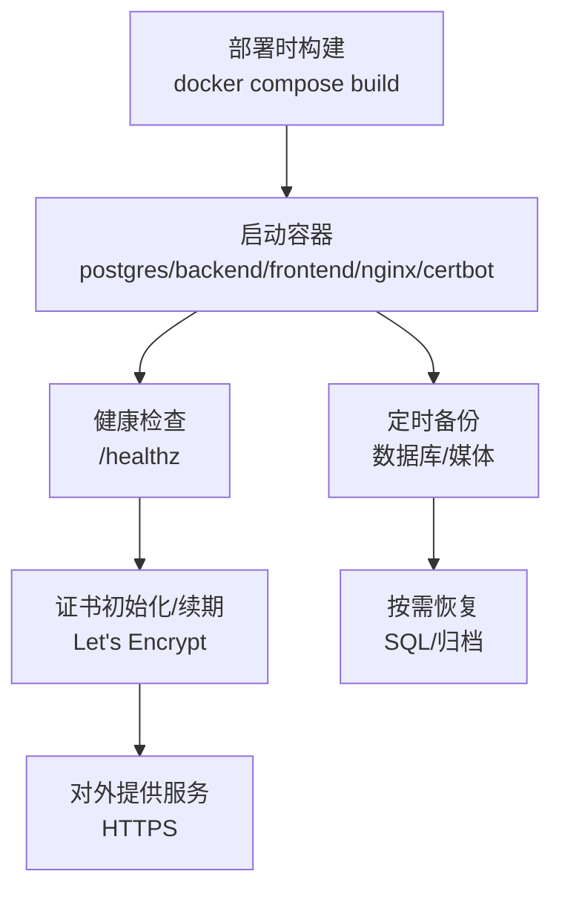
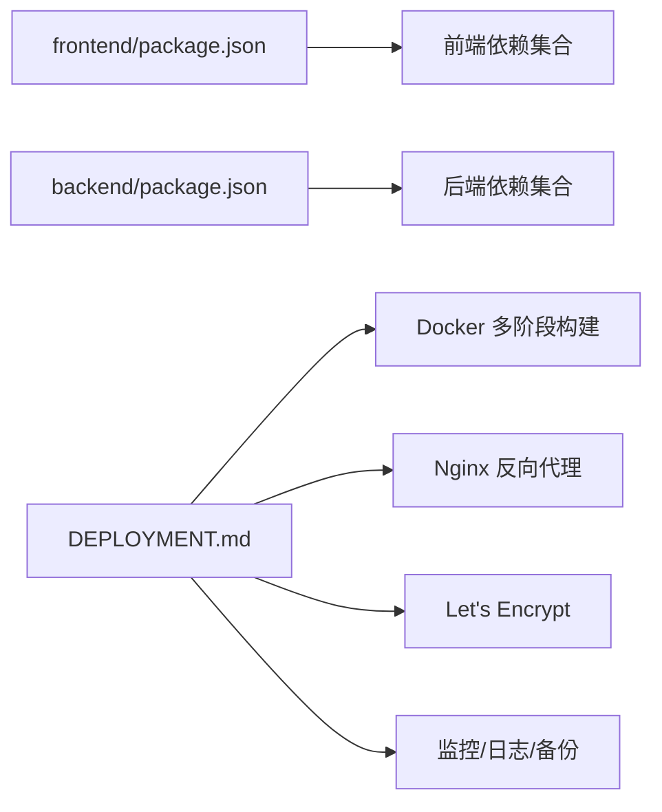

# 项目概述

<cite>
**本文引用的文件**
- [README.md](file://README.md)
- [frontend/package.json](file://frontend/package.json)
- [backend/package.json](file://backend/package.json)
- [frontend/next.config.ts](file://frontend/next.config.ts)
- [frontend/lib/strapi.ts](file://frontend/lib/strapi.ts)
- [frontend/content/site-config.ts](file://frontend/content/site-config.ts)
- [frontend/app/layout.tsx](file://frontend/app/layout.tsx)
- [frontend/components/layout/Navigation.tsx](file://frontend/components/layout/Navigation.tsx)
- [frontend/content/navigation.ts](file://frontend/content/navigation.ts)
- [backend/src/index.ts](file://backend/src/index.ts)
- [backend/config/database.ts](file://backend/config/database.ts)
- [specs/001-nextjs-migration/spec.md](file://specs/001-nextjs-migration/spec.md)
- [specs/001-strapi-backend-cms/spec.md](file://specs/001-strapi-backend-cms/spec.md)
- [DEPLOYMENT.md](file://DEPLOYMENT.md)
</cite>

## 目录
1. [简介](#简介)
2. [项目结构](#项目结构)
3. [核心组件](#核心组件)
4. [架构总览](#架构总览)
5. [详细组件分析](#详细组件分析)
6. [依赖关系分析](#依赖关系分析)
7. [性能考量](#性能考量)
8. [故障排查指南](#故障排查指南)
9. [结论](#结论)
10. [附录](#附录)

## 简介
本项目是中创智控官网，面向“智慧交通安全预警设备企业”的数字化转型需求，旨在通过现代化的全栈架构，提供专业、高效、可扩展的企业官网与内容管理平台。项目采用前后端分离架构，前端基于 Next.js 15 App Router，后端基于 Strapi 5 CMS，结合 TypeScript、Tailwind CSS、Radix UI、MUI、Framer Motion 等技术栈，实现高性能、可维护、可扩展的网站与内容管理能力。

项目目标：
- 展示企业品牌与产品矩阵，支撑销售线索转化
- 提供动态内容管理能力，降低运营成本
- 实现跨平台、跨设备的高质量用户体验
- 支撑企业数字化转型，提升线上影响力与运营效率

## 项目结构
项目采用“前后端分离 + 多阶段容器化部署”的组织方式，核心目录与职责如下：
- frontend：Next.js 15 应用，负责页面渲染、交互与静态/动态内容消费
- backend：Strapi 5 CMS，提供 REST API、内容管理与权限控制
- specs：需求规格与迁移计划文档，指导功能演进
- ops：运维脚本与配置，支持 Docker Compose 编排、证书与备份
- 根目录文档：README、部署方案、开发与生产环境分离方案等

图表来源
- [frontend/app/layout.tsx](file://frontend/app/layout.tsx#L63-L82)
- [frontend/lib/strapi.ts](file://frontend/lib/strapi.ts#L100-L155)
- [backend/src/index.ts](file://backend/src/index.ts#L19-L63)
- [backend/config/database.ts](file://backend/config/database.ts#L1-L61)
- [DEPLOYMENT.md](file://DEPLOYMENT.md#L38-L85)

章节来源
- [README.md](file://README.md#L66-L227)

## 核心组件
- 前端 Next.js 应用
  - App Router 路由体系，支持 SSR/SSG/CSR 混合渲染
  - 全局布局与元数据配置，统一 SEO 与主题
  - 组件化页面区块（Hero、Products、News、Solutions 等）
  - 图片优化、滚动进度、主题切换、无障碍 UI 组件
- 后端 Strapi CMS
  - REST API 提供产品与新闻内容
  - 用户权限插件（RBAC），支持公开与认证访问
  - 数据库可配置（SQLite/MySQL/PostgreSQL），支持迁移
  - 内容导入脚本，支持从静态内容迁移
- 运维与部署
  - Docker 多阶段构建，部署时构建，避免提交构建产物
  - Nginx 反向代理 + Let's Encrypt 自动化证书
  - 健康检查、日志轮转、定时备份与恢复

章节来源
- [frontend/package.json](file://frontend/package.json#L1-L88)
- [backend/package.json](file://backend/package.json#L1-L45)
- [frontend/next.config.ts](file://frontend/next.config.ts#L1-L39)
- [frontend/lib/strapi.ts](file://frontend/lib/strapi.ts#L1-L155)
- [backend/src/index.ts](file://backend/src/index.ts#L1-L65)
- [backend/config/database.ts](file://backend/config/database.ts#L1-L61)
- [DEPLOYMENT.md](file://DEPLOYMENT.md#L225-L320)

## 架构总览
项目采用“前端渲染 + 后端 API + 数据库 + 反向代理 + 证书 + 备份”的整体架构，支持开发与生产双环境分离，前后端可独立部署与扩展。

图表来源
- [DEPLOYMENT.md](file://DEPLOYMENT.md#L38-L85)
- [DEPLOYMENT.md](file://DEPLOYMENT.md#L278-L320)
- [DEPLOYMENT.md](file://DEPLOYMENT.md#L587-L647)

章节来源
- [README.md](file://README.md#L229-L298)
- [DEPLOYMENT.md](file://DEPLOYMENT.md#L34-L100)

## 详细组件分析

### 前端：Next.js 15 App Router 与混合渲染
- 路由与页面
  - 基于文件系统的路由，支持静态页（SSG）、服务端渲染（SSR）与客户端渲染（CSR）
  - 全局布局与元数据统一管理，支持 SEO 与 Open Graph
- 组件与区块
  - 布局组件（Navigation、Footer、ScrollProgress）
  - 页面区块（Hero、Products、News、Solutions、About、Contact 等）
- 样式与主题
  - Tailwind CSS v4 + CSS 变量主题，支持亮/暗主题切换
  - Radix UI 无障碍组件库，MUI Material Design 组件
- 性能与优化
  - 图片优化（remotePatterns、formats、响应式尺寸）
  - Turbopack 开发加速，严格模式与类型安全

图表来源
- [frontend/app/layout.tsx](file://frontend/app/layout.tsx#L63-L82)
- [frontend/components/layout/Navigation.tsx](file://frontend/components/layout/Navigation.tsx#L9-L125)
- [frontend/lib/strapi.ts](file://frontend/lib/strapi.ts#L100-L155)
- [backend/src/index.ts](file://backend/src/index.ts#L19-L63)

章节来源
- [frontend/next.config.ts](file://frontend/next.config.ts#L1-L39)
- [frontend/app/layout.tsx](file://frontend/app/layout.tsx#L1-L83)
- [frontend/components/layout/Navigation.tsx](file://frontend/components/layout/Navigation.tsx#L1-L126)
- [frontend/content/navigation.ts](file://frontend/content/navigation.ts#L1-L38)
- [frontend/content/site-config.ts](file://frontend/content/site-config.ts#L1-L47)

### 后端：Strapi 5 CMS 与内容管理
- API 与权限
  - REST API 提供产品与新闻的增删改查
  - 默认为 Public 角色开放读取，认证角色开放写入
- 数据库与迁移
  - 默认 SQLite，可配置 MySQL/PostgreSQL
  - 支持迁移系统与数据库池配置
- 内容导入
  - 提供导入脚本，支持批量导入产品与新闻
- 引导逻辑
  - 启动时自动为 Public 角色启用产品与新闻的查找权限

图表来源
- [backend/src/index.ts](file://backend/src/index.ts#L19-L63)
- [backend/config/database.ts](file://backend/config/database.ts#L1-L61)

章节来源
- [backend/src/index.ts](file://backend/src/index.ts#L1-L65)
- [backend/config/database.ts](file://backend/config/database.ts#L1-L61)
- [specs/001-strapi-backend-cms/spec.md](file://specs/001-strapi-backend-cms/spec.md#L83-L124)

### 数据流与内容管理策略
- 静态内容模式（默认）
  - 内容存储在 frontend/content，类型安全，适合快速开发
- 动态内容模式（CMS）
  - 通过 NEXT_PUBLIC_STRAPI_URL 指向后端 API
  - 支持内容导入脚本，一键导入产品与新闻
  - 前端通过 lib/strapi.ts 统一调用 API 并映射为前端类型

图表来源
- [frontend/lib/strapi.ts](file://frontend/lib/strapi.ts#L113-L125)
- [frontend/lib/strapi.ts](file://frontend/lib/strapi.ts#L100-L155)
- [backend/src/index.ts](file://backend/src/index.ts#L29-L60)

章节来源
- [README.md](file://README.md#L264-L298)
- [frontend/lib/strapi.ts](file://frontend/lib/strapi.ts#L1-L155)

### 部署与运维
- 多阶段构建
  - 前后端均采用多阶段 Docker 构建，部署时构建，避免提交构建产物
- 反向代理与证书
  - Nginx 作为反向代理，支持 HTTPS 与安全头
  - Let's Encrypt 自动化证书申请与续期
- 健康检查与监控
  - 容器健康检查、日志轮转、定时备份与恢复
- 更新与回滚
  - 一键部署脚本，支持拉取镜像、重启容器与健康检查

图表来源
- [DEPLOYMENT.md](file://DEPLOYMENT.md#L278-L320)
- [DEPLOYMENT.md](file://DEPLOYMENT.md#L322-L411)
- [DEPLOYMENT.md](file://DEPLOYMENT.md#L587-L744)

章节来源
- [DEPLOYMENT.md](file://DEPLOYMENT.md#L1-L1366)

## 依赖关系分析
- 前端依赖
  - Next.js 15、React 18、TypeScript、Tailwind CSS、Radix UI、MUI、Framer Motion、Lucide React、next-themes 等
  - 通过 pnpm 管理，支持 Turbopack 开发加速
- 后端依赖
  - Strapi 5、better-sqlite3、React Admin UI、styled-components、TypeScript
  - 通过 npm 管理，支持插件扩展（云服务、用户权限）
- 运维依赖
  - Docker、Docker Compose、Nginx、Certbot、PostgreSQL（生产）

图表来源
- [frontend/package.json](file://frontend/package.json#L1-L88)
- [backend/package.json](file://backend/package.json#L1-L45)
- [DEPLOYMENT.md](file://DEPLOYMENT.md#L225-L320)

章节来源
- [frontend/package.json](file://frontend/package.json#L1-L88)
- [backend/package.json](file://backend/package.json#L1-L45)
- [DEPLOYMENT.md](file://DEPLOYMENT.md#L1-L1366)

## 性能考量
- 前端性能
  - 图片优化：remotePatterns 白名单、现代格式（AVIF/WebP）、响应式尺寸
  - 渲染策略：SSG/SSR/CSR 混合，减少首屏等待
  - 组件化与懒加载：按需加载区块与组件
- 后端性能
  - 数据库连接池配置，支持高并发
  - API 响应时间限制与跨域配置
- 运维性能
  - 多阶段构建减少镜像体积，加速部署
  - Nginx 缓存与压缩，提升静态资源传输效率

章节来源
- [frontend/next.config.ts](file://frontend/next.config.ts#L1-L39)
- [backend/config/database.ts](file://backend/config/database.ts#L1-L61)
- [DEPLOYMENT.md](file://DEPLOYMENT.md#L225-L277)

## 故障排查指南
- 常见问题
  - 前端无法访问后端 API：检查 NEXT_PUBLIC_STRAPI_URL 是否指向正确地址
  - 权限不足：确认 Public 角色已启用产品与新闻的查找权限
  - 图片加载失败：确认 remotePatterns 配置与媒体 URL
  - 证书问题：检查 Let's Encrypt 初始化与续期脚本
- 建议流程
  - 开发环境：分别启动 frontend/pnpm dev 与 backend/npm run develop
  - 生产环境：使用 docker compose 启动，执行健康检查与日志查看
  - 备份与恢复：定期执行备份脚本，按需恢复 SQL 与媒体归档

章节来源
- [README.md](file://README.md#L624-L800)
- [DEPLOYMENT.md](file://DEPLOYMENT.md#L587-L744)

## 结论
本项目以“前后端分离 + 无头 CMS + 多阶段容器化”为核心，围绕“智慧交通安全预警设备企业”的数字化转型需求，提供了可扩展、可维护、高性能的企业官网与内容管理平台。通过 Next.js 15 的 App Router 与混合渲染、Strapi 5 的内容管理与权限控制，以及完善的运维与部署方案，项目既满足初学者的快速上手，也为有经验的开发者提供了深入的技术洞察与扩展空间。

## 附录
- 项目背景与发展历史
  - 基于现有静态内容与 React/Vite 应用，迁移至 Next.js 15 App Router
  - 引入 Strapi 5 CMS，实现产品与新闻的动态内容管理
- 未来规划
  - 持续完善内容导入与迁移工具链
  - 增强监控与告警能力，提升可观测性
  - 探索更多可视化与数据展示能力（图表、地图等）

章节来源
- [specs/001-nextjs-migration/spec.md](file://specs/001-nextjs-migration/spec.md#L1-L162)
- [specs/001-strapi-backend-cms/spec.md](file://specs/001-strapi-backend-cms/spec.md#L1-L124)
- [README.md](file://README.md#L1-L863)