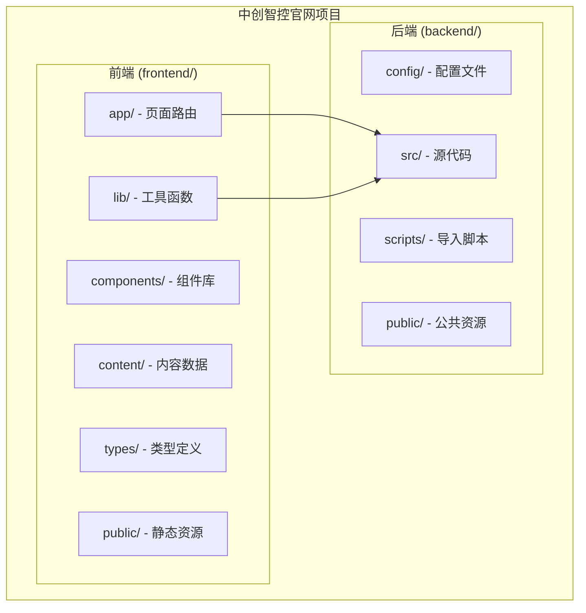
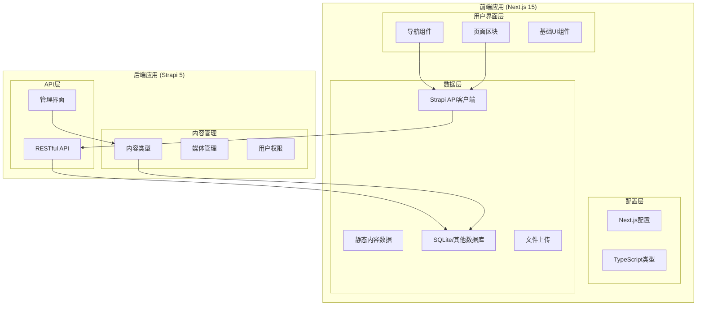
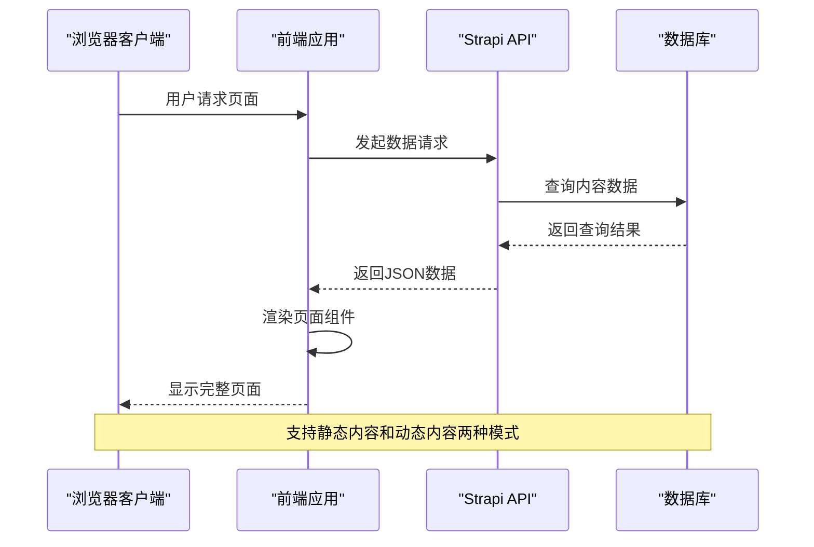

# 项目结构说明

<cite>
**本文档引用的文件**
- [README.md](file://README.md)
- [package.json](file://frontend/package.json)
- [package.json](file://backend/package.json)
- [next.config.ts](file://frontend/next.config.ts)
- [layout.tsx](file://frontend/app/layout.tsx)
- [strapi.ts](file://frontend/lib/strapi.ts)
- [site-config.ts](file://frontend/content/site-config.ts)
- [Navigation.tsx](file://frontend/components/layout/Navigation.tsx)
- [schema.json](file://backend/src/api/product/content-types/product/schema.json)
- [index.ts](file://backend/src/index.ts)
- [database.ts](file://backend/config/database.ts)
- [api.ts](file://backend/config/api.ts)
- [import-products.mjs](file://backend/scripts/import-products.mjs)
- [product.ts](file://frontend/types/product.ts)
- [news.ts](file://frontend/types/news.ts)
</cite>

## 目录
1. [简介](#简介)
2. [项目结构概览](#项目结构概览)
3. [前端目录结构详解](#前端目录结构详解)
4. [后端目录结构详解](#后端目录结构详解)
5. [文件命名规范](#文件命名规范)
6. [项目结构图](#项目结构图)
7. [导航指南](#导航指南)
8. [最佳实践建议](#最佳实践建议)

## 简介

中创智控官网项目是一个现代化的智能交通安全解决方案展示网站，采用前后端分离架构设计。项目基于Next.js 15 App Router构建前端应用，使用Strapi 5作为无头CMS管理后端内容，实现了技术先进、结构清晰的全栈解决方案。

该项目支持两种内容管理模式：静态内容模式和动态内容模式（Strapi CMS），为不同需求场景提供了灵活的解决方案。

## 项目结构概览

项目采用清晰的前后端分离架构，主要分为两个核心目录：



**图表来源**
- [README.md](file://README.md#L66-L227)
- [package.json](file://frontend/package.json#L1-L88)
- [package.json](file://backend/package.json#L1-L45)

## 前端目录结构详解

### app/ - Next.js App Router目录

`app/`目录是Next.js 15 App Router的核心，采用文件系统路由机制：

- **根页面**: `page.tsx` - 首页入口
- **静态页面**: `about/page.tsx`, `contact/page.tsx` - 固定内容页面
- **动态路由**: `news/[slug]/page.tsx` - 新闻详情页
- **错误处理**: `error.tsx`, `loading.tsx` - 错误边界和加载状态
- **全局配置**: `layout.tsx` - 根布局组件
- **SEO配置**: `robots.ts`, `sitemap.ts` - 搜索引擎优化

### components/ - 组件库

组件库采用模块化设计，按功能分类组织：

- **布局组件**: `layout/` - 导航栏、页脚、滚动进度条
- **UI基础组件**: `ui/` - 按Radix UI设计的按钮、卡片等
- **页面区块**: `sections/` - 可复用的页面功能模块
- **Figma集成**: `figma/` - 图片回退处理组件
- **上下文提供者**: `providers/` - 全局状态管理

### lib/ - 工具函数

工具函数库提供核心功能支持：

- **Strapi API客户端**: `strapi.ts` - 与后端CMS通信
- **分类工具**: `categories.ts` - 内容分类处理
- **类名合并**: `cn.ts` - Tailwind CSS类名工具
- **元数据处理**: `metadata.ts` - SEO元数据生成

### content/ - 内容数据

集中式内容管理系统：

- **导航配置**: `navigation.ts` - 网站导航结构
- **产品数据**: `products.ts` - 产品信息
- **新闻数据**: `news.ts` - 新闻资讯
- **站点配置**: `site-config.ts` - 全局网站配置
- **解决方案数据**: `solutions.ts` - 解决方案信息

### types/ - TypeScript类型定义

完整的类型安全保障：

- **产品类型**: `product.ts` - 产品数据结构
- **新闻类型**: `news.ts` - 新闻数据结构
- **导航类型**: `navigation.ts` - 导航数据结构
- **通用类型**: `index.ts` - 项目通用类型

**章节来源**
- [README.md](file://README.md#L69-L159)
- [layout.tsx](file://frontend/app/layout.tsx#L1-L83)
- [strapi.ts](file://frontend/lib/strapi.ts#L1-L155)
- [site-config.ts](file://frontend/content/site-config.ts#L1-L47)

## 后端目录结构详解

### config/ - Strapi配置

Strapi 5配置文件系统：

- **数据库配置**: `database.ts` - 数据库连接和池配置
- **API配置**: `api.ts` - REST API行为设置
- **中间件配置**: `middlewares.ts` - 请求处理管道
- **插件配置**: `plugins.ts` - 第三方插件集成
- **服务器配置**: `server.ts` - 服务器运行参数
- **管理员配置**: `admin.ts` - 后台管理界面设置
- **API路由配置**: `api.ts` - REST API端点配置

### src/ - 源代码

Strapi应用程序核心代码：

- **API端点**: `api/` - 自定义API控制器和服务
- **扩展**: `extensions/` - Strapi功能扩展
- **管理员界面**: `admin/` - React Admin UI源码
- **入口文件**: `index.ts` - 应用程序初始化

### scripts/ - 导入脚本

数据导入和迁移工具：

- **产品导入**: `import-products.mjs` - 产品数据批量导入
- **新闻导入**: `import-news.mjs` - 新闻数据批量导入
- **内容解析**: `parse-content.mjs` - 静态内容解析工具

### database/ - 数据库管理

数据库迁移和版本控制：

- **迁移文件**: `migrations/` - 数据库结构变更记录

**章节来源**
- [README.md](file://README.md#L160-L200)
- [database.ts](file://backend/config/database.ts#L1-L61)
- [api.ts](file://backend/config/api.ts#L1-L8)
- [index.ts](file://backend/src/index.ts#L1-L65)

## 文件命名规范

### 前端文件命名规范

- **页面文件**: `*.page.tsx` - Next.js页面组件
- **布局文件**: `*.layout.tsx` - 布局组件
- **错误文件**: `*.error.tsx` - 错误边界组件
- **加载文件**: `*.loading.tsx` - 加载状态组件
- **类型文件**: `*.types.ts` - TypeScript类型定义
- **配置文件**: `*.config.ts` - 配置文件

### 后端文件命名规范

- **内容类型**: `*/content-types/*/*.json` - Strapi内容模型
- **控制器**: `*/controllers/*.ts` - API控制器
- **路由**: `*/routes/*.ts` - 路由定义
- **服务**: `*/services/*.ts` - 业务逻辑服务
- **脚本**: `*.mjs` - Node.js模块脚本

### 组件命名规范

- **功能组件**: `*.tsx` - React函数组件
- **Hook函数**: `use*.ts` - 自定义Hook函数
- **工具函数**: `*.ts` - 工具函数模块
- **类型定义**: `*.d.ts` - TypeScript声明文件

**章节来源**
- [README.md](file://README.md#L66-L227)

## 项目结构图

### 整体架构图



**图表来源**
- [README.md](file://README.md#L229-L298)
- [strapi.ts](file://frontend/lib/strapi.ts#L1-L155)
- [schema.json](file://backend/src/api/product/content-types/product/schema.json#L1-L63)

### 数据流架构图



**图表来源**
- [README.md](file://README.md#L249-L262)
- [strapi.ts](file://frontend/lib/strapi.ts#L100-L155)

## 导航指南

### 新开发者快速入门

1. **项目克隆和安装**
   ```bash
   git clone <repository-url>
   cd zczk
   
   # 安装前端依赖
   cd frontend
   pnpm install
   
   # 安装后端依赖
   cd ../backend
   npm install
   ```

2. **环境配置**
   - 前端环境变量：复制 `.env.example` 为 `.env`
   - 后端环境变量：复制 `.env.example` 为 `.env`
   - 配置Strapi数据库连接

3. **开发服务器启动**
   ```bash
   # 终端1：启动后端
   cd backend
   npm run develop
   
   # 终端2：启动前端
   cd frontend
   pnpm dev
   ```

### 目录导航速查

| 目录 | 主要用途 | 关键文件 |
|------|----------|----------|
| `frontend/app/` | 页面路由和布局 | `page.tsx`, `layout.tsx` |
| `frontend/components/` | 可复用组件 | `layout/`, `sections/`, `ui/` |
| `frontend/lib/` | 工具函数和API客户端 | `strapi.ts` |
| `frontend/content/` | 静态内容数据 | `products.ts`, `news.ts` |
| `backend/src/api/` | 自定义API端点 | `product/`, `news-item/` |
| `backend/config/` | Strapi配置 | `database.ts`, `api.ts` |
| `backend/scripts/` | 数据导入脚本 | `import-products.mjs` |

### 常用开发任务

1. **添加新产品**
   - 在 `frontend/content/products.ts` 添加产品数据
   - 更新 `frontend/types/product.ts` 类型定义
   - 或在Strapi管理界面添加产品

2. **创建新页面**
   - 在 `frontend/app/` 下创建新目录和 `page.tsx`
   - Next.js会自动注册路由

3. **修改样式**
   - 在 `frontend/app/globals.css` 添加全局样式
   - 使用Tailwind CSS类名

4. **配置SEO**
   - 在页面 `page.tsx` 中导出 `metadata` 对象
   - 配置 `frontend/content/site-config.ts`

**章节来源**
- [README.md](file://README.md#L306-L408)
- [Navigation.tsx](file://frontend/components/layout/Navigation.tsx#L1-L126)

## 最佳实践建议

### 前端开发最佳实践

1. **组件设计**
   - 优先使用函数组件和Hooks
   - 遵循单一职责原则
   - 使用TypeScript确保类型安全

2. **样式管理**
   - 使用Tailwind CSS原子化样式
   - 避免内联样式的过度使用
   - 统一品牌色彩和设计规范

3. **性能优化**
   - 利用Next.js的图片优化功能
   - 实现适当的懒加载策略
   - 使用React的Suspense处理异步组件

### 后端开发最佳实践

1. **内容管理**
   - 使用Strapi的UID字段确保URL友好性
   - 合理配置内容类型的字段验证
   - 利用Draft/Publish工作流程

2. **API设计**
   - 遵循RESTful API设计原则
   - 实现适当的错误处理和状态码
   - 使用分页和过滤优化大数据集

3. **数据库管理**
   - 使用迁移文件管理数据库变更
   - 配置适当的索引提高查询性能
   - 定期备份数据库

### 开发流程建议

1. **版本控制**
   - 使用Git分支管理功能开发
   - 提交信息遵循约定式提交规范
   - 定期同步主分支代码

2. **测试策略**
   - 为关键组件编写单元测试
   - 使用E2E测试验证用户流程
   - 实施持续集成和部署

3. **文档维护**
   - 保持README和API文档同步
   - 记录重要的架构决策
   - 更新变更日志

**章节来源**
- [README.md](file://README.md#L496-L800)